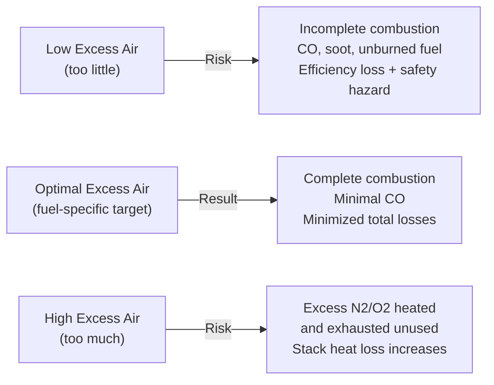

## Flue Gas Analysis

### Definition and Purpose

**Flue gas analysis** is the measurement and interpretation of the composition of exhaust gases produced by combustion processes (boilers, furnaces, engines, gas turbines). It is used to determine combustion efficiency, verify air-fuel ratio, quantify excess air, diagnose incomplete combustion, and monitor emissions compliance ($CO$, $NO_x$, $SO_2$, particulates).

Flue gas composition directly reveals how well a combustion process is operating: too little excess air causes incomplete combustion (CO, unburned hydrocarbons, soot); too much excess air wastes fuel by heating unnecessary nitrogen and oxygen that exit as stack losses without contributing useful heat.

### Typical Flue Gas Composition (Dry Basis)

For a well-tuned natural gas-fired system operating near optimal excess air:

| Species | Typical Range (% by volume, dry) |
| --- | --- |
| $CO_2$ | 8–12% |
| $O_2$ | 2–5% |
| $N_2$ | balance (~75–80%) |
| $CO$ | <0.01–0.1% (target: as low as practical) |
| $NO_x$ | ppm range (10s–100s ppm) |
| $SO_2$ | ppm range (fuel sulfur dependent) |

"Dry basis" means water vapor is condensed out before measurement — most portable flue gas analyzers report on a dry basis because condensing sample lines remove moisture before the gas reaches sensors.

### Orsat Analysis (Classical Method)

The **Orsat apparatus** is a traditional volumetric gas analysis method using sequential chemical absorption:

1. A measured volume of flue gas sample is drawn into a graduated burette.
2. The sample is passed through absorption pipettes containing selective reagents:
   - $CO_2$ absorbed by KOH (potassium hydroxide) solution
   - $O_2$ absorbed by alkaline pyrogallol solution
   - $CO$ absorbed by ammoniacal cuprous chloride solution
3. After each absorption step, the volume reduction is recorded — this reduction equals the volume fraction of that species.
4. Remaining gas (by difference) is assumed to be $N_2$.

While largely superseded by electronic analyzers in modern practice, Orsat analysis remains a standard reference method taught for understanding first-principles volumetric gas measurement and is still referenced in some regulatory and educational contexts. [Well-established classical method; still used as a calibration reference in some contexts, though electronic analyzers dominate current field practice]

### Orsat Apparatus Schematic (svg_diagram)

<svg xmlns="http://www.w3.org/2000/svg" viewBox="0 0 640 380">
<rect x="0" y="0" width="640" height="380" fill="#ffffff" />
<text x="320" y="26" text-anchor="middle" font-size="17" font-family="sans-serif" font-weight="bold" fill="#1a1a1a">Orsat Gas Analysis Apparatus (svg_diagram)</text>
<rect x="270" y="60" width="60" height="180" fill="#eaf2fb" stroke="#2c3e50" stroke-width="2" />
<text x="300" y="50" text-anchor="middle" font-size="11" font-family="sans-serif" fill="#1a1a1a">Measuring Burette</text>
<line x1="270" y1="90" x2="330" y2="90" stroke="#95a5a6" stroke-width="1" />
<line x1="270" y1="120" x2="330" y2="120" stroke="#95a5a6" stroke-width="1" />
<line x1="270" y1="150" x2="330" y2="150" stroke="#95a5a6" stroke-width="1" />
<line x1="270" y1="180" x2="330" y2="180" stroke="#95a5a6" stroke-width="1" />
<circle cx="150" cy="90" r="30" fill="#d4edda" stroke="#27ae60" stroke-width="2" />
<text x="150" y="94" text-anchor="middle" font-size="10" font-family="sans-serif" fill="#1a1a1a">KOH</text>
<text x="150" y="130" text-anchor="middle" font-size="9" font-family="sans-serif" fill="#333333">Absorbs CO2</text>
<circle cx="150" cy="190" r="30" fill="#fde3cf" stroke="#e67e22" stroke-width="2" />
<text x="150" y="194" text-anchor="middle" font-size="9" font-family="sans-serif" fill="#1a1a1a">Pyrogallol</text>
<text x="150" y="230" text-anchor="middle" font-size="9" font-family="sans-serif" fill="#333333">Absorbs O2</text>
<circle cx="490" cy="90" r="30" fill="#f5d6e0" stroke="#c0392b" stroke-width="2" />
<text x="490" y="94" text-anchor="middle" font-size="9" font-family="sans-serif" fill="#1a1a1a">Cu2Cl2 (NH3)</text>
<text x="490" y="130" text-anchor="middle" font-size="9" font-family="sans-serif" fill="#333333">Absorbs CO</text>
<line x1="180" y1="90" x2="270" y2="90" stroke="#333333" stroke-width="2" />
<line x1="180" y1="190" x2="270" y2="150" stroke="#333333" stroke-width="2" />
<line x1="330" y1="90" x2="460" y2="90" stroke="#333333" stroke-width="2" />
<rect x="285" y="250" width="30" height="60" fill="#d6e9f8" stroke="#2c3e50" stroke-width="1" />
<text x="300" y="330" text-anchor="middle" font-size="10" font-family="sans-serif" fill="#1a1a1a">Leveling Bottle</text>
<text x="300" y="345" text-anchor="middle" font-size="9" font-family="sans-serif" fill="#555555">(confining liquid)</text>

<text x="320" y="370" text-anchor="middle" font-size="10" font-family="sans-serif" fill="`#333333`">Remaining gas volume (by difference) = N2</text>

</svg>

### Modern Electronic Flue Gas Analyzers

Contemporary practice uses portable or fixed electronic analyzers with electrochemical, infrared (NDIR), or paramagnetic sensor cells:

- **Electrochemical cells:** commonly used for $O_2$, $CO$, $NO$, $NO_2$, $SO_2$ — a gas-permeable membrane allows target gas to diffuse to an electrode, generating a current proportional to concentration.
- **NDIR (Non-Dispersive Infrared):** used for $CO_2$ and $CO$, exploiting characteristic infrared absorption bands of each gas.
- **Paramagnetic sensors:** used for $O_2$ measurement, exploiting oxygen's unique paramagnetic property among common flue gas constituents.
- **Thermal conductivity detectors:** occasionally used for $H_2$ or other species with distinct thermal conductivity.

These analyzers directly display $O_2$, $CO$, $NO_x$, temperature, and calculate derived values (excess air, combustion efficiency, dew point) via onboard firmware. [Well-established, standard industrial instrumentation — specific accuracy and drift characteristics vary by manufacturer and model]

### Excess Air Calculation from Flue Gas O₂

The most common practical use of flue gas analysis is determining **excess air** from measured $O_2$ (or $CO_2$) concentration:

$$\text{Excess Air (\%)} = \frac{O_2}{21 - O_2} \times 100$$

This approximate formula assumes air as oxidizer (21% $O_2$ by volume) and negligible $CO$ formation. A more rigorous form accounting for incomplete combustion:

$$\text{Excess Air (\%)} = \frac{O_2 - 0.5\,CO}{0.266\,N_2 - (O_2 - 0.5\,CO)} \times 100$$

**Example:** A boiler's flue gas analyzer reads 4% $O_2$ (dry basis), negligible CO.

$$\text{Excess Air} = \frac{4}{21-4} \times 100 = \frac{4}{17} \times 100 \approx 23.5\%$$

This indicates the boiler is operating with roughly 23.5% more air than the stoichiometric requirement — a common, reasonable operating point for many industrial boilers, balancing complete combustion assurance against excess-air stack losses. [Inference: "reasonable" target excess air varies by fuel type and burner design — natural gas systems often target 10–20% excess air, while solid fuel systems may require 20–60%]

### Relationship Between CO₂, O₂, and Excess Air

For a given fuel, $CO_2$ and $O_2$ in dry flue gas are inversely related — as excess air increases, $O_2$ rises and $CO_2$ falls (due to dilution by additional $N_2$ and unreacted $O_2$). Each fuel has a theoretical maximum ("ultimate") $CO_2$ percentage at zero excess air (stoichiometric combustion):

| Fuel | Ultimate CO₂ (% dry, stoichiometric) |
| --- | --- |
| Natural Gas (Methane) | ~11.7% |
| Fuel Oil | ~15.5% |
| Coal (bituminous, typical) | ~18.5% |
| Propane | ~13.9% |

Measured $CO_2$ below this ultimate value indicates excess air is present; the further below ultimate, the more excess air.

### Combustion Efficiency Calculation

Flue gas analysis feeds directly into combustion (stack) efficiency calculations using the **indirect method** (loss method):

$$\eta_{combustion} = 100\% - L_{stack} - L_{other}$$

where stack loss $L_{stack}$ (dry gas loss) is commonly estimated via the Siegert formula or similar empirical correlation:

$$L_{stack} (\%) \approx \frac{K(T_{stack} - T_{ambient})}{CO_2 (\%)}$$

where $K$ is a fuel-specific Siegert constant (values commonly cited: ~0.38 for natural gas, ~0.50 for fuel oil, though exact constants vary by source and units convention), $T_{stack}$ is flue gas exit temperature, and $T_{ambient}$ is combustion air inlet temperature.

**Example:** Natural gas boiler, $T_{stack} = 200°C$, $T_{ambient} = 20°C$, measured $CO_2 = 10\%$.

$$L_{stack} \approx \frac{0.38 \times (200-20)}{10} = \frac{0.38 \times 180}{10} = 6.84\%$$

$$\eta_{combustion} \approx 100 - 6.84 = 93.16\%$$

[Inference: the Siegert constant value and exact formula convention vary across regional standards (e.g., European vs. North American practice) — the specific $K$ value should be verified against the applicable standard, such as EN 303 or manufacturer-provided correlations]

### CO/CO₂ Ratio as an Incomplete Combustion Indicator

The presence of $CO$ in flue gas indicates incomplete combustion — a safety and efficiency concern, since CO represents unreleased chemical energy and is toxic.

$$\text{Combustion completeness indicator} = \frac{CO}{CO + CO_2}$$

A rising $CO/CO_2$ ratio at a given excess air level signals burner malfunction, poor fuel-air mixing, flame impingement, or insufficient residence time — all of which warrant investigation independent of the excess air setting.

### Excess Air vs. Losses — Diagram

### Wet vs. Dry Basis Reporting

Flue gas composition can be reported on a **wet basis** (including water vapor as formed) or **dry basis** (water vapor removed/condensed before measurement). Most portable combustion analyzers measure on a dry basis because condensation in sample lines and sensor protection requirements naturally remove moisture. Conversion between bases requires knowledge of the water vapor fraction, which depends on fuel hydrogen content and excess air level.

$$\% X_{wet} = \% X_{dry} \times (1 - X_{H_2O,wet})$$

This distinction matters when comparing analyzer readings against combustion calculations performed on a wet (as-formed) product basis, such as those used in enthalpy of combustion or adiabatic flame temperature analysis.

### Emissions Monitoring Applications

Beyond combustion tuning, flue gas analysis is central to regulatory emissions compliance:

- **$NO_x$ monitoring:** required for power plants under most air quality regulations; typically reported in ppm corrected to a reference $O_2$ level (commonly 3% or 15% $O_2$, depending on jurisdiction and source category) to allow fair comparison independent of dilution air.
- **$SO_2$ monitoring:** relevant for fuels containing sulfur (coal, fuel oil, some natural gas sources); used to verify flue gas desulfurization (FGD) system performance.
- **Particulate matter (PM):** measured separately via isokinetic sampling methods (e.g., EPA Method 5) rather than typical electronic gas analyzers, since PM requires physical filtration rather than gas-phase sensing.
- **Continuous Emissions Monitoring Systems (CEMS):** permanently installed systems required at many regulated combustion sources (power plants, large industrial boilers) for continuous, recorded compliance verification.

$NO_x$ correction to a reference oxygen level:

$$NO_{x,corrected} = NO_{x,measured} \times \frac{20.9 - O_{2,ref}}{20.9 - O_{2,measured}}$$

### Practical Application in Power Plant Operations

In power generation, flue gas analysis serves multiple simultaneous roles:

1. **Combustion tuning:** operators or automated combustion control systems adjust air-fuel ratio in real time based on continuous $O_2$/CO trim control to maintain target excess air across load changes.
2. **Heat rate optimization:** minimizing stack losses (via optimal excess air and minimized stack temperature, within acid dew point constraints) directly improves plant heat rate and thermal efficiency.
3. **Acid dew point avoidance:** stack temperature must be kept above the acid dew point (where $SO_3$ combines with water vapor to form sulfuric acid mist, causing corrosion) — flue gas analysis of temperature and sulfur species helps define safe operating margins.
4. **Regulatory compliance and reporting:** CEMS data from flue gas analysis is the primary basis for emissions compliance demonstration to environmental regulators.

**Related Topics:**

- Excess Air and Stoichiometric Air-Fuel Ratio Calculations
- Combustion Efficiency and Boiler Heat Rate Analysis
- Continuous Emissions Monitoring Systems (CEMS) Architecture
- Acid Dew Point and Cold-End Corrosion in Boilers
- NOx Formation Mechanisms and Control Technologies (SCR, SNCR, Low-NOx Burners)
- Flue Gas Desulfurization (FGD) Systems
- Combustion Control Systems: O2 Trim and Air-Fuel Ratio Control
- Air Quality Regulations and Emission Standards for Combustion Sources