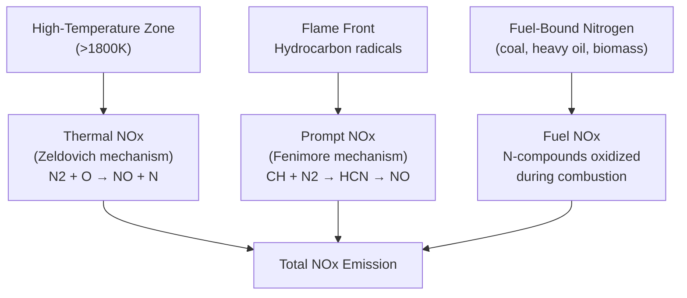
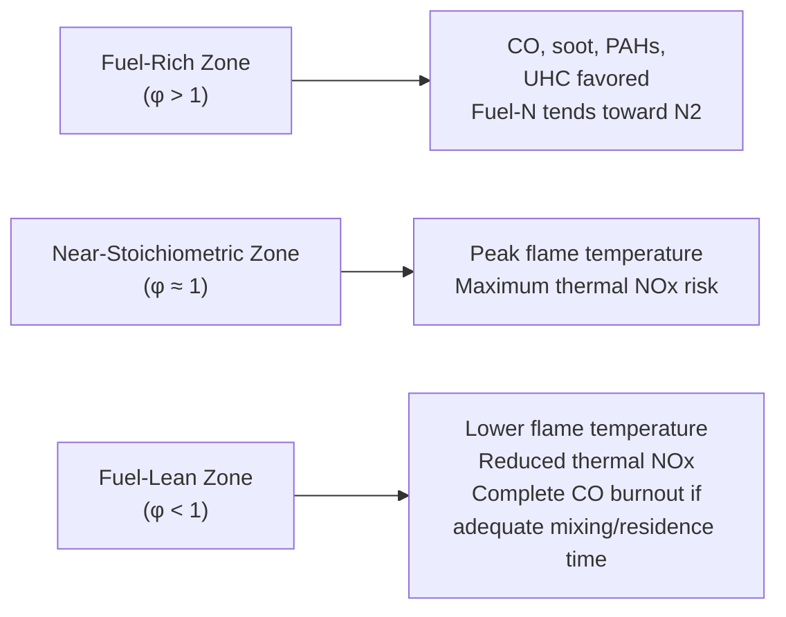

## Combustion-Generated Pollutants

### Overview

Combustion of hydrocarbon and solid fuels produces a range of pollutant species beyond the primary products of complete combustion ($CO_2$ and $H_2O$). These pollutants arise from incomplete combustion, trace fuel constituents, high-temperature reaction chemistry, and fuel-bound impurities. Understanding their formation mechanisms is central to combustor design, emissions control system selection, and regulatory compliance in power generation.

### Major Pollutant Categories

| Pollutant | Primary Source | Key Concern |
| --- | --- | --- |
| Carbon Monoxide (CO) | Incomplete combustion | Toxicity, wasted fuel energy |
| Nitrogen Oxides ($NO_x$) | High-temperature N₂/O₂ reaction; fuel-bound N | Smog, acid rain, respiratory harm |
| Sulfur Oxides ($SO_x$) | Fuel-bound sulfur oxidation | Acid rain, particulate formation |
| Particulate Matter (PM) | Incomplete combustion, ash, soot | Respiratory harm, visibility reduction |
| Unburned Hydrocarbons (UHC/VOCs) | Incomplete/quenched combustion | Smog precursor, some carcinogenic |
| Carbon Dioxide ($CO_2$) | Complete combustion (unavoidable) | Greenhouse gas / climate forcing |
| Polycyclic Aromatic Hydrocarbons (PAHs) | Fuel-rich zones, pyrolysis | Carcinogenic |
| Trace Metals (Hg, As, etc.) | Fuel-bound trace constituents (esp. coal) | Toxicity, bioaccumulation |

### Carbon Monoxide (CO) Formation

CO forms as an intermediate combustion product when oxidation is incomplete — either from insufficient oxygen (fuel-rich conditions), poor fuel-air mixing, flame quenching at cool surfaces, or insufficient residence time for full oxidation to $CO_2$.

**Simplified mechanism:**

$$CH_4 \rightarrow \ldots \rightarrow CO \rightarrow CO_2$$

The final oxidation step ($CO + \tfrac{1}{2}O_2 \rightarrow CO_2$) is relatively slow and is often the rate-limiting step in complete combustion. This step is particularly sensitive to local temperature and radical (OH) concentration — flame quenching (e.g., contact with a cool combustor wall) can "freeze" CO before it fully oxidizes.

CO emission is minimized through: adequate excess air, good fuel-air mixing (swirl, staged air injection), sufficient combustor residence time at high temperature, and avoiding excessive flame quenching.

### Nitrogen Oxides (NOx) — Formation Mechanisms

$NO_x$ (primarily $NO$ with smaller $NO_2$ fractions) forms via three distinct mechanisms, each with different sensitivities:

**1. Thermal NOx (Zeldovich Mechanism)**

Formed by direct oxidation of atmospheric $N_2$ at high temperature, via the extended Zeldovich chain reactions:

$$O + N_2 \rightleftharpoons NO + N$$

$$N + O_2 \rightleftharpoons NO + O$$

$$N + OH \rightleftharpoons NO + H$$

Thermal NOx formation rate is highly exponential with temperature — it becomes significant above approximately 1800 K and roughly doubles for every ~90 K increase near typical flame temperatures. [Well-established combustion chemistry — precise rate constants and the exact temperature sensitivity depend on the specific kinetic mechanism and local conditions]

This strong temperature dependence is the basis for **lean premixed combustion** and other flame-temperature-reduction strategies used in modern gas turbine combustors to control thermal NOx.

**2. Prompt NOx (Fenimore Mechanism)**

Forms rapidly in the flame front itself via reaction of hydrocarbon radicals (e.g., $CH$) with atmospheric $N_2$, producing $HCN$ intermediates that are subsequently oxidized to $NO$:

$$CH + N_2 \rightarrow HCN + N$$

Prompt NOx forms on a much shorter timescale than thermal NOx and is less temperature-sensitive, but typically contributes a smaller fraction of total NOx in most practical combustion systems compared to thermal NOx at high-temperature conditions.

**3. Fuel NOx**

Forms from oxidation of nitrogen chemically bound within the fuel itself (relevant for coal, heavy fuel oil, and some biomass — negligible for natural gas, which contains essentially no fuel-bound nitrogen). Fuel NOx conversion efficiency (fraction of fuel-N converted to NOx) is strongly dependent on local stoichiometry, with fuel-rich (sub-stoichiometric) conditions favoring conversion to $N_2$ instead of NOx — this is the basis for staged combustion NOx control strategies in coal-fired boilers.

### NOx Formation Pathways — Diagram

### Sulfur Oxides (SOx)

Formed from oxidation of sulfur present in the fuel (coal, residual fuel oil, some natural gas sources with H₂S content):

$$S + O_2 \rightarrow SO_2$$

$$2SO_2 + O_2 \rightleftharpoons 2SO_3 \text{ (minor pathway, catalyzed by ash/metals)}$$

$SO_2$ is the dominant sulfur oxide product (typically >95% of total SOx); $SO_3$ forms in smaller quantities but is significant because it combines with water vapor to form sulfuric acid mist ($H_2SO_4$), a major contributor to acid dew point corrosion in boiler cold-end equipment and to fine particulate/acid rain formation downstream.

SOx emissions are essentially proportional to fuel sulfur content and cannot be reduced through combustion modification alone (unlike NOx) — control requires either fuel desulfurization (pre-combustion) or flue gas desulfurization / FGD (post-combustion).

### Particulate Matter (PM)

Particulate matter from combustion arises from multiple sources:

- **Soot:** carbonaceous particles formed in fuel-rich zones via pyrolysis and dehydrogenation of hydrocarbon fragments, particularly prevalent with heavier/aromatic fuels and diffusion flames.
- **Fly ash:** incombustible mineral matter in solid fuels (coal, biomass) that becomes airborne with flue gas.
- **Condensable PM:** vapor-phase species (metals, organics, sulfates) that condense as flue gas cools, forming fine particulates downstream of the combustion zone.

PM is commonly categorized by aerodynamic diameter for regulatory and health purposes: PM10 (<10 μm) and PM2.5 (<2.5 μm, "fine particulates," of particular health concern due to deep lung penetration).

### Unburned Hydrocarbons (UHC) and VOCs

Result from incomplete combustion — similar root causes to CO formation (poor mixing, flame quenching, insufficient residence time). Includes unreacted fuel fragments and partially oxidized intermediates. Some UHC species, particularly polycyclic aromatic hydrocarbons (PAHs) formed in fuel-rich, sooting flames, are of elevated health concern due to carcinogenic potential.

### Emissions Control Technologies

| Pollutant | Primary Combustion Modification | Primary Post-Combustion Control |
| --- | --- | --- |
| CO / UHC | Improved mixing, adequate excess air, residence time | Oxidation catalyst |
| $NO_x$ | Lean premixed combustion, staged combustion, flue gas recirculation (FGR), low-NOx burners | Selective Catalytic Reduction (SCR), Selective Non-Catalytic Reduction (SNCR) |
| $SO_x$ | Fuel switching (low-sulfur fuel), fuel desulfurization | Flue Gas Desulfurization (FGD) — wet or dry scrubbers |
| Particulate Matter | Improved combustion completeness | Electrostatic precipitators (ESP), fabric filters (baghouses), cyclones |
| $CO_2$ | Efficiency improvement, fuel switching (lower carbon intensity) | Carbon capture and storage (CCS) |

### NOx Control: Combustion Modification Strategies

**Lean Premixed Combustion:** Fuel and air are thoroughly mixed before combustion at an overall lean equivalence ratio, avoiding local stoichiometric hot spots that drive thermal NOx formation. Widely used in modern dry low-NOx (DLN) gas turbine combustors.

**Staged Combustion (Air or Fuel Staging):** Combustion is split into a fuel-rich (or lean) initial zone followed by a second zone where remaining combustion is completed, limiting peak flame temperature and/or promoting fuel-NOx reduction to N₂ under sub-stoichiometric conditions.

**Flue Gas Recirculation (FGR):** A portion of cooled flue gas is recirculated into the combustion zone, diluting the reactant mixture and lowering peak flame temperature, thereby reducing thermal NOx.

**Water/Steam Injection:** Water or steam injected into the combustion zone absorbs heat (via its heat capacity and latent heat of vaporization), reducing peak flame temperature and thermal NOx — historically used in some gas turbines, though largely superseded by dry low-NOx combustor designs due to efficiency penalty and water consumption.

### Post-Combustion NOx Control

**Selective Catalytic Reduction (SCR):** Ammonia ($NH_3$) or urea is injected into flue gas upstream of a catalyst bed (typically vanadium/titanium-based), converting NOx to $N_2$ and $H_2O$:

$$4NO + 4NH_3 + O_2 \xrightarrow{\text{catalyst}} 4N_2 + 6H_2O$$

SCR typically achieves the highest NOx reduction efficiency among available technologies (often cited in the 80–95% range), but requires a specific temperature window (~300–400°C) for optimal catalyst activity and adds capital/operating cost (catalyst replacement, ammonia handling). [Inference: exact reduction efficiency and optimal temperature window vary by catalyst formulation and system design]

**Selective Non-Catalytic Reduction (SNCR):** Ammonia or urea is injected directly into a specific high-temperature furnace zone (~900–1100°C) without a catalyst, relying on gas-phase reactions. Lower capital cost than SCR but generally lower NOx reduction efficiency and narrower effective temperature window.

### Flue Gas Desulfurization (FGD) — Wet Scrubbing

The dominant SOx control technology, particularly for coal-fired power plants, using limestone (or lime) slurry to absorb SO₂:

$$SO_2 + CaCO_3 + \tfrac{1}{2}O_2 + 2H_2O \rightarrow CaSO_4 \cdot 2H_2O \text{ (gypsum)} + CO_2$$

Wet limestone FGD systems commonly achieve high SO₂ removal efficiency and additionally produce marketable gypsum byproduct suitable for wallboard manufacturing in many installations. Dry sorbent injection and spray dryer absorber systems offer lower-capital alternatives with somewhat lower removal efficiency, often selected for smaller units or retrofit situations with space constraints. [Inference: specific removal efficiency figures and byproduct marketability depend on plant-specific design and local market conditions]

### Particulate Control Technologies

**Electrostatic Precipitators (ESP):** Particles are electrically charged by a corona discharge and collected on oppositely charged plates; widely used at coal-fired power plants due to high collection efficiency and ability to handle large gas volumes at relatively low pressure drop.

**Fabric Filters (Baghouses):** Flue gas passes through fabric filter bags that physically capture particulates; generally achieve very high collection efficiency across a wide particle size range, including fine particulates, though at higher pressure drop and maintenance requirements than ESPs.

**Cyclone Separators:** Use centrifugal force to separate larger particles from gas flow; simple and low-cost but effective mainly for coarser particulates, typically used as a pre-collector ahead of ESP or baghouse stages rather than as a standalone final control.

### Pollutant Formation vs. Combustion Zone Stoichiometry

### Regulatory Framework Context

Combustion pollutant emissions from power generation and industrial sources are regulated under frameworks such as the U.S. EPA's New Source Performance Standards (NSPS) and Mercury and Air Toxics Standards (MATS), the EU Industrial Emissions Directive, and analogous national/regional standards elsewhere. Regulatory limits are typically expressed as mass per unit heat input (e.g., lb/MMBtu, g/GJ) or concentration corrected to a reference oxygen level, enabling comparison across sources of different size and excess air operation. [Inference: specific numerical limits vary substantially by jurisdiction, source category, fuel type, and facility age/permitting status — always verify against the applicable current regulation for a specific project]

### Practical Design Trade-offs

Combustion system design frequently involves competing pollutant control objectives — for example, measures that reduce thermal NOx (lower flame temperature, leaner combustion) can, if not carefully managed, increase CO and UHC emissions due to reduced reaction completeness. This trade-off is a central challenge in dry low-NOx gas turbine combustor design and lean-burn engine calibration, requiring careful optimization of mixing, residence time, and staging to achieve low emissions across all regulated pollutants simultaneously.

**Related Topics:**

- Lean Premixed (Dry Low-NOx) Gas Turbine Combustor Design
- Selective Catalytic Reduction (SCR) System Design and Catalyst Chemistry
- Flue Gas Desulfurization (FGD) System Types and Selection
- Carbon Capture and Storage (CCS) Technologies
- Flue Gas Analysis and Continuous Emissions Monitoring (CEMS)
- Air Quality Regulations: NSPS, MATS, and International Equivalents
- Staged Combustion and Fuel-Air Mixing Strategies
- Particulate Control: ESP vs. Baghouse Selection Criteria
- Acid Dew Point and Cold-End Corrosion in Boilers