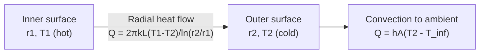

## Conduction and Fourier's Law

### Definition and Physical Mechanism

**Conduction** is the transfer of thermal energy through a material medium via molecular/atomic-level interactions — vibrational energy transfer between adjacent atoms in solids (lattice vibration, or phonons) and free electron migration in metals — without bulk motion of the material itself. It occurs whenever a temperature gradient exists within a stationary medium (solid, liquid, or gas), driving energy flow from higher to lower temperature regions in accordance with the second law of thermodynamics.

In metals, conduction occurs through two parallel mechanisms: lattice vibrations (phonon transport) and free electron motion, with free electrons typically dominating due to their high mobility — this is why good electrical conductors are generally also good thermal conductors. In non-metallic solids and fluids, phonon transport (and, in gases, molecular collision) is the primary mechanism.

### Fourier's Law of Heat Conduction

**One-dimensional form:**

$$q_x = -k \frac{dT}{dx}$$

where:

- $q_x$ = heat flux in the x-direction (W/m²) — heat transfer rate per unit area
- $k$ = thermal conductivity of the material (W/m·K)
- $\frac{dT}{dx}$ = temperature gradient (K/m)

The negative sign reflects the second law of thermodynamics: heat flows in the direction of decreasing temperature, so if $\frac{dT}{dx}$ is negative (temperature decreasing in the +x direction), $q_x$ is positive (heat flows in +x direction).

**General vector form (three dimensions):**

$$\vec{q} = -k\nabla T = -k\left(\frac{\partial T}{\partial x}\hat{i} + \frac{\partial T}{\partial y}\hat{j} + \frac{\partial T}{\partial z}\hat{k}\right)$$

**Total heat transfer rate** through a surface of area $A$:

$$Q = q_x \cdot A = -kA\frac{dT}{dx}$$

Fourier's Law is an empirical, phenomenological law (not derived from first principles in the way that, for example, the ideal gas law can be derived from kinetic theory) — it is a constitutive relation validated extensively by experiment, analogous in form to Fick's law of diffusion and Ohm's law of electrical conduction. [Well-established, foundational law of heat transfer — universally applied in engineering practice]

### Thermal Conductivity ($k$)

Thermal conductivity is a material property quantifying a substance's intrinsic ability to conduct heat. It is generally temperature-dependent (and, for anisotropic materials, direction-dependent), though often treated as constant over moderate temperature ranges for engineering calculations.

| Material Category | Typical Thermal Conductivity Range (W/m·K) |
| --- | --- |
| Metals (good conductors) | 15–430 |
| Non-metallic solids (insulators, ceramics) | 0.1–10 |
| Liquids | 0.1–0.7 |
| Gases | 0.01–0.3 |
| Insulation materials (fiberglass, foam) | 0.02–0.05 |

**Representative values at approximately room temperature:**

| Material | k (W/m·K) |
| --- | --- |
| Silver | ~429 |
| Copper | ~401 |
| Aluminum | ~237 |
| Carbon Steel | ~50–60 |
| Stainless Steel | ~15–17 |
| Glass | ~0.8–1.4 |
| Water (liquid) | ~0.6 |
| Air | ~0.026 |
| Fiberglass insulation | ~0.035–0.04 |
| Wood | ~0.1–0.2 |

[Well-documented material property values — precise figures vary by exact alloy composition, temperature, purity, and measurement source; consult material-specific data for precision engineering applications]

Thermal conductivity generally: decreases with increasing temperature for pure metals (due to increased phonon/electron scattering), while it typically increases with temperature for most gases and many non-metallic solids and insulating materials. [Inference: this is a general trend; exceptions exist and exact temperature dependence should be verified from material-specific data for precision work]

### Steady-State Conduction Through a Plane Wall

For steady-state, one-dimensional conduction through a plane wall of thickness $L$, cross-sectional area $A$, with uniform thermal conductivity $k$ and surface temperatures $T_1$ (hot side) and $T_2$ (cold side):

$$Q = \frac{kA(T_1 - T_2)}{L}$$

This is the integrated form of Fourier's Law, obtained by separating variables and integrating across the wall thickness under steady-state conditions (constant $Q$ at every cross-section, no internal heat generation).

### Thermal Resistance Concept

Analogous to Ohm's Law ($I = V/R$), conduction heat transfer can be expressed using a thermal resistance formulation:

$$Q = \frac{\Delta T}{R_{th}}$$

**Thermal resistance for a plane wall (conduction):**

$$R_{th} = \frac{L}{kA}$$

This electrical-thermal analogy is extensively used in composite wall and multi-layer heat transfer problems, allowing series and parallel resistance network analysis directly analogous to electrical circuit analysis.

### Electrical-Thermal Analogy Table

| Thermal Quantity | Electrical Analog |
| --- | --- |
| Heat transfer rate, $Q$ (W) | Current, $I$ (A) |
| Temperature difference, $\Delta T$ (K) | Voltage, $\Delta V$ (V) |
| Thermal resistance, $R_{th} = L/kA$ (K/W) | Electrical resistance, $R = L/\sigma A$ (Ω) |
| Thermal conductivity, $k$ | Electrical conductivity, $\sigma$ |

### Composite (Multi-Layer) Walls in Series

For a composite wall of $n$ layers, each with thickness $L_i$ and conductivity $k_i$, arranged in series (heat flows sequentially through each layer):

$$Q = \frac{T_1 - T_{n+1}}{\sum_{i=1}^{n} \frac{L_i}{k_i A}} = \frac{\Delta T_{total}}{R_{th,1} + R_{th,2} + \ldots + R_{th,n}}$$

**Worked Example:** A furnace wall consists of three layers: firebrick (L=0.1 m, k=1.7 W/m·K), insulation (L=0.05 m, k=0.05 W/m·K), and steel plate (L=0.01 m, k=45 W/m·K), each with area $A = 1$ m². Inside surface temperature 800°C, outside surface temperature 40°C.

**Individual resistances:**

$$R_1 = \frac{0.1}{1.7 \times 1} = 0.0588 \text{ K/W}$$

$$R_2 = \frac{0.05}{0.05 \times 1} = 1.0 \text{ K/W}$$

$$R_3 = \frac{0.01}{45 \times 1} = 0.00022 \text{ K/W}$$

**Total resistance:**

$$R_{total} = 0.0588 + 1.0 + 0.00022 \approx 1.059 \text{ K/W}$$

**Heat transfer rate:**

$$Q = \frac{800 - 40}{1.059} \approx \frac{760}{1.059} \approx 717.7 \text{ W}$$

This example illustrates a key insight: the insulation layer, despite being the thinnest of the resistive layers considered here relative to its conductivity, dominates total thermal resistance (~94% of total $R$) due to its very low thermal conductivity — this is precisely why thin insulation layers are so effective at reducing heat loss.

### Composite Wall Thermal Circuit (svg_diagram)

<svg xmlns="http://www.w3.org/2000/svg" viewBox="0 0 640 300">
<rect x="0" y="0" width="640" height="300" fill="#ffffff" />
<text x="320" y="26" text-anchor="middle" font-size="17" font-family="sans-serif" font-weight="bold" fill="#1a1a1a">Composite Wall Thermal Resistance Network (svg_diagram)</text>
<rect x="60" y="90" width="60" height="120" fill="#f5c6a5" stroke="#8b4513" stroke-width="2" />
<text x="90" y="220" text-anchor="middle" font-size="10" font-family="sans-serif" fill="#1a1a1a">Firebrick</text>
<text x="90" y="235" text-anchor="middle" font-size="9" font-family="sans-serif" fill="#555555">R1</text>
<rect x="120" y="90" width="60" height="120" fill="#d4edda" stroke="#27ae60" stroke-width="2" />
<text x="150" y="220" text-anchor="middle" font-size="10" font-family="sans-serif" fill="#1a1a1a">Insulation</text>
<text x="150" y="235" text-anchor="middle" font-size="9" font-family="sans-serif" fill="#555555">R2</text>
<rect x="180" y="90" width="20" height="120" fill="#b0bec5" stroke="#37474f" stroke-width="2" />
<text x="190" y="220" text-anchor="middle" font-size="9" font-family="sans-serif" fill="#1a1a1a">Steel</text>
<text x="190" y="235" text-anchor="middle" font-size="9" font-family="sans-serif" fill="#555555">R3</text>

<text x="30" y="150" text-anchor="middle" font-size="12" font-family="sans-serif" fill="`#c0392b`" font-weight="bold">T1 = 800°C</text>

<text x="230" y="150" text-anchor="middle" font-size="12" font-family="sans-serif" fill="`#2980b9`" font-weight="bold">T4 = 40°C</text>

<line x1="260" y1="150" x2="620" y2="150" stroke="#333333" stroke-width="2" />
<text x="290" y="140" font-size="11" font-family="sans-serif" fill="#000000">T1</text>
<rect x="310" y="135" width="40" height="30" fill="#ffffff" stroke="#333333" stroke-width="2" />
<text x="330" y="155" text-anchor="middle" font-size="10" font-family="sans-serif" fill="#000000">R1</text>
<text x="380" y="140" font-size="11" font-family="sans-serif" fill="#000000">T2</text>
<rect x="400" y="135" width="40" height="30" fill="#ffffff" stroke="#333333" stroke-width="2" />
<text x="420" y="155" text-anchor="middle" font-size="10" font-family="sans-serif" fill="#000000">R2</text>
<text x="470" y="140" font-size="11" font-family="sans-serif" fill="#000000">T3</text>
<rect x="490" y="135" width="40" height="30" fill="#ffffff" stroke="#333333" stroke-width="2" />
<text x="510" y="155" text-anchor="middle" font-size="10" font-family="sans-serif" fill="#000000">R3</text>
<text x="560" y="140" font-size="11" font-family="sans-serif" fill="#000000">T4</text>

<text x="440" y="200" text-anchor="middle" font-size="11" font-family="sans-serif" fill="`#333333`">Q = (T1 − T4) / (R1 + R2 + R3)</text>

</svg>

### Radial Conduction (Cylindrical Systems)

For steady-state radial conduction through a hollow cylinder (e.g., insulated pipe) of inner radius $r_1$, outer radius $r_2$, length $L$, with inner and outer surface temperatures $T_1$ and $T_2$:

$$Q = \frac{2\pi k L (T_1 - T_2)}{\ln(r_2/r_1)}$$

**Thermal resistance (cylindrical wall):**

$$R_{th} = \frac{\ln(r_2/r_1)}{2\pi k L}$$

This logarithmic form arises because the cross-sectional area for heat flow ($A = 2\pi r L$) increases with radius, unlike the constant area in a plane wall — the heat flux therefore decreases with increasing radius even though total heat transfer rate $Q$ remains constant at steady state.

**Application — Critical Radius of Insulation:** For insulated cylindrical systems (e.g., insulated pipes/wires), adding insulation increases conductive resistance but simultaneously increases the outer surface area available for convective heat loss. The "critical radius of insulation" is:

$$r_{cr} = \frac{k_{insulation}}{h}$$

where $h$ is the convective heat transfer coefficient at the outer surface. Below $r_{cr}$, adding insulation can counterintuitively increase total heat loss (since the convection area effect dominates); above $r_{cr}$, additional insulation reduces heat loss as expected. This effect is generally significant only for small-diameter conductors (e.g., electrical wires) with low insulation conductivity, since $r_{cr}$ is often smaller than typical pipe radii in practice. [Well-established heat transfer principle — practical significance depends on the specific geometry and insulation/convection properties involved]

### Fourier's Law for Radial (Cylindrical) Systems — Diagram

### Transient (Unsteady) Conduction and the Heat Equation

When temperature varies with time (not steady-state), Fourier's Law combines with an energy balance on a differential control volume to yield the **general heat conduction equation**:

$$\rho c_p \frac{\partial T}{\partial t} = \nabla \cdot (k \nabla T) + \dot{q}_{gen}$$

For constant $k$, this simplifies to:

$$\frac{\partial T}{\partial t} = \alpha \nabla^2 T + \frac{\dot{q}_{gen}}{\rho c_p}$$

where $\alpha = \frac{k}{\rho c_p}$ is the **thermal diffusivity** (m²/s) — a property combining thermal conductivity, density ($\rho$), and specific heat ($c_p$) that governs how quickly a temperature disturbance propagates through a material. Materials with high thermal diffusivity respond quickly to changing thermal conditions; low diffusivity materials respond slowly, retaining thermal "memory" of past conditions longer.

**One-dimensional, no generation, steady-state special case** reduces to:

$$\frac{d^2T}{dx^2} = 0$$

which integrates directly to the linear temperature profile assumed in the simple plane wall analysis above.

### Boundary Conditions in Conduction Problems

Solving the heat equation requires appropriate boundary conditions:

1. **Specified temperature (Dirichlet):** $T(x,t) = T_s$ (constant surface temperature)
2. **Specified heat flux (Neumann):** $-k\frac{\partial T}{\partial x}\Big|_{surface} = q_s''$ (including the special case of an insulated/adiabatic surface, $q_s'' = 0$)
3. **Convective boundary condition (Robin/mixed):** $-k\frac{\partial T}{\partial x}\Big|_{surface} = h(T_s - T_\infty)$ — couples conduction at the surface to convective heat transfer, and is the most common boundary condition in practical engineering problems where a solid surface exchanges heat with a surrounding fluid.

### Applications in Power and Energy Systems

**Boiler tube heat transfer:** Conduction through boiler tube walls (typically thin, high-conductivity steel or alloy) links convective/radiative heat transfer from combustion gases on the fire side to boiling heat transfer on the water/steam side — tube wall conduction resistance is usually small relative to convective resistances but becomes significant when considering scale/fouling buildup (which acts as an additional low-conductivity resistive layer).

**Turbine blade cooling:** Gas turbine blades operate in gas path temperatures that can exceed the melting point of blade alloys, requiring internal cooling passages; conduction through the blade wall (often with thermal barrier coatings — low-conductivity ceramic layers) combined with internal convective cooling determines blade metal temperature, a critical factor in blade life and turbine inlet temperature limits.

**Insulation design:** Minimizing heat loss from piping, vessels, and building envelopes in power plants relies directly on conduction resistance calculations (composite wall/cylinder analysis) to size insulation economically while meeting surface temperature safety limits and energy loss targets.

**Electronics and generator cooling:** Conduction through generator windings, insulation, and casing materials governs internal temperature rise, which is a limiting factor in generator capacity ratings (thermal limits on winding insulation life).

**Related Topics:**

- Convection Heat Transfer: Natural and Forced Convection Correlations
- Radiation Heat Transfer and the Stefan-Boltzmann Law
- Extended Surfaces (Fins) and Fin Efficiency Analysis
- Transient Conduction: Lumped Capacitance Method and Biot Number
- Heat Exchanger Design: LMTD and Effectiveness-NTU Methods
- Thermal Contact Resistance at Material Interfaces
- Critical Radius of Insulation in Cylindrical Systems
- Numerical Methods for Conduction: Finite Difference and Finite Element Approaches