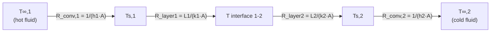

## Thermal Resistance Networks and Composite Walls

### Concept and Motivation

**Thermal resistance network analysis** treats heat conduction and convection problems using an electrical circuit analogy, allowing complex multi-layer, multi-mode heat transfer problems to be solved using series/parallel resistance combination rules rather than solving the full differential heat equation for each configuration. This approach is a direct extension of Fourier's Law and Newton's Law of Cooling, valid for steady-state, one-dimensional heat transfer problems.

The core analogy:

$$Q = \frac{\Delta T}{R_{th}} \quad \longleftrightarrow \quad I = \frac{\Delta V}{R}$$

Heat transfer rate ($Q$) plays the role of current, overall temperature difference ($\Delta T$) plays the role of voltage, and thermal resistance ($R_{th}$) plays the role of electrical resistance.

### Thermal Resistance Definitions by Mode

**Conduction resistance (plane wall):**

$$R_{cond} = \frac{L}{kA}$$

**Conduction resistance (cylindrical wall):**

$$R_{cond,cyl} = \frac{\ln(r_2/r_1)}{2\pi k L}$$

**Conduction resistance (spherical wall):**

$$R_{cond,sph} = \frac{1}{4\pi k}\left(\frac{1}{r_1} - \frac{1}{r_2}\right)$$

**Convection resistance:**

$$R_{conv} = \frac{1}{hA}$$

where $h$ is the convective heat transfer coefficient (W/m²·K).

**Radiation resistance (linearized, for small temperature differences or approximate analysis):**

$$R_{rad} = \frac{1}{h_r A}, \quad h_r = \varepsilon\sigma(T_s + T_{surr})(T_s^2 + T_{surr}^2)$$

where $\varepsilon$ is surface emissivity, $\sigma$ is the Stefan-Boltzmann constant, and $h_r$ is a radiation heat transfer coefficient linearized about the operating temperatures — this linearization is an approximation, since true radiation heat transfer is fourth-power in absolute temperature and not linear.

**Contact resistance (at interfaces between solid layers):**

$$R_{contact} = \frac{R_c''}{A}$$

where $R_c''$ is the thermal contact resistance per unit area (m²·K/W), arising from imperfect physical contact between mating surfaces (surface roughness creates air gaps that impede heat flow at the interface) — often a significant and easily overlooked resistance in composite systems, particularly at bolted or clamped joints.

### Resistances in Series

For $n$ layers in series (heat flows sequentially through each), resistances add directly:

$$R_{total} = R_1 + R_2 + \ldots + R_n = \sum_{i=1}^{n} R_i$$

$$Q = \frac{\Delta T_{overall}}{R_{total}}$$

This is the configuration for a standard multi-layer composite wall (e.g., building wall with brick, insulation, drywall) or a pipe wall with insulation and convective boundary layers on both sides.

### Resistances in Parallel

When heat can flow through two or more paths simultaneously (e.g., a wall section with a stud and insulation side-by-side, or a composite material with parallel conduction paths), resistances combine as:

$$\frac{1}{R_{total}} = \frac{1}{R_1} + \frac{1}{R_2} + \ldots + \frac{1}{R_n}$$

$$R_{total} = \left(\sum_{i=1}^{n} \frac{1}{R_i}\right)^{-1}$$

This applies, for example, to a wall section with wood studs (higher conductivity path) running parallel to insulation-filled cavities (lower conductivity path) — heat flow is not one-dimensional in these cases in reality, but a parallel-path approximation is often used for simplified engineering estimates, with the understanding that true two-dimensional effects (lateral heat spreading near the stud) introduce some error. [Well-established simplified engineering method — accuracy depends on how well the true multi-dimensional heat flow approximates the assumed parallel-path idealization]

### Complete Composite Wall with Convection on Both Sides

The most common practical configuration combines convective resistance on both the hot and cold sides with conductive resistance through one or more solid layers in between:

$$Q = \frac{T_{\infty,1} - T_{\infty,2}}{R_{conv,1} + R_{cond,1} + R_{cond,2} + \ldots + R_{cond,n} + R_{conv,2}}$$

$$Q = \frac{T_{\infty,1} - T_{\infty,2}}{\dfrac{1}{h_1 A} + \dfrac{L_1}{k_1 A} + \dfrac{L_2}{k_2 A} + \ldots + \dfrac{1}{h_2 A}}$$

### Worked Example: Building Wall with Convection

A wall consists of a brick layer ($L$ = 0.2 m, $k$ = 0.72 W/m·K) and an insulation layer ($L$ = 0.05 m, $k$ = 0.04 W/m·K), with inside air at $T_{\infty,1}$ = 22°C ($h_1$ = 8 W/m²·K) and outside air at $T_{\infty,2}$ = −5°C ($h_2$ = 25 W/m²·K). Wall area $A$ = 10 m².

**Individual resistances:**

$$R_{conv,1} = \frac{1}{8 \times 10} = 0.0125 \text{ K/W}$$

$$R_{brick} = \frac{0.2}{0.72 \times 10} = 0.0278 \text{ K/W}$$

$$R_{insulation} = \frac{0.05}{0.04 \times 10} = 0.125 \text{ K/W}$$

$$R_{conv,2} = \frac{1}{25 \times 10} = 0.004 \text{ K/W}$$

**Total resistance:**

$$R_{total} = 0.0125 + 0.0278 + 0.125 + 0.004 = 0.1693 \text{ K/W}$$

**Heat transfer rate:**

$$Q = \frac{22 - (-5)}{0.1693} = \frac{27}{0.1693} \approx 159.5 \text{ W}$$

**Interface temperatures** can then be found by working through the network progressively, since $Q$ is constant through all series resistances at steady state:

$$T_{s,1} = T_{\infty,1} - Q \cdot R_{conv,1} = 22 - (159.5)(0.0125) \approx 20.0°C$$

$$T_{brick/ins} = T_{s,1} - Q \cdot R_{brick} = 20.0 - (159.5)(0.0278) \approx 15.6°C$$

$$T_{s,2} = T_{brick/ins} - Q \cdot R_{insulation} = 15.6 - (159.5)(0.125) \approx -4.3°C$$

This progressive temperature-drop calculation, made possible by the resistance network framework, is directly useful for checking condensation risk at internal interfaces (e.g., verifying an interface temperature stays above the dew point) — a common building and industrial insulation design check.

### Series-Parallel Composite Wall Network Diagram

### Overall Heat Transfer Coefficient (U-value)

For composite systems, it is often convenient to define an **overall heat transfer coefficient** $U$ such that:

$$Q = UA\Delta T_{overall}$$

$$\frac{1}{UA} = R_{total} = \sum R_i$$

$$U = \frac{1}{A \cdot R_{total}}$$

The $U$-value is widely used in building energy analysis (as "U-factor," the reciprocal of R-value in common insulation terminology) and in heat exchanger design, where it consolidates all series resistances (convection on both sides, wall conduction, fouling) into a single coefficient for simplified sizing calculations.

**Note on R-value vs. thermal resistance:** In building/insulation industry practice (particularly in the U.S.), "R-value" commonly refers to resistance per unit area ($R'' = L/k$, units ft²·°F·h/Btu or m²·K/W) rather than the total resistance $R_{th} = L/(kA)$ used in the general engineering thermal circuit framework — care must be taken not to confuse the two conventions when working across disciplines. [Well-established terminology distinction — unit convention differs by region/industry and should be verified for the specific context]

### Contact Resistance at Layer Interfaces

Real composite walls include imperfect contact between adjacent solid layers, introducing an additional series resistance often neglected in idealized calculations but significant in precision applications (electronics cooling, bolted heat exchanger plates, turbine blade coatings):

$$R_{total} = R_1 + R_{contact,1-2} + R_2 + \ldots$$

Contact resistance depends on surface roughness, contact pressure, interstitial material (air gap vs. thermal paste/grease), and the hardness of the mating materials. In high-performance thermal management applications (e.g., electronics, some turbine components), thermal interface materials (TIMs) are specifically selected to minimize this resistance. [Well-established phenomenon — exact magnitude is highly application- and surface-condition-specific and typically requires empirical data or manufacturer specification rather than a general formula]

### Extended Surfaces (Fins) in Resistance Networks

Fins are often incorporated into thermal resistance networks as a parallel path with an associated **fin resistance**:

$$R_{fin} = \frac{1}{\eta_f h A_{fin}}$$

where $\eta_f$ is fin efficiency (accounting for temperature drop along the fin reducing its effectiveness relative to an idealized isothermal fin) and $A_{fin}$ is total fin surface area. When both a finned surface and adjacent unfinned (base) surface are present, they act as parallel convective resistances to the surrounding fluid — this is the standard framework for analyzing heat sinks, finned tube heat exchangers, and air-cooled engine components.

### Cylindrical Composite Systems (Insulated Pipes)

For a pipe with multiple concentric layers (e.g., pipe wall, insulation, protective jacket) plus convection on inside and outside surfaces, the series resistance network extends naturally:

$$Q = \frac{T_{\infty,inside} - T_{\infty,outside}}{\dfrac{1}{h_i A_i} + \dfrac{\ln(r_2/r_1)}{2\pi k_{pipe} L} + \dfrac{\ln(r_3/r_2)}{2\pi k_{ins} L} + \dfrac{1}{h_o A_o}}$$

Note that inside and outside convective resistances use different areas ($A_i = 2\pi r_1 L$, $A_o = 2\pi r_3 L$) since the cylindrical geometry means these surface areas differ — a key distinction from plane wall problems where area is constant throughout.

### Composite Cylindrical Pipe Network (svg_diagram)

<svg xmlns="http://www.w3.org/2000/svg" viewBox="0 0 640 320">
<rect x="0" y="0" width="640" height="320" fill="#ffffff" />
<text x="320" y="26" text-anchor="middle" font-size="17" font-family="sans-serif" font-weight="bold" fill="#1a1a1a">Insulated Pipe: Cross-Section and Resistance Network (svg_diagram)</text>
<circle cx="180" cy="180" r="90" fill="#dce8f5" stroke="#2c3e50" stroke-width="2" />
<circle cx="180" cy="180" r="60" fill="#b0bec5" stroke="#37474f" stroke-width="2" />
<circle cx="180" cy="180" r="35" fill="#ffffff" stroke="#333333" stroke-width="1" />
<text x="180" y="184" text-anchor="middle" font-size="10" font-family="sans-serif" fill="#1a1a1a">Fluid</text>
<text x="180" y="130" text-anchor="middle" font-size="9" font-family="sans-serif" fill="#1a1a1a">Pipe wall (r1-r2)</text>
<text x="180" y="95" text-anchor="middle" font-size="9" font-family="sans-serif" fill="#1a1a1a">Insulation (r2-r3)</text>

<text x="400" y="80" text-anchor="middle" font-size="11" font-family="sans-serif" fill="`#000000`">Ti</text>

<line x1="420" y1="80" x2="620" y2="80" stroke="none" />

<line x1="420" y1="80" x2="620" y2="80" stroke="`#333333`" stroke-width="0" />

<line x1="380" y1="180" x2="600" y2="180" stroke="#333333" stroke-width="2" />
<text x="395" y="170" font-size="10" font-family="sans-serif" fill="#000000">T∞,i</text>
<rect x="410" y="165" width="35" height="30" fill="#ffffff" stroke="#333333" stroke-width="2" />
<text x="427" y="184" text-anchor="middle" font-size="9" font-family="sans-serif" fill="#000000">Rconv,i</text>
<text x="460" y="170" font-size="10" font-family="sans-serif" fill="#000000">Ts1</text>
<rect x="475" y="165" width="35" height="30" fill="#ffffff" stroke="#333333" stroke-width="2" />
<text x="492" y="184" text-anchor="middle" font-size="9" font-family="sans-serif" fill="#000000">Rpipe</text>
<text x="520" y="170" font-size="10" font-family="sans-serif" fill="#000000">Ts2</text>
<rect x="535" y="165" width="35" height="30" fill="#ffffff" stroke="#333333" stroke-width="2" />
<text x="552" y="184" text-anchor="middle" font-size="9" font-family="sans-serif" fill="#000000">Rins</text>
<text x="580" y="170" font-size="10" font-family="sans-serif" fill="#000000">T∞,o</text>

<text x="490" y="240" text-anchor="middle" font-size="10" font-family="sans-serif" fill="`#333333`">(Outer convection resistance Rconv,o completes the series chain)</text>

</svg>

### Applications in Power Plant and Industrial Systems

**Boiler and pipe insulation sizing:** Thermal resistance networks are the standard tool for sizing insulation thickness to meet energy loss targets, surface temperature safety limits (personnel protection), and economic insulation thickness optimization (balancing insulation capital cost against ongoing energy loss cost).

**Heat exchanger design:** The overall heat transfer coefficient $U$, central to LMTD and effectiveness-NTU heat exchanger sizing methods, is calculated directly from a series resistance network combining convection on both fluid sides, wall conduction, and fouling resistance.

**Fouling resistance:** Scale, corrosion products, or biological fouling on heat exchanger or boiler tube surfaces adds an additional series resistance term ($R_{fouling}''/A$) that increases over operating time, progressively degrading heat transfer performance — a major consideration in boiler and condenser maintenance scheduling.

**Building and equipment envelope design:** Insulation specification for power plant buildings, tanks, and ductwork uses the same series-resistance methodology, often incorporating parallel-path corrections for structural elements (studs, ribs) that create thermal bridges through otherwise well-insulated envelopes.

**Related Topics:**

- Conduction and Fourier's Law
- Convection Heat Transfer Coefficients and Correlations
- Heat Exchanger Design: LMTD and Effectiveness-NTU Methods
- Extended Surfaces (Fins) and Fin Efficiency
- Critical Radius of Insulation
- Fouling Resistance and Heat Exchanger Performance Degradation
- Thermal Contact Resistance and Interface Materials
- Economic Insulation Thickness Optimization