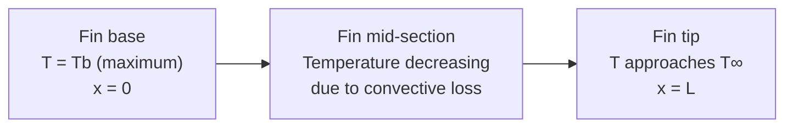

## Extended Surfaces and Fin Design

### Purpose and Physical Concept

**Extended surfaces (fins)** are solid protrusions attached to a primary heat transfer surface, used to increase the surface area available for convective (and sometimes radiative) heat exchange with a surrounding fluid, thereby increasing total heat transfer rate without requiring a larger temperature difference or higher convective heat transfer coefficient. Fins are used extensively wherever the convective heat transfer coefficient on one side of a surface is relatively low (particularly air-side/gas-side convection, where $h$ is typically much lower than liquid-side convection), since increasing surface area compensates for the low $h$.

Newton's Law of Cooling for a plain (unfinned) surface:

$$Q = hA(T_s - T_\infty)$$

Since $h$ is often fixed by the fluid and flow conditions, and $(T_s - T_\infty)$ is often constrained by process requirements, increasing $A$ via fins is frequently the most practical way to increase $Q$.

### Common Fin Geometries

| Fin Type | Typical Application |
| --- | --- |
| Straight rectangular fin | Air-cooled engine cylinders, electronics heat sinks |
| Straight triangular/trapezoidal fin | Weight-optimized applications (less material for similar performance) |
| Pin fin (cylindrical) | Electronics cooling, compact heat exchangers |
| Annular (circular) fin | Finned tube heat exchangers, air-cooled condensers |
| Plate fin | Compact heat exchangers, radiators |

### Fin Equation Derivation (Straight Rectangular Fin)

Consider a differential energy balance on a fin element of length $dx$, cross-sectional area $A_c$, and perimeter $P$, conducting heat along its length while simultaneously losing heat by convection from its lateral surface:

**Energy balance:** Conduction in = Conduction out + Convection loss

$$-kA_c\frac{dT}{dx}\bigg|_x = -kA_c\frac{dT}{dx}\bigg|_{x+dx} + hP\,dx\,(T-T_\infty)$$

Taking the limit as $dx \rightarrow 0$ and defining excess temperature $\theta = T - T_\infty$, this yields the general fin equation:

$$\frac{d^2\theta}{dx^2} - m^2\theta = 0, \quad m^2 = \frac{hP}{kA_c}$$

where $m$ (units 1/m) is the **fin parameter**, combining the convective loss rate ($hP$) against the conductive transport capacity ($kA_c$) of the fin.

### Fin Temperature Distribution — Boundary Conditions and Solutions

The general solution to the fin equation is:

$$\theta(x) = C_1 e^{mx} + C_2 e^{-mx}$$

Applying boundary conditions at the fin base ($\theta(0) = \theta_b = T_b - T_\infty$) and at the fin tip yields different specific solutions depending on tip condition assumed:

**Case 1 — Adiabatic tip (insulated, $d\theta/dx|_{x=L} = 0$):**

$$\frac{\theta(x)}{\theta_b} = \frac{\cosh[m(L-x)]}{\cosh(mL)}$$

$$Q_{fin} = \sqrt{hPkA_c}\,\theta_b \tanh(mL)$$

**Case 2 — Convective tip (heat loss from tip surface):**

$$\frac{\theta(x)}{\theta_b} = \frac{\cosh[m(L-x)] + (h/mk)\sinh[m(L-x)]}{\cosh(mL) + (h/mk)\sinh(mL)}$$

**Case 3 — Infinitely long fin (temperature approaches ambient at large x):**

$$\frac{\theta(x)}{\theta_b} = e^{-mx}$$

$$Q_{fin} = \sqrt{hPkA_c}\,\theta_b$$

**Case 4 — Specified tip temperature ($\theta(L) = \theta_L$):**

Used when the fin tip is in contact with another surface at a known, fixed temperature.

The adiabatic tip case is most commonly used in practice for design calculations, often applied to a real convective-tip fin using a **corrected fin length** $L_c = L + A_c/P$ (for a rectangular fin, $L_c = L + t/2$, where $t$ is fin thickness), which approximately accounts for the tip convective loss within the simpler adiabatic-tip formula. [Well-established engineering approximation, widely used for design purposes]

### Fin Temperature Distribution — Diagram

### Fin Performance Metrics

**Fin Heat Transfer Rate ($Q_{fin}$):** Actual heat transfer rate from the fin, calculated via the appropriate case above, or equivalently by integrating convective loss over the fin surface, or by evaluating conduction at the fin base:

$$Q_{fin} = -kA_c\frac{d\theta}{dx}\bigg|_{x=0}$$

**Fin Efficiency ($\eta_f$):** Ratio of actual fin heat transfer to the heat transfer that would occur if the entire fin surface were at the base temperature $T_b$ (an idealized maximum, since in reality temperature decreases along the fin):

$$\eta_f = \frac{Q_{fin}}{Q_{max}} = \frac{Q_{fin}}{hA_{fin}\theta_b}$$

For an adiabatic-tip rectangular fin:

$$\eta_f = \frac{\tanh(mL_c)}{mL_c}$$

Fin efficiency approaches 100% for short, highly conductive fins (where temperature drop along the fin is small) and decreases toward zero for very long fins (where most of the fin length is near ambient temperature and contributes little additional heat transfer).

**Fin Effectiveness ($\varepsilon_f$):** Ratio of fin heat transfer rate to the heat transfer rate that would occur from the same base area without the fin present — this metric directly answers "is adding this fin worthwhile?":

$$\varepsilon_f = \frac{Q_{fin}}{hA_{c,base}\theta_b}$$

A fin is generally considered worthwhile only if $\varepsilon_f > 2$, since fins add material cost, weight, and manufacturing complexity, and the fin's own base area is being replaced (not simply added) — an effectiveness of exactly 1 means the fin provides no benefit over the plain surface it replaced. [Well-established engineering guideline; the specific threshold used in practice can vary by application and economic considerations]

For a long fin (infinite fin approximation), effectiveness simplifies to:

$$\varepsilon_f = \sqrt{\frac{kP}{hA_c}}$$

This reveals the key design insight: fin effectiveness is favored by **high fin thermal conductivity** ($k$), **low convective coefficient environment** ($h$, since fins are most beneficial where convection alone is weak), and a **high perimeter-to-cross-sectional-area ratio** (thin, slender fins are more material-efficient than thick ones for a given effectiveness).

### Overall Surface Efficiency for Finned Arrays

For a surface with multiple fins plus exposed unfinned (base) area between fins, the **overall surface efficiency** $\eta_o$ accounts for the combined finned and unfinned heat transfer:

$$\eta_o = 1 - \frac{NA_{fin}}{A_{total}}(1-\eta_f)$$

where $N$ is the number of fins, $A_{fin}$ is surface area per fin, and $A_{total} = A_{unfinned} + NA_{fin}$ is total heat transfer surface area.

**Total heat transfer from a finned array:**

$$Q_{total} = \eta_o h A_{total} \theta_b$$

This overall efficiency concept is the standard basis for rating finned-tube heat exchangers, air-cooled heat sinks, and other extended-surface heat transfer equipment.

### Worked Example: Rectangular Fin Design

**Given:** An array of aluminum rectangular fins ($k$ = 200 W/m·K) is used to cool an electronics enclosure. Each fin: length $L$ = 25 mm, thickness $t$ = 2 mm, width $w$ = 100 mm (fin is long relative to thickness, so treat as effectively a 2D rectangular fin per unit width, or compute directly). Base temperature $T_b$ = 80°C, ambient $T_\infty$ = 25°C, convective coefficient $h$ = 15 W/m²·K (natural convection, air).

**Step 1 — Calculate fin parameter:**

For a thin rectangular fin, $P \approx 2w$ (neglecting thickness edges for a wide, thin fin), $A_c = wt$:

$$m = \sqrt{\frac{hP}{kA_c}} = \sqrt{\frac{h \cdot 2w}{k \cdot wt}} = \sqrt{\frac{2h}{kt}} = \sqrt{\frac{2(15)}{(200)(0.002)}} = \sqrt{75} \approx 8.66 \text{ m}^{-1}$$

**Step 2 — Corrected length:**

$$L_c = L + \frac{t}{2} = 0.025 + 0.001 = 0.026 \text{ m}$$

**Step 3 — Fin efficiency:**

$$mL_c = 8.66 \times 0.026 \approx 0.225$$

$$\eta_f = \frac{\tanh(0.225)}{0.225} \approx \frac{0.2213}{0.225} \approx 0.983 \, (98.3\%)$$

**Step 4 — Fin heat transfer rate:**

$$A_{fin} \approx 2wL_c = 2(0.1)(0.026) = 0.0052 \text{ m}^2 \text{ (per fin, both sides)}$$

$$Q_{fin} = \eta_f h A_{fin}\theta_b = 0.983 \times 15 \times 0.0052 \times (80-25) \approx 4.22 \text{ W per fin}$$

This example illustrates a common design regime: short, thick, highly conductive fins in low-$h$ (natural convection air) environments achieve high fin efficiency (near 100%) because conduction along the fin is fast relative to convective loss — the fin approximates an isothermal surface.

### Fin Array Heat Sink (svg_diagram)

<svg xmlns="http://www.w3.org/2000/svg" viewBox="0 0 640 320">
<rect x="0" y="0" width="640" height="320" fill="#ffffff" />
<text x="320" y="26" text-anchor="middle" font-size="17" font-family="sans-serif" font-weight="bold" fill="#1a1a1a">Rectangular Fin Array Heat Sink (svg_diagram)</text>
<rect x="120" y="240" width="400" height="30" fill="#8899a6" stroke="#333333" stroke-width="2" />
<text x="320" y="260" text-anchor="middle" font-size="11" font-family="sans-serif" fill="#ffffff">Base plate (Tb)</text>
<rect x="140" y="120" width="15" height="120" fill="#b0bec5" stroke="#37474f" stroke-width="1" />
<rect x="190" y="120" width="15" height="120" fill="#b0bec5" stroke="#37474f" stroke-width="1" />
<rect x="240" y="120" width="15" height="120" fill="#b0bec5" stroke="#37474f" stroke-width="1" />
<rect x="290" y="120" width="15" height="120" fill="#b0bec5" stroke="#37474f" stroke-width="1" />
<rect x="340" y="120" width="15" height="120" fill="#b0bec5" stroke="#37474f" stroke-width="1" />
<rect x="390" y="120" width="15" height="120" fill="#b0bec5" stroke="#37474f" stroke-width="1" />
<rect x="440" y="120" width="15" height="120" fill="#b0bec5" stroke="#37474f" stroke-width="1" />
<rect x="490" y="120" width="15" height="120" fill="#b0bec5" stroke="#37474f" stroke-width="1" />
<line x1="160" y1="180" x2="185" y2="180" stroke="#c0392b" stroke-width="1" marker-end="url(#arr)" />
<text x="172" y="170" text-anchor="middle" font-size="8" font-family="sans-serif" fill="#c0392b">airflow</text>

<text x="320" y="290" text-anchor="middle" font-size="10" font-family="sans-serif" fill="`#333333`">Convection to air from fin surfaces + exposed base area between fins</text>

</svg>

### Optimal Fin Spacing and Design Trade-offs

Adding more fins increases total surface area, but excessively close fin spacing restricts fluid flow between fins, reducing the local convective coefficient $h$ (boundary layers from adjacent fins begin to interact/merge) and can trap the fluid, negating the surface area benefit. This creates an optimal fin spacing that maximizes total heat transfer for a given base area and fluid flow condition — determined empirically or via more detailed flow analysis for natural or forced convection over fin arrays, rather than by simply maximizing fin count. [Well-established design consideration — optimal spacing values are typically obtained from empirical correlations or manufacturer/CFD-based data specific to the flow regime]

Similarly, fin thickness involves a trade-off: thicker fins have higher $mL$ efficiency for a given length (better temperature uniformity along the fin) but consume more material and occupy more volume per fin, reducing the number of fins that fit in a given footprint — fin design optimization typically seeks the geometry that maximizes heat transfer per unit material mass or per unit volume, depending on the governing design constraint (weight-critical vs. space-critical application).

### Applications in Power and Thermal Systems

**Air-cooled heat exchangers and condensers:** Finned tubes are standard in air-cooled condensers (used where cooling water is unavailable or undesirable) and radiators, since air-side convection is inherently much weaker than the liquid/refrigerant-side convection inside the tube — fins compensate for this asymmetry, often achieving substantially more air-side surface area than the bare tube would provide.

**Electronics and generator cooling:** Heat sinks on power electronics (inverters, transformers, generator excitation systems) use fin arrays to manage heat dissipation within component temperature limits, particularly in natural convection or low-airflow forced convection applications.

**Air-cooled internal combustion engines:** Cylinder fins on air-cooled engines (common in smaller engines, some aircraft engines) extend surface area to enable adequate cooling without a liquid cooling system.

**Steam condenser and cooling tower components:** Finned tube bundles appear in various auxiliary heat exchange equipment within power plant balance-of-plant systems where air-side heat rejection is required.

**Boiler economizers and air heaters:** Some designs incorporate finned tube surfaces on the gas side to improve heat recovery from flue gas, where gas-side convective coefficients are relatively low compared to the water/steam side.

**Related Topics:**

- Conduction and Fourier's Law
- Convection Heat Transfer Coefficients and Correlations
- Thermal Resistance Networks and Composite Walls
- Heat Exchanger Design: LMTD and Effectiveness-NTU Methods
- Natural vs. Forced Convection Flow Regimes
- Compact Heat Exchanger Design Principles
- Air-Cooled Condenser Systems in Power Plants
- Boundary Layer Theory and Convective Coefficient Correlations