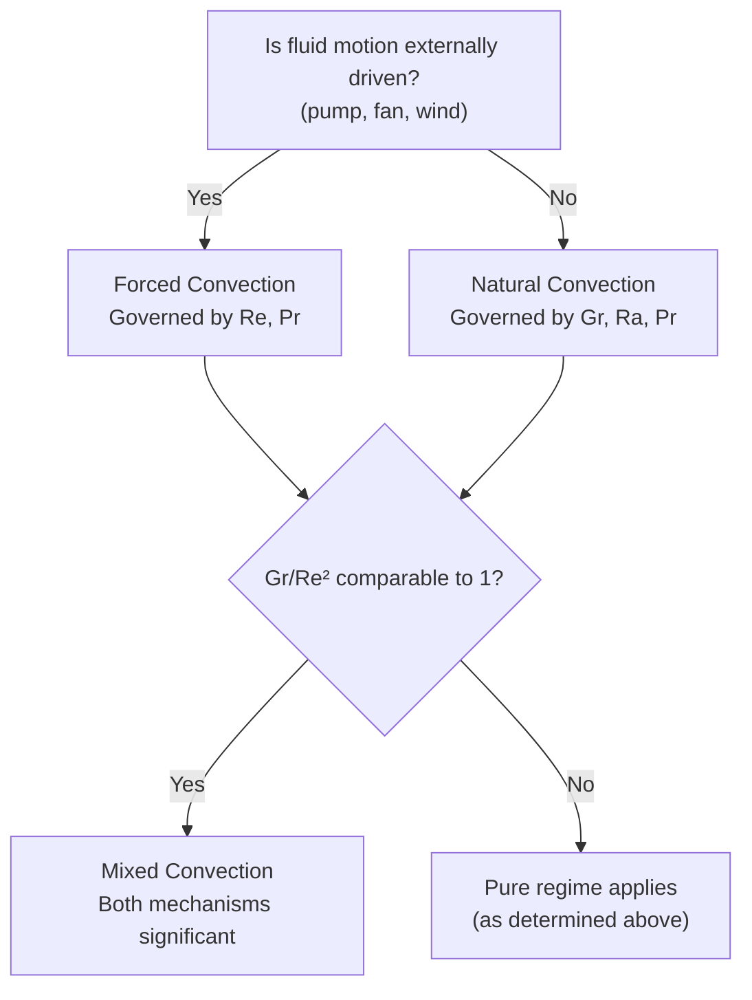

## Forced and Natural Convection

### Definition and Physical Mechanism

**Convection** is heat transfer between a solid surface and an adjacent moving fluid, combining conduction at the fluid-solid interface with bulk fluid motion that carries thermal energy away from (or toward) the surface. Convection is fundamentally governed by Newton's Law of Cooling:

$$Q = hA(T_s - T_\infty)$$

where $h$ is the **convective heat transfer coefficient** (W/m²·K), $A$ is surface area, $T_s$ is surface temperature, and $T_\infty$ is the free-stream (bulk) fluid temperature. Unlike thermal conductivity, $h$ is not a pure material property — it depends on fluid properties, flow velocity, surface geometry, and flow regime (laminar vs. turbulent), and is typically determined from empirical correlations rather than derived analytically for most practical geometries.

Convection is classified into two broad categories based on what drives the fluid motion:

- **Forced convection:** fluid motion is driven by an external mechanism (pump, fan, blower, or ambient wind).
- **Natural (free) convection:** fluid motion is driven solely by buoyancy forces arising from density differences caused by temperature gradients within the fluid itself — no external mover is present.

### The Boundary Layer Concept

Both convection modes are governed by boundary layer behavior at the solid-fluid interface:

- **Velocity (hydrodynamic) boundary layer:** the region near the surface where fluid velocity transitions from zero (no-slip condition at the wall) to the free-stream velocity.
- **Thermal boundary layer:** the region near the surface where fluid temperature transitions from the surface temperature to the free-stream temperature.

The relative thickness of these two boundary layers is characterized by the **Prandtl number** ($Pr = \nu/\alpha$, ratio of momentum diffusivity to thermal diffusivity), which determines how closely velocity and temperature profiles track one another — a key parameter appearing in nearly all convection correlations.

### Key Dimensionless Groups in Convection

| Dimensionless Number | Definition | Physical Meaning |
| --- | --- | --- |
| Reynolds number, $Re$ | $\dfrac{\rho V L}{\mu} = \dfrac{VL}{\nu}$ | Ratio of inertial to viscous forces; determines laminar vs. turbulent flow (forced convection) |
| Prandtl number, $Pr$ | $\dfrac{\nu}{\alpha} = \dfrac{c_p \mu}{k}$ | Ratio of momentum to thermal diffusivity; relates velocity and thermal boundary layer thickness |
| Nusselt number, $Nu$ | $\dfrac{hL}{k_{fluid}}$ | Dimensionless convective heat transfer coefficient; ratio of convective to conductive heat transfer |
| Grashof number, $Gr$ | $\dfrac{g\beta(T_s-T_\infty)L^3}{\nu^2}$ | Ratio of buoyancy to viscous forces; the natural-convection analog of Reynolds number |
| Rayleigh number, $Ra$ | $Gr \cdot Pr$ | Combined buoyancy-driven flow and thermal diffusion parameter; governs natural convection regime |

The universal goal of convection correlations is to determine $Nu$ (and hence $h = Nu \cdot k_{fluid}/L$) as a function of the other relevant dimensionless groups for a given geometry and flow regime:

$$Nu = f(Re, Pr) \quad \text{(forced convection)}$$

$$Nu = f(Gr, Pr) = f(Ra) \quad \text{(natural convection)}$$

### Forced Convection: Flow Regimes

**External flow (flow over a surface, e.g., flat plate, cylinder, tube bank):**

For flow over a flat plate, the transition from laminar to turbulent boundary layer occurs at a critical Reynolds number, commonly taken as $Re_{x,cr} \approx 5 \times 10^5$ for engineering purposes, though this value depends on surface roughness, free-stream turbulence, and pressure gradient. [Well-established approximate benchmark value — exact transition point is sensitive to specific flow conditions]

**Internal flow (flow inside a pipe or duct):**

Flow regime is determined by Reynolds number based on pipe diameter:

- $Re_D < 2300$: laminar
- $2300 < Re_D < 4000$: transitional
- $Re_D > 4000$: turbulent

[Well-established, commonly cited transition ranges — exact transition Reynolds numbers can shift somewhat depending on pipe roughness, inlet conditions, and disturbance levels]

### Common Forced Convection Correlations

**Flat plate, laminar flow, local Nusselt number:**

$$Nu_x = 0.332\,Re_x^{1/2}Pr^{1/3} \quad (Pr \geq 0.6)$$

**Flat plate, laminar flow, average Nusselt number over length L:**

$$\overline{Nu}_L = 0.664\,Re_L^{1/2}Pr^{1/3}$$

**Flat plate, turbulent flow, average Nusselt number:**

$$\overline{Nu}_L = 0.037\,Re_L^{4/5}Pr^{1/3}$$

**Internal flow, turbulent, fully developed (Dittus-Boelter equation):**

$$Nu_D = 0.023\,Re_D^{4/5}Pr^n$$

where $n = 0.4$ for heating (fluid being heated, $T_s > T_{fluid}$) and $n = 0.3$ for cooling ($T_s < T_{fluid}$). This is one of the most widely used correlations in industrial heat exchanger and piping design due to its simplicity, though more refined correlations (e.g., Gnielinski) offer improved accuracy across a broader Reynolds/Prandtl range. [Well-established, extensively validated correlation — applicable within stated Reynolds/Prandtl ranges and moderate temperature differences per its original derivation]

**Internal flow, laminar, fully developed, constant surface temperature:**

$$Nu_D = 3.66 \quad \text{(constant, independent of Re and Pr in fully developed laminar flow)}$$

**Internal flow, laminar, fully developed, constant surface heat flux:**

$$Nu_D = 4.36$$

**Flow across a single cylinder (Churchill-Bernstein correlation, commonly used form):**

Widely tabulated for a broad Reynolds number range; specific coefficients depend on the $Re$ range and are typically referenced directly from correlation tables rather than reproduced from memory for precision engineering work.

### Natural Convection Correlations

**Vertical flat plate/wall (Churchill-Chu correlation, laminar and turbulent range):**

$$\overline{Nu}_L = \left\{0.825 + \frac{0.387\,Ra_L^{1/6}}{[1+(0.492/Pr)^{9/16}]^{8/27}}\right\}^2$$

**Horizontal plate, hot surface facing up (or cold surface facing down) — enhances buoyant flow:**

$$\overline{Nu}_L = 0.54\,Ra_L^{1/4} \quad (10^4 \leq Ra_L \leq 10^7)$$

$$\overline{Nu}_L = 0.15\,Ra_L^{1/3} \quad (10^7 \leq Ra_L \leq 10^{11})$$

**Horizontal plate, hot surface facing down (or cold surface facing up) — suppresses buoyant flow:**

$$\overline{Nu}_L = 0.27\,Ra_L^{1/4} \quad (10^5 \leq Ra_L \leq 10^{10})$$

**Horizontal cylinder (widely used Churchill-Chu form for a broad Ra range):**

$$\overline{Nu}_D = \left\{0.60 + \frac{0.387\,Ra_D^{1/6}}{[1+(0.559/Pr)^{9/16}]^{8/27}}\right\}^2$$

Natural convection correlations are generally more geometry-sensitive than forced convection correlations, and the specific correlation coefficients/ranges above are drawn from standard, widely-referenced heat transfer textbook compilations; exact numerical coefficients can vary slightly between reference sources. [Well-established correlations in standard use — always verify coefficients and applicable Ra range against the specific reference being followed for critical design work]

### Forced vs. Natural Convection — Comparison

| Aspect | Forced Convection | Natural Convection |
| --- | --- | --- |
| Driving mechanism | External (pump, fan, wind) | Buoyancy (density difference from temperature gradient) |
| Governing dimensionless number | Reynolds number ($Re$) | Grashof/Rayleigh number ($Gr$, $Ra$) |
| Typical $h$ range (air) | 10–200 W/m²·K | 2–25 W/m²·K |
| Typical $h$ range (water/liquids) | 50–20,000 W/m²·K | 100–1000 W/m²·K |
| Relative magnitude | Generally higher $h$ for comparable conditions | Generally lower $h$ |
| Energy input required | Yes (pump/fan power) | No (passive) |

[Well-established qualitative comparison; specific $h$ ranges are commonly cited approximate bands and actual values depend heavily on specific fluid, geometry, temperature difference, and flow conditions]

### Mixed Convection

When forced and natural convection effects are of comparable magnitude (neither clearly dominant), **mixed convection** occurs, and neither pure forced nor pure natural convection correlations apply accurately alone. The relevant governing parameter is the ratio $Gr/Re^2$:

- $Gr/Re^2 \ll 1$: forced convection dominates, natural convection effects negligible
- $Gr/Re^2 \gg 1$: natural convection dominates
- $Gr/Re^2 \approx 1$: mixed convection regime — both effects significant, requiring specialized correlations or the more conservative approach of evaluating both mechanisms and using the larger predicted $h$, or a combined correlation appropriate to the specific geometry.

### Convection Regime Selection — Diagram

### Worked Example: Forced Convection Over a Tube in Cross-Flow

**Given:** Air at 25°C flows across a cylindrical tube (D = 0.05 m) at 10 m/s. Tube surface temperature is 80°C. Estimate the convective heat transfer coefficient.

**Air properties at film temperature** $T_f = (25+80)/2 = 52.5°C \approx 325$ K (approximate values):

- $\nu \approx 1.85 \times 10^{-5}$ m²/s
- $k \approx 0.0280$ W/m·K
- $Pr \approx 0.703$

**Step 1 — Reynolds number:**

$$Re_D = \frac{VD}{\nu} = \frac{10 \times 0.05}{1.85 \times 10^{-5}} \approx 27{,}027$$

**Step 2 — Apply an appropriate cross-flow cylinder correlation** (e.g., Churchill-Bernstein or Hilpert-type correlation for this Re range — using a representative simplified form, $Nu_D = C\,Re_D^m Pr^{1/3}$ with typical tabulated constants for this Re range, e.g., $C \approx 0.027$, $m \approx 0.805$ for $Re$ in the range ~$4\times10^4$–$4\times10^5$, or comparable constants for the ~$2.7 \times 10^4$ range from standard correlation tables):

$$Nu_D \approx 0.027 (27{,}027)^{0.805}(0.703)^{1/3} \approx 0.027 \times 3{,}220 \times 0.889 \approx 77.3$$

[Inference: illustrative calculation using representative correlation constants; precise design work should reference the exact correlation and coefficient table applicable to the specific Reynolds number range, such as Hilpert or Churchill-Bernstein tabulated values]

**Step 3 — Convert to h:**

$$h = \frac{Nu_D \cdot k}{D} = \frac{77.3 \times 0.0280}{0.05} \approx 43.3 \text{ W/m}^2\text{·K}$$

**Step 4 — Heat transfer rate per unit length:**

$$Q' = h\pi D(T_s - T_\infty) = 43.3 \times \pi \times 0.05 \times (80-25) \approx 374 \text{ W/m}$$

### Applications in Power Generation Systems

**Boiler tube heat transfer:** Convective heat transfer from combustion gases to boiler tubes (gas-side, typically forced convection with high-velocity flue gas flow, sometimes combined with radiation) and from tube walls to boiling water/steam (liquid-side, often high-$h$ forced or two-phase convective boiling) together determine overall boiler heat exchanger performance.

**Condenser and feedwater heater design:** Shell-and-tube condensers rely on forced convection correlations (often combined with condensation heat transfer models) on both the steam side (condensing) and cooling water side (single-phase forced convection, frequently using Dittus-Boelter or similar correlations for the tube-side flow).

**Gas turbine blade cooling:** Internal cooling passages in turbine blades use forced convection (sometimes with turbulence-enhancing features like ribs or pin fins) to remove heat from the blade metal, since natural convection alone would be entirely inadequate given the extreme heat flux from hot combustion gases.

**Natural convection in transformer and equipment cooling:** Oil-filled power transformers often rely partly or wholly on natural convection (thermosiphon effect) to circulate cooling oil through external radiators, avoiding the need for pumps in smaller/lower-capacity units.

**Cooling tower and air-cooled condenser design:** Natural draft cooling towers rely entirely on buoyancy-driven natural convection (warm, moist air rising) to draw air through the tower, while mechanical draft towers use forced convection via fans — the choice between these approaches involves trade-offs in capital cost, auxiliary power consumption, and site conditions (ambient wind, available height for natural draft).

**Related Topics:**

- Conduction and Fourier's Law
- Thermal Resistance Networks and Composite Walls
- Extended Surfaces and Fin Design
- Boiling and Condensation Heat Transfer
- Heat Exchanger Design: LMTD and Effectiveness-NTU Methods
- Boundary Layer Theory: Velocity and Thermal Boundary Layers
- Cooling Tower Design: Natural vs. Mechanical Draft
- Dimensional Analysis and Buckingham Pi Theorem in Heat Transfer