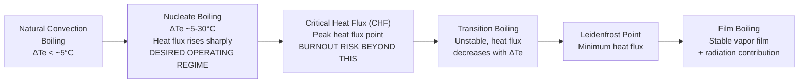
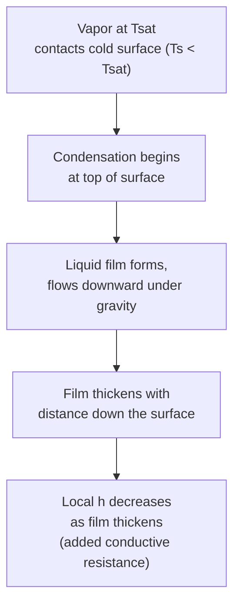

## Boiling and Condensation Heat Transfer

### Overview and Significance

**Boiling and condensation** are phase-change heat transfer modes involving latent heat exchange, distinguishing them fundamentally from single-phase convection. Because latent heat of vaporization is typically far larger than the sensible heat associated with modest temperature changes, phase-change heat transfer achieves substantially higher heat transfer coefficients than single-phase convection for a given temperature difference — making boiling and condensation central to the thermal performance of boilers, condensers, and evaporators throughout power generation and refrigeration systems.

### Boiling Heat Transfer: Fundamental Concept

Boiling occurs when a liquid is in contact with a surface maintained at a temperature above the liquid's saturation temperature at the local pressure. The **excess temperature** (or wall superheat) driving boiling is defined as:

$$\Delta T_e = T_s - T_{sat}$$

where $T_s$ is the heated surface temperature and $T_{sat}$ is the saturation temperature of the liquid at the system pressure.

### The Boiling Curve (Nukiyama Curve)

The relationship between heat flux and excess temperature for pool boiling exhibits a characteristic non-monotonic shape, historically established through Nukiyama's classic experiments, and is divided into distinct regimes:

**Regime 1 — Natural Convection Boiling ($\Delta T_e \lesssim 5°C$):**

No vapor bubbles form; heat transfer occurs by natural convection alone, with the superheated liquid rising to the free surface where evaporation occurs.

**Regime 2 — Nucleate Boiling ($\Delta T_e \approx 5$–$30°C$, approximate range):**

Vapor bubbles form at discrete nucleation sites (surface imperfections, cavities) on the heated surface, grow, detach, and rise through the liquid. This regime provides very high heat transfer coefficients and is the desired operating regime for essentially all practical boiling heat transfer equipment (boilers, kettle reboilers). Heat flux increases sharply with excess temperature in this regime.

**Critical Heat Flux (CHF) / Burnout Point:**

At a certain maximum excess temperature, heat flux reaches a peak value called the **critical heat flux**. Beyond this point, vapor generation becomes so rapid that bubbles coalesce into a vapor film that partially blankets the heated surface, sharply reducing heat transfer (since vapor has much lower thermal conductivity than liquid). This is an extremely important practical design limit — operating a boiler tube or heated surface beyond CHF, especially under constant heat flux (as opposed to constant surface temperature) conditions, can result in a sudden, large surface temperature spike ("burnout") potentially causing physical damage or failure of the heated surface. [Well-established critical phenomenon central to boiler and nuclear reactor thermal-hydraulic safety design]

**Regime 3 — Transition Boiling (Unstable Film Boiling):**

Beyond CHF, the surface is intermittently covered by unstable vapor patches; heat flux actually decreases with increasing excess temperature in this regime, making it inherently unstable and generally avoided in practical equipment design/operation.

**Regime 4 — Film Boiling:**

At sufficiently high excess temperature, a stable, continuous vapor film blankets the entire heated surface, insulating it from direct liquid contact. Heat transfer occurs by conduction/convection through the vapor film plus radiation at very high surface temperatures. Heat flux increases again with excess temperature in this regime due to increasing radiative contribution, but at substantially reduced efficiency compared to nucleate boiling for a given excess temperature.

**Leidenfrost Point:** The minimum heat flux point separating transition boiling from stable film boiling — named for the classic Leidenfrost effect phenomenon (e.g., water droplets skittering on a very hot surface due to a supporting vapor cushion).

### Boiling Curve — Diagram

### Boiling Curve Heat Flux vs. Excess Temperature (svg_diagram)

<svg xmlns="http://www.w3.org/2000/svg" viewBox="0 0 640 380">
<rect x="0" y="0" width="640" height="380" fill="#ffffff" />
<text x="320" y="26" text-anchor="middle" font-size="17" font-family="sans-serif" font-weight="bold" fill="#1a1a1a">Pool Boiling Curve (svg_diagram)</text>
<line x1="80" y1="330" x2="600" y2="330" stroke="#333333" stroke-width="2" />
<line x1="80" y1="330" x2="80" y2="50" stroke="#333333" stroke-width="2" />
<text x="330" y="360" text-anchor="middle" font-size="12" font-family="sans-serif" fill="#000000">Excess Temperature, ΔTe = Ts − Tsat (log scale)</text>
<text x="30" y="190" text-anchor="middle" font-size="12" font-family="sans-serif" fill="#000000" transform="rotate(-90 30 190)">Heat Flux, q'' (log scale)</text>
<path d="M 100 320 L 160 280 L 220 190 L 280 90 L 330 70 L 380 130 L 430 200 L 480 175 L 560 100" fill="none" stroke="#c0392b" stroke-width="3" />
<circle cx="280" cy="90" r="4" fill="#000000" />
<text x="280" y="75" text-anchor="middle" font-size="9" font-family="sans-serif" fill="#000000">CHF (peak)</text>
<circle cx="430" cy="200" r="4" fill="#000000" />
<text x="440" y="220" text-anchor="middle" font-size="9" font-family="sans-serif" fill="#000000">Leidenfrost pt</text>

<text x="120" y="315" text-anchor="middle" font-size="9" font-family="sans-serif" fill="`#333333`">Natural</text>

<text x="120" y="325" text-anchor="middle" font-size="9" font-family="sans-serif" fill="`#333333`">Convection</text>

<text x="220" y="240" text-anchor="middle" font-size="9" font-family="sans-serif" fill="`#333333`">Nucleate Boiling</text>

<text x="360" y="150" text-anchor="middle" font-size="9" font-family="sans-serif" fill="`#333333`">Transition</text>

<text x="500" y="130" text-anchor="middle" font-size="9" font-family="sans-serif" fill="`#333333`">Film Boiling</text>

</svg>

### Nucleate Boiling Correlation — Rohsenow Equation

For engineering estimation of nucleate pool boiling heat flux, the widely used **Rohsenow correlation** relates heat flux to excess temperature:

$$q'' = \mu_l h_{fg}\left[\frac{g(\rho_l - \rho_v)}{\sigma}\right]^{1/2}\left(\frac{c_{p,l}\Delta T_e}{C_{sf}h_{fg}Pr_l^n}\right)^3$$

where $\mu_l$ is liquid viscosity, $h_{fg}$ is latent heat of vaporization, $\rho_l$/$\rho_v$ are liquid/vapor densities, $\sigma$ is surface tension, $c_{p,l}$ is liquid specific heat, $C_{sf}$ is an empirical surface-fluid combination constant (varies by heater surface material/finish and fluid pair — tabulated in reference sources), and $n$ is an empirical exponent (commonly 1.0 for water, 1.7 for other fluids in the original correlation formulation).

This correlation requires empirical surface-fluid coefficients determined experimentally for specific material/fluid combinations, and predictions carry meaningful uncertainty even with well-characterized coefficients — it is used primarily for preliminary design estimation rather than precision heat flux prediction. [Well-established classical correlation, widely referenced — inherent empirical uncertainty is acknowledged even in its standard application]

### Critical Heat Flux Correlation (Zuber Correlation)

A widely used estimate for critical heat flux in pool boiling:

$$q''_{CHF} = C_{cr}\,h_{fg}\,\rho_v^{1/2}\left[\sigma g(\rho_l - \rho_v)\right]^{1/4}$$

where $C_{cr}$ is a constant (commonly cited as approximately 0.131 in the widely referenced form of this correlation, though values are sometimes reported over a small range in different sources). [Inference: exact constant value varies slightly among reference sources; consult the specific reference standard being followed for design work]

### Flow Boiling

**Flow boiling** occurs in boiler tubes, evaporators, and other systems where the boiling liquid flows through a channel rather than sitting in a pool, combining forced convection effects with the phase-change mechanisms described above. Flow boiling in a heated tube proceeds through a sequence of flow regimes as vapor quality increases along the tube length:

1. **Subcooled boiling:** bulk liquid below saturation temperature, but local nucleate boiling occurs at the wall where surface temperature exceeds saturation.
2. **Saturated nucleate boiling / bubbly flow:** discrete bubbles form and are carried along with bulk liquid at saturation temperature.
3. **Slug flow:** bubbles coalesce into larger vapor slugs.
4. **Annular flow:** a liquid film flows along the tube wall while vapor flows through the core — often the dominant, most efficient heat transfer regime in flow boiling.
5. **Mist flow / dryout:** liquid film on the wall is depleted, leaving only droplets entrained in a vapor-dominated core — heat transfer coefficient drops sharply once dryout occurs, analogous to critical heat flux/burnout in pool boiling.

This sequence and its associated heat transfer coefficient variation is fundamental to boiler tube and evaporator design, where maintaining adequate liquid film coverage (avoiding premature dryout) is a key design and operational constraint.

### Condensation Heat Transfer: Fundamental Concept

Condensation occurs when vapor contacts a surface at a temperature below the vapor's saturation temperature, releasing latent heat as it converts to liquid. Two distinct condensation modes exist based on how condensate behaves on the surface:

**Film Condensation:** Condensate forms a continuous liquid film that wets the surface completely and flows under gravity (or vapor shear) away from the condensing region. This is the typical mode on most engineering surfaces (clean metal surfaces are generally wetted by common working fluids like water) and provides moderate condensation heat transfer coefficients since the liquid film itself represents a thermal resistance the released latent heat must conduct through.

**Dropwise Condensation:** Condensate forms discrete droplets rather than a continuous film, typically occurring on surfaces treated with a non-wetting coating or contaminated with certain substances that prevent film formation. Dropwise condensation achieves substantially higher heat transfer coefficients than film condensation (commonly cited as an order of magnitude higher) because droplets roll off the surface, continuously exposing fresh bare surface directly to vapor without the resistance of an intervening liquid film. However, dropwise condensation is difficult to sustain reliably over long operating periods in industrial equipment (surface treatments degrade over time), so most practical condenser design is conservatively based on film condensation assumptions. [Well-established distinction — dropwise condensation's substantial heat transfer benefit is well documented, though industrial reliability limitations are the primary reason it is not standard practice]

### Nusselt's Film Condensation Theory

For laminar film condensation on a vertical plate (classical Nusselt analysis), the average heat transfer coefficient over plate length $L$ is:

$$\overline{h} = 0.943\left[\frac{g\rho_l(\rho_l-\rho_v)k_l^3 h_{fg}'}{\mu_l L(T_{sat}-T_s)}\right]^{1/4}$$

where $h_{fg}' = h_{fg} + 0.68\,c_{p,l}(T_{sat}-T_s)$ is a modified latent heat accounting for the sensible cooling of subcooled condensate below saturation temperature within the film.

**For a horizontal tube (common in shell-and-tube condensers):**

$$\overline{h} = 0.729\left[\frac{g\rho_l(\rho_l-\rho_v)k_l^3 h_{fg}'}{\mu_l D(T_{sat}-T_s)}\right]^{1/4}$$

The horizontal tube correlation is widely used in shell-and-tube steam condenser design because the shorter characteristic condensate flow path around a tube's circumference (compared to flow down a tall vertical surface) generally yields a thinner average film and correspondingly higher heat transfer coefficient for comparable temperature difference. [Well-established classical result from Nusselt film condensation theory]

**For a bank of N horizontal tubes stacked vertically** (condensate from upper tubes drains onto lower tubes, thickening the film progressively):

$$\overline{h}_N = \overline{h}_{1,tube} \cdot N^{-1/4}$$

This reduction factor reflects why tube bundle arrangement and condensate drainage management are important considerations in shell-and-tube condenser design — tubes lower in a vertical stack experience reduced local heat transfer coefficient due to accumulated condensate film thickness from tubes above.

### Film Condensation on a Vertical Surface — Diagram

### Effect of Non-Condensable Gases

Even a small fraction of non-condensable gas (e.g., air) mixed with condensing vapor can dramatically reduce condensation heat transfer coefficient, because non-condensables accumulate near the condensing surface (since only vapor is removed by condensation) and must diffuse away through the vapor before fresh vapor can reach the surface — this added diffusional resistance can reduce heat transfer significantly even at seemingly small non-condensable concentrations. This effect is a major practical concern in steam condenser design and operation, driving the use of air ejectors/vacuum systems to actively remove accumulated non-condensable gases from condenser shells during operation. [Well-established, practically significant phenomenon in steam condenser engineering]

### Worked Example: Horizontal Tube Steam Condenser

**Given:** Saturated steam at 1 atm ($T_{sat}$ = 100°C) condenses on the outside of a horizontal tube, $D$ = 0.025 m, maintained at $T_s$ = 80°C.

**Approximate saturated liquid water properties at film temperature ~90°C:**

- $\rho_l \approx 965$ kg/m³
- $k_l \approx 0.675$ W/m·K
- $\mu_l \approx 3.15 \times 10^{-4}$ Pa·s
- $h_{fg} \approx 2257$ kJ/kg (at 100°C)
- $\rho_v \approx 0.6$ kg/m³ (small, often neglected relative to $\rho_l$)

**Modified latent heat:**

$$h_{fg}' = 2257 + 0.68(4.2)(100-80) \approx 2257 + 57.1 \approx 2314 \text{ kJ/kg} = 2{,}314{,}000 \text{ J/kg}$$

**Applying the horizontal tube correlation:**

$$\overline{h} = 0.729\left[\frac{9.81 \times 965 \times 965 \times (0.675)^3 \times 2{,}314{,}000}{3.15\times10^{-4} \times 0.025 \times 20}\right]^{1/4}$$

Computing the bracketed term numerically:

Numerator: $9.81 \times 965 \times 965 \times 0.3075 \times 2{,}314{,}000 \approx 6.42 \times 10^{12}$

Denominator: $3.15\times10^{-4} \times 0.025 \times 20 \approx 1.575\times10^{-4}$

$$\frac{6.42\times10^{12}}{1.575\times10^{-4}} \approx 4.08 \times 10^{16}$$

$$\overline{h} \approx 0.729 \times (4.08\times10^{16})^{0.25} \approx 0.729 \times 14{,}200 \approx 10{,}350 \text{ W/m}^2\text{·K}$$

[Inference: this worked calculation uses representative approximate property values for illustration; precise design calculations should use steam table property data at the exact film temperature and verify all intermediate arithmetic independently]

This result illustrates why condensing steam heat transfer coefficients are characteristically very high (often several thousand to over ten thousand W/m²·K) — a key reason condenser shell-side (steam) thermal resistance is often small relative to tube-side (cooling water) resistance in overall condenser $U$-value calculations.

### Applications in Power Generation

**Steam boiler evaporator tubes:** Nucleate flow boiling in boiler risers/waterwall tubes is the primary heat transfer mode converting feedwater to steam; boiler design must ensure adequate margin below critical heat flux across all tubes and operating conditions to prevent tube overheating/failure (departure from nucleate boiling, DNB, is a critical safety limit particularly emphasized in nuclear reactor thermal-hydraulic design).

**Steam condensers:** The primary heat rejection component of the Rankine cycle, relying on film condensation of exhaust steam on the outside of cooling-water-carrying tubes; condenser performance (vacuum level achieved) directly affects overall cycle thermal efficiency, making condensation heat transfer optimization (tube arrangement, non-condensable gas removal, dropwise condensation research) an active area of power plant performance engineering.

**Feedwater heaters:** Use condensing extraction steam to preheat boiler feedwater, relying on the same film condensation principles as the main condenser but at higher pressure/temperature.

**Refrigeration and heat pump condensers/evaporators:** Both boiling (evaporator) and condensation (condenser) heat transfer are central to refrigeration cycle component design, directly analogous to power cycle applications but operating with refrigerant working fluids rather than water/steam.

**Related Topics:**

- Rankine Cycle Fundamentals and Condenser Role
- Critical Heat Flux and Departure from Nucleate Boiling (DNB) in Reactor Safety
- Heat Exchanger Design: LMTD and Effectiveness-NTU Methods
- Steam Condenser Design and Non-Condensable Gas Removal
- Two-Phase Flow Regimes in Boiler Tubes
- Forced and Natural Convection
- Feedwater Heater Design and Regenerative Rankine Cycles