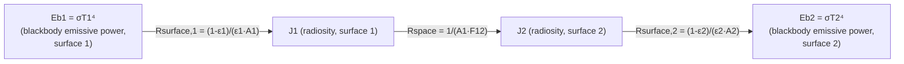

## Thermal Radiation and the Stefan-Boltzmann Law

### Definition and Physical Mechanism

**Thermal radiation** is heat transfer via electromagnetic waves emitted by any matter with temperature above absolute zero, arising from changes in electron energy configurations within atoms and molecules. Unlike conduction and convection, radiation requires no intervening medium and can occur through a vacuum — this is how solar energy reaches Earth, and why radiation becomes the dominant heat transfer mode in high-temperature applications where other modes may be absent or comparatively weak (e.g., combustor interiors, furnace chambers, space-based thermal systems).

Thermal radiation spans a range of the electromagnetic spectrum, primarily the infrared range for typical engineering temperatures, extending into visible light at higher temperatures (e.g., incandescent glow above roughly 800 K) and into ultraviolet at very high temperatures (e.g., the sun's surface).

### The Stefan-Boltzmann Law

For an ideal **blackbody** (a hypothetical surface that absorbs all incident radiation and emits the maximum possible radiation at any given temperature), total emissive power is:

$$E_b = \sigma T^4$$

where:

- $E_b$ = blackbody emissive power (W/m²)
- $\sigma$ = Stefan-Boltzmann constant = $5.67 \times 10^{-8}$ W/m²·K⁴
- $T$ = absolute temperature (K)

This fourth-power temperature dependence is the defining, distinguishing characteristic of radiation heat transfer compared to conduction and convection (which scale linearly with temperature difference) — it means radiation heat transfer becomes disproportionately dominant at high absolute temperatures and comparatively negligible at temperatures close to ambient, relative to conduction/convection in the same system.

### Real Surfaces: Emissivity

Real surfaces emit less radiation than an ideal blackbody at the same temperature. This is quantified by **emissivity** ($\varepsilon$), defined as the ratio of actual emissive power to blackbody emissive power at the same temperature:

$$\varepsilon = \frac{E}{E_b}, \quad 0 \leq \varepsilon \leq 1$$

$$E = \varepsilon\sigma T^4$$

Emissivity depends on surface material, surface finish/roughness, temperature, and (for real, non-"gray" surfaces) wavelength and direction — though for many engineering calculations, surfaces are approximated as **diffuse-gray** (emissivity independent of wavelength and direction) to simplify analysis.

**Representative emissivity values (approximate, at moderate temperature):**

| Surface | Emissivity ($\varepsilon$) |
| --- | --- |
| Polished aluminum | 0.04–0.06 |
| Oxidized aluminum | 0.2–0.3 |
| Polished stainless steel | 0.15–0.2 |
| Oxidized/rusted steel | 0.6–0.85 |
| Black paint | 0.9–0.98 |
| White paint | 0.85–0.95 (in the infrared, despite appearing "white" in visible light) |
| Firebrick / refractory | 0.75–0.9 |
| Human skin | ~0.95–0.98 |
| Water | ~0.95–0.96 |

[Well-documented representative values — actual emissivity depends strongly on exact surface condition, oxidation state, and measurement wavelength range; consult material-specific data for precision engineering applications]

A key practical insight: emissivity in the infrared (thermal radiation) range often does not correlate with visible-light color/appearance — this is why, for example, white paint can have high thermal emissivity despite appearing to reflect visible light strongly, since the relevant wavelength range for thermal radiation calculations (infrared, for typical engineering temperatures) is distinct from the visible spectrum governing perceived color.

### Absorptivity, Reflectivity, and Transmissivity

When radiation is incident on a real surface, it is partitioned among three fates:

$$\alpha + \rho + \tau = 1$$

where $\alpha$ = absorptivity, $\rho$ = reflectivity, $\tau$ = transmissivity. For most solid, opaque engineering surfaces, $\tau \approx 0$, simplifying to:

$$\alpha + \rho = 1$$

**Kirchhoff's Law of Radiation:** For a surface in thermal equilibrium with its surroundings (or, more generally and commonly applied as an approximation, for a diffuse-gray surface), spectral absorptivity equals spectral emissivity at the same temperature and wavelength:

$$\alpha_\lambda = \varepsilon_\lambda$$

For diffuse-gray surfaces, this is commonly extended to total (spectrally-integrated) properties, $\alpha = \varepsilon$, though this simplification is strictly valid only when the surface and the incident radiation source have similar spectral distributions (e.g., both near the same temperature) — using $\alpha = \varepsilon$ for surfaces exposed to radiation from a source at a very different temperature (e.g., solar radiation on a surface near ambient temperature) can introduce meaningful error, since solar radiation is concentrated at shorter wavelengths than the surface's own emission spectrum. [Well-established radiation physics principle — the gray-surface simplification's accuracy depends on how closely the emitting source and receiving surface temperatures/spectra align]

### Blackbody Spectral Distribution: Planck's Law and Wien's Displacement Law

The spectral distribution of blackbody emissive power across wavelength is given by **Planck's Law**:

$$E_{b\lambda} = \frac{C_1}{\lambda^5\left[\exp(C_2/\lambda T) - 1\right]}$$

where $C_1$ and $C_2$ are radiation constants. Integrating Planck's Law over all wavelengths recovers the Stefan-Boltzmann Law ($E_b = \sigma T^4$).

**Wien's Displacement Law** identifies the wavelength of maximum spectral emissive power for a blackbody at a given temperature:

$$\lambda_{max} T = 2898 \, \mu\text{m·K}$$

This explains why higher-temperature bodies emit radiation shifted toward shorter wavelengths — the sun (surface temperature ~5800 K) emits peak radiation in the visible spectrum, while objects near room temperature (~300 K) emit peak radiation in the far infrared, invisible to the human eye but detectable by infrared thermal imaging equipment.

### Radiation Heat Exchange Between Two Surfaces

**Net radiation heat transfer between two black surfaces** (idealized, no view factor complexity, surface 1 completely surrounded by surface 2, or infinite parallel plates):

$$Q_{1\rightarrow2} = \sigma A_1 (T_1^4 - T_2^4)$$

**Between two gray surfaces (general enclosure, using the radiation network/resistance method):**

For two finite gray surfaces exchanging radiation (e.g., two parallel plates, or a surface fully enclosed by another):

$$Q_{1\rightarrow2} = \frac{\sigma(T_1^4 - T_2^4)}{\dfrac{1-\varepsilon_1}{\varepsilon_1 A_1} + \dfrac{1}{A_1 F_{1-2}} + \dfrac{1-\varepsilon_2}{\varepsilon_2 A_2}}$$

where $F_{1-2}$ is the **view factor** (also called shape factor or configuration factor) — the fraction of radiation leaving surface 1 that directly strikes surface 2, determined purely by geometry (relative size, shape, orientation, and distance between the two surfaces).

**Special case — small object (1) enclosed by a much larger surface (2)** (a very common practical simplification, e.g., a hot pipe in a large room, or a small component inside a large furnace):

$$Q_{1\rightarrow2} = \varepsilon_1 \sigma A_1(T_1^4 - T_2^4)$$

This simplified form is widely used because $A_1/A_2 \rightarrow 0$ causes the surface-2-related resistance terms to vanish, and $F_{1-2} \approx 1$ (essentially all radiation leaving the small object reaches the large enclosure).

**Special case — two infinite parallel plates:**

$$Q_{1\rightarrow2} = \frac{\sigma A(T_1^4-T_2^4)}{\dfrac{1}{\varepsilon_1}+\dfrac{1}{\varepsilon_2}-1}$$

### Radiation Network / Resistance Analogy

Similar to conduction/convection thermal resistance, radiation exchange can be represented using a resistance-network formulation:

$$Q = \frac{E_{b1}-E_{b2}}{R_{surface,1} + R_{space,1-2} + R_{surface,2}}$$

where:

- **Surface resistance:** $R_{surface} = \dfrac{1-\varepsilon}{\varepsilon A}$ (represents the surface's own imperfect emission relative to a blackbody; vanishes for a blackbody, $\varepsilon = 1$)
- **Space resistance:** $R_{space,1-2} = \dfrac{1}{A_1 F_{1-2}}$ (represents the geometric view-factor-based radiation exchange between two surfaces)

This network approach allows complex multi-surface radiation enclosure problems (e.g., furnace interiors with multiple walls, combustion chamber radiation analysis) to be solved using electrical-circuit-like network reduction techniques, analogous to the conduction/convection thermal resistance network approach.

### Radiation Network Diagram

### View Factors: Key Properties

**Reciprocity relation:**

$$A_1 F_{1-2} = A_2 F_{2-1}$$

**Summation rule** (for an enclosure of N surfaces, radiation leaving surface $i$ must go somewhere within the enclosure):

$$\sum_{j=1}^{N} F_{i-j} = 1$$

View factors for common geometric configurations (parallel rectangles, perpendicular rectangles with common edge, coaxial disks, etc.) are extensively tabulated in standard heat transfer references and view factor charts/catalogs, since closed-form analytical solutions exist only for relatively simple geometries — complex geometry view factors are typically obtained from published charts, tabulated formulas, or numerical integration/Monte Carlo ray-tracing methods in modern practice.

### Worked Example: Radiation Loss from a Hot Pipe

**Given:** An uninsulated steel pipe (outer diameter 0.1 m, length 5 m, emissivity $\varepsilon$ = 0.8) at surface temperature 150°C is located in a large room at 25°C. Calculate radiative heat loss.

**Step 1 — Convert temperatures to absolute (Kelvin):**

$$T_1 = 150 + 273 = 423 \text{ K}, \quad T_2 = 25 + 273 = 298 \text{ K}$$

**Step 2 — Surface area:**

$$A_1 = \pi D L = \pi(0.1)(5) \approx 1.571 \text{ m}^2$$

**Step 3 — Apply small-object-in-large-enclosure formula:**

$$Q_{rad} = \varepsilon_1 \sigma A_1 (T_1^4 - T_2^4)$$

$$T_1^4 = 423^4 \approx 3.203\times10^{10}, \quad T_2^4 = 298^4 \approx 7.886\times10^9$$

$$Q_{rad} = 0.8 \times 5.67\times10^{-8} \times 1.571 \times (3.203\times10^{10} - 0.7886\times10^{10})$$

$$Q_{rad} = 0.8 \times 5.67\times10^{-8} \times 1.571 \times 2.414\times10^{10}$$

$$Q_{rad} \approx 0.8 \times 5.67\times10^{-8} \times 1.571 \times 2.414\times10^{10} \approx 1{,}718 \text{ W}$$

This radiative loss would typically be evaluated alongside natural convection loss from the same pipe surface (using an appropriate horizontal cylinder natural convection correlation) — the total heat loss from an uninsulated hot pipe to ambient air is the **sum** of the convective and radiative contributions, since both mechanisms act in parallel from the same surface.

### Combined Convection and Radiation

For a surface losing heat simultaneously by convection and radiation to the same ambient/surrounding temperature (a very common practical scenario for exposed hot equipment surfaces), total heat loss is:

$$Q_{total} = Q_{conv} + Q_{rad} = hA(T_s - T_\infty) + \varepsilon\sigma A(T_s^4 - T_{surr}^4)$$

A **combined (linearized) heat transfer coefficient** $h_{combined}$ is sometimes defined for convenience, incorporating both effects into a single Newton's-Law-of-Cooling-style expression, particularly useful in personnel-safety surface temperature calculations and simplified insulation sizing:

$$h_{rad} = \varepsilon\sigma(T_s+T_{surr})(T_s^2+T_{surr}^2)$$

$$Q_{total} = (h + h_{rad})A(T_s - T_\infty)$$

(valid when $T_\infty \approx T_{surr}$, i.e., ambient air temperature and surrounding surface temperature are approximately equal, a common simplifying assumption for exposed equipment in a room).

### Radiation Shields

**Radiation shields** are thin, high-reflectivity (low-emissivity) sheets placed between two radiating surfaces to reduce net radiation heat transfer, without requiring physical insulation bulk. For $N$ radiation shields placed between two parallel plates (all with the same emissivity for simplicity), net radiation heat transfer is reduced by a factor of $(N+1)$ relative to the no-shield case (assuming identical emissivities throughout):

$$Q_{N,shields} = \frac{Q_{no,shield}}{N+1}$$

More generally, with shields of different emissivity than the primary surfaces, the resistance-network method is applied by adding an additional series resistance pair (two surface resistances plus a space resistance) for each shield inserted into the radiation circuit.

Radiation shields are widely applied in high-temperature furnace design, cryogenic system insulation (multi-layer insulation, MLI, used in spacecraft and cryogenic storage), and thermocouple radiation error correction (shielding a temperature sensor from radiative exchange with surroundings that would otherwise bias the sensor reading away from true gas temperature).

### Applications in Power and Combustion Systems

**Furnace and boiler radiant heat transfer:** In high-temperature combustion chambers, radiation is frequently the dominant heat transfer mode from hot combustion gases and flame to boiler waterwall tubes, since gas temperatures in this region often exceed 1000°C — well into the regime where the fourth-power temperature dependence makes radiation dominate over convection. Furnace design calculations must account for gas-phase radiation (from $CO_2$, $H_2O$, and particulates/soot in the flame, which are non-gray, participating media requiring specialized gas emissivity treatment) in addition to surface-to-surface radiation exchange.

**Gas turbine combustor liner design:** Combustor liner walls receive intense radiative heat flux from the flame and hot combustion products, requiring effective cooling (film cooling, thermal barrier coatings) to maintain acceptable liner metal temperatures despite this radiative load.

**Solar thermal power systems:** Concentrated solar power (CSP) systems rely fundamentally on radiation heat transfer principles — both the concentration of incoming solar radiation via reflective collectors and the radiative (and convective) losses from the receiver/absorber surface, which must be minimized (often via selective surface coatings with high solar absorptivity but low thermal emissivity) to maximize net energy capture.

**Nuclear reactor and spacecraft thermal management:** In vacuum or near-vacuum environments (spacecraft, some advanced reactor concepts), radiation becomes the sole available heat rejection mechanism to the surroundings, since no fluid medium is present for convection.

**Personnel safety and insulation surface temperature:** Combined convection-radiation calculations are standard in determining safe-to-touch surface temperatures for insulated piping and equipment in industrial and power plant settings.

**Related Topics:**

- Conduction and Fourier's Law
- Forced and Natural Convection
- View Factor Determination and Radiation Enclosure Analysis
- Gas Radiation and Participating Media in Combustion Chambers
- Concentrated Solar Power (CSP) System Design
- Multi-Layer Insulation (MLI) and Radiation Shielding
- Furnace and Boiler Radiant Section Design
- Thermal Imaging and Infrared Temperature Measurement Principles