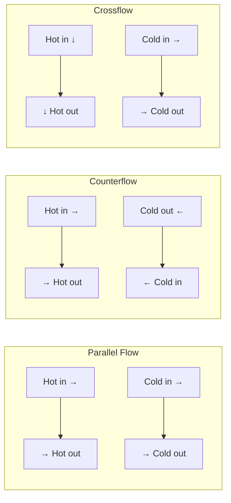
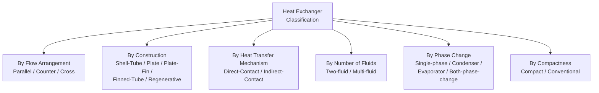

## Classification of Heat Exchangers

### Definition and Purpose

A **heat exchanger** is a device designed to transfer thermal energy between two or more fluids at different temperatures without (in most designs) direct mixing of the fluid streams. Heat exchangers are among the most widely used equipment in power generation, process industries, HVAC, and refrigeration, and can be classified along several independent dimensions: flow arrangement, construction type, heat transfer mechanism, number of fluids, and compactness.

### Classification by Flow Arrangement

**Parallel Flow (Cocurrent):** Both fluids enter at the same end and flow in the same direction. Temperature difference between fluids is largest at the inlet and progressively decreases along the length, with both fluids approaching a common intermediate temperature asymptotically but never crossing.

**Counterflow (Countercurrent):** Fluids enter at opposite ends and flow in opposite directions. This arrangement maintains a more uniform temperature difference along the exchanger length and can achieve a cold fluid outlet temperature that exceeds the hot fluid outlet temperature — a thermodynamic outcome impossible in parallel flow. For a given heat duty and flow rates, counterflow arrangement generally achieves the highest possible effectiveness among simple flow arrangements, which is why it is generally preferred where the exchanger geometry permits it. [Well-established thermodynamic result standard across heat transfer literature]

**Crossflow:** Fluids flow perpendicular to each other. Further subclassified as:

- *Both fluids unmixed:* each fluid is constrained to flow in separate channels/tubes without lateral mixing (e.g., finned-tube exchangers with fins preventing lateral flow).
- *Both fluids mixed:* fluids can mix freely in the direction transverse to the main flow.
- *One fluid mixed, one unmixed:* a common configuration (e.g., tube-side fluid unmixed within tubes, shell-side fluid mixed by baffled crossflow).

Crossflow performance falls between parallel flow and counterflow, with the mixed/unmixed condition affecting the exact position within that range.

### Flow Arrangement Comparison — Diagram

### Classification by Construction Type

**Double-Pipe (Concentric Tube) Heat Exchanger:** Simplest configuration — one fluid flows through an inner pipe while the second flows through the annular space between inner and outer pipes. Suitable for small capacity applications and situations requiring true counterflow with minimal complexity, but has limited surface area per unit volume, making it impractical for large heat duties without extensive length or multiple units in series/parallel ("hairpin" arrangements).

**Shell-and-Tube Heat Exchanger:** The most widely used configuration in power generation and industrial process applications. Consists of a bundle of tubes enclosed within a cylindrical shell; one fluid flows through the tubes while the other flows across/along the tubes within the shell, often directed by baffles that promote crossflow and turbulence on the shell side to enhance heat transfer.

Key components and design variables include:

- **Tube passes:** number of times tube-side fluid traverses the exchanger length (single-pass, multi-pass configurations)
- **Shell passes:** number of times shell-side fluid traverses the length
- **Baffles:** plates that direct shell-side flow, support tubes, and induce turbulence/crossflow component to shell-side flow
- **Tube pitch and layout pattern:** triangular, square, or rotated square tube arrangements affecting shell-side flow characteristics and cleanability
- **Fixed tubesheet, U-tube, or floating head design:** governing thermal expansion accommodation and tube bundle removability for cleaning/maintenance

TEMA (Tubular Exchanger Manufacturers Association) standards provide a standardized nomenclature and design classification system (front head, shell, and rear head type designations) widely referenced in shell-and-tube exchanger specification across the power and process industries. [Well-established industry standard — specific TEMA designation letters and configuration details should be referenced directly from current TEMA standards for precise specification work]

**Plate Heat Exchanger:** Consists of a series of thin, corrugated metal plates stacked together, with hot and cold fluids flowing in alternating channels between plates, gasketed or welded at the edges. Plate exchangers achieve high heat transfer coefficients (due to the corrugation pattern inducing turbulence at relatively low flow velocities) and high surface area density in compact packages, and are relatively easy to disassemble for cleaning (gasketed plate types) or to reconfigure capacity by adding/removing plates. Common in applications such as district heating substations, some feedwater heater designs, and process heat recovery. Limitations include lower maximum operating pressure/temperature compared to shell-and-tube designs (for gasketed types) and generally higher susceptibility to fouling in certain services due to narrow flow channels.

**Plate-Fin Heat Exchanger:** A compact exchanger construction using alternating layers of flat separator plates and corrugated fin material, brazed or otherwise bonded into a block, commonly used in cryogenic and aerospace applications (e.g., air separation plants, some gas turbine recuperators) where extremely high surface-area-to-volume ratio and light weight are priorities.

**Finned-Tube (Extended Surface) Heat Exchanger:** Tubes with externally attached fins, used when one fluid (typically a gas, such as air) has a much lower convective heat transfer coefficient than the other (typically a liquid) — the extended surface compensates for this asymmetry. Common in air-cooled condensers, radiators, and HVAC coils.

**Regenerative Heat Exchanger:** Heat is temporarily stored in a solid matrix material during one phase of operation, then released to a second fluid during another phase. Subclassified as:

- *Static (fixed-matrix) regenerators:* fluids alternate flow direction through a fixed matrix (e.g., some industrial furnace heat recovery systems, Ljungström-type air preheaters used in some coal-fired boiler configurations).
- *Rotary regenerators:* a rotating matrix continuously passes through hot and cold fluid streams (e.g., rotary air preheaters common in coal-fired power plant flue gas heat recovery, recovering heat from flue gas to preheat combustion air).

Regenerative exchangers typically permit some small degree of fluid carryover/leakage between streams (due to the shared matrix and, in rotary designs, seal clearances), which is an important design and operational consideration distinguishing them from true **recuperative** exchangers (where the two fluids are continuously separated by a solid wall, as in shell-and-tube, plate, and finned-tube designs, preventing direct fluid mixing).

### Classification by Compactness

A heat exchanger is often categorized as **compact** if it achieves a high surface-area-to-volume ratio, commonly cited using a threshold of approximately 700 m²/m³ (a commonly referenced benchmark, though exact thresholds vary somewhat between sources) for gas-side surfaces. [Inference: the specific numerical threshold for "compact" classification varies somewhat across references and applications] Compact exchangers (plate-fin, finned-tube with dense fin spacing, some plate types) are favored where weight and volume are constrained, such as aerospace, automotive, and some specialized power generation applications (e.g., gas turbine recuperators), at the cost of generally higher susceptibility to fouling and more limited cleaning access compared to shell-and-tube designs.

### Classification by Heat Transfer Mechanism

**Direct-Contact (Open) Heat Exchangers:** The two fluid streams physically mix directly, with no separating wall — heat (and often mass) transfer occurs through direct contact. Examples include cooling towers (air directly contacts water) and direct-contact feedwater heaters (deaerating heaters in some power plant configurations). These achieve very high heat transfer rates due to the absence of a solid wall resistance, but are limited to applications where fluid mixing is acceptable or even desired (as in cooling towers, where some evaporative water loss is expected).

**Indirect-Contact (Closed/Surface) Heat Exchangers:** Fluids remain physically separated by a solid wall throughout the heat exchange process (the large majority of heat exchanger types described above — shell-and-tube, plate, finned-tube, etc.), preventing direct mixing or contamination between streams. This category is by far the most common in practice wherever fluid mixing must be avoided (e.g., steam condensers, where cooling water and condensing steam must remain separate).

### Classification by Number of Fluids

Most heat exchangers involve exactly two fluid streams, but **multi-fluid (multi-stream) heat exchangers** — particularly common in cryogenic and natural gas processing applications (e.g., plate-fin exchangers in LNG liquefaction trains) — simultaneously exchange heat among three or more fluid streams within a single unit, offering compactness and integration advantages over multiple separate two-stream exchangers at the cost of significantly increased design complexity.

### Classification by Phase Change

| Category | Description | Example |
| --- | --- | --- |
| Single-phase to single-phase | Neither fluid changes phase | Liquid-to-liquid oil cooler |
| Condenser | One fluid condenses (releases latent heat), other remains single-phase | Steam surface condenser |
| Evaporator/Boiler | One fluid vaporizes (absorbs latent heat), other remains single-phase (or itself condenses) | Boiler economizer/evaporator, refrigeration evaporator |
| Condenser-Evaporator | Both fluids undergo phase change simultaneously | Some refrigeration cascade system interconnecting exchangers |

The presence of phase change substantially affects heat exchanger thermal design methodology, since the phase-changing fluid typically maintains a nearly constant temperature throughout the phase-change process (at constant pressure), altering the temperature profile assumptions used in standard LMTD calculations (a condenser or evaporator with one isothermal stream simplifies certain aspects of the LMTD calculation, since $\Delta T_{lm}$ reduces to a simpler form when one fluid's temperature is constant throughout).

### Classification Summary Diagram

### Shell-and-Tube Exchanger Schematic (svg_diagram)

<svg xmlns="http://www.w3.org/2000/svg" viewBox="0 0 640 300">
<rect x="0" y="0" width="640" height="300" fill="#ffffff" />
<text x="320" y="26" text-anchor="middle" font-size="17" font-family="sans-serif" font-weight="bold" fill="#1a1a1a">Shell-and-Tube Heat Exchanger (svg_diagram)</text>
<rect x="80" y="100" width="480" height="100" rx="15" fill="#dce8f5" stroke="#2c3e50" stroke-width="2" />
<text x="320" y="90" text-anchor="middle" font-size="11" font-family="sans-serif" fill="#1a1a1a">Shell</text>
<line x1="100" y1="130" x2="540" y2="130" stroke="#c0392b" stroke-width="4" />
<line x1="100" y1="150" x2="540" y2="150" stroke="#c0392b" stroke-width="4" />
<line x1="100" y1="170" x2="540" y2="170" stroke="#c0392b" stroke-width="4" />
<text x="320" y="185" text-anchor="middle" font-size="9" font-family="sans-serif" fill="#c0392b">Tube bundle (tube-side fluid)</text>
<rect x="150" y="100" width="6" height="100" fill="#7f8c8d" />
<rect x="280" y="100" width="6" height="100" fill="#7f8c8d" />
<rect x="410" y="100" width="6" height="100" fill="#7f8c8d" />
<text x="150" y="215" text-anchor="middle" font-size="8" font-family="sans-serif" fill="#333333">Baffle</text>
<line x1="30" y1="150" x2="80" y2="150" stroke="#c0392b" stroke-width="4" marker-end="url(#a1)" />
<line x1="560" y1="150" x2="610" y2="150" stroke="#c0392b" stroke-width="4" marker-end="url(#a1)" />
<text x="30" y="140" text-anchor="middle" font-size="9" font-family="sans-serif" fill="#c0392b">Tube in</text>
<text x="610" y="140" text-anchor="middle" font-size="9" font-family="sans-serif" fill="#c0392b">Tube out</text>
<line x1="200" y1="80" x2="200" y2="100" stroke="#2980b9" stroke-width="4" marker-end="url(#a2)" />
<line x1="400" y1="200" x2="400" y2="220" stroke="#2980b9" stroke-width="4" marker-end="url(#a2)" />
<text x="200" y="70" text-anchor="middle" font-size="9" font-family="sans-serif" fill="#2980b9">Shell in</text>
<text x="400" y="235" text-anchor="middle" font-size="9" font-family="sans-serif" fill="#2980b9">Shell out</text>
</svg>

### Applications in Power Generation Systems

**Steam surface condensers:** Large shell-and-tube (or, less commonly, plate-type) exchangers condensing turbine exhaust steam on the shell side against circulating cooling water in the tubes — a condenser-type, indirect-contact, typically single-shell-pass/multi-tube-pass configuration.

**Feedwater heaters:** Shell-and-tube exchangers heating feedwater (tube side) using extraction steam (shell side), typically operating in the condenser category, arranged in a regenerative Rankine cycle feedwater heating train.

**Air preheaters:** Regenerative (rotary Ljungström-type, common in many coal-fired plants) or recuperative (tubular/plate type) exchangers recovering heat from flue gas to preheat combustion air, improving boiler thermal efficiency.

**Gas turbine recuperators:** Compact plate-fin or primary-surface exchangers recovering heat from turbine exhaust gas to preheat compressor discharge air before combustion, used in recuperated (regenerative) Brayton cycle configurations to improve thermal efficiency, particularly in smaller/microturbine applications.

**Cooling towers:** Direct-contact heat exchangers (open, evaporative type) rejecting waste heat from the power cycle's cooling water circuit to ambient air, relying on both convective and evaporative heat transfer mechanisms.

**Oil coolers and auxiliary heat exchangers:** Plate or shell-and-tube exchangers used throughout balance-of-plant systems for lubricating oil cooling, generator hydrogen/air coolers, and various auxiliary cooling services.

**Related Topics:**

- Heat Exchanger Design: LMTD and Effectiveness-NTU Methods
- Boiling and Condensation Heat Transfer
- Forced and Natural Convection
- Fouling Resistance and Heat Exchanger Performance Degradation
- TEMA Standards for Shell-and-Tube Exchanger Design
- Regenerative Rankine Cycle and Feedwater Heater Trains
- Gas Turbine Recuperator Design
- Cooling Tower Design: Natural vs. Mechanical Draft