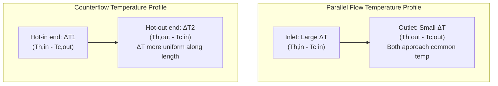
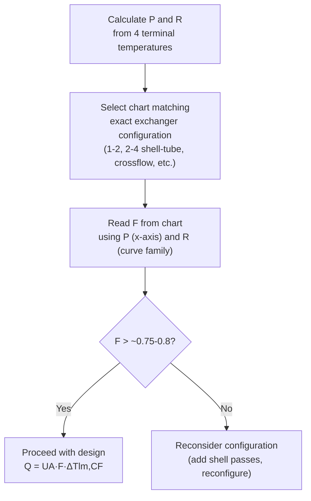

## The Log Mean Temperature Difference Method

### Purpose and Context

The **Log Mean Temperature Difference (LMTD) method** is a standard approach for heat exchanger thermal analysis and sizing, used to calculate required heat transfer surface area given known (or specified) fluid inlet/outlet temperatures and flow rates, or to predict outlet temperatures for an exchanger of known area and configuration. It is one of two primary heat exchanger design methods (the other being the Effectiveness-NTU method), and is generally the more straightforward approach when all four terminal temperatures (both fluids' inlet and outlet) are known or can be directly specified.

### Why a Mean Temperature Difference Is Needed

The fundamental heat exchanger rate equation is:

$$Q = UA\Delta T_m$$

where $U$ is the overall heat transfer coefficient, $A$ is heat transfer surface area, and $\Delta T_m$ is an appropriately averaged temperature difference between the two fluids. Since fluid temperatures change continuously along the exchanger length as heat is transferred, the temperature difference between hot and cold streams varies from one end of the exchanger to the other — a single, simple arithmetic mean of inlet and outlet temperature differences would introduce error, since the temperature difference profile along the exchanger is generally not linear (it follows an exponential decay relationship, derivable from the governing differential energy balance).

### Derivation: Parallel Flow Case

For parallel flow, defining $\Delta T_1$ as the temperature difference at the inlet end and $\Delta T_2$ as the temperature difference at the outlet end, an energy balance on a differential element combined with the local rate equation yields, after integration along the exchanger length:

$$\ln\frac{\Delta T_2}{\Delta T_1} = -\frac{UA}{\dot{m}_h c_{p,h}} - \frac{UA}{\dot{m}_c c_{p,c}}$$

Combined with the overall energy balance ($Q = \dot{m}_h c_{p,h}(T_{h,in}-T_{h,out}) = \dot{m}_c c_{p,c}(T_{c,out}-T_{c,in})$), this leads directly to the definition of the log mean temperature difference:

$$\Delta T_{lm} = \frac{\Delta T_1 - \Delta T_2}{\ln(\Delta T_1/\Delta T_2)}$$

$$Q = UA\Delta T_{lm}$$

This logarithmic form arises naturally from the exponential temperature decay along the exchanger and is mathematically exact (not an approximation) under the standard simplifying assumptions listed below. [Well-established, rigorously derived result — a standard cornerstone of heat exchanger design theory]

### Standard Simplifying Assumptions

The LMTD method as classically derived assumes:

1. **Overall heat transfer coefficient $U$ is constant** along the entire exchanger length (in reality, $U$ often varies somewhat due to local property and flow variations, but is typically treated as a representative average value for design purposes).
2. **Constant specific heats** for both fluids over the temperature range involved (or, if phase change occurs, that it happens at constant temperature).
3. **No heat loss to the surroundings** — all heat leaving the hot fluid is transferred to the cold fluid.
4. **No axial conduction** along the tube/wall material (heat transfer is purely radial/transverse between fluids).
5. **Steady-state operation** with uniform velocity and temperature at each cross-section (fully developed, one-dimensional flow assumption).

Deviations from these assumptions (e.g., significantly temperature-dependent $U$, or significant heat loss to ambient) introduce error into a strict LMTD calculation, and more detailed numerical methods (dividing the exchanger into segments with locally-evaluated properties) may be warranted in such cases. [Well-established caveats standard to LMTD method application]

### Defining ΔT₁ and ΔT₂: Parallel Flow vs. Counterflow

**Parallel Flow:**

$$\Delta T_1 = T_{h,in} - T_{c,in} \quad \text{(at the common inlet end)}$$

$$\Delta T_2 = T_{h,out} - T_{c,out} \quad \text{(at the common outlet end)}$$

**Counterflow:**

$$\Delta T_1 = T_{h,in} - T_{c,out} \quad \text{(at the end where hot fluid enters)}$$

$$\Delta T_2 = T_{h,out} - T_{c,in} \quad \text{(at the end where hot fluid exits)}$$

The specific labeling convention ($\Delta T_1$ vs. $\Delta T_2$, which end is "1" and which is "2") is arbitrary — the LMTD formula gives the same result regardless of which end is labeled 1 or 2, since the formula is symmetric under this relabeling (swapping $\Delta T_1$ and $\Delta T_2$ leaves $\Delta T_{lm}$ unchanged).

### Temperature Profiles: Parallel Flow vs. Counterflow — Diagram

### Special Case: ΔT₁ = ΔT₂

When the temperature differences at both ends are equal (a limiting case that can occur, for example, in a balanced counterflow exchanger with equal heat capacity rates on both sides), the logarithmic formula becomes mathematically indeterminate (0/0). In this limit:

$$\Delta T_{lm} = \Delta T_1 = \Delta T_2$$

This limiting behavior is confirmed by taking the mathematical limit of the LMTD expression as $\Delta T_1 \rightarrow \Delta T_2$ (a standard calculus result, L'Hôpital's rule applied to the logarithmic ratio), and represents the case where temperature difference is genuinely constant along the entire exchanger length.

### Correction Factor Method for Complex Flow Arrangements

The LMTD formula derived above applies exactly only to pure parallel flow and pure counterflow single-pass arrangements. For more complex configurations — multi-pass shell-and-tube exchangers, crossflow exchangers — actual flow paths deviate from ideal countercurrent behavior, requiring a **correction factor** $F$:

$$Q = UA \cdot F \cdot \Delta T_{lm,CF}$$

where $\Delta T_{lm,CF}$ is the LMTD calculated **as if the exchanger were in pure counterflow** using the actual four terminal temperatures, and $F \leq 1$ corrects for the actual (less thermally favorable) flow arrangement. $F = 1$ represents true counterflow performance (the best-case reference); $F < 1$ quantifies the performance penalty of the actual, more complex flow path.

Correction factor charts are presented as functions of two dimensionless temperature ratios:

$$P = \frac{T_{c,out}-T_{c,in}}{T_{h,in}-T_{c,in}}, \quad R = \frac{T_{h,in}-T_{h,out}}{T_{c,out}-T_{c,in}}$$

These charts are specific to each standard exchanger configuration (1 shell pass/2 tube passes, 2 shell pass/4 tube passes, single-pass crossflow with various mixed/unmixed conditions, etc.) and are extensively tabulated in heat transfer references and TEMA-related design literature — reading the correct chart for the specific configuration being analyzed is essential, since using the wrong chart or misreading $P$/$R$ definitions is a common source of design error. [Well-established, standard industry method — correction factor charts should be sourced from a reliable reference matched exactly to the exchanger configuration under analysis]

An important design guideline: correction factor $F$ should generally be kept above approximately 0.75–0.8 in practical design, since values significantly below this indicate the configuration is operating far from its thermal potential (approaching a temperature cross or other unfavorable condition) — in such cases, adding shell passes or otherwise reconfiguring the exchanger is often warranted. [Inference: this is a commonly cited practical design guideline rather than a rigid rule, and the acceptable threshold can vary depending on specific design and economic considerations]

### Worked Example: Counterflow Double-Pipe Heat Exchanger

**Given:** Hot oil enters a counterflow double-pipe heat exchanger at 150°C and leaves at 90°C. Cooling water enters at 20°C and leaves at 70°C. Overall heat transfer coefficient $U$ = 350 W/m²·K. Hot oil mass flow rate 2.5 kg/s, specific heat 2.1 kJ/kg·K.

**Step 1 — Calculate heat duty from the hot fluid energy balance:**

$$Q = \dot{m}_h c_{p,h}(T_{h,in}-T_{h,out}) = 2.5 \times 2100 \times (150-90) = 315{,}000 \text{ W} = 315 \text{ kW}$$

**Step 2 — Determine counterflow temperature differences:**

$$\Delta T_1 = T_{h,in} - T_{c,out} = 150 - 70 = 80°C$$

$$\Delta T_2 = T_{h,out} - T_{c,in} = 90 - 20 = 70°C$$

**Step 3 — Calculate LMTD:**

$$\Delta T_{lm} = \frac{80-70}{\ln(80/70)} = \frac{10}{\ln(1.143)} = \frac{10}{0.1335} \approx 74.9°C$$

**Step 4 — Solve for required area:**

$$A = \frac{Q}{U\Delta T_{lm}} = \frac{315{,}000}{350 \times 74.9} \approx \frac{315{,}000}{26{,}215} \approx 12.0 \text{ m}^2$$

This straightforward calculation illustrates the LMTD method's primary strength: when all four terminal temperatures are known (as specified in the problem), sizing calculations proceed directly without iteration.

### Worked Example: Shell-and-Tube Exchanger with Correction Factor

**Given:** The same duty as above, but using a 1 shell-pass, 2 tube-pass shell-and-tube exchanger instead of true counterflow double-pipe.

**Step 1 — Calculate P and R:**

Assigning shell-side (hot oil) as the "hot" fluid and tube-side (water) as the "cold" fluid per standard convention:

$$P = \frac{T_{c,out}-T_{c,in}}{T_{h,in}-T_{c,in}} = \frac{70-20}{150-20} = \frac{50}{130} \approx 0.385$$

$$R = \frac{T_{h,in}-T_{h,out}}{T_{c,out}-T_{c,in}} = \frac{150-90}{70-20} = \frac{60}{50} = 1.2$$

**Step 2 — Read correction factor from the appropriate 1-2 shell-and-tube chart:**

For $P \approx 0.385$ and $R = 1.2$, a typical 1-2 TEMA E-shell correction factor chart gives $F \approx 0.87$–$0.90$ (approximate value read from standard charts). [Inference: exact F value should be read precisely from the specific correction factor chart for a 1 shell-pass/2 tube-pass configuration; the value cited here is an illustrative approximation]

**Step 3 — Calculate required area (using $F \approx 0.88$ as a representative value):**

$$A = \frac{Q}{U \cdot F \cdot \Delta T_{lm,CF}} = \frac{315{,}000}{350 \times 0.88 \times 74.9} \approx \frac{315{,}000}{23{,}069} \approx 13.7 \text{ m}^2$$

Note this required area is larger than the pure counterflow case (12.0 m²) — reflecting the thermal penalty of the shell-and-tube's imperfect counterflow arrangement (partial parallel-flow character introduced by the tube passes), requiring additional surface area to achieve the same heat duty.

### Correction Factor Chart Structure — Diagram

### LMTD Method: Design vs. Rating Problems

**Design (sizing) problem:** All four terminal temperatures and flow rates are specified (or determinable from energy balance); the unknown is required area $A$. This is the most straightforward application of the LMTD method, solved directly as shown in the worked examples above.

**Rating (performance) problem:** Exchanger area $A$ and configuration are known/fixed; the task is to determine outlet temperatures for given inlet conditions and flow rates. This requires iteration when using the LMTD method, since $\Delta T_{lm}$ itself depends on the (unknown) outlet temperatures — an initial guess for outlet temperatures is made, $\Delta T_{lm}$ calculated, and the process repeated until convergence. This iterative requirement is a key limitation of the LMTD method for rating problems, and is the primary reason the **Effectiveness-NTU method** (which avoids this iteration by using known area/UA directly) is generally preferred for rating-type analysis.

### Comparison: LMTD Method vs. Effectiveness-NTU Method

| Aspect | LMTD Method | Effectiveness-NTU Method |
| --- | --- | --- |
| Best suited for | Design/sizing problems (all 4 temperatures known) | Rating/performance problems (area known, outlet temps unknown) |
| Iteration required? | Yes, for rating problems | No — direct calculation |
| Key parameters | $\Delta T_{lm}$, correction factor $F$ | Effectiveness $\varepsilon$, NTU, capacity ratio $C_r$ |
| Physical intuition | Direct temperature-difference based | Dimensionless, more abstract but avoids iteration |

Both methods are mathematically equivalent and will yield identical results when applied correctly to the same problem — the choice between them is primarily one of computational convenience given what information is known versus unknown at the outset of the problem.

### Applications in Power Plant Heat Exchanger Design

**Condenser sizing:** LMTD calculations (often simplified since the shell-side steam is condensing at a nearly constant saturation temperature, making $\Delta T_{lm}$ reduce to a simpler logarithmic form based on cooling water inlet/outlet and constant steam temperature) are standard in surface condenser design and performance verification.

**Feedwater heater design:** Multi-zone feedwater heaters (desuperheating, condensing, and drain cooling zones) often require LMTD analysis applied separately to each zone, since the temperature profile and effective $U$ can differ substantially between zones.

**Economizer and superheater sizing:** Boiler heat transfer surfaces operating with single-phase gas-side and single- or two-phase water/steam-side flow are commonly sized using LMTD methodology with appropriate correction factors for the specific tube/pass arrangement.

**Recuperator and regenerator performance verification:** While regenerative devices are often more naturally analyzed with the effectiveness-NTU approach, LMTD-based analysis remains applicable for recuperative (non-mixing) gas turbine recuperators when terminal temperatures are known from test data or design specifications.

**Related Topics:**

- Classification of Heat Exchangers
- Effectiveness-NTU Method for Heat Exchanger Analysis
- Overall Heat Transfer Coefficient and Thermal Resistance Networks
- Boiling and Condensation Heat Transfer
- Fouling Resistance and Heat Exchanger Performance Degradation
- TEMA Standards for Shell-and-Tube Correction Factor Charts
- Feedwater Heater Multi-Zone Design (Desuperheating, Condensing, Drain Cooling)