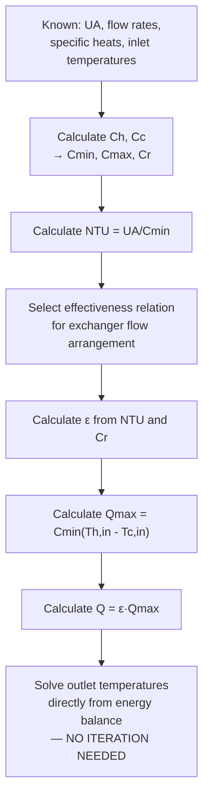

## The Effectiveness-NTU Method

### Purpose and Context

The **Effectiveness-NTU (ε-NTU) method** is an alternative heat exchanger analysis approach that avoids the iterative calculations required by the LMTD method when outlet temperatures are unknown. It is particularly well-suited to **rating problems** — where heat exchanger area, configuration, and inlet conditions are known, and outlet temperatures (and hence heat duty) must be determined — since it calculates these directly without requiring an initial guess and iteration loop.

### Fundamental Definitions

**Heat Capacity Rate:** For each fluid stream, the product of mass flow rate and specific heat:

$$C = \dot{m}c_p \quad \text{(units: W/K)}$$

Two capacity rates are defined: $C_h = \dot{m}_h c_{p,h}$ (hot fluid) and $C_c = \dot{m}_c c_{p,c}$ (cold fluid).

**Minimum and Maximum Capacity Rates:**

$$C_{min} = \min(C_h, C_c), \quad C_{max} = \max(C_h, C_c)$$

**Capacity Rate Ratio:**

$$C_r = \frac{C_{min}}{C_{max}}, \quad 0 \leq C_r \leq 1$$

**Maximum Possible Heat Transfer Rate:** The theoretical maximum heat transfer achievable by a heat exchanger of infinite area, which would occur if the fluid with the smaller capacity rate ($C_{min}$) experienced the maximum possible temperature change (from its own inlet temperature to the other fluid's inlet temperature):

$$Q_{max} = C_{min}(T_{h,in} - T_{c,in})$$

This represents an idealized thermodynamic limit — the fluid with $C_{min}$ has less "thermal inertia" per unit temperature change and can, in the limit of infinite exchanger area, be brought exactly to the other fluid's inlet temperature; the fluid with $C_{max}$ cannot reach this limit for the same total heat transfer without a larger temperature change requirement that would violate the energy balance. [Well-established, rigorously derived thermodynamic limit central to ε-NTU theory]

### Effectiveness

**Effectiveness ($\varepsilon$)** is defined as the ratio of actual heat transfer rate to the theoretical maximum:

$$\varepsilon = \frac{Q_{actual}}{Q_{max}} = \frac{C_h(T_{h,in}-T_{h,out})}{C_{min}(T_{h,in}-T_{c,in})} = \frac{C_c(T_{c,out}-T_{c,in})}{C_{min}(T_{h,in}-T_{c,in})}$$

Effectiveness is dimensionless, bounded between 0 and 1, and depends only on the exchanger's flow arrangement, NTU, and capacity ratio $C_r$ — not on the specific temperature levels involved, making it a convenient, universal performance metric for a given exchanger design.

Once $\varepsilon$ is known (from an appropriate correlation or chart for the specific flow arrangement), actual heat transfer rate follows directly:

$$Q = \varepsilon C_{min}(T_{h,in}-T_{c,in})$$

and outlet temperatures follow from the energy balance without any iteration.

### Number of Transfer Units (NTU)

**NTU** is a dimensionless measure of the heat exchanger's physical size and heat transfer capability relative to the fluid capacity rates:

$$NTU = \frac{UA}{C_{min}}$$

NTU can be interpreted as the exchanger's "thermal size" — a larger NTU indicates a larger exchanger (more area $A$, higher $U$) relative to the flow capacity being handled, generally corresponding to higher achievable effectiveness for a given flow arrangement and capacity ratio (though with diminishing returns at high NTU, since effectiveness approaches its theoretical maximum asymptotically).

### Effectiveness Relations by Flow Arrangement

**Parallel Flow:**

$$\varepsilon = \frac{1-\exp[-NTU(1+C_r)]}{1+C_r}$$

**Counterflow ($C_r < 1$):**

$$\varepsilon = \frac{1-\exp[-NTU(1-C_r)]}{1-C_r\exp[-NTU(1-C_r)]}$$

**Counterflow, special case $C_r = 1$:**

$$\varepsilon = \frac{NTU}{1+NTU}$$

**Shell-and-Tube, 1 shell pass, 2/4/6... tube passes:**

$$\varepsilon_1 = 2\left\{1+C_r+\sqrt{1+C_r^2}\,\frac{1+\exp[-NTU\sqrt{1+C_r^2}]}{1-\exp[-NTU\sqrt{1+C_r^2}]}\right\}^{-1}$$

**Crossflow, both fluids unmixed** (approximate correlation, widely used):

$$\varepsilon \approx 1-\exp\left\{\frac{NTU^{0.22}}{C_r}\left[\exp(-C_r\,NTU^{0.78})-1\right]\right\}$$

**All flow arrangements, special case $C_r = 0$** (one fluid undergoes phase change — condensing or evaporating — so its effective capacity rate is infinite):

$$\varepsilon = 1-\exp(-NTU)$$

This last relation is particularly important in power plant applications, since condensers and evaporators (boilers) inherently have $C_r = 0$ on the phase-changing side, and this simplified, flow-arrangement-independent relation applies regardless of whether the exchanger is nominally parallel, counter, or crossflow — because with one fluid at constant temperature throughout, the distinction between flow arrangements becomes thermally irrelevant. [Well-established special-case result — a key simplification frequently exploited in condenser/evaporator effectiveness analysis]

### Effectiveness vs. NTU Relationship — Diagram

### Key Qualitative Trends

1. **Counterflow achieves the highest effectiveness** for a given NTU and $C_r$ among all flow arrangements — this reinforces the general preference for counterflow configurations noted in LMTD analysis, now expressed in effectiveness-NTU terms.
2. **Effectiveness increases monotonically with NTU** for all flow arrangements and capacity ratios, but with strongly diminishing returns at high NTU — doubling exchanger size (NTU) does not double effectiveness, particularly once effectiveness is already high (e.g., above ~80%), since the exchanger is approaching the maximum possible effectiveness for its flow arrangement and $C_r$.
3. **Lower capacity ratio ($C_r$) generally permits higher effectiveness** for a given NTU — the special case $C_r = 0$ achieves the highest possible effectiveness curve for any given NTU among all capacity ratios, which is why phase-change heat exchangers (condensers, evaporators) can achieve very high effectiveness relatively efficiently (with comparatively lower NTU/size requirement) compared to single-phase exchangers with comparable capacity rates on both sides.
4. **At $C_r = 1$ (balanced counterflow),** maximum effectiveness is fundamentally limited even at infinite NTU — the counterflow relation for $C_r=1$ shows $\varepsilon \rightarrow 1$ only as $NTU \rightarrow \infty$, but for parallel flow at $C_r=1$, effectiveness is capped at a maximum of 50% even at infinite NTU (both fluids can only approach the same intermediate temperature, never crossing, which fundamentally caps achievable effectiveness in parallel flow when capacity rates are equal). [Well-established, rigorously derived thermodynamic limit specific to the parallel-flow configuration]

### Worked Example: Rating a Counterflow Heat Exchanger

**Given:** A counterflow heat exchanger has $UA$ = 2500 W/K. Hot fluid: $\dot{m}_h$ = 1.2 kg/s, $c_{p,h}$ = 4.0 kJ/kg·K, inlet 120°C. Cold fluid: $\dot{m}_c$ = 2.0 kg/s, $c_{p,c}$ = 4.18 kJ/kg·K, inlet 25°C. Find outlet temperatures.

**Step 1 — Capacity rates:**

$$C_h = 1.2 \times 4000 = 4800 \text{ W/K}$$

$$C_c = 2.0 \times 4180 = 8360 \text{ W/K}$$

Since $C_h < C_c$: $C_{min} = 4800$ W/K, $C_{max} = 8360$ W/K.

**Step 2 — Capacity ratio and NTU:**

$$C_r = \frac{4800}{8360} \approx 0.574$$

$$NTU = \frac{UA}{C_{min}} = \frac{2500}{4800} \approx 0.521$$

**Step 3 — Effectiveness (counterflow relation):**

$$\varepsilon = \frac{1-\exp[-0.521(1-0.574)]}{1-0.574\exp[-0.521(1-0.574)]}$$

$$\exp[-0.521 \times 0.426] = \exp(-0.222) \approx 0.801$$

$$\varepsilon = \frac{1-0.801}{1-0.574(0.801)} = \frac{0.199}{1-0.460} = \frac{0.199}{0.540} \approx 0.369$$

**Step 4 — Maximum possible heat transfer:**

$$Q_{max} = C_{min}(T_{h,in}-T_{c,in}) = 4800 \times (120-25) = 4800 \times 95 = 456{,}000 \text{ W}$$

**Step 5 — Actual heat transfer:**

$$Q = \varepsilon Q_{max} = 0.369 \times 456{,}000 \approx 168{,}264 \text{ W} \approx 168.3 \text{ kW}$$

**Step 6 — Outlet temperatures from energy balance:**

$$T_{h,out} = T_{h,in} - \frac{Q}{C_h} = 120 - \frac{168{,}264}{4800} \approx 120 - 35.1 \approx 84.9°C$$

$$T_{c,out} = T_{c,in} + \frac{Q}{C_c} = 25 + \frac{168{,}264}{8360} \approx 25 + 20.1 \approx 45.1°C$$

This calculation proceeded directly, with no iteration required — a demonstration of the ε-NTU method's key practical advantage over LMTD for this type of rating problem where outlet temperatures were initially unknown.

### Worked Example: Condenser Effectiveness (Cr = 0 Case)

**Given:** Steam condenses at a constant 45°C in a condenser with $UA$ = 180,000 W/K. Cooling water: $\dot{m}$ = 50 kg/s, $c_p$ = 4180 J/kg·K, inlet 20°C. Find cooling water outlet temperature and heat duty.

**Step 1 — Since steam is condensing, its effective capacity rate is infinite; therefore $C_{min}$ = water capacity rate:**

$$C_{min} = 50 \times 4180 = 209{,}000 \text{ W/K}, \quad C_r = 0$$

**Step 2 — NTU:**

$$NTU = \frac{UA}{C_{min}} = \frac{180{,}000}{209{,}000} \approx 0.861$$

**Step 3 — Effectiveness (Cr = 0 case, applies regardless of nominal flow arrangement):**

$$\varepsilon = 1-\exp(-NTU) = 1-\exp(-0.861) \approx 1-0.423 \approx 0.577$$

**Step 4 — Maximum possible heat transfer:**

$$Q_{max} = C_{min}(T_{steam}-T_{water,in}) = 209{,}000 \times (45-20) = 209{,}000 \times 25 = 5{,}225{,}000 \text{ W}$$

**Step 5 — Actual heat transfer:**

$$Q = \varepsilon Q_{max} = 0.577 \times 5{,}225{,}000 \approx 3{,}014{,}825 \text{ W} \approx 3.01 \text{ MW}$$

**Step 6 — Cooling water outlet temperature:**

$$T_{water,out} = T_{water,in} + \frac{Q}{C_{min}} = 20 + \frac{3{,}014{,}825}{209{,}000} \approx 20 + 14.4 \approx 34.4°C$$

### NTU Method Calculation Flow — Diagram

### Design Problems Using ε-NTU

While ε-NTU excels at rating problems, it can also be used for design (sizing) problems, though this typically requires the inverse relationship — solving for NTU given a target effectiveness, then calculating required area from $A = NTU \cdot C_{min}/U$. Inverse (NTU-from-effectiveness) relations are available in closed form for most standard flow arrangements (obtained by algebraically inverting the effectiveness relations above), making this approach nearly as direct as the forward calculation for many practical cases.

**Example inverse relation, counterflow ($C_r < 1$):**

$$NTU = \frac{1}{C_r-1}\ln\left(\frac{\varepsilon-1}{\varepsilon C_r-1}\right)$$

### Comparison Summary: When to Use Each Method

| Scenario | Preferred Method |
| --- | --- |
| All 4 terminal temperatures known, solving for area | LMTD (direct, no iteration needed) |
| Area/UA known, solving for outlet temperatures | ε-NTU (direct, no iteration needed) |
| Comparing exchanger performance across different operating conditions | ε-NTU (effectiveness is a compact, condition-independent performance metric) |
| Complex multi-pass shell-and-tube configuration | Either — LMTD requires correction factor charts; ε-NTU requires the corresponding effectiveness relation — both approaches are standard in commercial heat exchanger design software |
| Preliminary/conceptual design comparison of flow arrangements | ε-NTU (effectiveness curves visually communicate performance trade-offs clearly) |

### Applications in Power Generation

**Feedwater heater performance monitoring:** Plant operators and engineers commonly use ε-NTU-based performance models to assess feedwater heater degradation over time (declining effectiveness for a given flow condition signals fouling, tube plugging, or other performance issues) without needing to re-derive LMTD-based correction factors for each assessment.

**Gas turbine recuperator design and rating:** Recuperator performance is frequently expressed directly in terms of effectiveness (a recuperator "effectiveness" of, e.g., 85% is a commonly cited performance specification), making ε-NTU the natural analytical framework for this application, particularly since recuperator inlet conditions vary with turbine operating point, making repeated LMTD iteration for each condition impractical.

**Condenser and evaporator rating:** As demonstrated in the worked example above, the simplified $C_r = 0$ relation makes ε-NTU particularly convenient for phase-change heat exchanger performance prediction across varying flow conditions (e.g., predicting condenser performance at different cooling water flow rates or inlet temperatures without re-deriving LMTD correction factors each time).

**Off-design performance prediction:** Power plant heat exchangers frequently operate away from their original design point (varying ambient temperature, partial load operation, fouling over time) — ε-NTU's direct, non-iterative calculation of performance for arbitrary inlet conditions and flow rates (given fixed $UA$) makes it well-suited to building off-design performance models and digital twins of plant heat exchanger equipment.

**Related Topics:**

- The Log Mean Temperature Difference Method
- Classification of Heat Exchangers
- Overall Heat Transfer Coefficient and Thermal Resistance Networks
- Boiling and Condensation Heat Transfer
- Fouling Resistance and Heat Exchanger Performance Degradation
- Gas Turbine Recuperator Design and Regenerative Brayton Cycles
- Feedwater Heater Performance Monitoring and Degradation Analysis