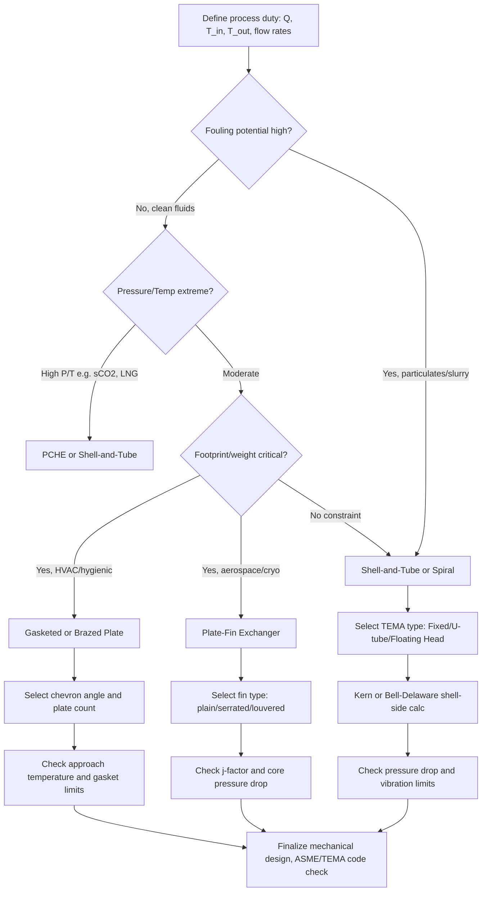

## Shell-and-Tube and Compact Heat Exchanger Design

### Overview and Classification

Heat exchangers transfer thermal energy between two or more fluids at different temperatures without (in most cases) direct mixing. Shell-and-tube and compact exchangers represent two design philosophies optimized for different constraints: shell-and-tube designs prioritize mechanical robustness, serviceability, and high-pressure/high-temperature capability, while compact exchangers prioritize high surface-area-to-volume ratio and are used where weight, footprint, or approach temperature matter most.

**Key Points**

- Shell-and-tube exchangers dominate industrial process heating, power plants, and refineries due to ease of cleaning, repair, and code-certified pressure ratings.
- Compact exchangers (plate, plate-fin, printed circuit) are favored in HVAC, cryogenics, automotive, and aerospace applications where volume and mass are constrained.
- The choice between designs is governed by the surface area density $\beta$ (m²/m³), where compact exchangers typically exceed $700 \, \text{m}^2/\text{m}^3$, versus shell-and-tube units, which are usually below $100 \, \text{m}^2/\text{m}^3$.

---

### Shell-and-Tube Heat Exchanger Design

#### Basic Construction

A shell-and-tube exchanger consists of a bundle of tubes enclosed within a cylindrical shell. One fluid flows inside the tubes (tube-side), and the other flows around the tubes within the shell (shell-side). Key components include:

- **Tube bundle**: array of parallel tubes, typically 3/4" to 1.5" OD, arranged in triangular or square pitch.
- **Tubesheets**: perforated plates at each end that hold and seal the tubes, separating tube-side from shell-side fluid.
- **Shell**: the outer pressure vessel casing.
- **Baffles**: plates (segmental, disc-and-doughnut, or helical) that direct shell-side flow across the tube bundle, increasing velocity and turbulence while providing mechanical tube support.
- **Channel heads/bonnets**: end covers directing tube-side fluid flow, enabling multi-pass configurations.
- **Tie rods and spacers**: maintain baffle spacing during fabrication and operation.

#### TEMA Classification

The Tubular Exchanger Manufacturers Association (TEMA) standard designates configurations with a three-letter code for front head, shell type, and rear head (e.g., AES, BEM, AEP).

- **Front head types**: A (removable channel and cover), B (bonnet, integral cover), C (removable channel, integral with tubesheet).
- **Shell types**: E (one-pass shell, most common), F (two-pass shell with longitudinal baffle), G (split flow), H (double split flow), J (divided flow), K (kettle reboiler), X (crossflow).
- **Rear head types**: L, M, N (fixed tubesheet variants), P (outside packed floating head), S (floating head with backing device), T (pull-through floating head), U (U-tube bundle), W (packed floating head).

**Example**: A "BEM" exchanger has a bonnet front head, single-pass E-shell, and fixed tubesheet rear head — a common, economical configuration for clean, non-fouling services with modest thermal expansion differential.

#### Tube-Side and Shell-Side Arrangements

- **Tube passes**: Multiple tube passes (1-2-4-6-8) increase tube-side velocity and heat transfer coefficient at the cost of pressure drop and design complexity (requires pass partitions in the channel head).
- **Shell passes**: Most designs use single-pass shells (E-type); F-type two-pass shells enable closer approach to true countercurrent flow but are prone to bypass leakage across the longitudinal baffle.
- **Floating head vs. fixed tubesheet vs. U-tube**:
  - *Fixed tubesheet*: simplest, cheapest, but shell-side cannot be mechanically cleaned and thermal expansion differentials require an expansion joint if severe.
  - *U-tube*: tubes bent into a U-shape, one tubesheet, allows free thermal expansion and tube bundle removal, but tube-side cleaning of the bend is difficult and tube-side must be a clean fluid.
  - *Floating head*: one tubesheet fixed, one floating, allows full thermal expansion and bundle removal for cleaning both sides — most versatile but most expensive.

#### Thermal Design Fundamentals

The fundamental heat transfer rate equation is:

$$Q = U A \Delta T_{lm} F$$

where $Q$ is heat duty (W), $U$ is the overall heat transfer coefficient (W/m²·K), $A$ is heat transfer area (m²), $\Delta T_{lm}$ is the log-mean temperature difference, and $F$ is a correction factor for non-countercurrent flow arrangements (multi-pass, crossflow).

The log-mean temperature difference for countercurrent flow:

$$\Delta T_{lm} = \frac{\Delta T_1 - \Delta T_2}{\ln(\Delta T_1 / \Delta T_2)}$$

where $\Delta T_1$ and $\Delta T_2$ are the temperature differences at each end of the exchanger.

**Correction factor F**: For 1-shell-pass, 2-tube-pass (and higher even multiples) configurations, $F < 1$ because the arrangement is not purely countercurrent. $F$ is obtained from standard charts (Bowman, TEMA) as a function of two dimensionless parameters:

$$P = \frac{T_{c,out} - T_{c,in}}{T_{h,in} - T_{c,in}}, \quad R = \frac{T_{h,in} - T_{h,out}}{T_{c,out} - T_{c,in}}$$

[Inference] In practice, designers target $F \geq 0.75$–0.8; values below this indicate the configuration is thermally inefficient and a different shell arrangement (more shell passes, or multiple shells in series) should be considered.

#### Overall Heat Transfer Coefficient

The overall coefficient $U$ combines resistances in series (tube-side film, tube wall conduction, shell-side film, and fouling on both sides), referenced to a chosen area (commonly outside tube area):

$$\frac{1}{U_o} = \frac{1}{h_o} + R_{fo} + \frac{d_o \ln(d_o/d_i)}{2 k_w} + \frac{d_o}{d_i}\left(\frac{1}{h_i} + R_{fi}\right)$$

where $h_o$, $h_i$ are shell-side and tube-side film coefficients, $R_{fo}$, $R_{fi}$ are fouling resistances, $d_o$, $d_i$ are outer/inner tube diameters, and $k_w$ is tube wall thermal conductivity.

**Tube-side coefficient** is typically calculated using Dittus-Boelter or Sieder-Tate correlations for turbulent flow:

$$Nu = 0.023 \, Re^{0.8} Pr^n$$

with $n = 0.4$ for heating and $n = 0.3$ for cooling of the tube-side fluid.

**Shell-side coefficient** is more complex due to crossflow-baffled geometry; the Kern method and Bell-Delaware method are the two classical approaches:

- **Kern method**: simplified, uses an equivalent diameter and a shell-side mass velocity based on the bundle crossflow area at the shell centerline. Faster to apply by hand but less accurate (typically ±30%), and does not separately account for baffle leakage and bypass streams.
- **Bell-Delaware method**: decomposes shell-side flow into crossflow, baffle-window flow, tube-to-baffle leakage, shell-to-baffle leakage, and bundle bypass streams, applying correction factors to an ideal crossflow correlation. Significantly more accurate (±15–20%) and standard in modern commercial software (e.g., HTRI, HTFS, Aspen EDR).

#### Pressure Drop Considerations

Tube-side pressure drop follows standard internal flow friction plus return losses at each pass:

$$\Delta P_{tube} = \left(4f \frac{L}{d_i} + 4N_p\right)\frac{\rho u^2}{2}$$

where $N_p$ is the number of tube passes, accounting for the kinetic energy loss in the return bends/headers.

Shell-side pressure drop depends heavily on baffle spacing and cut; closer baffle spacing increases $h_o$ but raises $\Delta P$ roughly with the square of velocity, so baffle spacing (typically 20–100% of shell ID) is a key optimization variable. [Inference] Baffle cuts of 20–25% are generally recommended as a good compromise between heat transfer enhancement and pressure drop/vibration risk, though optimal values are service-specific.

#### Fouling and Flow-Induced Vibration

- **Fouling resistance** is added conservatively based on service (e.g., TEMA standard tables list typical values for cooling water, fuels, steam). Fouling factors compensate for scale, corrosion products, or biological growth that reduce $U$ over the operating campaign between cleanings.
- **Flow-induced vibration**: high shell-side crossflow velocities can excite tube natural frequencies (vortex shedding, fluidelastic instability, acoustic resonance), potentially causing tube-to-baffle wear or fatigue failure. Design checks compare the tube natural frequency against the vortex shedding frequency and fluidelastic stability threshold, typically following HTRI/TEMA vibration analysis guidelines.

---

### Compact Heat Exchanger Design

#### Defining Characteristics

Compact heat exchangers are defined by Shah and Sekulic as having a surface area density $\beta > 700 \, \text{m}^2/\text{m}^3$ for gas-side applications (liquid-side compact exchangers use a somewhat lower threshold, around $400 \, \text{m}^2/\text{m}^3$). This high density is achieved through small hydraulic diameter flow passages and extended surfaces (fins).

#### Plate Heat Exchangers (PHE)

Constructed from thin corrugated metal plates stacked and sealed with gaskets (gasketed PHE), brazed together (brazed plate, BPHE), or fully welded (welded plate).

- **Flow arrangement**: fluids flow in alternating channels between plates, typically in a countercurrent or complex multi-pass pattern; the corrugation (chevron) pattern induces high turbulence at low Reynolds numbers, yielding high $h$ values (often 3,000–8,000 W/m²·K) even in laminar-transitional flow.
- **Chevron angle**: governs the trade-off between heat transfer and pressure drop; low chevron angles (~30°, "hard" plates) give lower $h$ and lower $\Delta P$, while high chevron angles (~60°, "soft" plates) give higher $h$ and higher $\Delta P$. Mixed plate arrangements allow tuning of thermal duty.
- **Advantages**: very high $U$ values (achievable overall coefficients often 3–5× a shell-and-tube unit for the same service), close temperature approach (as low as 1–2 K), compact footprint, easy to expand capacity by adding plates, and gasketed types allow easy disassembly for cleaning (favorable for food/pharma/hygienic service).
- **Limitations**: gasket material limits temperature (~150–200°C typical for elastomer gaskets, higher for brazed/welded units) and pressure (typically <25 bar for gasketed types); not suitable for fluids with large solid particles or high fouling tendency in gasketed form.

#### Plate-Fin Heat Exchangers (PFHE)

Used extensively in cryogenics (air separation units), aerospace, and automotive applications. Constructed from alternating layers of corrugated fin material and flat separator plates, brazed (commonly aluminum, vacuum-brazed) into a rigid block.

- **Fin types**: plain, serrated (offset strip fin), wavy, louvered — each trading off heat transfer enhancement against pressure drop and manufacturability. Offset strip fins interrupt boundary layer growth periodically, giving high $j$-factor (Colburn factor) heat transfer performance.
- **Multi-stream capability**: a major advantage — PFHEs can integrate 3 or more process streams into a single core (common in cryogenic air separation and LNG plants), reducing equipment count substantially.
- **Surface area density**: can exceed $2000 \, \text{m}^2/\text{m}^3$, enabling extremely compact and lightweight designs — critical for aerospace and mobile applications.
- **Limitations**: brazed aluminum construction limits operating temperature (typically <200°C) and requires very clean, non-fouling fluids since internal passages cannot be mechanically cleaned.

#### Printed Circuit Heat Exchangers (PCHE)

Fabricated by chemically etching fine flow channels (typically semicircular, 0.5–2 mm hydraulic diameter) into metal plates, which are then diffusion-bonded into a solid block.

- **Advantages**: diffusion bonding creates a solid metal matrix with strength approaching the parent material, enabling very high pressure ratings (up to 600+ bar) and high temperatures (up to ~900°C with appropriate alloys), while retaining high compactness ($\beta$ often > 1000 m²/m³).
- **Applications**: supercritical CO₂ power cycles, LNG processing, nuclear intermediate heat exchangers, and other high-pressure/high-temperature duty where conventional plate exchangers cannot be used.
- **Limitations**: [Inference] high manufacturing cost and long lead times relative to shell-and-tube or plate designs, and the fine channels increase fouling sensitivity and cleaning difficulty, generally restricting PCHE use to clean process fluids.

#### Other Compact Forms

- **Plate-and-shell**: welded circular plate pack inside a cylindrical shell, combining plate-level compactness with shell-and-tube-style pressure containment (higher pressure/temperature capability than gasketed PHE).
- **Spiral heat exchangers**: two long metal sheets coiled to form two spiral flow channels, self-cleaning (high shear, no dead zones) — well suited to high-fouling and viscous fluids/slurries.
- **Microchannel/heat sink exchangers**: hydraulic diameters below 1 mm, used in electronics cooling and process intensification, exhibiting very high $h$ but requiring careful attention to flow maldistribution and fouling/clogging risk.

---

### Comparative Design Selection

| Criterion | Shell-and-Tube | Compact (Plate/PFHE/PCHE) |
| --- | --- | --- |
| Surface area density | Low (< 100 m²/m³) | High (> 700 m²/m³) |
| Pressure capability | Very high (up to several hundred bar, code-rated) | Moderate (gasketed PHE) to very high (PCHE) |
| Temperature capability | Very high (limited by material) | Limited by gasket (PHE) or braze (PFHE); high for PCHE |
| Fouling tolerance | Good (mechanically cleanable) | Poor to moderate (PHE cleanable if gasketed; PFHE/PCHE not) |
| Temperature approach | Larger (typically >10 K practical minimum) | Very close (1–5 K achievable) |
| Footprint/weight | Large, heavy | Small, lightweight |
| Capacity flexibility | Fixed at design | Easily modified (add/remove plates in PHE) |
| Maintenance | Well-established, widely serviceable | Specialized, often requires manufacturer support |

**Example**: For a refinery crude preheat train handling fouling, particulate-laden crude oil at high pressure and temperature, a shell-and-tube exchanger is the standard choice due to mechanical cleanability and pressure code compliance. For a dairy pasteurization duty requiring hygienic design, frequent cleaning, and a close temperature approach, a gasketed plate heat exchanger is preferred.

---

### Design Procedure Summary (Rating and Sizing)

1. **Define duty**: heat load $Q$, inlet/outlet temperatures, fluid properties, allowable pressure drop, fouling allowance.
2. **Select exchanger type** based on service constraints (pressure, temperature, fouling, footprint, cost).
3. **Estimate $U$** from typical ranges for the fluid pair (e.g., water-water: 800–1500 W/m²·K in shell-and-tube; up to 5000+ W/m²·K in plate).
4. **Calculate $\Delta T_{lm}$ and correction factor $F$** for the chosen flow arrangement.
5. **Compute required area**: $A = Q / (U \Delta T_{lm} F)$.
6. **Detailed rating**: determine geometry (tube count/layout or plate count/size), calculate actual $h_i$, $h_o$, $U$, and compare against the area estimate; iterate.
7. **Check pressure drop** against allowable limits on both sides; adjust geometry (baffle spacing, tube passes, plate chevron angle) as needed.
8. **Mechanical/vibration checks** (shell-and-tube): verify tube vibration limits, thermal expansion stresses, and code compliance (ASME Section VIII, TEMA).
9. **Finalize and specify** for fabrication, including materials of construction based on corrosion compatibility.

---

### Flow Arrangement Schematic (svg_diagram)

<svg xmlns="http://www.w3.org/2000/svg" viewBox="0 0 800 420">
<text x="400" y="25" font-size="16" font-weight="bold" text-anchor="middle" fill="#1a1a1a">Shell-and-Tube vs. Plate Heat Exchanger Flow Paths (svg_diagram)</text>

<text x="200" y="55" font-size="14" font-weight="bold" text-anchor="middle" fill="`#1a1a1a`">Shell-and-Tube (1 Shell Pass, 2 Tube Passes)</text>

<rect x="60" y="80" width="280" height="120" rx="10" fill="none" stroke="#333" stroke-width="2" />

<line x1="90" y1="110" x2="310" y2="110" stroke="#c0392b" stroke-width="4" />
<line x1="90" y1="140" x2="310" y2="140" stroke="#c0392b" stroke-width="4" />

<line x1="90" y1="170" x2="310" y2="170" stroke="#e74c3c" stroke-width="4" />
<path d="M 310 110 Q 330 125 310 140" fill="none" stroke="#c0392b" stroke-width="4" />
<path d="M 310 140 Q 330 155 310 170" fill="none" stroke="#e74c3c" stroke-width="4" />

<line x1="130" y1="80" x2="130" y2="200" stroke="#2980b9" stroke-width="2" stroke-dasharray="6,3" />
<line x1="200" y1="80" x2="200" y2="200" stroke="#2980b9" stroke-width="2" stroke-dasharray="6,3" />
<line x1="270" y1="80" x2="270" y2="200" stroke="#2980b9" stroke-width="2" stroke-dasharray="6,3" />
<text x="200" y="215" font-size="11" text-anchor="middle" fill="#2980b9">Shell-side fluid (baffled crossflow)</text>
<text x="200" y="230" font-size="11" text-anchor="middle" fill="#c0392b">Tube-side fluid (2 passes)</text>
<polygon points="85,105 95,110 85,115" fill="#c0392b" />
<polygon points="315,165 305,170 315,175" fill="#e74c3c" />

<text x="600" y="55" font-size="14" font-weight="bold" text-anchor="middle" fill="`#1a1a1a`">Plate Heat Exchanger (Countercurrent Channels)</text>

<g stroke="#333" stroke-width="2" fill="none">

<rect x="500" y="80" width="20" height="120" />

<rect x="530" y="80" width="20" height="120" />

<rect x="560" y="80" width="20" height="120" />

<rect x="590" y="80" width="20" height="120" />

<rect x="620" y="80" width="20" height="120" />

<rect x="650" y="80" width="20" height="120" />

</g>

<line x1="510" y1="90" x2="510" y2="190" stroke="#c0392b" stroke-width="3" />
<polygon points="505,185 510,195 515,185" fill="#c0392b" />
<line x1="570" y1="90" x2="570" y2="190" stroke="#c0392b" stroke-width="3" />
<polygon points="565,185 570,195 575,185" fill="#c0392b" />
<line x1="630" y1="90" x2="630" y2="190" stroke="#c0392b" stroke-width="3" />
<polygon points="625,185 630,195 635,185" fill="#c0392b" />

<line x1="540" y1="190" x2="540" y2="90" stroke="#2980b9" stroke-width="3" />
<polygon points="535,95 540,85 545,95" fill="#2980b9" />
<line x1="600" y1="190" x2="600" y2="90" stroke="#2980b9" stroke-width="3" />
<polygon points="595,95 600,85 605,95" fill="#2980b9" />
<line x1="660" y1="190" x2="660" y2="90" stroke="#2980b9" stroke-width="3" />
<polygon points="655,95 660,85 665,95" fill="#2980b9" />
<text x="580" y="215" font-size="11" text-anchor="middle" fill="#c0392b">Hot fluid (alternating channels, down)</text>
<text x="580" y="230" font-size="11" text-anchor="middle" fill="#2980b9">Cold fluid (alternating channels, up)</text>

<text x="400" y="270" font-size="14" font-weight="bold" text-anchor="middle" fill="`#1a1a1a`">Relative Surface Area Density (β)</text>

<rect x="150" y="290" width="30" height="90" fill="`#7f8c8d`" />

<text x="165" y="395" font-size="11" text-anchor="middle">Shell-and-Tube</text>

<text x="165" y="285" font-size="11" text-anchor="middle">~50-100</text>

<rect x="300" y="220" width="30" height="160" fill="#27ae60" />
<text x="315" y="395" font-size="11" text-anchor="middle">Plate (PHE)</text>
<text x="315" y="215" font-size="11" text-anchor="middle">~200-500</text>
<rect x="450" y="150" width="30" height="230" fill="#2980b9" />
<text x="465" y="395" font-size="11" text-anchor="middle">Plate-Fin</text>
<text x="465" y="145" font-size="11" text-anchor="middle">~1000-2000</text>
<rect x="600" y="130" width="30" height="250" fill="#8e44ad" />
<text x="615" y="395" font-size="11" text-anchor="middle">PCHE</text>
<text x="615" y="125" font-size="11" text-anchor="middle">~1000+</text>
<line x1="120" y1="380" x2="680" y2="380" stroke="#333" stroke-width="1" />
</svg>

---

### Thermal-Hydraulic Design Decision Flow

---

### Practical Example: Sizing Calculation

**Problem**: Size a shell-and-tube exchanger to cool 10 kg/s of oil from 150°C to 90°C using cooling water entering at 25°C and leaving at 45°C. Assume $U = 350 \, \text{W/m}^2\text{K}$, oil $c_p = 2100 \, \text{J/kg·K}$.

**Solution outline**:

1. Heat duty: $Q = \dot{m} c_p \Delta T = 10 \times 2100 \times (150-90) = 1{,}260{,}000 \, \text{W}$
2. Countercurrent temperature differences: $\Delta T_1 = 150 - 45 = 105\text{K}$, $\Delta T_2 = 90 - 25 = 65\text{K}$
3. $\Delta T_{lm} = \dfrac{105 - 65}{\ln(105/65)} = \dfrac{40}{0.480} \approx 83.3\text{K}$
4. Assuming a 1-shell-pass/2-tube-pass configuration, compute $P = (45-25)/(150-25) = 0.16$, $R = (150-90)/(45-25) = 3.0$; from standard TEMA F-charts, $F \approx 0.92$ [Inference: exact value depends on chart interpolation precision].
5. Required area: $A = \dfrac{Q}{U \Delta T_{lm} F} = \dfrac{1{,}260{,}000}{350 \times 83.3 \times 0.92} \approx 47.0 \, \text{m}^2$

**Output**: An exchanger with approximately 47 m² of heat transfer surface is required; this would translate to a specific tube count and length based on selected tube OD (e.g., 19 mm OD, 4.88 m long tubes would need roughly 160-170 tubes, subject to detailed layout and pass configuration).

---

### Materials and Corrosion Considerations

- **Carbon steel**: economical for non-corrosive services (steam, treated water, hydrocarbons without H₂S/chlorides).
- **Stainless steel (304/316)**: general corrosion resistance, common in plate exchangers and food/pharma service.
- **Titanium**: seawater and chloride-rich cooling water services, resists pitting/crevice corrosion.
- **Copper-nickel alloys (90/10, 70/30)**: traditional choice for seawater-cooled condensers, good biofouling resistance.
- **Duplex/super-duplex stainless steels**: high-chloride, high-pressure applications requiring strength plus corrosion resistance.
- [Inference] Material selection should always be verified against a corrosion compatibility chart specific to the exact process fluid composition, since trace contaminants (chlorides, sulfides, dissolved oxygen) can significantly alter which alloy performs adequately over the design life.

---

### Codes and Standards

- **TEMA** (Tubular Exchanger Manufacturers Association): mechanical design standard for shell-and-tube exchangers, classified into Class R (severe petroleum/related service), C (general/commercial), and B (chemical process service).
- **ASME Boiler and Pressure Vessel Code, Section VIII**: pressure vessel design and fabrication rules applicable to the shell and channel pressure boundary.
- **API 660 / API 662**: American Petroleum Institute standards for shell-and-tube and plate heat exchangers in petroleum refining service, adding requirements beyond base TEMA/ASME.
- **PHE-specific**: no single dominant international mechanical code equivalent to TEMA exists for plate exchangers; manufacturers typically qualify designs against pressure vessel codes (ASME, PED) for the plate pack pressure boundary.

**Related Topics**

- Fouling mechanisms and fouling factor selection methodology
- Bell-Delaware method detailed shell-side calculation procedure
- Air-cooled heat exchangers (fin-fan coolers)
- Condensers and reboilers (phase-change heat exchanger design)
- Heat exchanger network synthesis and pinch analysis
- Flow-induced vibration analysis (fluidelastic instability, vortex shedding)
- Cryogenic multi-stream heat exchanger design (LNG, air separation)
- Supercritical CO₂ power cycle heat exchangers