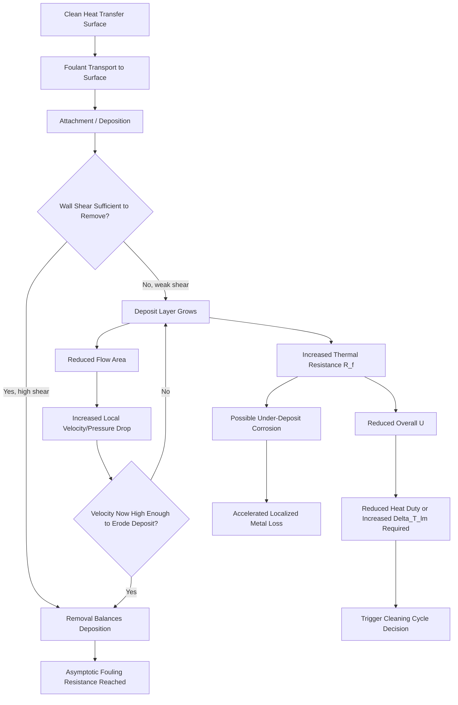

## Fouling and Its Effect on Performance

### Definition and Significance

Fouling is the accumulation of unwanted deposits on heat transfer surfaces, forming an additional layer of thermal resistance that degrades heat exchanger performance over time. It is one of the most significant unresolved problems in heat exchanger operation, affecting design margins, operating costs, energy consumption, and maintenance scheduling across virtually every industry that uses heat transfer equipment.

**Key Points**

- Fouling adds thermal resistance, reduces the overall heat transfer coefficient $U$, increases pressure drop, and can eventually restrict flow passages entirely.
- Fouling is time-dependent (transient), unlike most other resistances in the heat transfer circuit, making it the dominant source of long-term performance uncertainty.
- Estimated global economic impact of fouling has historically been cited in the range of 0.25% of GDP in industrialized nations [Unverified — commonly cited figure from older fouling literature, exact current estimates vary by source and industry].

---

### Categories of Fouling Mechanisms

Fouling is typically classified into six major mechanisms, often occurring simultaneously and interacting with one another.

#### 1. Crystallization (Precipitation) Fouling

Occurs when dissolved salts in solution exceed their solubility limit at the local surface temperature and precipitate onto the surface. Common with inverse-solubility salts (e.g., calcium carbonate, calcium sulfate, magnesium silicate) that become less soluble as temperature rises, meaning scaling occurs preferentially on the hottest surface (often the heat-input side).

$$CaCO_3 \text{ scaling: } Ca^{2+} + 2HCO_3^- \rightarrow CaCO_3\downarrow + H_2O + CO_2\uparrow$$

This reaction is temperature-driven — as water is heated, dissolved CO₂ liberation shifts the bicarbonate equilibrium toward CaCO₃ precipitation, hence "hard scale" forming on hot tube walls in cooling water and boiler systems.

#### 2. Particulate Fouling

Suspended particles (silt, dust, corrosion products, rust, clay) settle and accumulate on the heat transfer surface, primarily driven by gravity settling (sedimentation fouling) in low-velocity regions, or by inertial impaction in flowing streams.

#### 3. Chemical Reaction Fouling

Deposits form as a result of chemical reactions occurring at or near the heat transfer surface, where the surface material itself is not a reactant (distinguishing it from corrosion fouling). Classic examples include:

- **Polymerization/coking** of hydrocarbons at elevated wall temperatures (common in refinery preheat trains and furnace tubes).
- **Autoxidation** of unsaturated hydrocarbons in the presence of dissolved oxygen.

#### 4. Corrosion Fouling

The heat transfer surface itself reacts chemically or electrochemically with the process fluid, producing corrosion products (oxides, sulfides) that remain on the surface as a fouling layer, and can also promote further fouling by other mechanisms (e.g., corrosion products act as nucleation sites for particulate or biological fouling).

#### 5. Biological Fouling (Biofouling)

Growth of microorganisms (bacteria, algae, fungi) and macro-organisms (mussels, barnacles) on the heat transfer surface, forming a biofilm. Common in cooling water systems using untreated natural water sources (rivers, seawater, cooling towers). Biofilms can be surprisingly effective insulators despite their high water content, and can also promote under-deposit corrosion.

#### 6. Freezing (Solidification) Fouling

Occurs when a liquid or a component of a liquid mixture solidifies onto a subcooled surface — for example, wax deposition from crude oil below its pour point, or ice formation in refrigeration/cryogenic systems.

**Example**: In a refinery crude preheat train, a single tube can experience multiple fouling mechanisms simultaneously — particulate fouling from entrained solids, chemical reaction fouling from asphaltene precipitation and coking at high wall temperatures, and corrosion fouling from naphthenic acids — making it one of the most fouling-prone services in industrial heat transfer.

---

### The Fouling Process: Sequential Stages

Fouling development is generally described by a sequence of stages, though not all mechanisms exhibit every stage distinctly:

1. **Initiation (induction period)**: a delay period before measurable deposit forms, during which surface conditioning occurs (e.g., adsorption of a conditioning film, nucleation site formation).
2. **Transport**: foulant material (particles, dissolved species, microorganisms) is transported from the bulk fluid to the surface via diffusion, convection, or thermophoresis.
3. **Attachment**: foulant adheres to the surface, governed by surface energy, chemical bonding, or biological adhesion mechanisms.
4. **Removal (re-entrainment)**: simultaneously, fluid shear stress at the wall tends to remove weakly-bound deposit, competing against the attachment process.
5. **Aging**: deposits already on the surface may undergo further chemical or structural changes (e.g., dehydration of scale, crystal recrystallization, biofilm maturation), often making the deposit harder to remove over time.

#### Net Fouling Rate

The net fouling rate is the difference between deposition and removal rates:

$$\frac{dR_f}{dt} = \phi_d - \phi_r$$

where $\phi_d$ is the deposition rate and $\phi_r$ is the removal rate, both generally functions of surface temperature, wall shear stress (velocity), and foulant concentration.

---

### Fouling Curve Behavior

Three characteristic fouling-resistance-versus-time curve shapes are observed experimentally:

- **Linear**: fouling resistance $R_f$ increases proportionally with time; occurs when removal is negligible (e.g., hard, strongly-adherent scale where shear cannot dislodge deposit).
- **Falling-rate (asymptotic)**: the fouling rate decreases over time and approaches a constant asymptotic value $R_f^*$, because as the deposit layer thickens, the removal rate (which often increases with deposit thickness/roughness under shear) increasingly balances the deposition rate. This is the most common behavior for scaling and particulate fouling in flowing systems.

$$R_f(t) = R_f^*(1 - e^{-t/\tau})$$

where $\tau$ is the fouling time constant.

- **Sawtooth**: periodic increases followed by sudden drops, characteristic of deposits that grow until reaching a critical thickness, then spall off due to thermal stress or mechanical shear, before regrowing.

[Inference] In practice, most cooling-water and crude-oil fouling data are fit reasonably well by the asymptotic model, but the underlying mechanism assumptions (constant removal coefficient, single dominant mechanism) are simplifications; real systems often show mixed behavior, especially over long campaign lengths.

---

### Effect on Heat Transfer Performance

#### Thermal Resistance Impact

Fouling resistance $R_f$ (m²·K/W) is added directly into the overall heat transfer coefficient equation as an additional series resistance:

$$\frac{1}{U_{fouled}} = \frac{1}{U_{clean}} + R_{fi} + R_{fo}$$

where $R_{fi}$ and $R_{fo}$ are the tube-side and shell-side (or equivalent) fouling resistances.

Since $U_{fouled} < U_{clean}$, and heat duty $Q = U A \Delta T_{lm} F$ for a fixed area $A$, a fouled exchanger transfers less heat for the same temperature driving force — or equivalently, requires a larger $\Delta T_{lm}$ (higher approach temperature, meaning less efficient heat recovery) to maintain the same duty.

**Example**: A cooling water exchanger designed with $U_{clean} = 850 \, \text{W/m}^2\text{K}$ and a typical fouling allowance of $R_f = 0.0002 \, \text{m}^2\text{K/W}$ (moderate treated water) will see its actual operating $U$ drop to approximately:

$$\frac{1}{U_{fouled}} = \frac{1}{850} + 0.0002 = 0.001176 + 0.0002 = 0.001376$$

$$U_{fouled} \approx 727 \, \text{W/m}^2\text{K}$$

This represents roughly a 14% reduction in heat transfer coefficient from fouling alone, illustrating why fouling allowances materially affect exchanger sizing.

#### Secondary Effects

- **Increased pumping power**: deposit layers reduce the effective flow cross-section, increasing fluid velocity and frictional pressure drop for a given flow rate, or requiring more pump/fan power to maintain flow rate.
- **Flow maldistribution**: uneven fouling across parallel tubes or channels causes flow to redistribute toward less-fouled paths, further concentrating fouling in already-fouled passages (a positive feedback effect) and reducing effective heat transfer area utilization.
- **Under-deposit corrosion**: porous deposits can trap corrosive species and create concentration cells beneath the deposit, accelerating localized corrosion (pitting) independent of the fouling's thermal effect.
- **Reduced tube life and reliability**: mechanical stresses from deposit buildup, coupled with corrosion, shorten equipment life and increase unplanned shutdown risk.
- **Increased energy consumption system-wide**: fouled exchangers in a heat recovery network reduce heat recovery efficiency, requiring more utility heating/cooling to compensate — a major driver of the energy cost impact of fouling in process plants.

---

### Fouling Resistance Design Values

Industry-standard fouling factors are published by TEMA and used during the design stage to add conservative margin to the clean heat transfer coefficient. Representative TEMA-style values (illustrative, service-dependent):

| Fluid Service | Typical $R_f$ (m²·K/W) |
| --- | --- |
| Treated cooling tower water | 0.0001 – 0.0002 |
| Untreated seawater | 0.0001 – 0.0002 |
| River water (untreated) | 0.0002 – 0.0006 |
| Steam (non-oil-bearing) | 0.00005 – 0.0001 |
| Fuel oils | 0.0004 – 0.0009 |
| Crude oil (depending on velocity/temperature) | 0.0002 – 0.0009 |
| Refrigerant liquids | 0.0002 |

[Inference] These values represent conservative industry practice rather than universal physical constants — actual fouling rates depend strongly on site-specific water chemistry, velocity, temperature, and treatment programs, so designers frequently adjust from published tables based on operating history at a specific plant.

**Design implication**: Over-conservative fouling allowances lead to oversized, more expensive exchangers with excessive initial margin (and can actually promote fouling by operating at lower-than-optimal velocities); under-conservative allowances lead to premature performance shortfall and more frequent cleaning cycles. Selecting realistic fouling factors is therefore an economic optimization problem, not merely a safety margin exercise.

---

### Cleaning Cycle Economics

The interval between cleanings is typically determined by balancing:

1. **Lost production/efficiency cost** from degraded $U$ over time (increasing utility consumption or reduced throughput).
2. **Cleaning cost** (labor, downtime, chemicals, mechanical cleaning equipment).
3. **Equipment degradation cost** from fouling-related corrosion and mechanical stress.

An economic optimum cleaning cycle $t^*$ minimizes the total cost per unit time, balancing the increasing marginal efficiency loss (as fouling accumulates) against the fixed cost of each cleaning event.

**Cleaning methods**:

- **Mechanical**: tube brushing, hydroblasting (high-pressure water jetting), drilling/rodding for hardened deposits — requires exchanger shutdown and disassembly (for shell-and-tube, requires removable bundle designs).
- **Chemical**: acid cleaning (for carbonate/sulfate scale), alkaline cleaning (for organic/oil deposits), biocide treatment (for biofouling) — can sometimes be performed online or with reduced downtime.
- **Online/continuous methods**: sponge-ball cleaning systems (circulate abrasive sponge balls through tubes continuously), automatic backwash filtration upstream, and continuous biocide dosing.

---

### Mitigation Strategies

**Key Points**

- **Velocity control**: maintaining tube-side/shell-side velocities above a minimum threshold reduces particulate settling and promotes self-cleaning shear, but excessive velocity increases erosion risk and pumping power — an optimum design velocity typically exists (often cited as 1–2.5 m/s for water in tubes, though [Inference] exact optimal values are fluid- and geometry-specific).
- **Water treatment**: chemical dosing (scale inhibitors, dispersants, biocides, corrosion inhibitors) and pretreatment (softening, filtration) reduce foulant concentration and precipitation tendency before the fluid reaches the exchanger.
- **Surface treatments and coatings**: low-surface-energy coatings (e.g., PTFE-based, ion-implanted surfaces) reduce foulant adhesion, particularly effective against biofouling and crystallization fouling.
- **Design selection**: choosing exchanger geometries less prone to fouling for a given service (e.g., spiral heat exchangers for high-fouling slurries due to self-cleaning high-shear flow; U-tube or removable bundle designs for ease of mechanical cleaning).
- **Operating temperature control**: minimizing peak wall (film) temperature reduces chemical reaction fouling (coking, polymerization) and inverse-solubility scaling rates, since these mechanisms are strongly temperature-activated.

---

### Fouling Resistance vs. Time (Illustrative Curves)

<svg xmlns="http://www.w3.org/2000/svg" viewBox="0 0 750 420">
<text x="375" y="25" font-size="16" font-weight="bold" text-anchor="middle" fill="#1a1a1a">Characteristic Fouling Curves (svg_diagram)</text>

<line x1="80" y1="370" x2="700" y2="370" stroke="#333" stroke-width="2" />
<line x1="80" y1="370" x2="80" y2="60" stroke="#333" stroke-width="2" />
<text x="390" y="400" font-size="13" text-anchor="middle" fill="#1a1a1a">Time (t)</text>
<text x="30" y="220" font-size="13" text-anchor="middle" fill="#1a1a1a" transform="rotate(-90 30 220)">Fouling Resistance R_f</text>

<line x1="80" y1="370" x2="650" y2="90" stroke="#c0392b" stroke-width="3" />
<text x="600" y="80" font-size="12" fill="#c0392b" font-weight="bold">Linear</text>

<path d="M 80 370 C 200 200, 350 130, 650 120" fill="none" stroke="#2980b9" stroke-width="3" />
<line x1="450" y1="120" x2="700" y2="120" stroke="#2980b9" stroke-width="1" stroke-dasharray="4,3" />
<text x="600" y="140" font-size="12" fill="#2980b9" font-weight="bold">Asymptotic (falling-rate)</text>
<text x="500" y="112" font-size="11" fill="#2980b9">R_f*</text>

<path d="M 80 370 L 180 280 L 182 340 L 280 250 L 282 320 L 380 220 L 382 300 L 480 190 L 482 280 L 580 160 L 582 260 L 650 200" fill="none" stroke="`#27ae60`" stroke-width="3" />

<text x="590" y="190" font-size="12" fill="`#27ae60`" font-weight="bold">Sawtooth</text>

<text x="100" y="355" font-size="11" fill="#555">Induction</text>

<text x="100" y="368" font-size="11" fill="#555">period</text>

</svg>

---

### Design Diagram: Fouling Feedback Loop

---

### Monitoring and Diagnosis

- **Performance monitoring**: tracking operating $U$ over time against the clean design value (via measured flow rates and temperatures) is the primary method for detecting fouling progression in operating equipment.
- **Cleanliness factor**: defined as $CF = U_{actual}/U_{clean}$, commonly tracked in condenser and cooling water applications as a simple performance indicator; a declining cleanliness factor triggers cleaning scheduling.
- **Pressure drop trending**: rising pressure drop at constant flow rate is a strong indicator of particulate or crystallization fouling reducing flow area, complementing thermal performance monitoring.
- **Fouling resistance back-calculation**: from measured $U_{actual}$ and known/assumed $U_{clean}$, the in-service fouling resistance can be back-calculated using the same series-resistance equation, allowing direct comparison against design fouling allowances.

**Related Topics**

- TEMA fouling factor tables and design margin selection methodology
- Bell-Delaware method and shell-side fouling distribution effects
- Cooling water treatment programs (scale inhibitors, biocides, corrosion inhibitors)
- Crude oil preheat train fouling and refinery energy management (pinch-based retrofit)
- Condenser cleanliness factor monitoring in power plant steam cycles
- Spiral and self-cleaning heat exchanger designs for high-fouling services
- Corrosion mechanisms in heat exchangers (pitting, under-deposit, erosion-corrosion)