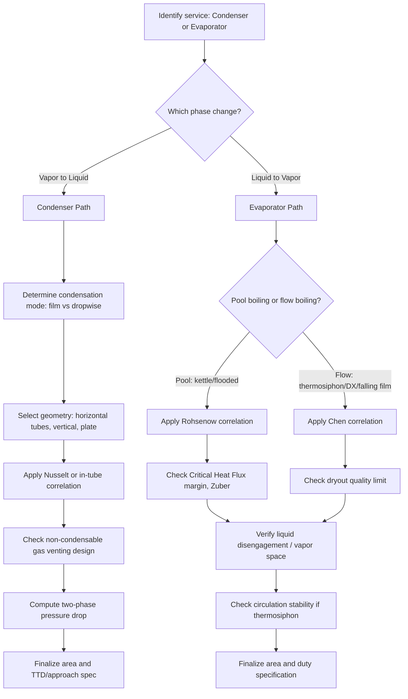

## Condensers and Evaporators as Heat Exchangers

### Overview: Phase-Change Heat Exchangers

Condensers and evaporators are heat exchangers in which one (or both) fluids undergo a phase change, distinguishing them fundamentally from single-phase (sensible heat) exchangers. Phase-change heat transfer involves latent heat exchange at (nominally) constant temperature for a pure substance, yielding very high heat transfer coefficients compared to single-phase convection, but introducing additional complexity in flow regime prediction, pressure drop, and instability phenomena.

**Key Points**

- Condensers reject heat by converting vapor to liquid; evaporators absorb heat by converting liquid to vapor.
- Both appear across power generation (steam condensers, boilers), refrigeration/HVAC (condensers, evaporators in vapor-compression cycles), and process industries (reboilers, vaporizers).
- Two-phase heat transfer coefficients are typically an order of magnitude higher than single-phase convection for the same fluid, but flow regime transitions make prediction significantly more complex than single-phase correlations.

---

### Condensers

#### Condensation Fundamentals

Condensation occurs when a vapor contacts a surface below its saturation temperature, releasing latent heat of vaporization $h_{fg}$ as it converts to liquid. Two distinct condensation modes exist:

- **Filmwise condensation**: condensate forms a continuous liquid film covering the surface, which acts as a thermal resistance the latent heat must conduct through to reach the cold wall. This is the dominant mode on most engineering surfaces (clean metal, wettable).
- **Dropwise condensation**: condensate forms discrete droplets rather than a continuous film, typically on surfaces treated to be non-wetting (e.g., with promoter coatings). Because droplets roll off and continuously expose bare (low-resistance) surface, dropwise condensation yields heat transfer coefficients 5–10× higher than filmwise. [Inference] Despite this large potential benefit, dropwise condensation is rarely exploited industrially because promoter coatings degrade over time and filmwise condensation eventually reasserts itself, making sustained dropwise performance unreliable for long-term operation.

#### Nusselt Film Condensation Theory

For laminar filmwise condensation on a vertical plate, Nusselt's classical analysis gives the local and average heat transfer coefficients:

$$\bar{h} = 0.943 \left[\frac{g \rho_l (\rho_l - \rho_v) k_l^3 h_{fg}'}{\mu_l L (T_{sat} - T_s)}\right]^{1/4}$$

where $\rho_l$, $k_l$, $\mu_l$ are liquid density, thermal conductivity, and viscosity; $\rho_v$ is vapor density; $h_{fg}'$ is a corrected latent heat accounting for subcooling of the condensate film; $L$ is the plate length; and $(T_{sat} - T_s)$ is the vapor-to-surface temperature difference.

For **horizontal tube banks** (common in shell-and-tube condensers), condensate falling from upper tube rows onto lower rows reduces the effective heat transfer coefficient of lower tubes; a correction for $N$ tube rows in a vertical column is commonly applied:

$$\bar{h}_N = \bar{h}_1 \, N^{-1/4}$$

where $\bar{h}_1$ is the single-tube (top row) coefficient. [Inference] This simple $N^{-1/4}$ correction is a classical approximation; modern design software accounts more precisely for condensate inundation, splashing, and turbulence effects that can partially offset the predicted degradation.

#### Condensation Inside Tubes

Condensation inside horizontal or vertical tubes (common in air-cooled condensers, refrigeration condensers) is governed by the two-phase flow regime, which depends on vapor quality $x$ and mass flux $G$:

- **Annular flow**: liquid film on the tube wall, vapor core in the center — dominant at high vapor quality and high mass flux; heat transfer is enhanced by high interfacial shear.
- **Stratified/wavy flow**: liquid pools at the bottom of a horizontal tube due to gravity, with vapor above — occurs at low mass flux; gravity-dominated, with the top of the tube experiencing much lower local heat transfer coefficient than the bottom.
- **Slug/plug flow**: intermittent liquid slugs and vapor plugs, typically at low-to-moderate quality and low mass flux.

Design correlations (e.g., Shah correlation, Cavallini-Zecchin) combine the liquid-only single-phase coefficient with a two-phase multiplier that is a function of quality, reduced pressure, and the Martinelli parameter.

#### Condenser Types and Applications

- **Surface condensers (power plant)**: shell-and-tube configuration where turbine exhaust steam condenses on the shell-side over tube bundles carrying cooling water; operate under vacuum (typically 0.05–0.1 bar absolute) to maximize turbine work extraction. Sized by cleanliness factor, terminal temperature difference (TTD), and condenser vacuum specification.
- **Air-cooled condensers**: finned-tube bundles with forced air draft, used where cooling water is unavailable or restricted; larger surface area required due to lower air-side heat transfer coefficients (typically requiring extended fin surfaces).
- **Evaporative condensers**: combine air cooling with water spray evaporation over the coil, achieving lower condensing temperatures than dry air-cooled units by leveraging evaporative cooling (approaching the wet-bulb rather than dry-bulb temperature).
- **Shell-and-tube refrigerant condensers**: refrigerant condenses shell-side (or tube-side in some designs) while cooling water or air removes the heat; standard in chiller and HVAC systems.

**Example**: A steam surface condenser in a 500 MW power plant typically operates with a condenser pressure around 0.05–0.08 bar absolute (corresponding to a saturation temperature of roughly 33–41°C), rejecting on the order of 700–900 MW of waste heat to cooling water — illustrating why condenser performance directly affects overall plant thermal efficiency via the Rankine cycle back-pressure.

---

### Evaporators

#### Evaporation and Boiling Fundamentals

Evaporators absorb heat to convert liquid to vapor, and the term encompasses both **pool boiling** (heat added to a liquid pool with a submerged heated surface) and **flow boiling** (liquid flowing through a heated channel undergoing vaporization). Heat transfer performance is described by the **boiling curve**, which relates heat flux $q''$ to the excess temperature $\Delta T_e = T_s - T_{sat}$ (wall superheat).

#### The Pool Boiling Curve

The boiling curve exhibits four distinct regimes:

1. **Natural convection boiling** (low $\Delta T_e$, below onset of nucleate boiling): heat transfer is by single-phase natural convection; no bubble formation yet.
2. **Nucleate boiling**: bubbles form at surface nucleation sites, grow, and detach, providing highly efficient heat transfer through bubble-induced mixing and latent heat transport. This is the preferred operating regime for most evaporator/boiler design due to high $h$ at moderate $\Delta T_e$.
3. **Critical heat flux (CHF) / burnout point**: as $\Delta T_e$ increases further, bubble generation becomes so intense that vapor blankets begin to form and coalesce on the surface, reaching a maximum heat flux $q''_{max}$ (the critical heat flux). Operating beyond this point in a heat-flux-controlled system causes a sudden, often destructive, jump in surface temperature (partial or complete vapor film formation) — a phenomenon called "boiling crisis" or "burnout."
4. **Film boiling**: a continuous vapor film blankets the surface, insulating it from the liquid; heat transfer coefficient drops sharply immediately after CHF, then rises again at very high $\Delta T_e$ due to radiation contribution across the vapor film.

The critical heat flux is commonly estimated using the Zuber correlation:

$$q''_{max} = C \, h_{fg} \, \rho_v^{1/2} \left[\sigma g (\rho_l - \rho_v)\right]^{1/4}$$

where $C \approx 0.131$ (theoretical value for an infinite flat plate) and $\sigma$ is surface tension. [Inference] The constant $C$ varies somewhat with geometry and heater orientation in practice, and design correlations for specific geometries (tubes, finite plates) apply corrected values.

**Nucleate boiling heat transfer** is commonly correlated using the Rohsenow correlation:

$$q'' = \mu_l h_{fg} \left[\frac{g(\rho_l - \rho_v)}{\sigma}\right]^{1/2} \left(\frac{c_{p,l} \Delta T_e}{C_{sf} h_{fg} Pr_l^n}\right)^3$$

where $C_{sf}$ is an empirical surface-fluid combination coefficient and $n$ is a fluid-dependent exponent (typically 1.0 for water, 1.7 for other fluids).

#### Flow Boiling in Evaporators

Flow boiling (used in shell-and-tube evaporators, plate evaporators, and refrigerant evaporator coils) progresses through flow regimes as vapor quality increases along the flow path, analogous to (but distinct from) condensation regimes:

- **Subcooled boiling**: bubbles nucleate at the wall even though bulk liquid remains below saturation temperature.
- **Saturated nucleate boiling**: bulk fluid at saturation, nucleate boiling dominates heat transfer, relatively insensitive to mass flux.
- **Convective boiling (annular flow)**: at higher quality, a thin liquid film on the tube wall is evaporated primarily by conduction/convection through the film to the vapor core interface (nucleate boiling suppressed); heat transfer coefficient increases with quality and mass flux in this regime.
- **Dryout/post-dryout**: at high quality, the liquid film dries out, leaving a mist flow of liquid droplets in vapor; heat transfer coefficient drops sharply, analogous to CHF in pool boiling and equally important to avoid in most evaporator designs (dryout causes severe wall temperature excursion in fired equipment like boiler tubes).

The Chen correlation is a widely used flow boiling model that superimposes a nucleate boiling contribution and a convective (forced convection) contribution:

$$h_{TP} = h_{nb} \cdot S + h_{cb} \cdot F$$

where $S$ is a nucleate boiling suppression factor (accounts for reduced bubble growth in high-velocity flow) and $F$ is a two-phase convective enhancement factor (accounts for increased convective transport due to the thin, fast-moving liquid film).

#### Evaporator Types

- **Falling film evaporators**: liquid distributed as a thin film flowing down the inside of vertical tubes (or outside horizontal tubes), evaporating primarily by convective boiling through the thin film; used extensively in desalination, food concentration, and where fouling/scaling of the liquid is a concern (as low liquid holdup and continuous renewal reduce fouling residence time).
- **Kettle reboilers (TEMA K-shell)**: shell-side pool boiling design with an internal tube bundle submerged in liquid within an oversized shell providing vapor disengagement space above the liquid level; widely used in distillation column reboilers due to simplicity and inherent CHF margin from the large liquid pool.
- **Thermosiphon reboilers**: natural or forced circulation of liquid through vertical tubes driven by density difference between the two-phase mixture in the tubes and the liquid in the downcomer, without a pump; common in distillation reboiler service due to lower cost and no moving parts, but requires careful hydraulic design to avoid circulation instability.
- **Rising film / climbing film evaporators**: liquid boils as it rises through vertical tubes, vapor generation driving upward liquid entrainment; common in sugar and chemical process concentration.
- **Direct expansion (DX) evaporator coils**: refrigerant evaporates inside finned tube coils while air flows across the fins (HVAC/refrigeration); refrigerant-side is flow boiling, air-side is single-phase convection with fin efficiency effects.
- **Flooded evaporators**: shell-side pool boiling of refrigerant around tube bundles carrying the fluid to be cooled (chilled water), analogous to kettle reboilers but for refrigeration service.

**Example**: A distillation column reboiler using a thermosiphon design relies on the density difference between the two-phase mixture returning to the column and the single-phase liquid in the downcomer to drive natural circulation; if the driving head is insufficient (e.g., due to excessive frictional pressure drop in the tubes at high vapor generation rates), circulation can stall, leading to dryout and reduced reboiler duty — a classic thermosiphon instability failure mode.

---

### Shared Design Considerations

#### Two-Phase Pressure Drop

Both condensers and evaporators require two-phase pressure drop prediction, typically using the Lockhart-Martinelli correlation or homogeneous flow model, combining frictional, accelerational (due to density change along the flow path), and gravitational (for vertical/inclined flow) pressure drop components:

$$\Delta P_{total} = \Delta P_{friction} + \Delta P_{acceleration} + \Delta P_{gravity}$$

The accelerational component is often negligible in single-phase flow but becomes significant in phase-change flows due to the large specific volume change between liquid and vapor.

#### Instabilities

- **Flow instabilities** (Ledinegg instability, density wave oscillations): in parallel-channel evaporator systems (multiple tubes/channels boiling in parallel), flow can redistribute unstably between channels due to the non-monotonic pressure-drop-versus-flow-rate characteristic of two-phase flow, potentially starving some channels and causing localized dryout.
- **Condensation-induced water hammer**: rapid condensation of vapor pockets in contact with subcooled liquid can cause violent, transient pressure spikes in piping and equipment — a significant safety consideration in steam systems.

#### Non-Condensable Gases

In condensers, even small amounts of non-condensable gas (air, dissolved gases) dramatically reduce condensation heat transfer coefficient because the gas accumulates at the liquid-vapor interface, creating a diffusional resistance vapor molecules must cross to reach the condensing surface. [Inference] This effect is highly nonlinear — a few percent non-condensable gas by mass can reduce local condensation coefficient by 50% or more — which is why power plant condensers include dedicated air removal (vacuum ejector or vacuum pump) systems and vent point design to continuously purge accumulated non-condensables.

---

### Comparative Summary

| Aspect | Condenser | Evaporator |
| --- | --- | --- |
| Heat direction | Rejects heat (vapor→liquid) | Absorbs heat (liquid→vapor) |
| Governing phenomenon | Film/dropwise condensation | Nucleate/film boiling, flow boiling |
| Critical limit | Non-condensable gas blanketing, flooding | Critical heat flux (CHF)/dryout |
| Common industrial forms | Surface condenser, air-cooled condenser, evaporative condenser | Kettle reboiler, thermosiphon reboiler, falling-film evaporator, DX coil |
| Key design correlation | Nusselt film theory, Shah correlation | Rohsenow, Zuber (CHF), Chen correlation |
| Typical $h$ range | 5,000–15,000 W/m²K (steam, filmwise) | 3,000–60,000+ W/m²K (nucleate boiling, fluid-dependent) |

---

### Boiling Curve Diagram (svg_diagram)

<svg xmlns="http://www.w3.org/2000/svg" viewBox="0 0 750 420">
<text x="375" y="25" font-size="16" font-weight="bold" text-anchor="middle" fill="#1a1a1a">Pool Boiling Curve: Heat Flux vs. Wall Superheat (svg_diagram)</text>

<line x1="90" y1="370" x2="700" y2="370" stroke="#333" stroke-width="2" />
<line x1="90" y1="370" x2="90" y2="50" stroke="#333" stroke-width="2" />
<text x="395" y="400" font-size="13" text-anchor="middle" fill="#1a1a1a">Wall Superheat, ΔTe = Ts − Tsat (log scale)</text>
<text x="35" y="220" font-size="13" text-anchor="middle" fill="#1a1a1a" transform="rotate(-90 35 220)">Heat Flux q'' (log scale)</text>

<path d="M 100 350 C 150 330, 180 300, 210 260 C 250 210, 290 150, 330 100 C 350 85, 370 80, 390 90 C 420 105, 440 160, 460 250 C 480 320, 520 330, 570 300 C 620 265, 660 200, 690 130" fill="none" stroke="`#8e44ad`" stroke-width="3" />

<line x1="200" y1="60" x2="200" y2="370" stroke="#bbb" stroke-width="1" stroke-dasharray="3,3" />
<line x1="390" y1="60" x2="390" y2="370" stroke="#bbb" stroke-width="1" stroke-dasharray="3,3" />
<line x1="480" y1="60" x2="480" y2="370" stroke="#bbb" stroke-width="1" stroke-dasharray="3,3" />

<text x="140" y="390" font-size="11" text-anchor="middle" fill="`#1a1a1a`">Natural</text>

<text x="140" y="402" font-size="11" text-anchor="middle" fill="`#1a1a1a`">Convection</text>

<text x="290" y="390" font-size="11" text-anchor="middle" fill="`#1a1a1a`">Nucleate Boiling</text>

<text x="435" y="390" font-size="11" text-anchor="middle" fill="`#1a1a1a`">Transition</text>

<text x="600" y="390" font-size="11" text-anchor="middle" fill="`#1a1a1a`">Film Boiling</text>

<circle cx="390" cy="90" r="6" fill="#c0392b" />
<text x="440" y="70" font-size="12" fill="#c0392b" font-weight="bold">Critical Heat Flux (CHF)</text>
<text x="440" y="85" font-size="11" fill="#c0392b">"Burnout point"</text>

<circle cx="480" cy="255" r="5" fill="#2980b9" />
<text x="500" y="255" font-size="11" fill="#2980b9">Leidenfrost point</text>
</svg>

---

### Design Flow: Condenser and Evaporator Sizing Logic

---

### Worked Example: Kettle Reboiler Sizing Check

**Problem**: A kettle reboiler vaporizes a hydrocarbon mixture with $h_{fg} = 350{,}000 \, \text{J/kg}$, $\rho_l = 550 \, \text{kg/m}^3$, $\rho_v = 12 \, \text{kg/m}^3$, $\sigma = 0.008 \, \text{N/m}$. Estimate the critical heat flux and check the design margin if the operating heat flux is $35{,}000 \, \text{W/m}^2$.

**Solution outline**:

1. Apply the Zuber correlation with $C = 0.131$:

$$q''_{max} = 0.131 \times 350{,}000 \times \sqrt{12} \times \left[0.008 \times 9.81 \times (550-12)\right]^{1/4}$$

2. Compute the bracket term: $0.008 \times 9.81 \times 538 \approx 42.2$; raised to the 1/4 power: $42.2^{0.25} \approx 2.55$
3. Compute $\sqrt{12} \approx 3.46$
4. $q''_{max} \approx 0.131 \times 350{,}000 \times 3.46 \times 2.55 \approx 405{,}000 \, \text{W/m}^2$

**Output**: The estimated critical heat flux is approximately 405 kW/m². With an operating flux of 35 kW/m², the design operates at roughly 9% of CHF — a substantial margin, which is typical and intentional for kettle reboiler design, since operating too close to CHF risks localized dryout and reduced reboiler performance during minor process upsets.

**Conclusion**

Condensers and evaporators extend heat exchanger design beyond single-phase sensible heat transfer into the domain of latent heat and two-phase flow, where heat transfer coefficients are higher but governed by fundamentally different phenomena — condensation film theory and non-condensable gas effects on the condensing side; nucleate boiling, critical heat flux, and dryout on the evaporating side. Robust design requires respecting phase-change-specific limits (CHF margin, non-condensable venting, circulation stability) that have no analog in single-phase exchanger design.

**Related Topics**

- Rankine cycle condenser back-pressure and turbine efficiency interaction
- Vapor-compression refrigeration cycle component design (evaporator/condenser pairing)
- Multi-effect and multi-stage flash (MSF) desalination evaporator systems
- Boiler tube dryout and departure from nucleate boiling (DNB) in fired equipment
- Thermosiphon and natural circulation stability analysis
- Air-cooled heat exchanger (fin-fan) design for condensing service
- Distillation column reboiler and condenser integration (heat integration/pinch analysis)