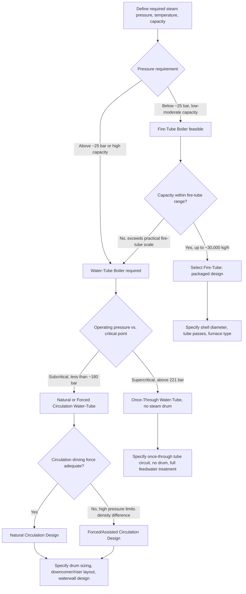

## Boiler Classification: Fire-Tube and Water-Tube Design

### Overview and Fundamental Distinction

Boilers are pressure vessels designed to generate steam or hot water by transferring heat from combustion gases (or other heat sources) to a working fluid. The most fundamental classification distinguishes boilers by which fluid resides inside the tubes versus which surrounds them: fire-tube boilers pass hot combustion gases through tubes submerged in water, while water-tube boilers pass water/steam through tubes surrounded by hot combustion gases.

**Key Points**

- Fire-tube: hot gas inside tubes, water/steam outside (in the shell).
- Water-tube: water/steam inside tubes, hot gas outside (in the furnace/flue gas path).
- The choice fundamentally determines achievable pressure, capacity, response time, and application suitability.

---

### Fire-Tube Boilers

#### Construction and Operating Principle

A fire-tube boiler consists of a cylindrical shell filled with water, penetrated by a bundle of tubes through which hot combustion gases flow. Heat is transferred by convection and radiation from the hot gas, through the tube wall, to the surrounding water, generating steam that collects in the vapor space above the water level.

- **Furnace/combustion chamber**: often a large-diameter corrugated tube (Morrison-type furnace) forming the first gas pass, located within the shell itself and submerged in water — providing radiant heat transfer directly to the water on its outer surface.
- **Multiple gas passes**: after the furnace, combustion gases typically reverse direction and pass through one or more tube bundles (2-pass, 3-pass, or 4-pass configurations) before exiting to the stack, extracting progressively more heat via convective transfer as gas temperature drops.
- **Shell**: a large-diameter pressure vessel containing the entire tube bundle and water/steam space; because it is a single large-diameter vessel under internal pressure, wall thickness requirements increase substantially with pressure and diameter (per the thin-wall pressure vessel hoop stress relation $\sigma = PD/2t$), which is the fundamental reason fire-tube boilers are pressure-limited.

#### Advantages

- **Simplicity and reliability**: fewer components, straightforward construction, well-understood technology.
- **Large water/steam storage volume**: provides good load-following capability and buffers against rapid demand fluctuations, since the large water mass acts as thermal storage.
- **Lower initial cost**: for small-to-medium capacities, generally less expensive to fabricate and install than an equivalent water-tube unit.
- **Easier maintenance and water treatment tolerance**: [Inference] the large water volume and lower operating pressure generally make fire-tube boilers somewhat more forgiving of water chemistry excursions than high-pressure water-tube units, though proper treatment is still essential to prevent scaling and corrosion.
- **Compact packaged units**: commonly supplied as fully shop-assembled "packaged boilers," simplifying site installation.

#### Limitations

- **Pressure limitation**: practically limited to roughly 25 bar (350 psig) and below [Inference: commonly cited industry threshold; exact limits vary by code, shell diameter, and manufacturer], because shell wall thickness for higher pressures becomes prohibitively thick and heavy for a large-diameter vessel.
- **Capacity limitation**: typically limited to smaller steam generation capacities (commonly up to roughly 25,000–30,000 kg/h of steam, though larger units exist), since increasing capacity requires more/larger tubes and a correspondingly larger-diameter shell, compounding the pressure vessel wall-thickness problem.
- **Slower response and startup**: the large water inventory that provides load-following buffering also means more thermal mass to heat up, resulting in slower cold-start times compared to water-tube designs.
- **Higher risk profile if the shell fails**: because the entire pressurized water/steam inventory is contained in a single large vessel, a catastrophic shell failure releases a large stored energy volume; the historical evolution toward water-tube designs at higher pressures was partly driven by this safety consideration (smaller-diameter tubes fail less catastrophically).

#### Applications

Fire-tube boilers are widely used for low-to-medium pressure steam or hot water generation in: commercial and institutional heating, small-to-medium industrial process steam, marine propulsion (historically, Scotch marine boilers), and package boiler applications where simplicity, moderate capacity, and lower capital cost are prioritized over high pressure/temperature performance.

---

### Water-Tube Boilers

#### Construction and Operating Principle

A water-tube boiler circulates water and steam through a network of relatively small-diameter tubes, which are heated externally by combustion gases in the furnace. Because the pressure-containing tubes are small in diameter, they can withstand much higher internal pressures for a given wall thickness than a large-diameter fire-tube shell.

- **Drum(s)**: water-tube boilers typically employ a **steam drum** (upper) where steam separates from the water/steam mixture, and often a **mud drum** or **lower header** (lower) that collects circulating water and any sediment; risers and downcomers connect the drums via the tube circuit.
- **Downcomers**: unheated (or lightly heated) tubes carrying relatively cool, denser water from the steam drum down to the mud drum/headers, providing the driving density difference for natural circulation.
- **Risers/generating tubes**: heated tubes in which water absorbs heat, partially vaporizes, and the resulting lower-density steam-water mixture rises back to the steam drum, driven by the density difference with the downcomer fluid (natural circulation) or by a boiler feed pump (forced/assisted circulation).
- **Waterwall tubes**: in modern utility boilers, the furnace walls themselves are constructed of closely-spaced (often membrane-welded) water tubes, simultaneously serving as the pressure boundary, primary heat absorption surface (radiant heat transfer from the flame), and furnace enclosure — a highly compact and efficient design.
- **Superheater and reheater sections**: additional tube banks located in the hot flue gas path downstream of the primary evaporator section, raising steam temperature above saturation (superheat) to improve cycle efficiency and reduce turbine blade erosion from moisture.
- **Economizer**: a convective heat transfer section (typically finned or bare tubes) in the cooler flue gas path near the stack exit, preheating boiler feedwater using otherwise-wasted flue gas heat before it enters the steam drum — improving overall boiler thermal efficiency.

#### Circulation Types

- **Natural circulation**: relies entirely on the density difference between the water-filled downcomers and the steam-water mixture in the risers to drive flow; no circulating pump required. Circulation driving force decreases as operating pressure approaches the critical point (374°C, 221 bar for water) because the liquid-vapor density difference diminishes, limiting natural circulation boilers to subcritical pressures (practically below roughly 170–180 bar [Inference: approximate industry-cited upper bound, varies by specific design]).
- **Forced (assisted) circulation**: a circulating pump augments or entirely drives flow through the tube circuit, allowing operation at higher pressures where natural circulation driving force becomes inadequate, and permitting more flexible tube routing (since flow is not solely dependent on gravity-driven density difference).
- **Once-through (supercritical) circulation**: at supercritical pressure (above 221 bar), there is no distinct liquid-vapor phase transition (no latent heat, no boiling in the traditional sense) — water is pumped through the tube circuit once, continuously increasing in enthalpy and temperature from feedwater to superheated steam conditions without a steam drum or the concept of "circulation" in the traditional sense, since there is no two-phase mixture to separate.

#### Advantages

- **High pressure and temperature capability**: small tube diameters withstand far higher pressures than large-diameter shells, enabling supercritical and ultra-supercritical steam conditions in modern utility power plants (routinely 170–300+ bar, 540–620°C).
- **High capacity**: capable of very large steam generation rates (utility boilers can exceed 1,000,000 kg/h), since capacity scales by adding more parallel tube circuits rather than increasing a single vessel's diameter.
- **Faster response and startup**: lower water inventory relative to heat transfer surface area means faster thermal response to load changes and quicker startup than an equivalent-capacity fire-tube unit.
- **Superior efficiency at scale**: integration of economizers, superheaters, reheaters, and air preheaters into a coordinated heat recovery train (enabled by the flexible tube-bank arrangement) allows very high overall thermal efficiency in large installations.
- **Better safety characteristics at high pressure**: distributed small-diameter tubes fail less catastrophically than a single large pressurized shell, an important consideration as operating pressures increase.

#### Limitations

- **Higher complexity and cost**: more components (drums, headers, multiple tube banks, circulation piping) increase fabrication complexity and capital cost, particularly at smaller capacities where fire-tube designs remain more economical.
- **Stricter water chemistry requirements**: high heat flux in the waterwall tubes combined with tight tube diameters makes water-tube boilers considerably more sensitive to scaling and deposition than fire-tube units; feedwater treatment (demineralization, deaeration, chemical dosing) is essential and more demanding.
- **Lower water storage/buffering capacity**: the smaller water inventory that enables fast response also means less thermal buffering against rapid load swings, requiring more sophisticated control systems to maintain steam drum level and pressure stability.
- **More demanding maintenance access**: numerous small-diameter tubes distributed through the furnace and convective sections can be more labor-intensive to inspect and maintain than the more compact fire-tube arrangement, though this varies by design.

#### Applications

Water-tube boilers dominate utility power generation (fossil-fired steam power plants, both subcritical and supercritical), large industrial cogeneration, and any application requiring high pressure, high capacity, or supercritical steam conditions. Heat Recovery Steam Generators (HRSGs) in combined-cycle gas turbine plants are also water-tube designs, recovering heat from gas turbine exhaust.

---

### Direct Comparison

| Parameter | Fire-Tube | Water-Tube |
| --- | --- | --- |
| Fluid location | Hot gas in tubes, water in shell | Water/steam in tubes, hot gas outside |
| Maximum practical pressure | ~25 bar (350 psig) | Up to and beyond supercritical (221+ bar) |
| Typical capacity range | Small to medium (up to ~30,000 kg/h) | Medium to very large (>1,000,000 kg/h) |
| Response to load change | Slower (large water mass) | Faster (lower water inventory) |
| Startup time | Slower | Faster |
| Water treatment sensitivity | Moderate | High (critical) |
| Capital cost (small scale) | Lower | Higher |
| Capital cost (large scale) | Not practical/available | Economical at scale |
| Typical application | Commercial heating, small process steam | Utility power generation, large cogeneration |
| Failure mode severity | Higher (large single vessel) | Lower (distributed small tubes) |

**Example**: A hospital or university campus central heating plant requiring 5,000 kg/h of low-pressure steam (under 10 bar) for space heating and domestic hot water would typically select a packaged fire-tube boiler for its simplicity, lower cost, and adequate performance at this scale. A 600 MW coal-fired utility power station requiring supercritical steam at 250 bar and 565°C would necessarily use a water-tube (once-through) design, since fire-tube technology cannot physically achieve this pressure range.

---

### Natural Circulation Loop Schematic (svg_diagram)

<svg xmlns="http://www.w3.org/2000/svg" viewBox="0 0 700 460">
<text x="350" y="25" font-size="16" font-weight="bold" text-anchor="middle" fill="#1a1a1a">Water-Tube Boiler Natural Circulation Loop (svg_diagram)</text>

<ellipse cx="350" cy="80" rx="140" ry="35" fill="#dce6f1" stroke="#333" stroke-width="2" />
<text x="350" y="70" font-size="13" font-weight="bold" text-anchor="middle" fill="#1a1a1a">Steam Drum</text>
<text x="350" y="90" font-size="11" text-anchor="middle" fill="#1a1a1a">(steam-water separation)</text>

<line x1="440" y1="65" x2="500" y2="40" stroke="#c0392b" stroke-width="3" />
<polygon points="495,30 505,40 495,50" fill="#c0392b" />
<text x="530" y="40" font-size="11" fill="#c0392b">Steam out</text>

<line x1="260" y1="65" x2="200" y2="40" stroke="#2980b9" stroke-width="3" />
<polygon points="195,45 200,32 210,42" fill="#2980b9" />
<text x="120" y="40" font-size="11" fill="#2980b9">Feedwater in</text>

<line x1="270" y1="105" x2="180" y2="330" stroke="#2980b9" stroke-width="6" />
<text x="140" y="220" font-size="11" fill="#2980b9" font-weight="bold">Downcomer</text>
<text x="140" y="235" font-size="11" fill="#2980b9">(cool, dense water)</text>
<polygon points="170,300 180,320 190,300" fill="#2980b9" />

<ellipse cx="350" cy="360" rx="110" ry="28" fill="#f0e6d2" stroke="#333" stroke-width="2" />
<text x="350" y="365" font-size="12" font-weight="bold" text-anchor="middle" fill="#1a1a1a">Mud Drum / Lower Header</text>

<rect x="450" y="150" width="140" height="180" fill="#fdecec" stroke="#c0392b" stroke-width="1" stroke-dasharray="4,3" />
<text x="520" y="145" font-size="11" fill="#c0392b" font-weight="bold" text-anchor="middle">Furnace Zone</text>
<line x1="480" y1="330" x2="480" y2="105" stroke="#e74c3c" stroke-width="5" />
<line x1="520" y1="330" x2="520" y2="105" stroke="#e74c3c" stroke-width="5" />
<line x1="560" y1="330" x2="560" y2="105" stroke="#e74c3c" stroke-width="5" />
<polygon points="475,140 480,120 485,140" fill="#e74c3c" />
<polygon points="515,140 520,120 525,140" fill="#e74c3c" />
<polygon points="555,140 560,120 565,140" fill="#e74c3c" />
<text x="520" y="360" font-size="11" fill="#c0392b" font-weight="bold" text-anchor="middle">Risers</text>
<text x="520" y="375" font-size="11" fill="#c0392b" text-anchor="middle">(heated, steam-water mix rises)</text>

<text x="520" y="250" font-size="30" text-anchor="middle" fill="`#e67e22`">🔥</text>

<text x="520" y="290" font-size="11" text-anchor="middle" fill="`#e67e22`">Combustion gas heat</text>

<line x1="230" y1="345" x2="450" y2="345" stroke="#333" stroke-width="1" stroke-dasharray="2,2" />

<text x="350" y="440" font-size="12" text-anchor="middle" fill="`#1a1a1a`">Density difference (cool downcomer vs. heated riser mixture) drives circulation</text>

</svg>

---

### Classification Decision Flow

---

### Historical and Design Evolution Note

[Inference] The general historical trajectory of boiler technology moved from fire-tube designs (dominant in 19th-century industrial and marine applications) toward water-tube designs as steam pressures and capacities demanded by electric power generation increased through the 20th century — driven primarily by the pressure-vessel wall-thickness constraint of large-diameter fire-tube shells and by the improved safety profile of distributed small-diameter tube failure modes. Fire-tube technology remains fully current and widely manufactured today, but is now confined to the lower-pressure, lower-capacity segment of the market where its simplicity and cost advantage are decisive.

**Related Topics**

- Boiler drum internals and steam-water separation (cyclone separators, scrubbers)
- Superheater and reheater design and steam temperature control
- Economizer and air preheater integration for boiler efficiency
- Supercritical and ultra-supercritical once-through boiler design
- Heat Recovery Steam Generators (HRSG) in combined-cycle plants
- Boiler feedwater treatment and chemistry control
- Natural circulation stability and departure from nucleate boiling in boiler tubes
- Boiler efficiency calculation methods (direct and indirect/heat loss method)