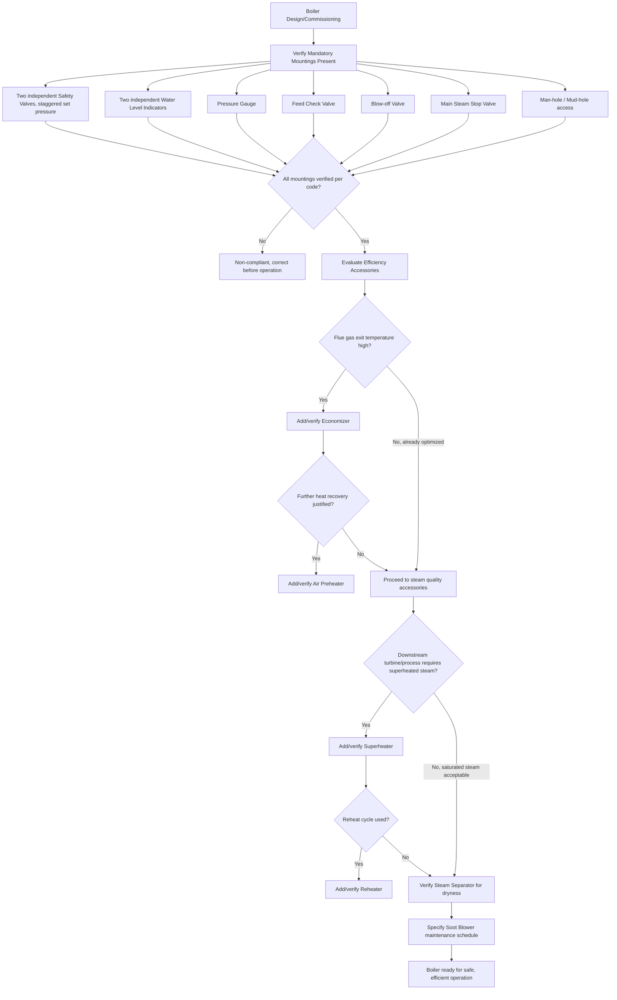

## Boiler Mountings and Accessories

### Overview and Distinction

Boiler auxiliaries are commonly divided into two categories: **mountings**, which are components mounted directly on the boiler shell/drum that are essential for safe operation and are typically required by pressure vessel codes, and **accessories**, which are components installed to improve boiler efficiency, operability, or convenience but are not strictly mandated by safety codes for basic operation. This distinction, while somewhat traditional/pedagogical rather than a strict regulatory boundary, remains a standard framework for organizing boiler component knowledge.

**Key Points**

- Mountings: safety-critical, directly attached to the pressure vessel, code-mandated (e.g., safety valves, water level gauge, pressure gauge, stop valve).
- Accessories: efficiency- and operability-enhancing, not always code-mandated for basic safety (e.g., economizer, superheater, air preheater, feed pump, soot blower).
- [Inference] The mounting/accessory distinction is a traditional engineering classification (particularly common in mechanical engineering curricula) rather than a universally standardized regulatory term; actual jurisdictional codes (ASME, national boiler codes) specify required safety devices without necessarily using this exact terminology.

---

### Boiler Mountings

#### Safety Valve

The single most critical safety mounting, designed to automatically release steam if pressure exceeds a preset safe limit, preventing catastrophic overpressure failure of the boiler shell.

- **Spring-loaded safety valve**: the most common type; a calibrated spring holds a valve disc against a seat, and when steam pressure force on the disc exceeds the spring's closing force, the valve lifts and discharges steam. Set pressure is adjustable via the spring compression.
- **Dead-weight safety valve**: uses calibrated weights directly loading the valve disc; simple and historically significant but rarely used in modern high-pressure boilers due to size and dynamic response limitations, more suited to low-pressure/stationary applications.
- **Lever safety valve**: a weight on a lever arm provides the closing force via mechanical advantage; also largely historical for modern high-pressure service.
- Most codes (e.g., ASME Section I) require at least two independent safety valves on boilers above a certain capacity, with staggered set pressures (one set slightly higher than the other) to provide progressive relief capacity and redundancy.

**Example**: A boiler operating at 15 bar might have two safety valves set to lift at 15.5 bar and 16 bar respectively; under normal upset conditions the first valve opens to relieve excess pressure, and the second acts as backup if the first is insufficient or fails to reseat properly.

#### Water Level Indicator (Gauge Glass)

A transparent glass (or reflex/magnetic type) tube connected to the steam and water spaces of the boiler, allowing the operator to visually confirm the water level is within safe operating limits. Low water level is one of the most dangerous boiler conditions, since it can expose heated tube/furnace surfaces to steam only (rather than water), causing overheating and potential tube rupture or shell failure.

- Codes typically require at least two independent water level indicating devices.
- Modern boilers supplement direct-reading gauge glasses with **low-water cutoff** devices (float or electronic probe-based) that automatically shut off fuel/burner firing if water level drops below a safe minimum, providing automatic protection beyond operator visual monitoring.

#### Pressure Gauge

A Bourdon-tube (or equivalent) pressure gauge mounted on the steam drum/shell, providing continuous visual indication of boiler operating pressure to the operator, essential for monitoring normal operation and verifying safety valve set points during testing.

#### Fusible Plug

A safety device (a plug containing a low-melting-point metal alloy, historically often a bismuth-tin-lead alloy) installed at a point in the boiler that would be exposed to combustion gas if water level dropped critically low. If water level falls enough to uncover the plug, the resulting high metal temperature melts the fusible alloy, creating an opening that releases steam/water into the furnace — extinguishing the fire and providing a last-resort warning/protective action against a dangerously low water condition. [Inference] Fusible plugs are more strongly associated with older/traditional boiler designs (particularly fire-tube and locomotive boilers); many modern boiler designs rely primarily on electronic low-water cutoff systems as the principal low-water protection, with fusible plugs less universally applied in contemporary high-pressure water-tube units.

#### Stop Valve (Main Steam Stop Valve)

Controls and can completely shut off the flow of steam from the boiler to the steam main/distribution header, typically mounted directly on the highest point of the steam drum/shell. Essential for isolating the boiler from the downstream steam system for maintenance, or for controlling steam flow during startup/shutdown sequences.

#### Feed Check Valve (Feedwater Check Valve)

A non-return (check) valve installed in the feedwater line at the point it enters the boiler shell/drum, preventing backflow of high-pressure boiler water/steam into the feedwater system in the event of a feed pump failure or feedwater pressure drop, while allowing feedwater to enter when pump pressure exceeds boiler pressure.

#### Blow-Off Valve (Blowdown Valve)

Installed at the lowest point of the boiler (typically the mud drum in water-tube boilers, or the bottom of the shell in fire-tube boilers), used to periodically or continuously discharge a portion of boiler water to remove accumulated sediment, sludge, and to control the concentration of dissolved solids (TDS) in the boiler water.

- **Intermittent blowdown**: periodic manual or automated opening of the blow-off valve to discharge accumulated sludge from the bottom of the boiler.
- **Continuous blowdown**: a smaller, continuously open bleed from the water surface (where dissolved solids concentrate) to control TDS concentration steadily, often incorporating heat recovery from the blowdown stream (flash tank, heat exchanger) to minimize energy loss.

#### Man-Hole and Mud-Hole Doors

Access openings (typically elliptical or circular, bolted covers) in the boiler shell allowing personnel entry for internal inspection, cleaning, and maintenance. Man-holes are sized for personnel access to the steam/water drum interior; mud-holes are smaller openings positioned to allow cleaning of sediment accumulation zones (e.g., the mud drum in water-tube boilers).

---

### Boiler Accessories

#### Economizer

A heat exchanger installed in the flue gas path (typically after the main boiler heat transfer surfaces but before the stack/air preheater), using residual heat in the exiting flue gas to preheat incoming boiler feedwater before it enters the steam drum.

- **Benefit**: recovers heat that would otherwise be lost up the stack, directly improving overall boiler thermal efficiency — commonly cited to improve efficiency by roughly 4-11% depending on flue gas temperature reduction achieved and specific design [Inference: figure varies significantly by installation, flue gas temperature, and feedwater temperature rise achieved].
- **Types**: can be **non-steaming** (feedwater remains liquid throughout, most common) or **steaming economizers** (partial evaporation occurs, requiring more careful design to avoid two-phase flow instability).

#### Air Preheater

A heat exchanger that transfers residual flue gas heat to incoming combustion air before it enters the furnace/burners, further recovering waste heat beyond what the economizer captures (since air preheaters are typically positioned in the coolest part of the flue gas path, downstream of the economizer).

- **Benefits**: improves combustion efficiency (preheated air improves flame stability and combustion completeness, particularly important for lower-grade fuels), and further reduces stack heat loss.
- **Types**: **recuperative** (tubular or plate types, with continuous separate gas and air flow paths) and **regenerative** (rotating matrix, such as the Ljungström type, where a rotating heat-storage matrix alternately absorbs heat from flue gas and releases it to combustion air).

#### Superheater

A tube bank located in the hot flue gas path (downstream of the primary evaporator/steam drum) that raises saturated steam temperature above its saturation point, producing superheated steam.

- **Benefits**: superheated steam contains more available energy for expansion work in a turbine (improving Rankine cycle thermal efficiency, per the same principles governing steam turbine cycle design), and critically, avoids excessive moisture content during turbine expansion, which would otherwise cause blade erosion.
- **Types**: **radiant superheaters** (located where they receive significant radiant heat directly from the furnace flame, often exhibiting a decreasing steam temperature rise with increasing boiler load due to furnace radiation characteristics), and **convective superheaters** (located in the convective flue gas path, typically exhibiting increasing temperature rise with load due to increasing gas mass flow and velocity).

#### Reheater

Similar in construction to a superheater, but reheats steam that has already partially expanded through a high-pressure turbine stage, raising its temperature again before it enters an intermediate- or low-pressure turbine stage — a key feature of reheat Rankine cycles that improves overall cycle efficiency and further reduces turbine exhaust moisture content.

#### Feed Pump

Delivers feedwater from the feedwater system (deaerator, condensate system) into the boiler against the full boiler operating pressure, and must be sized to overcome boiler pressure plus all system losses. Types include reciprocating pumps (historically common, self-regulating flow characteristics) and centrifugal pumps (most common in modern installations, often multistage for high-pressure boiler service).

#### Injector

A device using the kinetic energy of a high-velocity steam jet (drawn from the boiler itself) to entrain and pump feedwater into the boiler, without requiring mechanical moving parts (other than the steam/water flow itself). Historically significant, particularly in locomotive and marine boiler applications, though largely superseded by pump-based feedwater systems in most modern stationary boiler installations.

#### Steam Separator

Installed in the steam line (often just downstream of the boiler stop valve, or within the steam drum itself) to remove entrained water droplets from the steam before it proceeds to the turbine or process use, improving steam quality (dryness fraction) and reducing erosion/damage risk to downstream equipment.

#### Soot Blower

A device that periodically directs high-pressure steam, air, or water jets onto heat transfer surfaces (particularly convective tube banks, superheaters, economizers) to remove accumulated soot and ash deposits from the flue-gas side, maintaining heat transfer effectiveness and preventing excessive draft loss from flue gas passage restriction. Common types include retractable (long-lance) soot blowers for deep furnace penetration and fixed rotary soot blowers for convective tube banks.

---

### Comparative Summary Table

| Component | Category | Primary Function |
| --- | --- | --- |
| Safety valve | Mounting | Overpressure protection |
| Water level indicator | Mounting | Water level monitoring/safety |
| Pressure gauge | Mounting | Pressure monitoring |
| Fusible plug | Mounting | Low-water emergency protection |
| Stop valve | Mounting | Steam flow isolation/control |
| Feed check valve | Mounting | Prevent feedwater backflow |
| Blow-off valve | Mounting | Sediment removal, TDS control |
| Man-hole/mud-hole | Mounting | Internal access for inspection/cleaning |
| Economizer | Accessory | Feedwater preheating, efficiency |
| Air preheater | Accessory | Combustion air preheating, efficiency |
| Superheater | Accessory | Increase steam temperature/quality |
| Reheater | Accessory | Reheat steam between turbine stages |
| Feed pump | Accessory | Deliver feedwater against boiler pressure |
| Injector | Accessory | Alternative feedwater delivery (historical) |
| Steam separator | Accessory | Improve steam dryness fraction |
| Soot blower | Accessory | Maintain heat transfer surface cleanliness |

---

### Boiler Mountings and Accessories Layout (svg_diagram)

<svg xmlns="http://www.w3.org/2000/svg" viewBox="0 0 800 480">
<text x="400" y="25" font-size="16" font-weight="bold" text-anchor="middle" fill="#1a1a1a">Boiler Mountings and Accessories — Schematic Layout (svg_diagram)</text>

<ellipse cx="400" cy="200" rx="220" ry="90" fill="#eef3f8" stroke="#333" stroke-width="2" />
<text x="400" y="205" font-size="13" font-weight="bold" text-anchor="middle" fill="#1a1a1a">Boiler Shell / Steam Drum</text>

<rect x="370" y="90" width="30" height="25" fill="#c0392b" stroke="#333" />
<line x1="385" y1="90" x2="385" y2="60" stroke="#c0392b" stroke-width="3" />
<text x="440" y="80" font-size="11" fill="#c0392b" font-weight="bold">Safety Valve (Mounting)</text>

<circle cx="470" cy="130" r="15" fill="#f9f9f9" stroke="#333" stroke-width="1.5" />
<text x="470" y="134" font-size="9" text-anchor="middle">P</text>
<text x="550" y="115" font-size="11" fill="#1a1a1a">Pressure Gauge (Mounting)</text>
<line x1="485" y1="130" x2="540" y2="118" stroke="#333" stroke-width="1" />

<rect x="325" y="170" width="15" height="60" fill="#dce6f1" stroke="#333" stroke-width="1.5" />
<text x="230" y="205" font-size="11" text-anchor="end" fill="#1a1a1a">Water Level</text>
<text x="230" y="218" font-size="11" text-anchor="end" fill="#1a1a1a">Gauge (Mounting)</text>
<line x1="325" y1="200" x2="245" y2="205" stroke="#333" stroke-width="1" />

<rect x="590" y="150" width="25" height="20" fill="#7f8c8d" stroke="#333" />
<line x1="615" y1="160" x2="660" y2="140" stroke="#333" stroke-width="3" />
<polygon points="655,132 668,138 660,148" fill="#c0392b" />
<text x="680" y="130" font-size="11" fill="#1a1a1a">Steam to header</text>
<text x="620" y="185" font-size="11" fill="#1a1a1a">Stop Valve (Mounting)</text>

<line x1="140" y1="160" x2="180" y2="180" stroke="#2980b9" stroke-width="3" />
<polygon points="175,170 188,178 178,188" fill="#2980b9" />
<rect x="110" y="150" width="30" height="20" fill="#2980b9" stroke="#333" />
<text x="60" y="140" font-size="11" fill="#2980b9">Feed Pump</text>
<text x="30" y="125" font-size="10" fill="#2980b9">(Accessory)</text>
<text x="170" y="200" font-size="10" fill="#2980b9">Feed Check</text>
<text x="170" y="212" font-size="10" fill="#2980b9">Valve (Mounting)</text>

<rect x="385" y="285" width="30" height="20" fill="#8e44ad" stroke="#333" />
<line x1="400" y1="305" x2="400" y2="340" stroke="#8e44ad" stroke-width="3" />
<text x="430" y="335" font-size="11" fill="#8e44ad">Blow-off Valve (Mounting)</text>

<rect x="130" y="380" width="140" height="40" fill="#fdf2e3" stroke="#e67e22" stroke-width="1.5" />
<text x="200" y="404" font-size="11" text-anchor="middle" fill="#e67e22" font-weight="bold">Economizer (Accessory)</text>
<line x1="200" y1="380" x2="200" y2="230" stroke="#2980b9" stroke-width="2" stroke-dasharray="4,2" />

<rect x="530" y="380" width="140" height="40" fill="#fdecec" stroke="#c0392b" stroke-width="1.5" />
<text x="600" y="404" font-size="11" text-anchor="middle" fill="#c0392b" font-weight="bold">Superheater (Accessory)</text>
<line x1="600" y1="380" x2="600" y2="230" stroke="#c0392b" stroke-width="2" stroke-dasharray="4,2" />

<line x1="130" y1="450" x2="670" y2="450" stroke="#7f8c8d" stroke-width="2" />
<polygon points="120,445 105,450 120,455" fill="#7f8c8d" />
<text x="400" y="465" font-size="11" text-anchor="middle" fill="#7f8c8d">Flue gas path (economizer/air preheater downstream)</text>
</svg>

---

### Mounting and Accessory Selection / Verification Flow

---

### Operational Notes on Interlocks and Modern Automation

[Inference] While the classical mounting/accessory list above reflects traditional boiler engineering fundamentals, modern boiler installations layer additional automated safety interlocks on top of these basic components — including flame failure detection, combustion air proving switches, high/low fuel pressure switches, and programmable logic controller (PLC) or burner management system (BMS) sequencing — which work in conjunction with (not as a replacement for) the fundamental mechanical mountings described here (safety valve, low-water cutoff, etc.) to provide layered, redundant protection consistent with modern process safety management practices.

**Related Topics**

- Boiler feedwater treatment and deaeration systems
- Burner management systems (BMS) and combustion safeguards
- Steam trap selection and condensate return systems
- Boiler blowdown heat recovery (flash tanks, blowdown heat exchangers)
- ASME Boiler and Pressure Vessel Code (Section I) requirements
- Draft systems: natural draft, forced draft, induced draft, balanced draft
- Combustion air and flue gas path design (ductwork, dampers, ID/FD fans)