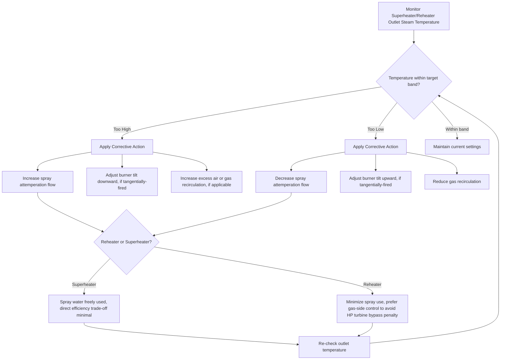

## Superheaters, Reheaters, and Economizers

### Overview: Heat Recovery and Steam Conditioning Train

Superheaters, reheaters, and economizers are convective/radiant heat transfer surfaces integrated into the boiler flue gas path, positioned to extract maximum useful energy from combustion gases at progressively decreasing temperature levels. Together they form the backbone of modern high-efficiency steam generator design, directly enabling the Rankine cycle efficiency improvements associated with high steam temperature and heat recovery.

**Key Points**

- Superheater: raises saturated steam temperature above saturation point before it enters the turbine (or process use).
- Reheater: raises the temperature of partially-expanded steam returning from a high-pressure turbine stage, before it re-enters an intermediate-pressure stage.
- Economizer: recovers residual flue gas heat to preheat feedwater before it enters the boiler drum/circuit.
- All three exploit heat that would otherwise be lost, but each operates on a different fluid stream at a different point in the overall steam-water-flue gas system.

---

### Superheaters

#### Purpose and Thermodynamic Rationale

Saturated steam leaving the boiler drum is thermodynamically limited — increasing its energy content further requires either raising pressure (limited by drum/circuit design) or moving into the superheated region by adding sensible heat above the saturation temperature. Superheating provides two primary benefits:

1. **Increased cycle efficiency**: superheated steam entering a turbine carries more available energy (higher enthalpy) for a given mass flow and pressure, improving the Rankine cycle's mean temperature of heat addition and thus overall thermal efficiency, consistent with the general principle that higher average heat-addition temperature improves cycle efficiency (Carnot-analogous reasoning).
2. **Reduced turbine blade erosion**: as steam expands through turbine stages, it cools and its quality (dryness fraction) decreases; starting from a higher superheat temperature ensures that even after significant expansion, the exhaust steam quality (moisture content) remains within acceptable limits (typically kept above ~88-90% quality, i.e., below 10-12% moisture, at the low-pressure turbine exhaust [Inference: exact acceptable limits are turbine-manufacturer- and design-specific]), since liquid droplet impingement on rotating blades causes erosion damage over time.

#### Types of Superheaters by Heat Transfer Mode

- **Radiant superheaters**: positioned within or at the exit of the furnace where they receive substantial direct radiant heat transfer from the flame. A defining characteristic is that radiant superheater outlet steam temperature tends to **decrease** as boiler load increases, because at higher loads a larger, more luminous flame increases furnace radiant heat absorption in the waterwalls disproportionately, leaving relatively less radiant energy reaching the superheater per unit of steam flow — though [Inference] this exact load-dependent behavior varies with specific furnace and superheater geometry.
- **Convective superheaters**: positioned further downstream in the convective flue gas pass, receiving heat primarily via gas-side convection rather than radiation. These exhibit the opposite trend — outlet steam temperature tends to **increase** with boiler load, because higher load increases flue gas mass flow rate and velocity, enhancing convective heat transfer coefficient more than proportionally to the increase in steam flow requiring heating.
- **Combined (radiant-convective) superheaters**: many modern boiler designs deliberately combine both types in series specifically because their opposing load-response characteristics tend to cancel out, yielding a more stable, flatter steam outlet temperature profile across the boiler's operating load range — an important design strategy for maintaining consistent turbine inlet conditions.

#### Physical Configurations

- **Platen superheaters**: widely spaced, large panel-like tube arrangements positioned high in the furnace or furnace exit, oriented to withstand very high radiant heat flux while managing tube metal temperature and allowing ash/slag to fall through the wide spacing without excessive fouling in high-ash fuel applications (e.g., pulverized coal).
- **Pendant superheaters**: tube banks suspended vertically from the top of the boiler, hanging down into the gas path — a common convective superheater configuration that self-drains condensate during shutdown, reducing the risk of water hammer or tube damage on restart.
- **Horizontal (inverted-loop) superheaters**: tube banks arranged in horizontal runs, sometimes used where vertical space is constrained, though these can be more prone to condensate drainage issues on shutdown if not carefully designed with appropriate slope/drain provisions.

#### Steam Temperature Control

Because superheater outlet temperature varies with load, fuel condition, and excess air, active control mechanisms are typically employed to maintain steam temperature within the narrow band required by the turbine (excessive temperature risks material damage; insufficient temperature reduces efficiency and risks turbine moisture issues):

- **Desuperheating (attemperation)**: injecting a controlled spray of relatively cool feedwater (or condensate) directly into the steam flow between superheater stages, reducing steam temperature by absorbing latent/sensible heat as the injected water flashes to steam. This is the most common and responsive control method in modern boilers.
- **Gas flow/damper control**: adjustable dampers or gas recirculation systems can redirect a portion of flue gas flow to bypass or supplement heat transfer surfaces, shifting the balance of radiant versus convective heating.
- **Burner tilt (tangentially-fired boilers)**: in tangentially-fired furnace designs, burners can be mechanically tilted up or down, shifting the flame's vertical position and thereby altering the relative radiant heat absorption between the furnace waterwalls and the superheater/reheater sections above.
- **Excess air control**: adjusting combustion excess air affects flue gas mass flow and temperature profile, providing a secondary (less responsive) means of influencing convective superheater performance.

---

### Reheaters

#### Purpose and Thermodynamic Rationale

In a reheat Rankine cycle, steam expands partially through a high-pressure (HP) turbine section, is then routed back to the boiler for reheating (raising its temperature again, typically back to near the initial superheat temperature, though usually at a much lower pressure than the initial superheat stage), and then continues expansion through intermediate-pressure (IP) and low-pressure (LP) turbine sections.

- **Efficiency benefit**: reheating increases the average temperature at which heat is added in the latter portion of the expansion process, improving overall cycle efficiency compared to a single-expansion (non-reheat) cycle for the same maximum pressure and temperature limits.
- **Moisture reduction benefit**: without reheat, steam expanding from high initial pressure through a single continuous expansion to condenser pressure would reach unacceptably high moisture content at the LP turbine exhaust; reheating "dries out" the steam partway through expansion, allowing the overall expansion process to stay within acceptable moisture limits at final exhaust.
- **Double reheat**: some very high-efficiency (typically supercritical/ultra-supercritical) power plants employ a second reheat stage for further efficiency gain, though this adds significant capital cost and complexity, [Inference] generally justified only in the largest, most efficiency-critical utility installations given the diminishing incremental efficiency return relative to added complexity.

#### Design and Construction

Reheaters are constructed similarly to convective/radiant superheaters (tube banks in the flue gas path), but operate at significantly lower steam pressure than the superheater (since the steam has already partially expanded through the HP turbine), despite often targeting a similar or identical outlet temperature to the superheater (a design feature called "reheat temperature," commonly matched to or close to the main/primary superheat temperature in modern plants).

- Because reheat steam pressure is lower, reheater tubes can often use less expensive materials for a given temperature compared to the main superheater at the same location, though high-temperature reheater sections still require high-temperature alloy steels.
- Reheaters are similarly susceptible to load-dependent outlet temperature variation and employ similar control strategies (spray attemperation, though reheater spray is generally minimized where possible since — unlike superheater spray — reheater attemperation water bypasses the HP turbine entirely, representing a direct efficiency penalty; gas-side controls such as burner tilt or gas recirculation are often preferred as the primary reheat temperature control method for this reason).

**Example**: A supercritical coal-fired power plant might generate main steam at 250 bar/565°C, expand it through the HP turbine to roughly 45-50 bar, route it back through the reheater to raise its temperature back to 565°C at the now-lower pressure, and then expand it through the IP and LP turbine sections to condenser vacuum — the reheat step recovering efficiency that would otherwise be lost to the single-expansion moisture/efficiency penalty.

---

### Economizers

#### Purpose and Thermodynamic Rationale

An economizer is a heat exchanger positioned in the flue gas path after the primary boiler heat transfer surfaces (evaporator, and typically after superheater/reheater sections as well, where flue gas temperature has already dropped substantially), using residual flue gas heat to preheat feedwater before it enters the steam drum. This directly reduces the sensible heat load the boiler drum/evaporator section must otherwise supply, and — critically — reduces the flue gas temperature exiting to the stack, directly recovering energy that would otherwise be wasted.

$$\eta_{boiler} \text{ improvement} \approx \frac{\Delta T_{feedwater} \times \dot{m}_{fw} \times c_{p,water}}{\text{Total fuel heat input}}$$

[Inference] As a general rule of thumb frequently cited in boiler efficiency literature, each approximately 20-22°C (35-40°F) reduction in flue gas exit temperature achieved via the economizer corresponds to roughly a 1% improvement in overall boiler thermal efficiency, though this relationship depends on specific fuel, excess air level, and flue gas composition.

#### Types

- **Non-steaming economizers**: the most common configuration; feedwater remains entirely in the liquid phase throughout the economizer, simplifying design and avoiding two-phase flow considerations.
- **Steaming economizers**: designed to allow partial evaporation (a small percentage of steam quality) within the economizer tubes before the mixture enters the steam drum; requires more careful hydraulic and flow-stability design to avoid two-phase flow maldistribution or instability, but can extract slightly more heat from a given flue gas temperature range.

#### Construction

Economizers are typically constructed from bare or finned steel tubes (finning increases gas-side surface area, compensating for the relatively low gas-side heat transfer coefficient compared to the water-side), arranged in banks perpendicular to flue gas flow, often located immediately upstream of the air preheater in the overall flue gas heat recovery train.

- **Corrosion consideration**: if flue gas is cooled below its acid dew point (particularly relevant for sulfur-bearing fuels, where SO₃ combines with water vapor to form sulfuric acid vapor that condenses at a specific dew point temperature, typically 120-150°C depending on sulfur content and moisture), economizer tube surfaces can experience severe low-temperature corrosion. This constrains how much flue gas cooling (and thus efficiency gain) can practically be extracted by the economizer without corrosion-resistant materials or careful minimum-temperature control, particularly for higher-sulfur fuels like coal or heavy fuel oil.

---

### Integrated Flue Gas Heat Recovery Train

The typical arrangement of these components along the flue gas path, from hottest to coolest gas temperature, reflects a deliberate design logic: extract the highest-value (highest exergy) heat first for the highest-value use (steam superheat/reheat for power generation), then progressively lower-value heat for lower-grade uses (feedwater preheating, then combustion air preheating) as gas temperature drops.

1. **Furnace/waterwalls** (highest temperature, radiant) — primary steam generation (evaporation)
2. **Superheater** (radiant/convective) — raise main steam temperature
3. **Reheater** (convective) — raise reheat steam temperature
4. **Economizer** (convective, cooler gas) — preheat feedwater
5. **Air preheater** (lowest useful temperature, convective) — preheat combustion air

This sequencing follows the general principle that the highest-temperature (highest-exergy) heat should be matched to the highest-temperature-requiring process (steam generation/superheat), progressively cascading down to lower-temperature uses — a concept directly related to pinch analysis and exergy-based heat integration principles applied at the level of a single boiler's internal heat recovery train.

---

### Comparative Summary

| Component | Fluid Heated | Position in Gas Path | Primary Benefit | Key Constraint |
| --- | --- | --- | --- | --- |
| Superheater | Main steam | High-temp zone (radiant/convective) | Cycle efficiency, turbine erosion protection | Tube metal temperature limits, load-dependent outlet temp |
| Reheater | Cold reheat steam (post-HP turbine) | High-temp convective zone | Cycle efficiency, moisture reduction | Attemperation efficiency penalty, tube metal limits |
| Economizer | Feedwater | Cooler convective zone | Reduce stack loss, improve efficiency | Acid dew point corrosion limit |

---

### Heat Recovery Train Schematic (svg_diagram)

<svg xmlns="http://www.w3.org/2000/svg" viewBox="0 0 800 380">
<text x="400" y="25" font-size="16" font-weight="bold" text-anchor="middle" fill="#1a1a1a">Boiler Flue Gas Heat Recovery Train (svg_diagram)</text>

<line x1="60" y1="60" x2="60" y2="320" stroke="#333" stroke-width="2" />
<text x="30" y="190" font-size="12" text-anchor="middle" fill="#1a1a1a" transform="rotate(-90 30 190)">Flue Gas Temperature (decreasing downward)</text>

<rect x="100" y="60" width="120" height="50" fill="#fdecec" stroke="#c0392b" stroke-width="2" />
<text x="160" y="90" font-size="12" text-anchor="middle" fill="#c0392b" font-weight="bold">Furnace / Waterwalls</text>
<text x="160" y="123" font-size="10" text-anchor="middle" fill="#1a1a1a">~1300-1600°C</text>

<rect x="100" y="140" width="120" height="45" fill="#fde3e3" stroke="#e74c3c" stroke-width="2" />
<text x="160" y="167" font-size="12" text-anchor="middle" fill="#e74c3c" font-weight="bold">Superheater</text>
<text x="160" y="198" font-size="10" text-anchor="middle" fill="#1a1a1a">~900-1100°C</text>

<rect x="100" y="215" width="120" height="40" fill="#fdece0" stroke="#e67e22" stroke-width="2" />
<text x="160" y="240" font-size="12" text-anchor="middle" fill="#e67e22" font-weight="bold">Reheater</text>
<text x="160" y="268" font-size="10" text-anchor="middle" fill="#1a1a1a">~700-900°C</text>

<rect x="100" y="285" width="120" height="35" fill="#eaf2fb" stroke="#2980b9" stroke-width="2" />
<text x="160" y="307" font-size="12" text-anchor="middle" fill="#2980b9" font-weight="bold">Economizer</text>

<line x1="260" y1="70" x2="260" y2="310" stroke="#7f8c8d" stroke-width="3" />
<polygon points="252,300 260,318 268,300" fill="#7f8c8d" />
<text x="290" y="190" font-size="11" fill="#7f8c8d" transform="rotate(-90 290 190)">Flue gas flow direction</text>

<rect x="340" y="285" width="130" height="35" fill="#eafaf1" stroke="#27ae60" stroke-width="2" />
<text x="405" y="307" font-size="12" text-anchor="middle" fill="#27ae60" font-weight="bold">Air Preheater</text>
<text x="405" y="335" font-size="10" text-anchor="middle" fill="#1a1a1a">~150-180°C exit to stack</text>
<line x1="230" y1="302" x2="340" y2="302" stroke="#7f8c8d" stroke-width="2" />
<polygon points="330,296 342,302 330,308" fill="#7f8c8d" />

<text x="560" y="90" font-size="11" fill="`#c0392b`">← Waterwall tubes (evaporation)</text>

<line x1="220" y1="85" x2="540" y2="85" stroke="`#c0392b`" stroke-width="1" stroke-dasharray="3,2" />

<text x="560" y="165" font-size="11" fill="`#e74c3c`">← Main steam to HP turbine</text>

<line x1="220" y1="160" x2="540" y2="160" stroke="`#e74c3c`" stroke-width="1" stroke-dasharray="3,2" />

<text x="560" y="238" font-size="11" fill="`#e67e22`">← Cold reheat in / Hot reheat out to IP turbine</text>

<line x1="220" y1="233" x2="540" y2="233" stroke="`#e67e22`" stroke-width="1" stroke-dasharray="3,2" />

<text x="560" y="303" font-size="11" fill="`#2980b9`">← Feedwater from deaerator to drum</text>

<line x1="220" y1="298" x2="540" y2="298" stroke="`#2980b9`" stroke-width="1" stroke-dasharray="3,2" />

<text x="560" y="358" font-size="11" fill="`#27ae60`">← Combustion air from FD fan to burners</text>

<line x1="470" y1="303" x2="540" y2="303" stroke="`#27ae60`" stroke-width="1" stroke-dasharray="3,2" />

</svg>

---

### Temperature Control Decision Flow

---

### Worked Example: Economizer Efficiency Gain Estimate

**Problem**: A boiler's flue gas exits the main heat transfer surfaces at 280°C. Installing an economizer reduces this to 160°C before the air preheater. Using the rule-of-thumb that each ~21°C reduction corresponds to roughly 1% efficiency gain, estimate the efficiency improvement.

**Solution outline**:

1. Temperature reduction achieved: $280 - 160 = 120°C$
2. Estimated efficiency gain: $\dfrac{120}{21} \approx 5.7\%$

**Output**: The economizer is estimated to improve overall boiler thermal efficiency by approximately 5.7 percentage points [Inference: this is a simplified rule-of-thumb estimate; precise efficiency gain requires a full heat balance calculation incorporating fuel composition, excess air, and actual feedwater temperature rise achieved].

**Conclusion**

Superheaters, reheaters, and economizers together transform a basic steam-generating boiler into a high-efficiency power generation system by systematically capturing and applying flue gas heat at successively appropriate temperature levels — superheat and reheat improving cycle efficiency and protecting turbine blades, and the economizer recovering otherwise-wasted stack heat to reduce fuel consumption. Their integrated design, along with active temperature control strategies, is central to modern boiler and power plant thermal performance.

**Related Topics**

- Rankine cycle with reheat: thermodynamic analysis and efficiency gains
- Spray attemperation control system design
- Acid dew point corrosion and cold-end corrosion protection
- Air preheater types: recuperative vs. regenerative (Ljungström)
- Tangentially-fired boiler burner tilt control systems
- Boiler efficiency calculation: direct and indirect (heat loss) methods
- Pinch analysis and heat integration principles applied to boiler design