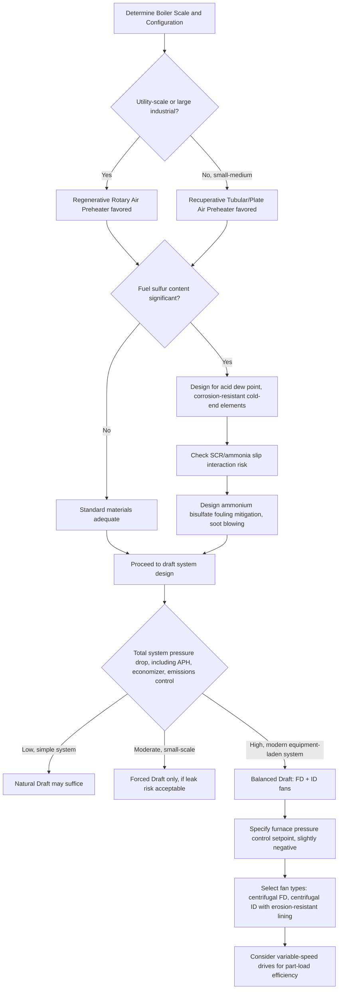

## Air Preheaters and Draft Systems

### Overview

Air preheaters recover residual flue gas heat to warm incoming combustion air, while draft systems provide the pressure differential necessary to move air into the furnace and exhaust flue gas out through the stack. Together they govern combustion efficiency, boiler thermal performance, and the safe, controlled movement of gas through the entire boiler flue gas path from intake to stack discharge.

**Key Points**

- Air preheaters improve combustion efficiency and boiler thermal efficiency by transferring otherwise-wasted flue gas heat to combustion air.
- Draft systems (natural, forced, induced, balanced) establish the pressure gradient that drives airflow through the furnace and flue gas path.
- These two systems are functionally coupled: air preheater pressure drop directly affects draft system fan sizing and power requirements.

---

### Air Preheaters

#### Purpose and Thermodynamic Benefit

An air preheater is positioned at the coldest end of the flue gas heat recovery train (after the economizer, where gas temperature has already been substantially reduced), extracting further residual heat to warm incoming combustion air before it reaches the burners.

- **Combustion efficiency improvement**: preheated air improves flame ignition stability, promotes more complete combustion (particularly important for lower-grade or harder-to-ignite fuels such as high-moisture coal, biomass, or heavy fuel oil), and can allow operation with lower excess air, further improving efficiency.
- **Overall boiler efficiency improvement**: like the economizer, the air preheater reduces stack flue gas exit temperature, directly recovering heat that would otherwise be lost. [Inference] A commonly cited rule of thumb is that each ~20-22°C reduction in flue gas exit temperature corresponds to roughly a 1% improvement in overall boiler efficiency, applicable to air preheater performance in the same way as economizer performance, though the exact relationship depends on fuel type and excess air level.
- **Fuel-specific importance**: air preheating is particularly critical for fuels with high moisture content (e.g., lignite, biomass, bagasse) or high ignition temperature requirements, where preheated combustion air can be essential for achieving stable, self-sustaining combustion.

#### Types of Air Preheaters

**Recuperative (Tubular or Plate) Air Preheaters**

Continuous, non-moving heat exchangers where flue gas and combustion air flow through separate, fixed passages (tubes or plates) with heat conducted through the separating wall — analogous in principle to a conventional shell-and-tube or plate heat exchanger, but designed for gas-to-gas service.

- **Tubular type**: flue gas typically flows inside vertical tubes while combustion air flows across the tube bundle externally (crossflow arrangement), or vice versa depending on design; simple, robust, and tolerant of some fouling, though gas-to-gas heat transfer coefficients are inherently low, requiring large surface area.
- **Plate type**: thin corrugated plates separate alternating flue gas and air channels; more compact than tubular designs for a given duty but can be more susceptible to fouling and more difficult to clean mechanically.
- No moving parts (other than potentially soot-blowing equipment), making recuperative types mechanically simple and reliable, but generally larger and heavier per unit of heat recovered than regenerative designs.

**Regenerative Air Preheaters**

Use an intermediate heat-storage medium (a rotating or moving matrix of metal plates/baskets) that alternately absorbs heat from the hot flue gas stream and releases it to the cooler combustion air stream as the matrix rotates or moves between the two gas streams.

- **Ljungström-type rotary regenerative preheater**: the most common design in large utility boilers — a rotating cylindrical matrix (heating element baskets, often multi-layer corrugated metal plate elements) rotates slowly (typically a few revolutions per minute) through a duct divided into a flue gas sector and an air sector by sealing plates. As each matrix section passes through the hot flue gas sector, it absorbs heat; as it rotates into the air sector, it releases that stored heat to the incoming combustion air.
- **Rothemuhle-type**: a variant where the heating element matrix remains stationary while rotating air/gas ducts (hoods) sweep across it — sometimes preferred for very large boilers where a rotating full-diameter matrix becomes mechanically impractical.
- **Advantages**: more compact and generally lower capital cost per unit of heat transfer than recuperative designs for large-scale applications, making them the dominant choice in utility-scale boilers.
- **Key operational challenges**:
  - **Air-to-gas leakage**: because rotating (or moving) components inherently cannot achieve a perfect seal between the air and gas sectors, some direct leakage of higher-pressure combustion air into the lower-pressure flue gas stream is unavoidable (typically monitored and quantified as a leakage percentage); excessive leakage reduces both combustion air delivered to the furnace and overall thermal performance, and requires oversizing the forced draft fan to compensate.
  - **Cold-end corrosion and fouling**: the coldest sections of the rotating matrix (where flue gas exits at its lowest temperature) are most susceptible to acid dew point corrosion (from SO₃/H₂SO₄ condensation, particularly with sulfur-bearing fuels) and ammonium bisulfate fouling/plugging (particularly relevant in boilers with SCR NOx control systems, where residual ammonia slip reacts with SO₃ to form sticky ammonium bisulfate deposits that can severely foul and plug the cold-end matrix elements).
  - **Fire risk**: accumulated combustible deposits (unburned carbon, soot) on the matrix elements can smolder and ignite, particularly during startup/shutdown transients when normal gas flow (which typically limits smoldering) is reduced — a recognized and actively managed operational hazard in large regenerative air preheaters, addressed through soot blowing, water washing, and fire detection/suppression systems.

#### Design and Performance Considerations

- **Approach temperature and heat recovery limit**: air preheater performance is fundamentally limited by the acid dew point of the flue gas (for sulfur-bearing fuels), since cooling flue gas below this temperature causes severe corrosion; this establishes a practical minimum flue gas exit temperature (commonly in the range of 120-160°C depending on fuel sulfur content [Inference: specific values are highly fuel- and design-dependent]).
- **Pressure drop**: both recuperative and regenerative air preheaters introduce meaningful pressure drop on both the air and gas sides, which must be accounted for in forced draft (FD) fan and induced draft (ID) fan sizing.
- **Materials**: cold-end elements are often constructed from corrosion-resistant enameled or specially coated steel to withstand acid condensation, while hot-end elements use standard carbon steel since they operate above the acid dew point.

---

### Draft Systems

#### Purpose and Fundamentals

Draft refers to the pressure difference that causes air and flue gas to flow through the furnace, boiler heat transfer surfaces, and out the stack. Draft can be generated naturally (via the stack's buoyancy effect) or mechanically (via fans), and the choice/combination of draft type fundamentally shapes the pressure profile throughout the entire boiler flue gas path.

$$\Delta P_{stack} = h \, g \, (\rho_{air} - \rho_{gas})$$

where $h$ is stack height, and $\rho_{air}$, $\rho_{gas}$ are ambient air and hot flue gas densities respectively — the natural draft driving force arising from the density difference between the (denser, cooler) ambient air column outside the stack and the (less dense, hotter) flue gas column inside it.

#### Natural Draft

Relies solely on the buoyancy-driven pressure difference created by a sufficiently tall stack, with no mechanical fans. Historically common in small, simple boiler installations (e.g., small industrial boilers, older power plants) where stack height could be made tall enough to generate adequate draft for the required flow resistance.

- **Advantages**: no fan power consumption, mechanical simplicity, high reliability (no moving parts to fail).
- **Limitations**: draft magnitude is limited by achievable stack height and is highly sensitive to ambient temperature and atmospheric conditions (draft is stronger in cold weather due to greater density difference, weaker in hot weather) — making natural draft alone inadequate for modern high-capacity, high-pressure-drop boiler designs incorporating economizers, air preheaters, and emissions control equipment, all of which add substantial flow resistance that natural draft alone typically cannot overcome.

#### Forced Draft (FD)

A fan (forced draft fan) located upstream of the furnace pushes combustion air through the air preheater and into the furnace under positive pressure, with the furnace and downstream gas path operating at pressure above atmospheric.

- **Advantages**: mechanically simpler fan arrangement (handling cooler, cleaner air rather than hot, particulate-laden flue gas), generally lower maintenance than induced draft fans handling dirty gas.
- **Limitation**: if used alone (without an induced draft fan), the entire furnace and flue gas path operates under positive pressure, increasing the risk of hot flue gas leakage outward through any furnace wall or ductwork imperfections — a safety and environmental concern (gas leakage, potential for personnel exposure to combustion gases) that limits pure forced-draft operation to smaller or well-sealed installations.

#### Induced Draft (ID)

A fan (induced draft fan) located downstream of the boiler (typically just before the stack, after all heat transfer surfaces, air preheater, and emissions control equipment) pulls flue gas through the system, with the furnace and gas path operating under negative pressure (below atmospheric) relative to ambient.

- **Advantages**: negative furnace pressure prevents outward flue gas leakage (any leakage tends to be inward air infiltration rather than outward hot gas escape), providing a safety and environmental advantage.
- **Limitations**: the ID fan must handle hot, particulate-laden, potentially corrosive flue gas (rather than clean ambient air), requiring more robust (and typically larger, since gas volume increases with temperature) fan construction, and generally higher maintenance due to erosive/corrosive gas-side conditions.

#### Balanced Draft

The most common configuration in modern boilers, combining both a forced draft fan (pushing combustion air in) and an induced draft fan (pulling flue gas out), with the furnace pressure controlled to a slightly negative value relative to atmospheric — balancing the advantages of both approaches.

- **Furnace pressure control**: a control system (traditionally using furnace pressure transmitters and modulating ID/FD fan speed or inlet vane position) maintains furnace pressure at a small negative setpoint (commonly on the order of a few millimeters of water column below atmospheric), tight enough to prevent significant outward leakage but not so negative as to cause excessive inward air infiltration (which would reduce combustion efficiency and control precision).
- **Advantages**: provides the safety benefit of negative furnace pressure (no outward hot gas leakage) while sharing the total pressure-rise burden between two fans (reducing the size/power requirement of any single fan compared to a single-fan system covering the entire pressure drop), and enables more precise, responsive furnace pressure control via coordinated modulation of both fans.
- **Standard in modern utility and large industrial boilers**, particularly those incorporating substantial flow resistance from economizers, air preheaters, and downstream emissions control equipment (electrostatic precipitators, baghouses, flue gas desulfurization, SCR systems) — all of which add pressure drop that natural draft or a single fan type typically cannot economically overcome alone.

#### Draft Fan Types

- **Centrifugal fans**: most common for both FD and ID service; robust, well-suited to handling the required pressure rise and volume flow, available in various blade configurations (radial, backward-curved, forward-curved) optimized for clean air (FD) versus particulate-laden gas (ID) service.
- **Axial fans**: sometimes used for FD service (particularly where higher efficiency at lower pressure rise is beneficial) but less common for ID service due to erosion sensitivity in particulate-laden flue gas.
- **Variable-speed drives (VSDs)**: increasingly used on both FD and ID fans to improve part-load efficiency and provide finer furnace pressure/airflow control compared to traditional inlet vane or damper-based flow control, which incurs throttling losses at reduced load.

---

### Comparative Summary

| Aspect | Air Preheater (Recuperative) | Air Preheater (Regenerative) | Natural Draft | Forced Draft | Induced Draft | Balanced Draft |
| --- | --- | --- | --- | --- | --- | --- |
| Moving parts | None | Rotating/moving matrix | None | Fan (clean air) | Fan (dirty gas) | Two fans |
| Typical scale | Small-medium boilers | Large utility boilers | Small, simple boilers | Small-medium boilers | Rarely used alone | Modern large boilers |
| Key risk | Fouling, low gas-side h | Leakage, cold-end corrosion, fire risk | Weather-dependent, inadequate for modern systems | Positive furnace pressure leakage | Fan erosion/corrosion | Requires coordinated control |
| Furnace pressure | N/A | N/A | Slightly negative | Positive | Negative | Slightly negative (controlled) |

---

### Draft System Pressure Profile (svg_diagram)

<svg xmlns="http://www.w3.org/2000/svg" viewBox="0 0 800 400">
<text x="400" y="25" font-size="16" font-weight="bold" text-anchor="middle" fill="#1a1a1a">Balanced Draft System — Pressure Profile Along Gas Path (svg_diagram)</text>

<line x1="60" y1="200" x2="740" y2="200" stroke="#333" stroke-width="1.5" stroke-dasharray="5,3" />
<text x="60" y="195" font-size="11" fill="#1a1a1a">Atmospheric (0)</text>

<path d="M 100 260 L 200 195 L 350 230 L 480 250 L 600 235 L 700 200" fill="none" stroke="`#8e44ad`" stroke-width="3" />

<circle cx="100" cy="260" r="8" fill="#2980b9" />
<text x="100" y="290" font-size="11" text-anchor="middle" fill="#2980b9" font-weight="bold">FD Fan</text>
<text x="100" y="305" font-size="10" text-anchor="middle" fill="#1a1a1a">(+pressure)</text>

<circle cx="200" cy="195" r="6" fill="#27ae60" />
<text x="200" y="180" font-size="10" text-anchor="middle" fill="#27ae60">Air Preheater</text>
<text x="200" y="315" font-size="10" text-anchor="middle" fill="#1a1a1a">(≈ atm)</text>

<circle cx="350" cy="230" r="6" fill="#c0392b" />
<text x="350" y="215" font-size="10" text-anchor="middle" fill="#c0392b">Furnace</text>
<text x="350" y="325" font-size="10" text-anchor="middle" fill="#1a1a1a">(slightly negative, controlled)</text>

<circle cx="480" cy="250" r="6" fill="#e67e22" />
<text x="480" y="235" font-size="10" text-anchor="middle" fill="#e67e22">Convective/Economizer</text>
<text x="480" y="325" font-size="10" text-anchor="middle" fill="#1a1a1a">(negative)</text>

<circle cx="600" cy="235" r="6" fill="#7f8c8d" />
<text x="600" y="220" font-size="10" text-anchor="middle" fill="#7f8c8d">Emissions Control</text>
<text x="600" y="325" font-size="10" text-anchor="middle" fill="#1a1a1a">(negative)</text>

<circle cx="700" cy="200" r="8" fill="#8e44ad" />
<text x="700" y="185" font-size="11" text-anchor="middle" fill="#8e44ad" font-weight="bold">ID Fan → Stack</text>
<text x="700" y="315" font-size="10" text-anchor="middle" fill="#1a1a1a">(returns to atm)</text>

<text x="30" y="200" font-size="12" text-anchor="middle" fill="`#1a1a1a`" transform="rotate(-90 30 200)">Static Pressure</text>

<text x="400" y="370" font-size="12" text-anchor="middle" fill="`#1a1a1a`">Gas Path Position: FD Fan → Air Preheater → Furnace → Convective Section → Emissions Control → ID Fan → Stack</text>

</svg>

---

### Air Preheater and Draft System Selection Flow

---

### Operational Note: Ammonium Bisulfate Fouling in Modern Boilers

[Inference] With the widespread adoption of Selective Catalytic Reduction (SCR) NOx control systems in coal- and oil-fired power plants, a specific fouling mechanism has become increasingly significant in downstream air preheaters: unreacted ammonia ("ammonia slip") from the SCR reacts with SO₃ in the flue gas to form ammonium bisulfate, a sticky, corrosive compound that condenses and accumulates preferentially in the coldest sections of the air preheater matrix (regenerative types) or tube surfaces (recuperative types), causing both severe fouling (increased pressure drop, reduced heat transfer) and accelerated corrosion. This has driven increased attention to SCR ammonia slip control, air preheater cold-end material selection, and more frequent/effective soot blowing and water washing regimes in modern coal-fired plant design and operation.

**Related Topics**

- Selective Catalytic Reduction (SCR) NOx control and ammonia slip management
- Acid dew point corrosion mechanisms and cold-end protection strategies
- Fan selection, sizing, and variable-speed drive control for FD/ID service
- Furnace pressure control systems and combustion control loops
- Flue gas desulfurization (FGD) and particulate control equipment pressure drop
- Boiler efficiency calculation: stack loss and combustion efficiency methods
- Tangentially-fired and wall-fired burner combustion air distribution