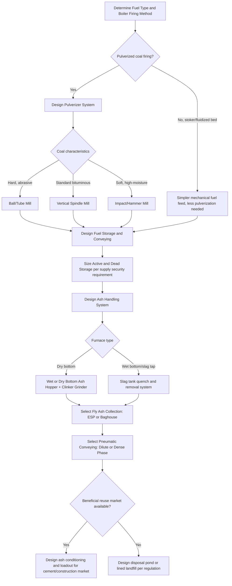

## Fuel Handling and Ash Handling Systems

### Overview

Fuel handling and ash handling systems are the material logistics backbone of solid-fuel-fired boiler plants (predominantly coal, but also biomass, petcoke, and municipal solid waste), responsible for receiving, storing, preparing, and delivering fuel to the furnace at the required rate and specification, and for collecting, transporting, and disposing of (or utilizing) the resulting combustion residues. These systems, while less thermodynamically prominent than the boiler itself, are critical to plant availability, since fuel or ash handling failures are common causes of unplanned outages.

**Key Points**

- Fuel handling encompasses unloading, storage, reclaiming, crushing/pulverizing, and metered delivery to burners.
- Ash handling encompasses collection of both bottom ash (furnace floor) and fly ash (entrained in flue gas), followed by transport, storage, and disposal or beneficial reuse.
- Both systems must be sized for continuous, reliable operation matching the boiler's full fuel throughput and ash generation rate, with adequate redundancy given their criticality to sustained plant operation.

---

### Fuel Handling Systems

#### Fuel Receiving and Unloading

Solid fuel (typically coal) arrives at a plant by rail, truck, barge, or conveyor from an adjacent mine, and must be unloaded efficiently to avoid delivery bottlenecks.

- **Rail unloading**: rotary car dumpers (which invert entire rail cars to dump coal) or bottom-dump hopper cars discharging directly into receiving hoppers are common for large-scale unit-train coal delivery to utility plants.
- **Truck unloading**: dump trucks discharge into receiving hoppers or directly onto stockpiles for smaller-scale operations.
- **Barge/ship unloading**: continuous ship unloaders (bucket-wheel or grab-bucket types) or pneumatic conveying systems handle waterborne coal delivery at coastal or riverine plants.

#### Storage

- **Active (live) storage**: silos or bunkers providing immediate feed to the pulverizers/mills, sized to provide a buffer (commonly hours to a day or more of full-load fuel supply) against short-term interruptions in the fuel supply chain.
- **Dead (reserve) storage**: large outdoor stockpiles providing longer-term fuel security (weeks to months of supply), protecting against extended supply disruptions (transportation strikes, mine outages, severe weather).
- **Stockpile management concerns**: coal stockpiles are subject to spontaneous combustion risk (from slow oxidation generating heat that can accumulate if not dissipated, particularly in high-volatile or high-sulfur coals), requiring compaction, moisture control, and temperature monitoring to mitigate; dust generation and control (water sprays, wind screens) is also a significant environmental and safety concern at open stockpiles.

#### Reclaiming and Conveying

- **Stacker-reclaimers**: mobile equipment that both builds stockpiles (stacking) and recovers fuel from them (reclaiming) via bucket-wheel or scraper mechanisms, feeding reclaimed coal onto conveyor systems.
- **Belt conveyors**: the dominant method for bulk fuel transport within the plant, moving coal from storage to crushing/pulverizing equipment and ultimately to boiler bunkers; equipped with magnetic separators (removing tramp iron that could damage downstream crushers/pulverizers) and belt scales (for continuous fuel flow measurement and combustion control input).
- **Crushers**: reduce raw coal (as received, potentially with lumps up to several hundred millimeters) to a size suitable for pulverizer feed (typically below 25-50 mm), using ring-granulator, hammer, or roll crushers depending on coal characteristics.

#### Pulverization (Coal Preparation for Firing)

For pulverized-coal-fired boilers (the dominant technology for large utility coal plants), coal must be ground to a fine powder (typically 70-80% passing a 200-mesh sieve, roughly 74 microns [Inference: fineness specification varies by coal type and burner design]) to achieve rapid, complete combustion when injected into the furnace.

- **Ball-and-tube mills**: rotating cylindrical drums containing steel balls that grind coal through tumbling impact and attrition; robust and tolerant of hard, abrasive coals, but relatively high power consumption and slower response to load changes compared to other mill types.
- **Vertical spindle (bowl) mills**: coal is crushed between a rotating bowl and stationary or rotating rollers, with hot primary air simultaneously drying and conveying the pulverized coal upward through a classifier; more compact and generally more responsive to load changes than ball mills, widely used in modern utility boilers.
- **Impact/hammer mills**: use high-speed rotating hammers to pulverize coal via impact, often used for softer, more friable coals or biomass fuels.
- **Primary air system**: hot air (drawn from the air preheater or a dedicated source) both dries the coal within the mill (removing surface moisture, improving combustion) and pneumatically conveys the pulverized coal-air mixture from the mill through coal pipes to the burners.
- **Classifiers**: separate adequately fine coal particles (which exit to the burners) from oversized particles (which are returned to the grinding zone for further pulverization), integrated into or immediately following the mill.

#### Fuel Delivery to Burners

Pulverized coal is pneumatically conveyed through coal pipes from each mill to its associated burners, with flow balance across multiple burner pipes from a single mill being an important design and operational consideration (uneven distribution can cause localized combustion issues, slagging, or unburned carbon variation across the furnace).

**Example**: A large utility boiler might employ 6-8 vertical spindle mills, each feeding 4-6 burners through individual coal pipes, with mill outlet temperature, primary airflow, and classifier settings actively controlled to maintain both the required coal fineness and the correct fuel-air ratio delivered to each burner zone.

---

### Ash Handling Systems

#### Ash Generation and Types

Combustion of solid fuel (particularly coal) produces mineral residue (ash) partitioned between two streams based on particle size and behavior in the furnace/flue gas path:

- **Bottom ash**: heavier ash particles and agglomerates that fall to the bottom of the furnace (or, in wet-bottom/slag-tap furnaces, molten slag that is tapped off), typically comprising roughly 10-20% of total ash generated in a dry-bottom pulverized-coal boiler [Inference: proportion varies significantly with coal ash characteristics and furnace design].
- **Fly ash**: finer ash particles entrained in the flue gas stream, carried through the boiler convective sections and captured by downstream particulate control equipment (electrostatic precipitators, baghouses); typically comprises the majority (roughly 80-90%) of total ash in dry-bottom pulverized-coal firing.

#### Bottom Ash Handling

- **Wet bottom ash handling**: bottom ash falls into a water-filled hopper beneath the furnace, where it is quenched (rapid cooling causing thermal shock that helps break up clinkers) and then removed via mechanical drag chain conveyors, hydraulic sluicing (water jets transporting ash as a slurry to a settling pond or dewatering bin), or submerged scraper conveyors.
- **Dry bottom ash handling**: increasingly adopted in modern plants (particularly to reduce water consumption and enable easier ash beneficial use), using mechanical conveyors (drag chain, vibrating, or belt) to remove and transport bottom ash without water quenching, often incorporating air or mechanical cooling of the ash before conveying.
- **Clinker grinders**: mechanical crushers positioned in the bottom ash removal path to break up larger clinker agglomerates into a size suitable for conveying and disposal/handling equipment.

#### Fly Ash Handling

- **Collection**: fly ash is captured from flue gas primarily by electrostatic precipitators (ESPs, using charged plates to attract and collect charged ash particles) or fabric filter baghouses (mechanically filtering ash through fabric bags), typically achieving collection efficiencies exceeding 99% [Inference: exact efficiency depends on specific equipment design, ash resistivity characteristics, and regulatory requirements].
- **Pneumatic conveying**: collected fly ash (a fine, free-flowing powder) is most commonly transported from collection hoppers to storage silos using pneumatic conveying systems — either **dilute phase** (high air velocity, low ash concentration, simpler but higher power consumption) or **dense phase** (lower air velocity, higher ash concentration, more energy-efficient but requiring more sophisticated conveying equipment and control).
- **Storage silos**: fly ash is stored in dedicated silos equipped with conditioning systems (adding controlled moisture to prevent dusting during subsequent truck loading and transport) before disposal or beneficial reuse.
- **Vacuum conveying**: an alternative to pressure pneumatic conveying, using vacuum to draw fly ash from multiple collection points to a central storage point; can be advantageous for handling ash from multiple, dispersed collection hoppers.

#### Ash Disposal and Beneficial Use

- **Landfill disposal**: historically the dominant disposal method, requiring engineered ash disposal ponds (for wet-handled ash) or lined landfills (for dry-handled ash) designed to prevent groundwater contamination, subject to increasingly stringent environmental regulation in most jurisdictions.
- **Beneficial reuse**: fly ash, in particular, has significant commercial value as a partial replacement for portland cement in concrete production (exploiting its pozzolanic properties), as well as applications in structural fill, road base construction, and other construction materials. [Inference] The proportion of fly ash beneficially reused versus landfilled varies substantially by region, regulatory environment, and local market demand for ash-based construction products, with some regions achieving high reuse rates while others rely predominantly on disposal.
- **Bottom ash reuse**: also has some beneficial use applications (e.g., as a lightweight aggregate or in specific construction applications), though generally with less market value and lower reuse rates than fly ash due to its coarser, less uniform characteristics.

---

### Integrated Fuel and Ash Handling Flow

**Example**: In a typical pulverized-coal utility boiler, the overall material flow proceeds: rail/barge delivery → rotary dumper/unloader → dead storage stockpile → reclaim conveyor → active storage bunker → crusher → pulverizer mill (with primary air drying/conveying) → burner injection → combustion in furnace → bottom ash falls to wet/dry hopper for mechanical/hydraulic removal → flue gas carries fly ash through convective sections → ESP/baghouse captures fly ash → pneumatic conveying to fly ash silo → truck/rail loadout for disposal or beneficial reuse.

---

### Comparative Summary

| System | Key Equipment | Primary Design Concern |
| --- | --- | --- |
| Fuel receiving/unloading | Rotary dumpers, ship unloaders | Delivery rate matching plant consumption |
| Fuel storage | Silos, bunkers, stockpiles | Spontaneous combustion, dust control, supply security |
| Fuel conveying | Belt conveyors, stacker-reclaimers | Reliability, tramp metal removal |
| Pulverization | Ball/tube mills, vertical spindle mills | Fineness specification, primary air drying/conveying |
| Bottom ash handling | Wet hoppers, drag chain conveyors, clinker grinders | Clinker size reduction, water consumption (wet systems) |
| Fly ash handling | ESP/baghouse, pneumatic conveying, storage silos | Collection efficiency, dust control, conveying energy |
| Ash disposal/reuse | Landfills, disposal ponds, cement/construction markets | Environmental compliance, beneficial use market value |

---

### Fuel and Ash Handling System Flow (svg_diagram)

<svg xmlns="http://www.w3.org/2000/svg" viewBox="0 0 800 460">
<text x="400" y="25" font-size="16" font-weight="bold" text-anchor="middle" fill="#1a1a1a">Fuel and Ash Handling System — Material Flow (svg_diagram)</text>

<text x="130" y="55" font-size="13" font-weight="bold" fill="`#e67e22`">Fuel Handling</text>

<rect x="40" y="65" width="100" height="40" fill="`#fdf2e3`" stroke="`#e67e22`" stroke-width="2" />

<text x="90" y="90" font-size="10" text-anchor="middle">Unloading (rail/barge)</text>

<rect x="170" y="65" width="100" height="40" fill="#fdf2e3" stroke="#e67e22" stroke-width="2" />
<text x="220" y="90" font-size="10" text-anchor="middle">Storage (bunker/stockpile)</text>
<rect x="300" y="65" width="100" height="40" fill="#fdf2e3" stroke="#e67e22" stroke-width="2" />
<text x="350" y="85" font-size="10" text-anchor="middle">Crusher /</text>
<text x="350" y="97" font-size="10" text-anchor="middle">Conveyor</text>
<rect x="430" y="65" width="100" height="40" fill="#fdf2e3" stroke="#e67e22" stroke-width="2" />
<text x="480" y="85" font-size="10" text-anchor="middle">Pulverizer</text>
<text x="480" y="97" font-size="10" text-anchor="middle">(Mill)</text>

<line x1="140" y1="85" x2="168" y2="85" stroke="#e67e22" stroke-width="2" />
<polygon points="163,80 172,85 163,90" fill="#e67e22" />
<line x1="270" y1="85" x2="298" y2="85" stroke="#e67e22" stroke-width="2" />
<polygon points="293,80 302,85 293,90" fill="#e67e22" />
<line x1="400" y1="85" x2="428" y2="85" stroke="#e67e22" stroke-width="2" />
<polygon points="423,80 432,85 423,90" fill="#e67e22" />

<rect x="580" y="55" width="160" height="120" fill="#fdecec" stroke="#c0392b" stroke-width="2" />
<text x="660" y="80" font-size="13" font-weight="bold" text-anchor="middle" fill="#c0392b">Furnace</text>
<text x="660" y="98" font-size="10" text-anchor="middle">(combustion)</text>
<line x1="530" y1="85" x2="578" y2="85" stroke="#e67e22" stroke-width="2" />
<polygon points="573,80 582,85 573,90" fill="#e67e22" />
<text x="555" y="75" font-size="9" fill="#1a1a1a">via burners</text>

<line x1="660" y1="175" x2="660" y2="230" stroke="#7f8c8d" stroke-width="2" />
<polygon points="655,222 660,235 665,222" fill="#7f8c8d" />
<text x="700" y="200" font-size="10" fill="#7f8c8d">Flue gas</text>
<rect x="580" y="235" width="160" height="40" fill="#eaf2fb" stroke="#2980b9" stroke-width="2" />
<text x="660" y="260" font-size="11" text-anchor="middle" fill="#2980b9">ESP / Baghouse</text>

<line x1="660" y1="275" x2="660" y2="310" stroke="#2980b9" stroke-width="2" />
<polygon points="655,302 660,315 665,302" fill="#2980b9" />
<rect x="580" y="315" width="160" height="40" fill="#eaf2fb" stroke="#2980b9" stroke-width="2" />
<text x="660" y="340" font-size="11" text-anchor="middle" fill="#2980b9">Fly Ash Silo (pneumatic)</text>
<line x1="660" y1="355" x2="660" y2="385" stroke="#2980b9" stroke-width="2" />
<polygon points="655,377 660,390 665,377" fill="#2980b9" />
<text x="660" y="405" font-size="11" text-anchor="middle" fill="#2980b9">Disposal / Beneficial Reuse</text>

<line x1="660" y1="175" x2="410" y2="230" stroke="#8e44ad" stroke-width="2" />
<polygon points="418,222 405,232 418,238" fill="#8e44ad" />
<text x="480" y="215" font-size="9" fill="#8e44ad">Bottom ash</text>
<rect x="240" y="235" width="160" height="40" fill="#f3eafc" stroke="#8e44ad" stroke-width="2" />
<text x="320" y="260" font-size="11" text-anchor="middle" fill="#8e44ad">Wet/Dry Hopper + Conveyor</text>
<line x1="240" y1="255" x2="200" y2="255" stroke="#8e44ad" stroke-width="2" />
<polygon points="205,250 195,255 205,260" fill="#8e44ad" />
<rect x="40" y="235" width="150" height="40" fill="#f3eafc" stroke="#8e44ad" stroke-width="2" />
<text x="115" y="255" font-size="10" text-anchor="middle" fill="#8e44ad">Clinker Grinder</text>
<text x="115" y="267" font-size="9" text-anchor="middle" fill="#1a1a1a">→ Disposal/Reuse</text>
</svg>

---

### Fuel/Ash System Decision Flow

---

### Operational and Safety Considerations

- **Spontaneous combustion monitoring**: active/dead coal storage requires temperature monitoring (thermocouples embedded in stockpiles, infrared scanning) and management practices (compaction to limit air infiltration, first-in-first-out reclaiming) to detect and mitigate self-heating before it progresses to open combustion.
- **Coal dust explosion hazard**: pulverized coal handling systems present a combustible dust explosion risk; design incorporates explosion venting, inerting (nitrogen blanketing in some mill systems), and strict housekeeping/dust suppression to manage this hazard.
- **Ash pond/landfill environmental compliance**: [Inference] increasing regulatory scrutiny in many jurisdictions (driven by groundwater contamination and structural failure concerns associated with wet ash disposal ponds) has been a significant driver toward dry ash handling system conversions and increased fly ash beneficial reuse in recent decades, though the pace and specifics of this transition vary considerably by region and regulatory framework.
- **Conveyor and mill maintenance**: fuel handling conveyors and mill grinding elements experience continuous wear from abrasive coal, requiring scheduled inspection and replacement programs (belt splicing, mill liner/roller replacement) integral to maintaining plant availability.

**Related Topics**

- Pulverized coal combustion and burner design
- Fluidized bed combustion (as an alternative to pulverized firing, with different fuel/ash handling needs)
- Electrostatic precipitator and baghouse particulate control design
- Coal quality characterization (proximate/ultimate analysis, ash fusion temperature)
- Flue gas desulfurization (FGD) byproduct handling (gypsum, etc.)
- Biomass and alternative solid fuel handling considerations
- Environmental regulations for coal combustion residuals (CCR) management