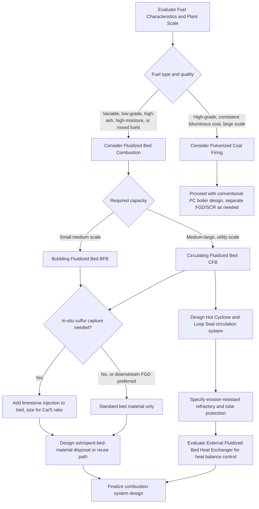

## Fluidized-Bed Combustion Boilers

### Overview and Fundamental Principle

Fluidized-bed combustion (FBC) suspends solid fuel particles in an upward-flowing stream of air (and, once ignited, combustion gases) within a bed of inert or reactive granular material (typically sand, ash, or limestone), such that the bed behaves like a turbulent, fluid-like mass rather than a fixed pile. This fluidization dramatically enhances mixing, heat transfer, and combustion efficiency compared to conventional grate or pulverized firing, while enabling in-situ pollutant control not readily achievable in other combustion technologies.

**Key Points**

- Fluidization occurs when upward air velocity through a bed of particles reaches the point where drag force on particles equals their weight, causing the bed to expand and behave fluid-like.
- FBC enables combustion of a very wide range of fuels (coal, biomass, waste, low-grade fuels, high-ash/high-moisture fuels) with high combustion efficiency at relatively low, uniform bed temperatures (typically 800-900°C).
- The two dominant industrial variants are Bubbling Fluidized Bed (BFB) and Circulating Fluidized Bed (CFB), distinguished primarily by fluidization velocity and solids circulation behavior.

---

### Fluidization Fundamentals

#### Minimum Fluidization Velocity

As air velocity through a bed of solid particles increases from zero, pressure drop across the bed increases until it equals the weight of the bed per unit cross-sectional area — at this point (the minimum fluidization velocity, $U_{mf}$), particles become suspended and the bed begins to exhibit fluid-like behavior.

$$U_{mf} = \frac{(\rho_p - \rho_g) g d_p^2}{150 \mu} \cdot \frac{\varepsilon_{mf}^3}{1 - \varepsilon_{mf}}$$

(a simplified form derived from the Ergun equation for laminar-dominated conditions), where $\rho_p$ is particle density, $\rho_g$ is gas density, $d_p$ is particle diameter, $\mu$ is gas viscosity, and $\varepsilon_{mf}$ is bed voidage at minimum fluidization.

#### Fluidization Regimes

As gas velocity increases beyond $U_{mf}$, the bed progresses through distinct regimes:

- **Bubbling fluidization**: gas in excess of that needed for minimum fluidization passes through the bed as discrete bubbles, causing vigorous solids mixing while bulk bed density remains relatively high and the bed surface remains relatively well-defined.
- **Turbulent fluidization**: at higher velocities, bubbles break down and coalesce chaotically, and the distinction between a dense bed and a dilute freeboard region above it becomes less sharp.
- **Fast fluidization (circulating)**: at still higher velocities, significant solids entrainment occurs, with particles carried out of the combustion chamber and requiring external separation and return (recirculation) to sustain the bed inventory — this is the operating regime that defines circulating fluidized bed combustion.

---

### Bubbling Fluidized Bed (BFB) Combustion

#### Design and Operation

In a BFB boiler, fuel is fed into (or onto) a bed of inert material (typically sand, with limestone often added for sulfur capture) fluidized by air introduced through a distributor plate at the bottom of the combustor. The bed operates at relatively low fluidization velocity (typically 1-3 m/s [Inference: exact range varies with bed material and fuel characteristics]), maintaining a distinct dense bed with a relatively well-defined upper surface and a dilute freeboard region above.

- **Heat transfer**: heat transfer surfaces (evaporator tube bundles) are commonly immersed directly within the bed itself, exploiting the very high bed-to-surface heat transfer coefficients characteristic of fluidized beds (arising from the intense particle-surface contact and mixing), in addition to conventional convective/radiant surfaces in the freeboard and downstream gas path.
- **Fuel feed**: fuel is typically fed either above the bed (over-bed feed, for coarser fuels) or pneumatically into the bed itself (under-bed feed, for finer fuels), with fuel particle size generally coarser than that required for pulverized coal firing (since the bed provides intense mixing and prolonged residence time rather than relying on fine particle size for rapid burnout).
- **Bed temperature control**: bed temperature is maintained in the range of roughly 800-900°C (below the ash fusion/softening temperature of most fuels to avoid bed agglomeration/clinkering, and within the range that maximizes limestone-based sulfur capture effectiveness) primarily via the immersed heat transfer surfaces removing heat from the bed.

#### Advantages and Limitations

- **Advantages**: relatively simple design, good fuel flexibility, effective for smaller-to-medium scale applications, lower erosion of in-bed tubes compared to CFB (due to lower velocities).
- **Limitations**: [Inference] generally less scalable to very large utility-scale capacities compared to CFB technology, and somewhat lower combustion efficiency (more unburned carbon in ash) due to less intense mixing and shorter effective fuel residence time compared to circulating designs.

---

### Circulating Fluidized Bed (CFB) Combustion

#### Design and Operation

CFB boilers operate at substantially higher fluidization velocities (typically 4-8 m/s [Inference: exact operating range varies by design and fuel]) than BFB units, in the fast fluidization regime where a significant fraction of bed solids are continuously entrained out of the combustion chamber with the flue gas. These entrained solids are captured by a hot cyclone (or other high-temperature solids separator) and returned to the base of the combustor via a standpipe and loop seal, creating a continuous external solids circulation loop that is the defining architectural feature of CFB technology.

- **Combustor (riser)**: a tall, relatively narrow vertical chamber where fuel, air, and circulating bed material mix intensely; the entire chamber (rather than just a discrete bottom bed as in BFB) is essentially fluidized, providing much longer effective solids residence time and more thorough fuel-air mixing throughout the combustor height.
- **Hot cyclone/solids separator**: captures the majority of entrained solids from the flue gas exiting the riser, at high temperature (avoiding the need to cool gas before separation, preserving thermal efficiency), and directs them to the return loop.
- **Loop seal (non-mechanical seal)**: a fluidized, J-valve-like device that returns separated solids from the cyclone back to the base of the riser while preventing backflow of combustion gas from the riser into the cyclone/return leg — a critical component enabling the continuous circulation loop without mechanical valves at high temperature.
- **Staged air introduction**: primary air is introduced at the base of the riser (fluidizing the dense lower bed zone), while secondary (and sometimes tertiary) air is introduced at higher elevations, enabling staged combustion that reduces NOx formation by controlling local stoichiometry and peak flame temperature.
- **Heat transfer surfaces**: unlike BFB, CFB combustors typically do not rely heavily on in-bed immersed tubes (given the much lower solids concentration throughout the tall riser compared to a discrete BFB bed); instead, heat is extracted via furnace waterwalls (as in conventional boilers) and, in many designs, an external fluidized bed heat exchanger (EFBHE) — a separate, lower-velocity fluidized bed vessel receiving a slipstream of hot circulating solids specifically for additional controlled heat extraction, providing an additional degree of freedom for temperature/heat balance control independent of combustion conditions in the riser.

#### Advantages and Applications

- **Fuel flexibility**: capable of efficiently combusting an exceptionally broad range of fuels, including low-grade coal, lignite, biomass, petroleum coke, and various waste-derived fuels, often with the ability to co-fire multiple fuel types simultaneously.
- **High combustion efficiency**: the long, intense solids circulation and high effective fuel residence time achieve high carbon burnout (low unburned carbon in ash) even with relatively coarse fuel particle size (no pulverization to fine powder required, unlike pulverized coal firing).
- **Effective in-situ sulfur capture**: limestone (CaCO₃) can be introduced directly into the bed, where it calcines to lime (CaO) and reacts with SO₂ generated during combustion to form calcium sulfate (CaSO₄, gypsum-like solid), capturing sulfur emissions directly within the combustion process rather than requiring a separate downstream flue gas desulfurization system:

$$CaCO_3 \rightarrow CaO + CO_2$$

$$CaO + SO_2 + \frac{1}{2}O_2 \rightarrow CaSO_4$$

- **Lower NOx formation**: the relatively low, uniform combustion temperature (800-900°C, well below the threshold for significant thermal NOx formation) combined with staged air introduction results in inherently lower NOx emissions than pulverized coal combustion (which typically operates at much higher peak flame temperatures), often reducing or eliminating the need for separate NOx control equipment such as SCR, [Inference] though specific emissions performance and regulatory requirements vary by installation and jurisdiction.
- **Scalability**: CFB technology has been successfully scaled to utility-scale capacities (units exceeding 300-600 MWe have been built), making it a viable alternative to pulverized coal firing for large power generation applications, particularly where fuel flexibility or in-situ sulfur capture are valued.

#### Limitations

- **Higher erosion**: the high solids circulation rate and velocity throughout the riser and return loop create significant erosion potential on refractory linings, heat transfer surfaces, and cyclone internals, requiring erosion-resistant materials and careful design of gas/solids flow paths.
- **Higher auxiliary power consumption**: the higher fluidization velocities required (compared to BFB) increase forced draft fan power consumption.
- **Complexity**: the solids circulation loop (cyclone, standpipe, loop seal) adds mechanical and operational complexity compared to simpler BFB or conventional pulverized/grate firing.
- **Limestone consumption and byproduct**: in-situ sulfur capture consumes substantial limestone and generates a solid byproduct (spent bed material containing calcium sulfate and unreacted lime) requiring disposal or beneficial use, an economic and environmental consideration distinct from wet flue gas desulfurization systems used with other combustion technologies.

**Example**: A CFB boiler firing high-sulfur lignite might achieve over 90% in-situ SO₂ capture through limestone injection directly into the bed [Inference: exact capture efficiency depends on calcium-to-sulfur molar ratio, limestone reactivity, and bed operating conditions], substantially reducing or eliminating the need for a separate downstream flue gas desulfurization plant that would otherwise be required for an equivalent pulverized-coal-fired unit burning the same fuel.

---

### Comparative Summary: BFB vs. CFB vs. Conventional Firing

| Parameter | Bubbling Fluidized Bed (BFB) | Circulating Fluidized Bed (CFB) | Pulverized Coal (PC) |
| --- | --- | --- | --- |
| Fluidization velocity | Low (1-3 m/s) | High (4-8 m/s) | N/A (entrained flow) |
| Fuel particle size | Coarser (no fine pulverization) | Coarser (no fine pulverization) | Very fine (pulverized) |
| Bed/combustion temperature | ~800-900°C | ~800-900°C | ~1300-1600°C (flame) |
| NOx formation | Low (low temperature) | Low (low temp + staging) | Higher (high flame temp) |
| In-situ sulfur capture | Possible (limestone in bed) | Highly effective (limestone in bed) | Not applicable (requires FGD) |
| Fuel flexibility | Good | Excellent | Limited (requires fine, consistent fuel) |
| Typical scale | Small-medium | Medium-large (utility scale) | Large utility scale |
| Erosion concern | Moderate | High (circulating solids) | Moderate (fly ash erosion) |
| Heat transfer method | In-bed immersed tubes | Waterwalls + external fluid bed heat exchanger | Waterwalls + convective banks |

---

### CFB Boiler Schematic (svg_diagram)

<svg xmlns="http://www.w3.org/2000/svg" viewBox="0 0 750 500">
<text x="375" y="25" font-size="16" font-weight="bold" text-anchor="middle" fill="#1a1a1a">Circulating Fluidized Bed (CFB) Boiler — Solids Circulation Loop (svg_diagram)</text>

<rect x="120" y="60" width="130" height="330" fill="#fdecec" stroke="#c0392b" stroke-width="2" />
<text x="185" y="80" font-size="12" font-weight="bold" text-anchor="middle" fill="#c0392b">Riser</text>
<text x="185" y="95" font-size="10" text-anchor="middle" fill="#1a1a1a">(Combustor)</text>

<circle cx="150" cy="200" r="3" fill="#e67e22" />
<circle cx="170" cy="230" r="3" fill="#e67e22" />
<circle cx="200" cy="180" r="3" fill="#e67e22" />
<circle cx="220" cy="250" r="3" fill="#e67e22" />
<circle cx="160" cy="300" r="3" fill="#e67e22" />
<circle cx="210" cy="330" r="3" fill="#e67e22" />
<circle cx="190" cy="150" r="3" fill="#e67e22" />
<circle cx="140" cy="270" r="3" fill="#e67e22" />

<line x1="185" y1="430" x2="185" y2="390" stroke="#2980b9" stroke-width="3" />
<polygon points="180,398 185,385 190,398" fill="#2980b9" />
<text x="185" y="450" font-size="10" text-anchor="middle" fill="#2980b9">Primary Air</text>

<line x1="90" y1="330" x2="120" y2="330" stroke="#2980b9" stroke-width="3" />
<polygon points="110,325 122,330 110,335" fill="#2980b9" />
<text x="55" y="335" font-size="10" fill="#2980b9">Secondary Air</text>

<line x1="90" y1="120" x2="120" y2="150" stroke="#8e44ad" stroke-width="3" />
<polygon points="110,140 122,152 108,152" fill="#8e44ad" />
<text x="50" y="105" font-size="10" fill="#8e44ad">Fuel Feed</text>

<line x1="90" y1="180" x2="120" y2="200" stroke="#27ae60" stroke-width="3" />
<polygon points="110,193 122,202 108,203" fill="#27ae60" />
<text x="30" y="175" font-size="10" fill="#27ae60">Limestone</text>
<text x="30" y="188" font-size="10" fill="#27ae60">Feed</text>

<line x1="250" y1="90" x2="330" y2="90" stroke="#7f8c8d" stroke-width="3" />
<polygon points="320,85 335,90 320,95" fill="#7f8c8d" />

<path d="M 340 60 L 460 60 L 460 130 Q 460 180 400 200 Q 340 180 340 130 Z" fill="#eaf2fb" stroke="#2980b9" stroke-width="2" />
<text x="400" y="90" font-size="12" font-weight="bold" text-anchor="middle" fill="#2980b9">Hot Cyclone</text>
<text x="400" y="105" font-size="10" text-anchor="middle" fill="#1a1a1a">(Solids Separator)</text>

<line x1="460" y1="80" x2="540" y2="60" stroke="#7f8c8d" stroke-width="3" />
<polygon points="530,55 545,60 533,68" fill="#7f8c8d" />
<text x="580" y="55" font-size="10" fill="#7f8c8d">Flue gas to</text>
<text x="580" y="68" font-size="10" fill="#7f8c8d">convective section</text>

<line x1="400" y1="200" x2="400" y2="340" stroke="#e67e22" stroke-width="4" />
<text x="430" y="270" font-size="10" fill="#e67e22" font-weight="bold">Standpipe</text>
<text x="430" y="283" font-size="10" fill="#e67e22">(returning solids)</text>

<rect x="360" y="340" width="80" height="35" fill="#fdf2e3" stroke="#e67e22" stroke-width="2" />
<text x="400" y="362" font-size="10" text-anchor="middle" fill="#e67e22">Loop Seal</text>

<line x1="400" y1="400" x2="400" y2="378" stroke="#2980b9" stroke-width="2" />
<polygon points="396,385 400,376 404,385" fill="#2980b9" />
<text x="400" y="415" font-size="9" text-anchor="middle" fill="#2980b9">Aeration Air</text>

<line x1="360" y1="358" x2="250" y2="358" stroke="#e67e22" stroke-width="4" />
<polygon points="260,352 245,358 260,364" fill="#e67e22" />
<text x="290" y="345" font-size="9" fill="#e67e22">Return to riser base</text>

<text x="400" y="440" font-size="10" text-anchor="middle" fill="`#1a1a1a`">(Optional: External Fluidized Bed Heat Exchanger may tap standpipe flow)</text>

</svg>

---

### Combustion System Selection Flow

---

### Worked Example: Minimum Fluidization Velocity Estimate

**Problem**: Estimate the minimum fluidization velocity for sand particles ($d_p = 500 \, \mu m$, $\rho_p = 2600 \, \text{kg/m}^3$) fluidized by air at combustion bed conditions ($\rho_g = 0.3 \, \text{kg/m}^3$ at ~850°C, $\mu = 4.5 \times 10^{-5} \, \text{Pa·s}$), assuming $\varepsilon_{mf} = 0.45$.

**Solution outline**:

1. Compute $d_p^2 = (500 \times 10^{-6})^2 = 2.5 \times 10^{-7} \, \text{m}^2$
2. Compute $(\rho_p - \rho_g) \approx 2600 - 0.3 \approx 2599.7 \, \text{kg/m}^3$
3. Compute the voidage term: $\dfrac{\varepsilon_{mf}^3}{1-\varepsilon_{mf}} = \dfrac{0.45^3}{0.55} = \dfrac{0.0911}{0.55} \approx 0.166$
4. Apply the simplified equation:

$$U_{mf} = \frac{2599.7 \times 9.81 \times 2.5\times10^{-7}}{150 \times 4.5\times10^{-5}} \times 0.166$$

5. Numerator: $2599.7 \times 9.81 \times 2.5\times10^{-7} \approx 0.00637$
6. Denominator: $150 \times 4.5\times10^{-5} = 0.00675$
7. $U_{mf} \approx (0.00637/0.00675) \times 0.166 \approx 0.944 \times 0.166 \approx 0.157 \, \text{m/s}$

**Output**: The estimated minimum fluidization velocity is approximately 0.16 m/s. Since actual BFB/CFB operating velocities (1-8 m/s) are many times $U_{mf}$, this confirms the bed operates well into the bubbling or fast-fluidization regime rather than marginally at incipient fluidization — consistent with the intense mixing and (for CFB) solids entrainment characteristic of these combustion systems.

**Conclusion**

Fluidized-bed combustion represents a fundamentally different approach to solid fuel firing compared to grate or pulverized combustion, exploiting the intense mixing and heat transfer of a fluidized particle bed to achieve high combustion efficiency, exceptional fuel flexibility, and inherently lower emissions (NOx via low/staged-temperature operation, SO₂ via in-situ limestone capture) without requiring the fine fuel pulverization or extensive downstream flue gas treatment typically needed for pulverized coal firing. CFB technology in particular has proven scalable to utility power generation while retaining these fuel-flexibility and emissions advantages.

**Related Topics**

- Ergun equation and fluidization/pressure drop fundamentals
- In-situ sulfur capture chemistry and limestone sorbent selection (Ca/S ratio optimization)
- NOx formation mechanisms and staged combustion control
- External fluidized bed heat exchangers and heat balance control strategies
- Biomass and waste-derived fuel co-firing in CFB systems
- Erosion-resistant refractory design for circulating solids systems
- Comparison of FBC emissions performance versus PC firing with FGD/SCR