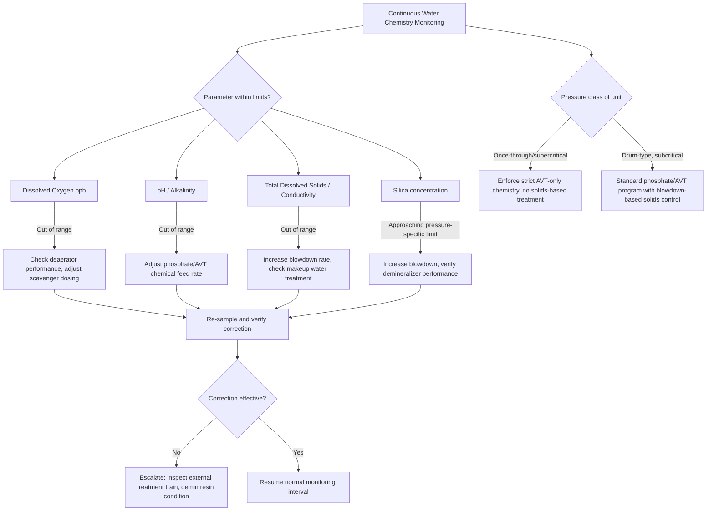

## Boiler Water Chemistry and Feedwater Treatment

### Overview and Significance

Boiler water chemistry and feedwater treatment govern the prevention of scaling, corrosion, and carryover within the boiler and steam-water circuit — three interrelated failure modes that, if uncontrolled, degrade heat transfer, damage equipment, and can lead to catastrophic tube failures. As boiler operating pressures and heat fluxes increase (particularly in modern water-tube utility boilers), water chemistry tolerances become progressively tighter, making feedwater treatment a critical, code-adjacent discipline in steam generator operation.

**Key Points**

- The three primary water-chemistry-related failure mechanisms are scaling (deposit formation reducing heat transfer), corrosion (metal loss degrading pressure boundary integrity), and carryover (contaminants transported into steam, fouling downstream equipment like turbines).
- Treatment strategy scales with operating pressure: low-pressure boilers tolerate more impurities; high-pressure/supercritical units require near-total removal of dissolved solids and dissolved gases.
- Feedwater treatment encompasses external treatment (before water enters the boiler system) and internal treatment (chemical conditioning within the boiler/feedwater system itself).

---

### Sources of Impurities and Their Effects

#### Dissolved Solids (Scale-Forming Species)

Raw makeup water contains dissolved minerals — primarily calcium, magnesium, silica, and various anions (bicarbonate, sulfate, chloride) — that, if not removed, concentrate within the boiler as water evaporates to steam (since dissolved solids do not vaporize), eventually exceeding solubility limits and precipitating as scale on heat transfer surfaces.

- **Calcium and magnesium carbonates/sulfates**: primary hardness-forming species; several exhibit inverse solubility (less soluble at higher temperature), causing preferential scaling on the hottest surfaces — precisely where heat transfer degradation is most damaging.
- **Silica**: particularly problematic at high pressure because silica exhibits significant volatility in steam at elevated pressure/temperature, meaning it can carry over into steam and later deposit on turbine blades as pressure drops during expansion (since silica solubility in steam decreases as pressure drops) — a distinct and serious concern for high-pressure boilers feeding turbines.

#### Dissolved Gases

- **Dissolved oxygen**: highly corrosive to boiler metal (carbon steel), promoting pitting corrosion particularly at elevated temperature; must be reduced to very low levels (commonly specified in parts per billion for high-pressure boilers) via mechanical deaeration and chemical oxygen scavenging.
- **Dissolved carbon dioxide**: forms carbonic acid in water, lowering pH and promoting general corrosion, particularly in condensate return systems; often originates from thermal decomposition of bicarbonate alkalinity within the boiler itself (as well as from raw makeup water), meaning even well-treated boiler water can generate CO₂ in-situ.

#### Suspended Solids and Organic Matter

Particulates and organic contaminants can contribute to fouling, provide nucleation sites for scale formation, and in some cases (organic matter under high heat flux) contribute to fouling deposits with insulating and corrosive characteristics.

---

### Scale Formation Mechanisms

Scale forms when dissolved species exceed their solubility limit at local (often wall-surface) conditions, driven primarily by:

- **Temperature-driven precipitation**: for inverse-solubility salts (calcium carbonate, calcium sulfate, certain silicates), solubility decreases as temperature increases, so scaling occurs preferentially at the hottest surface — typically the highest-heat-flux tube surfaces where thermal degradation from scale is most consequential.
- **Concentration-driven precipitation**: as water evaporates within the boiler, dissolved solids concentrate in the remaining liquid phase; without adequate blowdown to control this concentration, dissolved solids eventually exceed solubility limits even for normally-soluble species.

$$CaCO_3 \text{ (inverse solubility): } Ca^{2+} + CO_3^{2-} \rightleftharpoons CaCO_3\downarrow$$

**Effect on performance**: scale is generally a poor thermal conductor (thermal conductivity often an order of magnitude lower than the tube metal it deposits on), meaning even a relatively thin scale layer can substantially increase local thermal resistance, requiring higher tube wall temperature to maintain the same heat flux — a mechanism that, in fired boiler tubes with fixed heat input, can drive tube metal temperature into a range that causes overheating failure (a distinct and more acute risk than the general efficiency degradation discussed under fouling in heat exchangers generally).

---

### Corrosion Mechanisms in Boiler Systems

#### Oxygen (Pitting) Corrosion

Dissolved oxygen reacts with boiler metal, particularly at localized sites, to form characteristic pits — highly localized, deep corrosion attack that can penetrate tube walls despite relatively modest overall metal loss, making it disproportionately dangerous compared to uniform corrosion of the same average rate.

#### Caustic Corrosion (Caustic Gouging/Embrittlement)

Occurs when locally concentrated caustic (sodium hydroxide, which can result from certain water treatment chemistries or from evaporative concentration at specific locations such as under porous deposits) attacks boiler tube metal, particularly at high heat flux locations where local boiling concentrates dissolved alkali species. Historically associated with "caustic embrittlement" cracking at riveted boiler joints in older boiler designs [Inference: largely a historical concern for modern welded boiler construction, though caustic gouging under deposits remains a relevant modern mechanism].

#### Acid Corrosion (Low pH)

Occurs when boiler water pH drops below the protective range (typically maintained slightly alkaline, commonly pH 9-9.5 or higher depending on specific water treatment program and materials), often due to contamination (e.g., condenser cooling water in-leakage in systems using seawater or hard water cooling, or acidic contaminant ingress), accelerating general corrosion of carbon steel surfaces.

#### Hydrogen Damage

A severe and often catastrophic corrosion mechanism where atomic hydrogen (generated as a byproduct of certain corrosion reactions, particularly under acidic conditions beneath porous deposits) diffuses into the tube metal and reacts with iron carbides in the steel, forming methane gas and graphite at grain boundaries; the resulting internal gas pressure and grain boundary decarburization severely weaken the metal, often leading to sudden, brittle-appearing tube rupture ("hydrogen embrittlement" or "hydrogen damage") with little external warning.

#### Under-Deposit Corrosion

Porous scale or sludge deposits create localized environments beneath the deposit that can differ substantially from bulk boiler water chemistry (concentration of dissolved species, oxygen depletion, pH shifts), promoting various concentrated corrosion mechanisms (caustic gouging, acid attack, hydrogen damage) specifically at deposit sites — illustrating why scale prevention and corrosion control are fundamentally interconnected rather than independent concerns.

---

### Carryover

Carryover refers to the transport of boiler water contaminants (dissolved solids, moisture droplets containing dissolved solids) into the steam leaving the boiler drum, which is undesirable because it deposits contaminants on downstream superheater tubes, turbine blades, and other steam-path equipment.

- **Mechanical carryover**: fine water droplets (containing dissolved solids) are physically entrained in the steam leaving the drum, typically due to inadequate steam-water separation equipment (cyclone separators, scrubbers) or excessively high steam release rate relative to drum size/design.
- **Selective (vaporous) carryover**: certain species (notably silica, and to a lesser extent some other compounds) exhibit genuine solubility in steam itself at high pressure/temperature, meaning they can transfer into steam even without any liquid droplet entrainment — a distinct mechanism from mechanical carryover, and one that becomes increasingly significant as operating pressure increases, requiring correspondingly tighter boiler water silica limits at higher pressure.

**Example**: A high-pressure utility boiler operating at 170 bar might specify a boiler water silica limit far more stringent than a low-pressure industrial boiler at 10 bar, precisely because vaporous silica carryover increases sharply with pressure — silica that would remain safely in boiler water (and be removed via blowdown) at low pressure can partition significantly into the steam phase at high pressure, ultimately depositing on turbine blades as the steam expands and silica solubility drops.

---

### External (Pretreatment) Water Treatment

External treatment processes raw makeup water before it enters the boiler feedwater system, removing the bulk of dissolved solids and hardness.

- **Clarification and filtration**: removes suspended solids, turbidity, and some organic matter via coagulation/flocculation and media or membrane filtration.
- **Ion exchange (softening and demineralization)**:
  - **Sodium cycle softening**: exchanges calcium/magnesium hardness ions for sodium ions via a cation resin, effectively eliminating scale-forming hardness but not reducing total dissolved solids (sodium salts remain in solution) — adequate for lower-pressure boilers but insufficient alone for high-pressure applications.
  - **Demineralization (deionization)**: uses both cation (hydrogen-form) and anion (hydroxide-form) exchange resins in series (or mixed bed) to remove essentially all dissolved ionic species, producing very high purity water essential for high-pressure boiler feedwater.
- **Reverse osmosis (RO)**: membrane-based process removing the majority of dissolved solids via pressure-driven filtration at the molecular/ionic level; commonly used as a pretreatment stage ahead of demineralization (reducing the ionic load on downstream ion exchange resins, extending resin regeneration intervals) in modern high-purity water treatment trains.
- **Evaporation (distillation)**: thermal evaporation and condensation to produce high-purity water; historically significant (particularly in marine/naval applications and some industrial settings) but generally more energy-intensive than membrane/ion-exchange approaches for land-based industrial use, [Inference] though it remains relevant in specific contexts such as shipboard systems or where waste heat is readily available to drive the evaporation process economically.

#### Deaeration

A critical external/pretreatment step removing dissolved oxygen and carbon dioxide from feedwater before it enters the boiler, typically via a **deaerator** — a vessel that heats feedwater with steam (reducing gas solubility per Henry's Law as temperature rises toward saturation) while mechanically scrubbing/spraying the water to promote gas release, followed by venting the released gases to atmosphere.

- **Deaerator types**: spray-type (feedwater sprayed into a steam atmosphere) and tray-type (feedwater cascades over a series of trays within a steam atmosphere, providing extended contact time/surface area) are the two dominant designs.
- Mechanical deaeration typically reduces dissolved oxygen to very low levels (often below 7 parts per billion in well-designed/operated units [Inference: specific achievable levels depend on deaerator design, operating pressure, and vent rate]), with residual trace oxygen then addressed by chemical oxygen scavengers.

---

### Internal (Chemical) Treatment

Chemical treatment programs are applied within the boiler feedwater/boiler water system itself to control residual impurities, corrosion, and pH.

#### Oxygen Scavengers

Chemicals that react with residual dissolved oxygen (remaining after mechanical deaeration) to prevent it from reaching boiler metal surfaces:

- **Sodium sulfite**: a traditional, cost-effective oxygen scavenger for low-to-medium pressure boilers; reacts stoichiometrically with oxygen, though it increases total dissolved solids in boiler water (a consideration limiting its use at higher pressure, where TDS limits are tighter) and is generally unsuitable above certain pressure thresholds due to thermal decomposition concerns.
- **Hydrazine**: a volatile oxygen scavenger (leaves no dissolved solid residue, since it decomposes to nitrogen and water/ammonia) historically favored for high-pressure boilers; [Inference] however, hydrazine's classification as a suspected carcinogen has driven many operators toward alternative scavengers in recent decades, with the pace and extent of this shift varying by jurisdiction, regulation, and specific plant practice.
- **Alternative organic scavengers** (e.g., carbohydrazide, erythorbate, and various proprietary formulations): increasingly used as substitutes for hydrazine, offering similar volatile, low-residue characteristics with different toxicity profiles.

#### pH and Alkalinity Control

Boiler water pH is typically maintained in a mildly alkaline range (commonly cited as roughly pH 9-9.5 for many industrial boiler treatment programs, though specific setpoints vary by boiler type, pressure, and treatment chemistry) to minimize both acid corrosion (at low pH) and caustic corrosion (at excessively high pH/caustic concentration), using chemicals such as:

- **Sodium phosphate treatment (coordinated or congruent phosphate)**: phosphate buffers boiler water pH while also precipitating any residual calcium as a soft, non-adherent sludge (calcium phosphate) rather than hard adherent scale, making it more readily removed via blowdown; "coordinated" and "congruent" phosphate programs refer to specific sodium-to-phosphate ratio control strategies designed to avoid free caustic formation.
- **All-volatile treatment (AVT)**: uses only volatile chemicals (typically ammonia for pH control, and a volatile oxygen scavenger) with no solid dissolved species added, common in modern high-pressure and supercritical (once-through) boilers where no blowdown-based solids removal mechanism exists (since once-through units have no steam drum to concentrate and blow down solids) — making it essential that no non-volatile treatment chemicals are used, since they would otherwise simply carry through the entire system with no removal path.
- **Oxygenated treatment (OT)**: a specialized high-purity water treatment approach (used in some high-pressure/supercritical units) that deliberately maintains a small controlled amount of dissolved oxygen (rather than fully scavenging it) under very high purity conditions, promoting formation of a protective, adherent magnetite/hematite oxide layer on feedwater system carbon steel piping — a counterintuitive-seeming but effective strategy specifically suited to very high purity, all-ferrous or mixed-metallurgy feedwater systems. [Inference] OT requires very tight control of other water chemistry parameters (particularly chloride, sulfate, and overall conductivity) to be effective and is generally applied only in carefully controlled, high-purity system contexts rather than as a general-purpose treatment.

#### Blowdown Control

Blowdown (as discussed under boiler mountings) is the primary mechanism for physically removing accumulated dissolved and suspended solids from the boiler, and is coordinated with chemical treatment to maintain boiler water quality within specified limits.

$$\text{Blowdown rate (\%)} = \frac{\text{Feedwater TDS}}{\text{Boiler water TDS limit} - \text{Feedwater TDS}} \times 100$$

This relationship illustrates the direct trade-off between feedwater quality and required blowdown rate: higher feedwater purity (achieved via more extensive external treatment) reduces the blowdown rate needed to maintain boiler water within its TDS limit, directly reducing the energy loss associated with blowdown (since blown-down water carries away sensible heat at boiler temperature/pressure).

---

### Treatment Requirements by Pressure Class

| Pressure Class | Typical Feedwater Treatment | Typical Boiler Water Treatment | Key Concern |
| --- | --- | --- | --- |
| Low (< 20 bar) | Softening, mechanical deaeration | Sulfite scavenging, phosphate or simple alkalinity control | Hardness scaling |
| Medium (20-60 bar) | Demineralization or softening + RO, deaeration | Phosphate/coordinated phosphate, sulfite or volatile scavenger | Scaling, moderate carryover control |
| High (60-170 bar) | Full demineralization, deaeration | AVT or coordinated phosphate, volatile scavenger | Silica carryover, corrosion control |
| Supercritical/once-through (>221 bar) | Ultra-high-purity demineralization (often polishing/condensate polishing) | AVT only (no solids-based treatment, no drum to blow down) | Absolute minimization of all dissolved/suspended solids |

---

### Water Treatment Train Schematic (svg_diagram)

<svg xmlns="http://www.w3.org/2000/svg" viewBox="0 0 800 420">
<text x="400" y="25" font-size="16" font-weight="bold" text-anchor="middle" fill="#1a1a1a">Boiler Feedwater Treatment Train (svg_diagram)</text>

<rect x="30" y="70" width="100" height="40" fill="#eaf2fb" stroke="#2980b9" stroke-width="2" />
<text x="80" y="95" font-size="11" text-anchor="middle" fill="#2980b9">Raw Makeup Water</text>
<line x1="130" y1="90" x2="165" y2="90" stroke="#2980b9" stroke-width="2" />
<polygon points="160,85 170,90 160,95" fill="#2980b9" />

<rect x="170" y="70" width="110" height="40" fill="#eafaf1" stroke="#27ae60" stroke-width="2" />
<text x="225" y="90" font-size="10" text-anchor="middle" fill="#27ae60">Clarification /</text>
<text x="225" y="102" font-size="10" text-anchor="middle" fill="#27ae60">Filtration</text>
<line x1="280" y1="90" x2="315" y2="90" stroke="#27ae60" stroke-width="2" />
<polygon points="310,85 320,90 310,95" fill="#27ae60" />

<rect x="320" y="70" width="100" height="40" fill="#fdf2e3" stroke="#e67e22" stroke-width="2" />
<text x="370" y="95" font-size="11" text-anchor="middle" fill="#e67e22">Reverse Osmosis</text>
<line x1="420" y1="90" x2="455" y2="90" stroke="#e67e22" stroke-width="2" />
<polygon points="450,85 460,90 450,95" fill="#e67e22" />

<rect x="460" y="70" width="120" height="40" fill="#fdecec" stroke="#c0392b" stroke-width="2" />
<text x="520" y="90" font-size="10" text-anchor="middle" fill="#c0392b">Demineralization</text>
<text x="520" y="102" font-size="10" text-anchor="middle" fill="#c0392b">(Ion Exchange)</text>
<line x1="580" y1="90" x2="615" y2="90" stroke="#c0392b" stroke-width="2" />
<polygon points="610,85 620,90 610,95" fill="#c0392b" />

<rect x="620" y="70" width="130" height="40" fill="#f3eafc" stroke="#8e44ad" stroke-width="2" />
<text x="685" y="95" font-size="10" text-anchor="middle" fill="#8e44ad">High-Purity Storage</text>

<line x1="685" y1="110" x2="685" y2="180" stroke="#8e44ad" stroke-width="2" />
<polygon points="680,172 685,185 690,172" fill="#8e44ad" />

<rect x="30" y="180" width="140" height="40" fill="#dce6f1" stroke="#333" stroke-width="1.5" />
<text x="100" y="205" font-size="10" text-anchor="middle" fill="#1a1a1a">Condensate Return</text>
<line x1="170" y1="200" x2="590" y2="200" stroke="#333" stroke-width="1.5" stroke-dasharray="3,2" />
<line x1="590" y1="200" x2="590" y2="185" stroke="#333" stroke-width="1.5" />

<ellipse cx="640" cy="230" rx="130" ry="40" fill="#fef5e7" stroke="#e67e22" stroke-width="2" />
<text x="640" y="225" font-size="12" font-weight="bold" text-anchor="middle" fill="#e67e22">Deaerator</text>
<text x="640" y="242" font-size="10" text-anchor="middle" fill="#1a1a1a">(O2, CO2 removal via steam)</text>

<line x1="500" y1="300" x2="560" y2="260" stroke="#8e44ad" stroke-width="2" />
<polygon points="550,258 565,257 558,268" fill="#8e44ad" />
<text x="440" y="310" font-size="10" fill="#8e44ad">O2 Scavenger + pH</text>
<text x="440" y="322" font-size="10" fill="#8e44ad">Control Chemicals</text>

<line x1="640" y1="270" x2="640" y2="330" stroke="#333" stroke-width="2" />
<polygon points="635,322 640,335 645,322" fill="#333" />
<rect x="600" y="335" width="80" height="30" fill="#7f8c8d" stroke="#333" stroke-width="1.5" />
<text x="640" y="355" font-size="10" text-anchor="middle" fill="#fff">Feed Pump</text>

<line x1="640" y1="365" x2="640" y2="395" stroke="#333" stroke-width="2" />
<polygon points="635,388 640,400 645,388" fill="#333" />
<text x="700" y="395" font-size="11" font-weight="bold" fill="#1a1a1a">To Boiler Drum</text>
</svg>

---

### Chemistry Monitoring and Control Flow

---

### Worked Example: Required Blowdown Rate

**Problem**: A boiler operates with feedwater total dissolved solids (TDS) of 5 ppm and a specified boiler water TDS limit of 3000 ppm. Estimate the required continuous blowdown rate as a percentage of feedwater flow.

**Solution outline**:

Using the blowdown rate relationship:

$$\text{Blowdown \%} = \frac{5}{3000 - 5} \times 100 = \frac{5}{2995} \times 100 \approx 0.17\%$$

**Output**: A blowdown rate of approximately 0.17% of feedwater flow is required to maintain boiler water TDS at or below the 3000 ppm limit, given this feedwater quality — illustrating why high feedwater purity (achieved through effective external treatment) allows very low blowdown rates, directly minimizing the associated energy loss.

**Conclusion**

Boiler water chemistry and feedwater treatment form an integrated system spanning external pretreatment (softening, demineralization, deaeration) and internal chemical conditioning (oxygen scavenging, pH/alkalinity control, phosphate or AVT programs), all coordinated with blowdown control to prevent the three fundamental failure modes of scaling, corrosion, and carryover. Treatment stringency scales directly with operating pressure, reaching its most demanding form in once-through supercritical units where the absence of a steam drum eliminates blowdown as a solids-removal mechanism entirely, mandating near-perfect feedwater purity via all-volatile treatment.

**Related Topics**

- Condensate polishing systems for high-purity makeup and condensate treatment
- Deaerator design and dissolved gas removal performance
- Coordinated vs. congruent phosphate treatment program selection
- All-Volatile Treatment (AVT) and Oxygenated Treatment (OT) chemistry details
- Hydrogen damage and under-deposit corrosion failure analysis
- Silica volatility and turbine blade deposition mechanisms
- Cycle chemistry monitoring instrumentation (conductivity, sodium, dissolved oxygen analyzers)