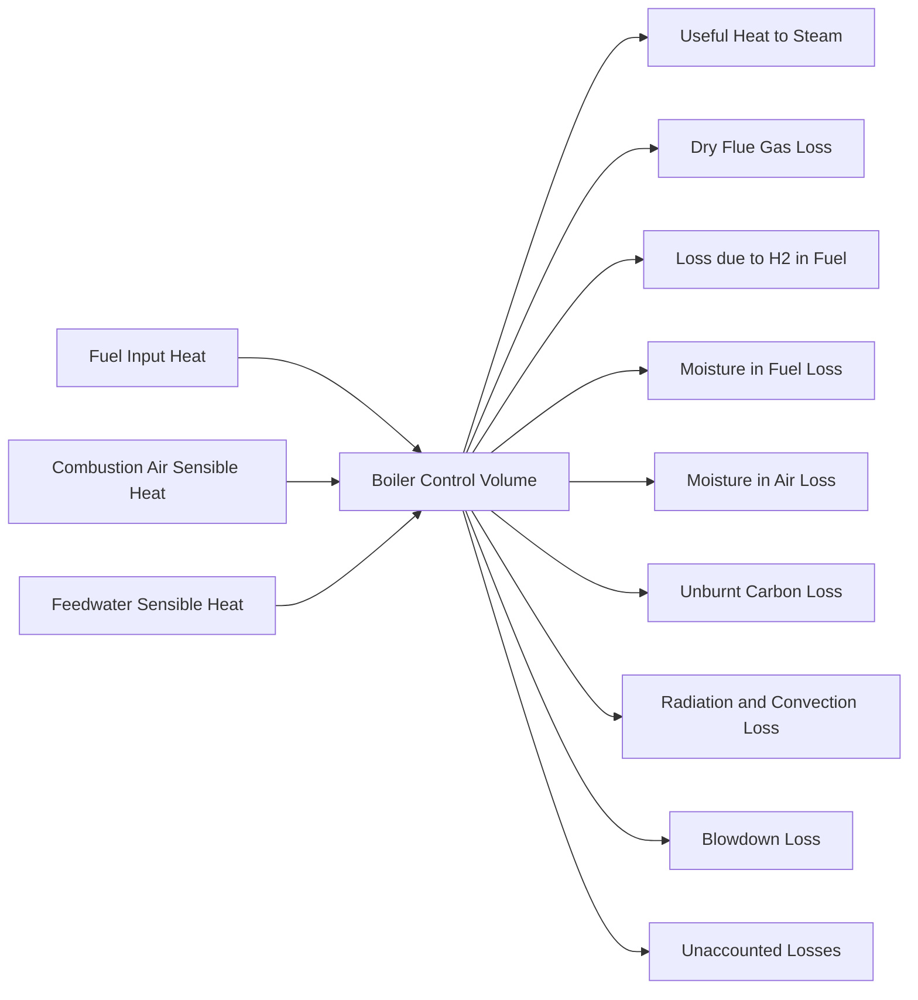
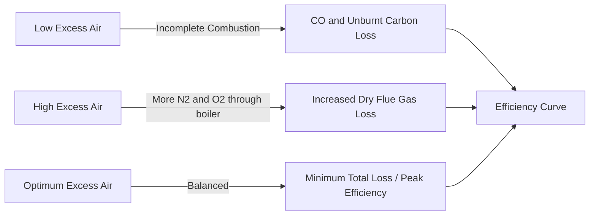

## Boiler Efficiency and Heat Balance

### Definition and Significance

Boiler efficiency quantifies the fraction of fuel energy input that is converted into useful steam output, with the remainder lost through various avenues (flue gas, unburnt fuel, radiation, blowdown, etc.). It is a primary performance metric for steam generator design, operation, and regulatory compliance, directly influencing fuel cost, emissions, and plant heat rate.

$$\eta_{boiler} = \frac{\text{Heat absorbed by working fluid}}{\text{Heat supplied by fuel}} \times 100\%$$

### Methods of Efficiency Determination

**Direct Method (Input-Output Method)**

Efficiency is calculated directly from the ratio of heat gained by feedwater/steam to heat supplied by fuel, without detailed accounting of individual losses.

$$\eta_{direct} = \frac{Q \times (h_g - h_f)}{q \times GCV} \times 100$$

Where:

- $Q$ = quantity of steam generated (kg/hr)
- $h_g$ = enthalpy of saturated/superheated steam (kJ/kg)
- $h_f$ = enthalpy of feedwater (kJ/kg)
- $q$ = quantity of fuel used (kg/hr)
- $GCV$ = gross calorific value of fuel (kJ/kg)

**Key Points**

- Requires minimal instrumentation (fuel flow, steam flow, pressures, temperatures)
- Fast and simple; suited for routine performance checks
- Does not identify individual loss sources, limiting diagnostic value
- Errors in steam/fuel flow metering directly propagate into efficiency error

**Indirect Method (Heat Loss Method)**

Efficiency is determined by subtracting all identifiable heat losses (as a percentage of fuel input) from 100%. This is the preferred method under standards such as ASME PTC 4 and BS 845.

$$\eta_{indirect} = 100 - \sum L_i$$

Where $L_i$ represents each individual loss expressed as a percentage of fuel heat input.

**Key Points**

- Requires flue gas analysis, temperature measurements, and fuel/ash analysis
- Provides breakdown of losses, enabling targeted efficiency improvements
- More accurate and diagnostic than the direct method
- More instrumentation-intensive and time-consuming

### Heat Balance Fundamentals

A heat balance is an energy accounting exercise applying the First Law of Thermodynamics to the boiler as a control volume: energy entering must equal useful energy output plus all losses.

$$Q_{in} = Q_{useful} + \sum Q_{losses}$$

**Heat Input Components**

- Sensible heat of fuel (above reference temperature)
- Heat from combustion (based on GCV or NCV)
- Sensible heat of combustion air (if preheated)
- Sensible heat of atomizing steam (for oil-fired units)

**Heat Output (Useful) Components**

- Heat absorbed by feedwater converting to steam (economizer, evaporator/waterwalls, superheater)

### Major Heat Losses (Indirect Method)

**L1: Dry Flue Gas Loss**

The largest single loss in most boilers; heat carried away by dry combustion products leaving at stack temperature above ambient.

$$L_1 = \frac{m_{dfg} \times C_p \times (T_{fg} - T_a)}{GCV} \times 100$$

Where $m_{dfg}$ = mass of dry flue gas per kg fuel, $C_p$ = specific heat of flue gas (~0.23-0.25 kcal/kg°C), $T_{fg}$ = flue gas exit temperature, $T_a$ = ambient temperature.

**L2: Loss due to Hydrogen in Fuel**

Hydrogen combustion produces water vapor that carries away latent and sensible heat.

$$L_2 = \frac{9 \times H_2 \times [584 + C_p(T_{fg} - T_a)]}{GCV} \times 100$$

Where $H_2$ = % hydrogen in fuel by mass, 584 kcal/kg = latent heat of vaporization at reference conditions.

**L3: Loss due to Moisture in Fuel**

$$L_3 = \frac{M \times [584 + C_p(T_{fg} - T_a)]}{GCV} \times 100$$

**L4: Loss due to Moisture in Combustion Air**

$$L_4 = \frac{AAS \times \text{humidity factor} \times C_p \times (T_{fg} - T_a)}{GCV} \times 100$$

**L5: Loss due to Unburnt Carbon in Ash/Refuse**

Applicable mainly to solid-fuel-fired boilers (stoker, pulverized coal, fluidized bed).

$$L_5 = \frac{\text{Total ash collected} \times GCV_{ash}}{\text{Fuel fired} \times GCV_{fuel}} \times 100$$

**L6: Radiation and Convection Loss**

Heat lost through the boiler casing to the surrounding ambient. Typically estimated using standard ABMA (American Boiler Manufacturers Association) charts as a function of boiler rating, since direct measurement is impractical.

**Key Points**

- Radiation loss percentage decreases as boiler load increases (fixed absolute loss, larger denominator)
- Ranges roughly 0.5-1% for large units at full load, higher at part load
- Larger boilers have proportionally lower radiation loss (lower surface-to-volume ratio)

**L7: Blowdown Loss**

Heat lost with water discharged to control dissolved solids concentration in the boiler drum.

$$L_7 = \frac{\text{Blowdown rate} \times (h_{bd} - h_f)}{Q_{fuel} \times GCV} \times 100$$

**L8: Unaccounted Losses**

A residual allowance (typically 1-2%) covering losses not individually measured, such as sootblowing steam, sampling, and instrumentation uncertainty.

### Sankey Diagram Representation (svg_diagram)

<svg xmlns="http://www.w3.org/2000/svg" viewBox="0 0 800 420" font-family="Arial, sans-serif">
<text x="400" y="25" text-anchor="middle" font-size="16" font-weight="bold">Boiler Heat Balance Sankey Flow (svg_diagram)</text>
<rect x="20" y="180" width="100" height="60" fill="#c0392b" />
<text x="70" y="215" text-anchor="middle" fill="white" font-size="13">Fuel Input</text>
<text x="70" y="230" text-anchor="middle" fill="white" font-size="12">100%</text>
<polygon points="120,180 400,140 400,200 120,240" fill="#27ae60" opacity="0.85" />
<text x="250" y="165" text-anchor="middle" font-size="12" fill="#1e1e1e">Useful Heat ~86%</text>
<polygon points="120,240 400,220 400,250 120,260" fill="#e67e22" opacity="0.85" />
<text x="330" y="270" text-anchor="middle" font-size="11">Dry Flue Gas ~6%</text>
<polygon points="120,260 400,255 400,275 120,275" fill="#8e44ad" opacity="0.85" />
<text x="330" y="295" text-anchor="middle" font-size="11">H2 in Fuel ~4%</text>
<polygon points="120,275 400,280 400,295 120,285" fill="#2980b9" opacity="0.85" />
<text x="330" y="315" text-anchor="middle" font-size="11">Radiation/Convection ~1%</text>
<polygon points="120,285 400,300 400,310 120,295" fill="#f1c40f" opacity="0.85" />
<text x="330" y="335" text-anchor="middle" font-size="11">Moisture/Blowdown/Unaccounted ~3%</text>
<rect x="400" y="120" width="120" height="60" fill="#16a085" />
<text x="460" y="155" text-anchor="middle" fill="white" font-size="12">Steam Output</text>
<rect x="400" y="200" width="120" height="160" fill="#d35400" opacity="0.7" />
<text x="460" y="285" text-anchor="middle" fill="white" font-size="12">Total Losses</text>
<text x="460" y="300" text-anchor="middle" fill="white" font-size="11">~14%</text>
</svg>

### Factors Affecting Boiler Efficiency

**Key Points**

- **Excess air**: Insufficient excess air causes incomplete combustion (unburnt fuel loss); excessive excess air increases dry flue gas loss. An optimum excess air level (typically 15-20% for coal, 10-15% for oil/gas) minimizes total combustion-related losses
- **Flue gas exit temperature**: Lower stack temperature improves efficiency but risks acid dew point corrosion (sulfuric acid condensation) in sulfur-bearing fuels; typically maintained 40-60°C above the acid dew point
- **Fuel moisture and quality**: Higher moisture content increases L3 loss and reduces flame temperature
- **Boiler load**: Efficiency typically peaks at 70-90% of MCR (Maximum Continuous Rating); both very low and very high loads reduce efficiency
- **Surface fouling/scaling**: Soot deposits on fire-side and scale on water-side act as insulating layers, raising flue gas temperature and reducing heat transfer
- **Combustion air preheating**: Recovering flue gas heat via air preheaters reduces L1 and improves overall efficiency
- **Blowdown rate**: Excessive blowdown increases L7; optimized via automatic TDS (Total Dissolved Solids) control

### Excess Air and Combustion Relationship

### Worked Example

**Example**

A coal-fired boiler has the following data:

- GCV of coal = 4000 kcal/kg
- Steam generated = 8 TPH (tons/hr) at enthalpy 660 kcal/kg
- Feedwater enthalpy = 105 kcal/kg
- Coal consumption = 1200 kg/hr

Direct method efficiency:

$$\eta = \frac{8000 \times (660 - 105)}{1200 \times 4000} \times 100 = \frac{8000 \times 555}{4,800,000} \times 100 = 92.5\%$$

**Note**: This value is unusually high for coal-fired units in practice ([Inference] real-world coal boiler efficiencies typically fall in the 80-85% range under the direct method); the figure here is illustrative of the calculation procedure rather than a representative achievable value, since actual results depend on coal quality, excess air control, and boiler condition.

### Efficiency Improvement Measures

**Key Points**

- Install economizers and air preheaters to recover flue gas waste heat
- Optimize excess air via continuous O2/CO trim control
- Improve fuel preparation (coal pulverization fineness, oil atomization quality)
- Implement soot blowing schedules to maintain clean heat transfer surfaces
- Insulate boiler casing and steam lines to reduce radiation losses
- Recover blowdown heat via flash steam recovery and heat exchangers
- Maintain proper water treatment to prevent scale formation
- Use variable frequency drives (VFDs) on forced/induced draft fans to match load, reducing auxiliary power (affects plant heat rate, not combustion efficiency directly)

### Relevant Standards

**Key Points**

- **ASME PTC 4**: Performance Test Code for Fired Steam Generators (indirect and direct methods, USA)
- **BS 845**: British Standard for boiler efficiency testing
- **IS 8753**: Indian Standard for boiler efficiency testing
- Standards specify reference conditions, instrumentation accuracy classes, and correction procedures for ambient variations

**Related Topics**

- Combustion Stoichiometry and Excess Air Calculation
- Flue Gas Analysis (Orsat Apparatus, Electronic Analyzers)
- Economizers and Air Preheaters
- Boiler Blowdown Control and TDS Management
- Fluidized Bed Combustion Efficiency Considerations
- Acid Dew Point and Cold-End Corrosion
- Boiler Draft System Design (ID/FD Fans)
- Steam Enthalpy and Mollier Chart Applications