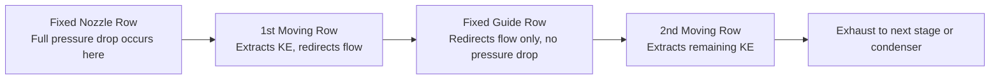

## Impulse Turbine Principles and Velocity Diagrams

### Overview

An impulse turbine converts the kinetic energy of a high-velocity steam jet into mechanical work by changing the direction (and hence the momentum) of the steam as it flows over curved blades, without any significant pressure drop occurring within the moving blade passages. All enthalpy drop takes place in fixed nozzles; the moving blades merely redirect the jet.

**Key Points**

- Pressure drop occurs entirely in the nozzles (fixed blades); pressure remains essentially constant across the moving blades.
- Steam velocity is very high at nozzle exit and decreases as it passes over the moving blades.
- Force on the blades arises purely from the rate of change of momentum of the steam jet.
- The degree of reaction is theoretically zero (ignoring friction effects that create a small actual reaction).
- Classic example: the De Laval turbine (single-stage impulse turbine).

### Basic Working Principle

Steam expands from boiler pressure to condenser pressure entirely within one or more sets of fixed nozzles, converting pressure energy into kinetic energy. This high-speed jet strikes curved moving blades mounted on a rotor. The blades are shaped to deflect the steam through an angle, and the resulting change in momentum produces a tangential force that drives the rotor. Since the blade passage cross-section is essentially constant, the relative velocity magnitude across the blade changes only due to friction — ideally it stays the same, only its direction changes.

$$\Delta p_{nozzle} \gg 0, \qquad \Delta p_{moving\ blade} \approx 0$$

### Stages and Staging Methods

A single-stage impulse turbine (Pelton-type arrangement adapted to steam, or "de Laval" turbine) is simple but requires very high blade speeds to extract kinetic energy efficiently, causing high rotational speeds impractical for direct coupling to generators. Two staging methods reduce blade velocity to practical levels while still using nozzle-only expansion:

- **Pressure staging (Rateau staging):** the total pressure drop is divided across multiple stages in series, each with its own set of nozzles and moving blades. Steam velocity leaving each stage is moderate, allowing lower blade speeds.
- **Velocity staging (Curtis staging):** the entire pressure drop occurs in a single nozzle row, producing a very high-velocity jet. This jet then passes through alternate rows of moving and fixed blades (the fixed blades merely redirect the flow, without further pressure drop), extracting the kinetic energy in increments across 2–3 moving rows.

Pressure staging is more thermodynamically efficient (lower individual stage velocity ratios closer to optimum); velocity staging allows a compact, fewer-stage design often used for the first (control) stage of large turbines.

### Velocity Diagram Fundamentals

The velocity diagram (or velocity triangle) is the essential analytical tool for impulse turbine design, relating absolute steam velocity, blade velocity, and relative steam velocity at inlet and outlet of the moving blade.

**Notation (standard convention):**

- $V_1$ = absolute velocity of steam entering the moving blade (nozzle exit velocity)
- $V_2$ = absolute velocity of steam leaving the moving blade
- $V_{r1}$ = relative velocity of steam entering the moving blade
- $V_{r2}$ = relative velocity of steam leaving the moving blade
- $U$ = blade (mean) velocity
- $\alpha_1$ = nozzle angle (angle of $V_1$ with the direction of blade motion)
- $\beta_1$ = blade inlet angle (angle of $V_{r1}$ with the direction of blade motion)
- $\alpha_2$ = angle of $V_2$ with blade motion direction
- $\beta_2$ = blade exit angle (angle of $V_{r2}$ with blade motion direction)
- $V_{w1}, V_{w2}$ = tangential (whirl) components of $V_1$ and $V_2$
- $V_{f1}, V_{f2}$ = axial (flow) components of $V_1$ and $V_2$

**Construction procedure:**

1. Draw $V_1$ at angle $\alpha_1$ from the tangential direction (blade motion direction).
2. Subtract the blade velocity vector $U$ (drawn along the tangential direction) from $V_1$ to obtain $V_{r1}$ — this is the inlet velocity triangle.
3. At blade exit, $V_{r2}$ is obtained from $V_{r1}$ reduced by the blade friction coefficient $k$ (also called the blade velocity coefficient), and turned through the blade exit angle: $V_{r2} = k \cdot V_{r1}$ (ideal, frictionless case: $k = 1$).
4. Add $U$ back to $V_{r2}$ vectorially to obtain $V_2$, the absolute exit velocity — this is the outlet velocity triangle.
5. In practice, both triangles are superimposed on a common base (the blade velocity line) to form a single composite velocity diagram.

### Diagram — Combined Velocity Triangle (svg_diagram)

<svg xmlns="http://www.w3.org/2000/svg" viewBox="0 0 700 380" font-family="Arial, sans-serif">
<text x="350" y="25" font-size="16" text-anchor="middle" font-weight="bold">Combined Velocity Triangle for Impulse Blade (svg_diagram)</text>

<line x1="80" y1="300" x2="620" y2="300" stroke="black" stroke-width="2" />
<text x="350" y="320" font-size="14" text-anchor="middle">U (blade velocity)</text>
<polygon points="620,300 610,295 610,305" fill="black" />

<circle cx="300" cy="300" r="3" fill="black" />
<text x="300" y="315" font-size="12" text-anchor="middle">O</text>

<line x1="80" y1="300" x2="300" y2="300" stroke="none" />
<line x1="80" y1="300" x2="300" y2="60" stroke="#1a5fb4" stroke-width="2.5" />
<polygon points="300,60 292,78 308,78" fill="#1a5fb4" />
<text x="180" y="165" font-size="14" fill="#1a5fb4" font-weight="bold">V1</text>
<text x="120" y="290" font-size="12">α1</text>

<line x1="80" y1="300" x2="300" y2="60" stroke="none" />
<line x1="80" y1="300" x2="300" y2="60" stroke="none" />

<line x1="80" y1="300" x2="300" y2="60" stroke="none" />

<line x1="300" y1="300" x2="120" y2="90" stroke="#c01c28" stroke-width="2.5" />
<polygon points="120,90 132,105 112,102" fill="#c01c28" />
<text x="230" y="180" font-size="14" fill="#c01c28" font-weight="bold">Vr1</text>
<text x="270" y="290" font-size="12">β1</text>

<line x1="300" y1="300" x2="480" y2="120" stroke="#2ec27e" stroke-width="2.5" />
<polygon points="480,120 465,128 472,138" fill="#2ec27e" />
<text x="420" y="180" font-size="14" fill="#2ec27e" font-weight="bold">Vr2</text>
<text x="330" y="290" font-size="12">β2</text>
<line x1="620" y1="300" x2="480" y2="120" stroke="#f5921e" stroke-width="2.5" />
<polygon points="480,120 495,128 490,138" fill="#f5921e" />
<text x="520" y="180" font-size="14" fill="#f5921e" font-weight="bold">V2</text>
<text x="560" y="290" font-size="12">α2</text>

<line x1="300" y1="300" x2="300" y2="60" stroke="#888" stroke-width="1" stroke-dasharray="4,3" />
<text x="308" y="180" font-size="11" fill="#555">Vf1</text>
<line x1="80" y1="300" x2="300" y2="300" stroke="#888" stroke-width="1" stroke-dasharray="4,3" />
<text x="180" y="298" font-size="11" fill="#555">Vw1</text>
<legend x="0" y="0" />
<text x="80" y="345" font-size="12" fill="#1a5fb4">■ V1 = Absolute inlet velocity</text>
<text x="80" y="362" font-size="12" fill="#c01c28">■ Vr1 = Relative inlet velocity</text>
<text x="360" y="345" font-size="12" fill="#2ec27e">■ Vr2 = Relative exit velocity</text>
<text x="360" y="362" font-size="12" fill="#f5921e">■ V2 = Absolute exit velocity</text>
</svg>

### Force, Power, and Efficiency Relations

**Tangential force on the blade (per unit mass flow rate):**

$$F_t = \dot{m}(V_{w1} + V_{w2})$$

(The sign convention adds $V_{w2}$ when the exit whirl component opposes the blade motion direction, which is the typical case for a well-designed blade; if $V_{w2}$ is in the same direction as $U$, it is subtracted.)

**Work done per unit mass flow (diagram/rotor work):**

$$W = U(V_{w1} \pm V_{w2})$$

**Axial thrust** (must be balanced by thrust bearings):

$$F_a = \dot{m}(V_{f1} - V_{f2})$$

**Diagram efficiency (blading efficiency):**

$$\eta_{diagram} = \frac{\text{Work done on blade}}{\text{Kinetic energy supplied}} = \frac{2U(V_{w1} \pm V_{w2})}{V_1^2}$$

**Stage efficiency** accounts for nozzle losses as well:

$$\eta_{stage} = \eta_{nozzle} \times \eta_{diagram}$$

**Blade velocity coefficient** (accounts for friction loss over blade surface):

$$k = \frac{V_{r2}}{V_{r1}} \quad (k < 1 \text{ in real blades, typically } 0.7\text{–}0.9)$$

### Optimum Blade Speed Ratio

For a single-stage impulse turbine with symmetric blades ($\beta_1 = \beta_2$) and $k = 1$, maximizing diagram efficiency with respect to the blade speed ratio $\rho = U/V_1$ gives:

$$\rho_{optimum} = \frac{U}{V_1} = \frac{\cos\alpha_1}{2}$$

At this optimum ratio, the maximum diagram efficiency becomes:

$$\eta_{diagram,max} = \cos^2\alpha_1$$

This result explains why practical nozzle angles $\alpha_1$ are kept small (typically 15°–22°) — smaller $\alpha_1$ increases the theoretical maximum efficiency, though very small angles increase frictional/windage losses and reduce the effective flow area, so a practical compromise is used.

**Example**

Steam leaves the nozzle at $V_1 = 600\ \text{m/s}$ with nozzle angle $\alpha_1 = 20°$. The blade is symmetric ($\beta_1 = \beta_2$) with a blade velocity coefficient $k = 0.85$. Find the optimum blade speed and the maximum diagram efficiency.

1. Optimum blade speed ratio: $\rho = \dfrac{\cos 20°}{2} = \dfrac{0.9397}{2} = 0.4698$
2. Optimum blade speed: $U = 0.4698 \times 600 = 281.9\ \text{m/s}$
3. Maximum diagram efficiency (ideal, $k=1$): $\eta_{diagram} = \cos^2 20° = 0.883 \Rightarrow 88.3\%$
4. With friction ($k = 0.85$), actual diagram efficiency is reduced below this ideal value because $V_{w2}$ is scaled down by $k$; recomputing work with $V_{r2} = 0.85 V_{r1}$ typically drops actual diagram efficiency to roughly 75–80% for this configuration. [Inference — exact value depends on precise triangle geometry recomputation with $k$ applied]

### Multi-Stage (Velocity-Compounded) Diagram — Curtis Stage

In velocity staging, the same high-velocity jet from a single nozzle row passes through successive moving-fixed-moving blade rows. Each successive row extracts a further share of the kinetic energy, with the fixed blade row between them simply redirecting flow without changing its magnitude (ideally).

Each subsequent moving row operates on a progressively lower absolute velocity, so blade speed ratio requirements differ per row — typically the first moving row is designed near $\rho \approx \cos\alpha_1/4$ (half the single-stage optimum) rather than $\cos\alpha_1/2$, since the kinetic energy is shared across two moving rows.

### Impulse vs. Reaction Turbines — Contrast

| Aspect | Impulse Turbine | Reaction Turbine |
| --- | --- | --- |
| Pressure drop location | Entirely in nozzles (fixed blades) | Divided between fixed and moving blades |
| Blade passage shape | Constant cross-section (no acceleration) | Converging (accelerates flow, like a nozzle) |
| Degree of reaction | 0 (ideal) | Typically 50% (Parsons stage) |
| Relative velocity | Ideally constant magnitude ($V_{r1} \approx V_{r2}$) except for friction | Increases across moving blade ($V_{r2} > V_{r1}$) |
| Blade speed for same output | Requires higher blade speed per stage or velocity compounding | Lower blade speed feasible with pressure compounding |
| Axial thrust | Comparatively lower | Higher (due to pressure drop across moving blades) |
| Typical application | High-pressure/first stages, compact designs | Low/medium pressure stages, large modern turbines |

### Common Losses Affecting Real Impulse Stages

- **Friction losses** in nozzle and blade passages (accounted for via nozzle coefficient $C_v$ and blade velocity coefficient $k$).
- **Windage and disc friction** losses from the rotor disc churning through steam-vapor atmosphere in the casing.
- **Leaving loss** — kinetic energy in $V_2$ that is not recovered, especially significant if $\alpha_2$ is far from 90°.
- **Partial admission losses** in stages where nozzles do not surround the full annulus (common in small/first stages), causing blade windage during the non-admission arc.
- **Wetness losses** in low-pressure stages as steam quality drops below 1.0.

### Practical Design Notes

- Blade angles $\beta_1$ and $\beta_2$ are typically close (near-symmetric blading) to maximize the change in whirl velocity for a given relative velocity magnitude.
- Nozzle angle selection balances thermodynamic (diagram) efficiency against practical flow area and manufacturing constraints.
- Real turbines rarely operate at the exact optimum $\rho$ across all load conditions, since $V_1$ and $U$ relationships shift with throttle/governing changes; designers often choose slightly off-optimum $\rho$ for better part-load performance. [Inference]

**Next Steps**

- Reaction Turbine Principles and the 50% Reaction (Parsons) Stage
- Compounding of Steam Turbines: Pressure vs. Velocity Compounding (detailed derivation)
- Nozzle Design: Convergent vs. Convergent-Divergent Nozzles and Choked Flow
- Turbine Blade Losses and Efficiency Corrections (Soderberg/Ainley correlations)
- Governing and Partial Admission in Impulse Stages
- Stage Efficiency vs. Reheat Factor in Multi-Stage Turbines