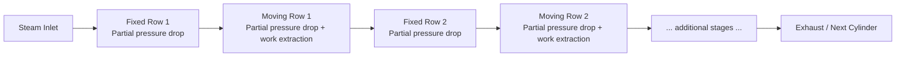

## Reaction Turbine Principles and Stage Design

### Overview

A reaction turbine develops rotor torque through both the momentum change of the steam jet (impulse effect) and the reactive thrust produced as steam accelerates through converging moving-blade passages (reaction effect). Unlike an impulse turbine, pressure drop occurs progressively across both fixed and moving blade rows, meaning the moving blades themselves act as nozzles.

**Key Points**

- Pressure drop is shared between fixed (guide) blades and moving blades.
- Moving blade passages are converging, causing relative velocity to increase across them ($V_{r2} > V_{r1}$).
- The most common practical design is the 50% reaction stage, also called the Parsons stage.
- Reaction stages generally achieve higher stage efficiency at moderate blade speeds compared to single impulse stages, but require more stages and produce higher axial thrust.
- Blade profiles in a reaction stage resemble aerofoil/nozzle-shaped sections rather than the simple curved buckets of impulse blades.

### Basic Working Principle

In a reaction stage, steam expands partially in the fixed blade row (converting some pressure energy to kinetic energy, same as an impulse nozzle) and expands further while flowing through the moving blade row. Because the moving blades are shaped as converging passages, the steam accelerates relative to the blade as it passes through, and this acceleration produces a reactive force on the blade — analogous to the thrust of a rocket nozzle — in addition to the impulse force from the change in flow direction.

$$\Delta p_{fixed\ blades} > 0, \qquad \Delta p_{moving\ blades} > 0$$

### Degree of Reaction

The degree of reaction $R$ quantifies the fraction of the total stage enthalpy drop that occurs in the moving blades relative to the total enthalpy drop across the stage:

$$R = \frac{\Delta h_{moving}}{\Delta h_{fixed} + \Delta h_{moving}}$$

An equivalent kinematic definition, useful for velocity-diagram-based analysis:

$$R = \frac{V_{r2}^2 - V_{r1}^2}{(V_1^2 - V_2^2) + (V_{r2}^2 - V_{r1}^2)}$$

- $R = 0$: pure impulse stage (all drop in fixed blades).
- $R = 1$: pure reaction stage (all drop in moving blades) — rarely used alone, since it demands very high blade speeds for good efficiency.
- $R = 0.5$: the Parsons (50%) reaction stage — the industry-standard configuration, where fixed and moving blade rows have identical (mirror-image) profiles.

### The 50% Reaction (Parsons) Stage

At $R = 0.5$, the fixed blade row and moving blade row are geometrically symmetric — the fixed blades act exactly like moving blades seen from a stationary frame. This symmetry gives:

$$\alpha_1 = \beta_2, \qquad \beta_1 = \alpha_2, \qquad V_1 = V_{r2}, \qquad V_{r1} = V_2$$

This symmetry considerably simplifies velocity diagram construction, since only one triangle shape needs to be derived (the outlet triangle is a mirror of the inlet triangle).

### Velocity Diagram — 50% Reaction Stage (svg_diagram)

<svg xmlns="http://www.w3.org/2000/svg" viewBox="0 0 700 400" font-family="Arial, sans-serif">
<text x="350" y="25" font-size="16" text-anchor="middle" font-weight="bold">50% Reaction Stage Velocity Diagram (svg_diagram)</text>

<line x1="80" y1="310" x2="620" y2="310" stroke="black" stroke-width="2" />
<polygon points="620,310 610,305 610,315" fill="black" />
<text x="350" y="330" font-size="14" text-anchor="middle">U (blade velocity)</text>

<circle cx="300" cy="310" r="3" fill="black" />

<line x1="80" y1="310" x2="300" y2="80" stroke="#1a5fb4" stroke-width="2.5" />
<polygon points="300,80 292,98 308,98" fill="#1a5fb4" />
<text x="170" y="180" font-size="14" fill="#1a5fb4" font-weight="bold">V1</text>
<text x="120" y="298" font-size="12">α1</text>

<line x1="300" y1="310" x2="160" y2="130" stroke="#c01c28" stroke-width="2.5" />
<polygon points="160,130 172,144 152,140" fill="#c01c28" />
<text x="200" y="220" font-size="14" fill="#c01c28" font-weight="bold">Vr1</text>
<text x="255" y="298" font-size="12">β1</text>

<line x1="300" y1="310" x2="500" y2="80" stroke="#2ec27e" stroke-width="2.5" />
<polygon points="500,80 484,90 496,98" fill="#2ec27e" />
<text x="430" y="180" font-size="14" fill="#2ec27e" font-weight="bold">Vr2</text>
<text x="340" y="298" font-size="12">β2</text>

<line x1="620" y1="310" x2="460" y2="130" stroke="#f5921e" stroke-width="2.5" />
<polygon points="460,130 472,144 452,140" fill="#f5921e" />
<text x="510" y="220" font-size="14" fill="#f5921e" font-weight="bold">V2</text>
<text x="565" y="298" font-size="12">α2</text>

<line x1="300" y1="310" x2="300" y2="60" stroke="#999" stroke-width="1" stroke-dasharray="3,3" />
<text x="305" y="55" font-size="11" fill="#666">symmetry axis</text>

<text x="80" y="355" font-size="12" fill="`#1a5fb4`">■ V1 = Vr2 (magnitude, at R=0.5)</text>

<text x="380" y="355" font-size="12" fill="`#c01c28`">■ Vr1 = V2 (magnitude, at R=0.5)</text>

<text x="80" y="375" font-size="12" fill="#333">Note: α1 = β2 and β1 = α2 due to blade symmetry</text>

</svg>

### Work Done and Stage Efficiency

Using Euler's turbine equation, the work done per unit mass flow is identical in form to the impulse case:

$$W = U(V_{w1} + V_{w2})$$

For the symmetric 50% reaction stage, this can be shown to simplify (with axial entry assumption, $\alpha_2$ referenced appropriately) to:

$$W = U(2V_1\cos\alpha_1 - U)$$

**Diagram efficiency for the 50% reaction stage:**

$$\eta_{diagram} = \frac{2\rho\cos\alpha_1 - \rho^2}{1 + \rho^2 - 2\rho\cos\alpha_1} \times \text{(adjust per convention)}, \quad \rho = \frac{U}{V_1}$$

A commonly cited closed form (Parsons' stage, zero axial velocity change, symmetric blading) for maximum diagram efficiency is:

$$\eta_{diagram,max} = \frac{2\cos^2\alpha_1}{1+\cos^2\alpha_1}$$

occurring at the optimum blade speed ratio:

$$\rho_{optimum} = \frac{U}{V_1} = \cos\alpha_1$$

**Comparison note:** at the same nozzle angle $\alpha_1$, the maximum diagram efficiency of a 50% reaction stage exceeds that of a single impulse stage ($\cos^2\alpha_1$), because the reaction effect contributes additional useful work without requiring proportionally higher blade speed. [Inference — comparison holds under matched-angle, ideal-friction-free assumptions typically used in textbook derivations]

### Example

A 50% reaction stage has a mean blade diameter such that $U = 150\ \text{m/s}$, and the nozzle (fixed blade) angle is $\alpha_1 = 20°$. Steam enters the fixed blades such that $V_1$ is to be determined at the optimum condition. Find $V_1$ and the maximum diagram efficiency.

1. At optimum: $\rho_{optimum} = \cos 20° = 0.9397$
2. Since $\rho = U/V_1$: $V_1 = U / \rho = 150 / 0.9397 = 159.6\ \text{m/s}$
3. Maximum diagram efficiency: $\eta_{diagram,max} = \dfrac{2\cos^2 20°}{1+\cos^2 20°} = \dfrac{2(0.883)}{1.883} = \dfrac{1.766}{1.883} = 0.938 \Rightarrow 93.8\%$

This illustrates why reaction staging, at matched nozzle angles, yields higher theoretical diagram efficiency than an equivalent impulse stage (88.3% computed for the same $\alpha_1$ in single impulse-stage analysis).

### Multi-Staging: Why Reaction Turbines Need More Stages

Because each reaction stage produces only a modest enthalpy drop (roughly half of it occurring in the moving row, which limits how much pressure can safely and efficiently drop per row while maintaining acceptable blade loading and leakage control), reaction turbines typically employ many more stages than impulse turbines for the same total pressure ratio. This is compensated by simpler, shorter blades and smoother efficiency curves across a wide load range.

### Axial Thrust and Balancing

Because pressure drops across the moving blades themselves, reaction stages generate substantial axial thrust on the rotor (proportional to the pressure differential across each moving row times the annulus area). This is a major design consideration distinguishing reaction turbines from impulse turbines:

$$F_{axial} \approx \sum_{stages} \Delta p_{moving,i} \times A_{annulus,i}$$

**Common balancing methods:**

- **Dummy piston (balance piston):** a piston fixed to the rotor exposed to a pressure differential that opposes the net thrust from the blading.
- **Double-flow arrangement:** splitting steam flow into two opposite axial directions from a central inlet, causing thrust from each half to cancel.
- **Thrust bearings:** sized to absorb any residual unbalanced axial force.

### Blade Profile and Construction Differences from Impulse Blades

- Reaction blades resemble aerofoil or converging-nozzle cross-sections, since the passage must accelerate the flow.
- Full-admission (steam enters around the entire annulus) is standard in reaction stages, unlike some small impulse stages that use partial admission.
- Reaction blading generally requires tighter tip clearances, since leakage of steam over blade tips (bypassing the intended converging passage) causes efficiency loss — this leakage effect is a chief internal loss mechanism in reaction stages.
- Reaction stages are typically shorter and more numerous, with progressively increasing blade height along the flow path to accommodate specific volume increase as pressure falls.

### Losses Specific to Reaction Stages

- **Tip leakage loss:** steam bypassing the blade passage over the tip clearance, more significant in reaction stages than impulse stages because of the pressure differential across the moving row.
- **Carry-over loss:** kinetic energy carried from one stage to the next (partially recovered, unlike a fully dissipated leaving loss in impulse turbines).
- **Blade and disc friction (windage) losses.**
- **Secondary flow losses** from three-dimensional flow effects near the blade root and tip (radial pressure gradient effects), particularly relevant in longer, low-pressure-end reaction blades.

### Impulse vs. Reaction — Design Trade-off Summary

| Aspect | Impulse | 50% Reaction |
| --- | --- | --- |
| Pressure drop per stage | High (in nozzle only) | Lower (split across two rows) |
| Number of stages for given pressure ratio | Fewer | More |
| Blade shape | Simple curved bucket | Aerofoil-like, converging passage |
| Axial thrust | Lower | Higher (needs balancing) |
| Tip leakage sensitivity | Lower | Higher (tight clearances required) |
| Typical use in modern turbines | HP first/control stages | HP, IP, and LP stages broadly, often mixed with impulse stages |

### Practical Design Notes

- Many modern steam turbines use a hybrid approach: an impulse (often velocity-compounded, Curtis) control stage to absorb the largest pressure drop at the throttle, followed by multiple reaction stages for the remaining expansion — combining the compactness of impulse staging with the efficiency of reaction staging.
- Reaction stage design typically assumes constant axial velocity component through the stage as a simplifying design convention, though real designs may deviate for flow-path optimization. [Inference]
- Selection between higher or lower degrees of reaction (deviating from exactly 50%) can be used in advanced designs to tune efficiency and mechanical constraints per stage location in the expansion line.

**Next Steps**

- Compounding of Steam Turbines: Pressure vs. Velocity Compounding
- Nozzle Design: Convergent vs. Convergent-Divergent Nozzles and Choked Flow
- Turbine Blade Losses and Efficiency Corrections (Soderberg/Ainley correlations)
- Governing Methods: Throttle Governing vs. Nozzle Control Governing
- Steam Turbine Cycle Analysis: Reheat and Regenerative Feedwater Heating
- Turbine Blade Root Fixing and Rotor Construction (Disc-and-Diaphragm vs. Drum Construction)