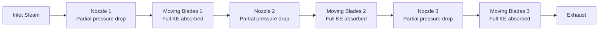
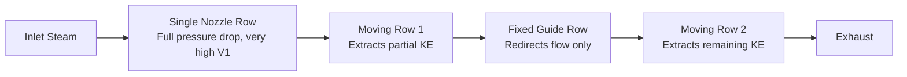
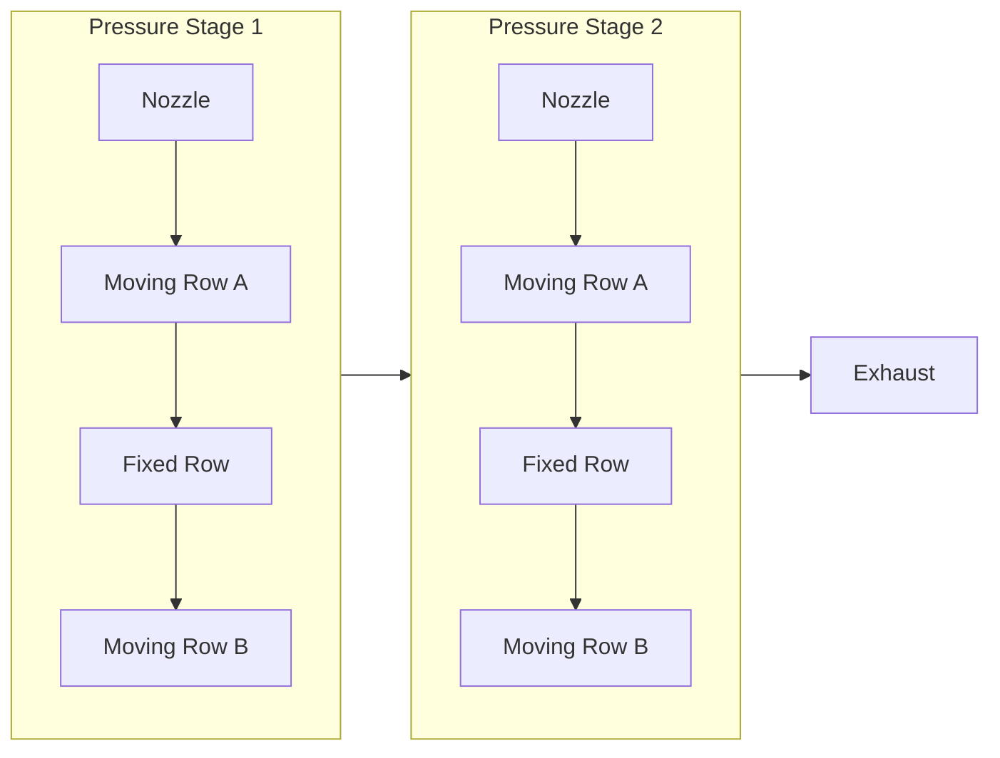

## Turbine Staging and Compounding

### Overview

Compounding is the arrangement of multiple stages within a steam turbine to reduce rotor speed and blade stresses to practical mechanical limits while efficiently extracting the total available enthalpy drop from inlet to exhaust conditions. A single stage expanding the entire pressure/enthalpy drop of typical boiler-to-condenser conditions would demand impractically high blade velocities (often exceeding material strength limits) or produce very low efficiency at practical speeds. Compounding solves this by splitting the total drop across several stages.

**Key Points**

- Compounding methods: pressure compounding, velocity compounding, and pressure-velocity compounding.
- Reaction staging is inherently a form of pressure compounding applied continuously across many low-pressure-drop-per-stage rows.
- Choice of compounding method affects rotor length, number of stages, blade stress, efficiency, and cost.
- Real turbines commonly combine methods: a velocity-compounded (Curtis) first stage for governing/control, followed by pressure-compounded reaction or impulse stages.

### Why Compounding Is Necessary

For a single-stage impulse turbine, the optimum blade speed ratio relationship $\rho_{opt} = \cos\alpha_1 / 2$ means that extracting a large enthalpy drop with a single nozzle row requires a very high $V_1$, and therefore an impractically high $U$ (blade speed) to stay near the efficiency optimum. Excessive blade speed causes:

- Excessive centrifugal stress on rotor discs and blade roots.
- Very high rotational speeds unsuitable for direct generator coupling (typically 3000/3600 rpm for grid-frequency generators).
- Poor diagram efficiency if the turbine is instead run at a practical (lower) speed far from the optimum $\rho$.

Compounding addresses this by dividing the enthalpy drop (and therefore the kinetic energy to be handled) across multiple stages, keeping each stage's required blade speed within practical limits.

### Method 1: Pressure Compounding (Rateau Staging)

The total pressure drop from inlet to exhaust is divided among a series of simple impulse stages arranged in series, each consisting of one nozzle row followed by one moving blade row. All kinetic energy generated in a stage's nozzle is (ideally) fully absorbed by that stage's moving blades before the steam proceeds to the next stage's nozzle.

**Characteristics:**

- Each stage operates near its own optimum $\rho$, since $V_1$ per stage is moderate.
- High overall efficiency, since each stage can be individually tuned near its ideal condition.
- Requires more stages (and hence a longer rotor and casing) for a given total pressure ratio compared to velocity compounding.
- Widely used in multistage impulse turbines and is the standard basis of most reaction turbine designs (where pressure is compounded continuously across fixed and moving rows).

### Method 2: Velocity Compounding (Curtis Staging)

The entire pressure drop (or a large fraction of it) occurs in a single nozzle row, producing one very high-velocity jet. This jet's kinetic energy is then extracted incrementally across two or three moving blade rows, separated by fixed guide blade rows that only redirect the flow direction without further pressure drop.

**Characteristics:**

- Fewer stages needed for the same total enthalpy drop, giving a shorter, more compact, and often cheaper turbine section.
- Lower efficiency than pressure compounding, because later moving rows operate at velocity ratios increasingly far from their individual optimum.
- Commonly used as the first (control/governing) stage of larger turbines, since it can absorb a large pressure drop compactly and helps with partial-load governing by nozzle control.
- Blade speed requirement for optimum first-row operation is roughly halved compared to a single impulse stage handling the same total drop, since the energy is shared: $\rho_{opt,row\ n} \approx \cos\alpha_1/(2n)$ for the $n$-th moving row in idealized analysis. [Inference — exact optimum shifts depend on interstage angle and friction assumptions]

### Method 3: Pressure-Velocity Compounding

A hybrid approach: the total pressure drop is divided into several pressure stages (as in pressure compounding), but within each pressure stage, the resulting kinetic energy is further extracted using velocity compounding (multiple moving rows per nozzle row). This combines moderate blade speed requirements with a reduced total stage count compared to pure pressure compounding.

### Comparison of Compounding Methods

| Aspect | Pressure Compounding | Velocity Compounding | Pressure-Velocity Compounding |
| --- | --- | --- | --- |
| Number of stages for given drop | More | Fewer | Intermediate |
| Efficiency | Highest | Lowest | Intermediate |
| Rotor/casing length | Longer | Shorter | Intermediate |
| Cost | Higher (more stages) | Lower | Intermediate |
| Typical application | Multistage impulse/reaction turbines, main expansion path | First (control) stage of large turbines | Medium-capacity turbines balancing cost and efficiency |
| Blade speed per stage | Moderate, near-optimum | Higher demand relieved across rows | Moderate |

### Reaction Staging as Continuous Pressure Compounding

Reaction turbines inherently compound pressure across a large number of low-pressure-drop stages, since the 50% degree of reaction naturally limits how much enthalpy drop a single stage can efficiently absorb without excessive blade stress or leakage loss. This is why reaction turbines have proportionally more stages than an equivalent-capacity impulse turbine, but achieve smoother efficiency curves across load ranges.

### Work and Efficiency Considerations Across Compounded Stages

**Total stage work** across $n$ pressure-compounded stages (assuming each stage individually operates near its own optimum):

$$W_{total} = \sum_{i=1}^{n} U_i (V_{w1,i} + V_{w2,i})$$

**Reheat factor** in multi-stage turbines: because each stage's isentropic expansion line diverges slightly from the overall isentropic line on the Mollier (h-s) diagram (due to reheating of steam by stage losses feeding into the next stage's available drop), the sum of individual stage isentropic enthalpy drops exceeds the overall isentropic drop between inlet and exhaust conditions. This ratio is the reheat factor:

$$RF = \frac{\sum \Delta h_{isentropic,stage}}{\Delta h_{isentropic,overall}} > 1$$

**Overall (internal) turbine efficiency** relates to individual stage efficiency via the reheat factor:

$$\eta_{overall} = \eta_{stage,avg} \times RF$$

Typical reheat factor values range roughly from 1.03 to 1.08 for multistage turbines, meaning multistaging recovers a small efficiency bonus (a few percent) compared to a hypothetical single ideal expansion, because "wasted" heat from friction/losses in earlier stages remains available (as slightly higher enthalpy/entropy) for extraction in later stages. [Unverified — typical numeric range varies by source and specific turbine design; treat as an order-of-magnitude reference]

### Example — Selecting a Compounding Strategy

A turbine must expand steam from a throttle condition with a large available enthalpy drop (e.g., high-pressure inlet to a moderate exhaust pressure) at a shaft speed fixed by grid frequency (3000 rpm, 50 Hz). A single impulse stage would require an unrealistically high blade tip speed to stay near optimum efficiency. Design resolution:

1. Use a velocity-compounded (2-row Curtis) first stage to absorb a large pressure drop compactly and to serve as the governing stage (nozzle control governing operates well with a Curtis stage).
2. Follow with several pressure-compounded reaction stages to expand the remaining pressure drop efficiently down to exhaust conditions, since reaction staging gives superior efficiency for the bulk of the expansion.
3. Verify axial thrust management (dummy piston or double-flow arrangement) given the reaction section's inherent thrust generation.
4. Check reheat factor and stage-by-stage state points on the Mollier diagram to confirm the total isentropic drop is properly accounted for in overall efficiency calculations.

This hybrid impulse-then-reaction compounding arrangement is common in real multistage industrial and utility steam turbines.

### Governing Interaction with Compounding Choice

- **Throttle governing** (varying inlet steam pressure via a throttle valve) works with any compounding arrangement but reduces available enthalpy drop and efficiency at part load.
- **Nozzle control (group) governing** — sequentially opening sets of first-stage nozzle groups — pairs naturally with a velocity-compounded first stage, since a Curtis stage can tolerate partial-arc admission without severe efficiency penalty at partial loads, unlike reaction stages which require full admission.

### Practical Design Notes

- The choice of compounding scheme is driven by a trade-off between capital cost (fewer stages, shorter rotor) and operating efficiency (more stages, closer-to-optimum velocity ratios per stage).
- Large modern utility turbines almost universally use pressure-compounded reaction stages for the bulk of the LP and IP sections, often preceded by an impulse (sometimes Curtis) control stage in the HP section.
- Mechanical constraints (critical shaft speed, blade natural frequency, disc stress limits) interact with the number and arrangement of stages chosen during detailed design. [Inference]

**Next Steps**

- Nozzle Design: Convergent vs. Convergent-Divergent Nozzles and Choked Flow
- Turbine Governing Methods: Throttle, Nozzle Control, and Bypass Governing
- Mollier (h-s) Diagram Analysis of Multistage Expansion
- Turbine Blade Losses and Efficiency Correlations (Soderberg/Ainley Methods)
- Rotor Construction: Disc-and-Diaphragm vs. Drum-Type Rotors
- Steam Turbine Cycle Enhancements: Reheat and Regenerative Feedwater Heating