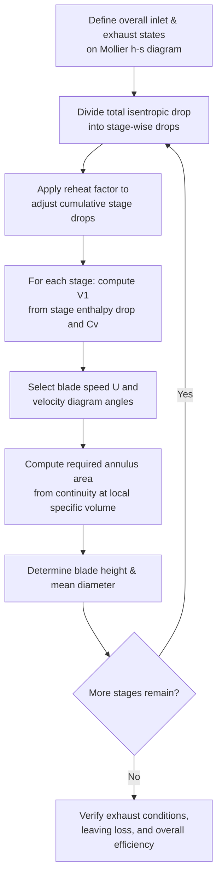

## Steam Nozzles and Steam Path Design

### Overview

Steam nozzles convert enthalpy (pressure and thermal energy) into kinetic energy by accelerating steam flow through a specially shaped duct. Nozzle design governs how efficiently a turbine stage converts available enthalpy drop into the high-velocity jet needed for blade work, while steam path design extends this concept across the full expansion line — sizing flow passages, blade heights, and annulus areas stage-by-stage to accommodate the changing specific volume of steam as it expands from inlet to exhaust.

**Key Points**

- Nozzle type (convergent vs. convergent-divergent) depends on the pressure ratio across it relative to the critical pressure ratio.
- Steam accelerates in a convergent nozzle up to sonic velocity at the throat; beyond that, a divergent section is required for further (supersonic) acceleration.
- The steam path is designed considering continuity, increasing specific volume, blade height (annulus area) growth, and stage-by-stage state points on the Mollier diagram.
- Nozzle efficiency and friction losses are captured by the nozzle velocity coefficient $C_v$.
- Supersaturation (metastable expansion) can occur in the low-pressure wet-steam region, affecting nozzle behavior.

### Nozzle Flow Fundamentals

For adiabatic, frictionless (isentropic) flow through a nozzle, the steady-flow energy equation gives the ideal (theoretical) exit velocity as a function of the isentropic enthalpy drop:

$$V_{ideal} = \sqrt{2(h_1 - h_{2s})} \quad \text{(SI units: velocity in m/s, enthalpy in J/kg)}$$

Or in the commonly used engineering form (enthalpy in kJ/kg):

$$V_{ideal} = 44.72\sqrt{h_1 - h_{2s}}$$

where $h_1$ is the inlet specific enthalpy and $h_{2s}$ is the isentropic exit specific enthalpy corresponding to the exit pressure.

**Actual exit velocity**, accounting for friction losses in the nozzle, is:

$$V_{actual} = C_v \times V_{ideal}$$

where $C_v$ is the nozzle velocity coefficient (typically 0.93–0.98 for well-designed nozzles).

**Nozzle efficiency:**

$$\eta_{nozzle} = \frac{V_{actual}^2}{V_{ideal}^2} = C_v^2$$

### Critical Pressure Ratio and Choking

As the pressure ratio across a convergent nozzle increases (i.e., downstream pressure decreases relative to upstream), the mass flow rate and exit velocity increase — up to a limit. At the **critical pressure ratio**, the flow at the throat reaches sonic velocity (Mach 1), and further reduction in downstream pressure cannot increase the mass flow rate through a convergent-only nozzle. This condition is called **choking**.

**Critical pressure ratio** for steam (approximate, depending on state):

$$\left(\frac{p_2}{p_1}\right)_{critical} = \left(\frac{2}{n+1}\right)^{n/(n-1)}$$

where $n$ is the isentropic index appropriate to the steam condition:

- Dry saturated steam: $n \approx 1.135$, giving critical pressure ratio $\approx 0.577$
- Superheated steam: $n \approx 1.3$, giving critical pressure ratio $\approx 0.546$
- Wet steam (Zeuner's approximation region): $n \approx 1.035 + 0.1x$ (where $x$ is initial dryness fraction) is sometimes used in older references. [Unverified — index selection conventions vary between textbooks; treat exact numeric constants as reference values, not universal]

At the throat under choked conditions, the flow velocity equals the local sonic velocity:

$$V_{throat} = \sqrt{n \cdot p_{throat} \cdot v_{throat}}$$

### Convergent vs. Convergent-Divergent Nozzles

| Aspect | Convergent Nozzle | Convergent-Divergent (De Laval) Nozzle |
| --- | --- | --- |
| Pressure ratio across nozzle | Above critical ratio | Below critical ratio |
| Maximum velocity achievable | Sonic (at throat) | Supersonic (at diverging exit) |
| Application | Impulse stages with moderate pressure drop per stage, most reaction stage fixed/moving blade passages | High-pressure-ratio single/first stages, condensing turbine last-stage nozzles, steam jet ejectors |
| Behavior if operated below design back-pressure | Under-expansion, some KE loss to turbulent expansion after exit | Over/under-expansion losses if back-pressure doesn't match design exit pressure |
| Throat sizing | Throat = exit (smallest section is exit) | Throat is minimum area; divergent section area increases based on required exit Mach number |

### Convergent-Divergent Nozzle Sizing

For a convergent-divergent nozzle designed for a specific supersonic exit condition, the exit area is determined from the continuity equation using the expected exit specific volume (much larger than at the throat, since steam continues expanding and increasing in specific volume through the divergent section):

$$A_{exit} = \frac{\dot{m} \cdot v_{exit}}{V_{exit}}$$

$$A_{throat} = \frac{\dot{m} \cdot v_{throat}}{V_{throat}}$$

The divergence angle is typically kept small (around 10°–12° included angle) to minimize flow separation and divergence losses while keeping nozzle length reasonable.

### Nozzle Cross-Section Profile (svg_diagram)

<svg xmlns="http://www.w3.org/2000/svg" viewBox="0 0 700 260" font-family="Arial, sans-serif">
<text x="350" y="25" font-size="16" text-anchor="middle" font-weight="bold">Convergent-Divergent Nozzle Profile (svg_diagram)</text>

<path d="M 60,80 C 200,80 260,140 320,150 C 380,160 500,60 640,40" fill="none" stroke="#1a5fb4" stroke-width="3" />

<path d="M 60,180 C 200,180 260,120 320,110 C 380,100 500,200 640,220" fill="none" stroke="#1a5fb4" stroke-width="3" />

<line x1="60" y1="80" x2="60" y2="180" stroke="#1a5fb4" stroke-width="3" />
<text x="60" y="205" font-size="12" text-anchor="middle">Inlet (p1, V1≈0)</text>

<line x1="320" y1="150" x2="320" y2="110" stroke="#c01c28" stroke-width="2" stroke-dasharray="4,3" />
<text x="320" y="230" font-size="12" text-anchor="middle" fill="#c01c28">Throat (sonic, M=1)</text>

<line x1="640" y1="40" x2="640" y2="220" stroke="#1a5fb4" stroke-width="3" />
<text x="640" y="240" font-size="12" text-anchor="middle">Exit (supersonic, M&gt;1)</text>

<line x1="100" y1="130" x2="600" y2="130" stroke="#888" stroke-width="1" stroke-dasharray="6,4" />
<polygon points="600,130 588,124 588,136" fill="#888" />
<text x="350" y="145" font-size="11" fill="#666">Flow direction — steam accelerates throughout</text>

<text x="150" y="70" font-size="12" fill="#333">Convergent section</text>

<text x="480" y="30" font-size="12" fill="#333">Divergent section</text>

</svg>

### Effect of Friction and Boundary Layer on Nozzle Flow

Real nozzle flow deviates from the ideal isentropic case due to wall friction, generating entropy and slightly increasing the actual exit enthalpy above the isentropic value:

$$h_{2,actual} = h_1 - C_v^2(h_1 - h_{2s})$$

This "reheat" of the steam due to friction is recoverable in subsequent stages (contributing to the reheat factor discussed in multi-stage compounding), but represents an irreversible loss within the nozzle itself. Additional losses include:

- **Divergence loss** in convergent-divergent nozzles from non-parallel exit flow if the divergence angle is too large.
- **Boundary layer thickening** reducing effective flow area, requiring a discharge coefficient correction to the geometric area.
- **Supersaturation (metastable flow):** in the wet-steam region, condensation lags behind the pressure drop due to the very short residence time in the nozzle, causing steam to exist briefly in a metastable superheated-like state below the saturation line before rapid ("Wilson line") condensation occurs. This affects both the effective expansion index and measured nozzle efficiency in wet-steam-region nozzles.

### Steam Path Design — Blade Height and Annulus Area

As steam expands through successive stages, its specific volume increases substantially (especially in low-pressure stages approaching condenser vacuum). To maintain roughly constant axial velocity and avoid excessive flow acceleration or stage choking, the annulus area (and hence blade height) must increase progressively along the steam path.

**Continuity relation per stage:**

$$\dot{m} = \frac{A \cdot V_f}{v}$$

where $A$ is the annulus flow area, $V_f$ is the axial (flow) velocity component, and $v$ is the specific volume at that stage.

Since $v$ can increase by one or two orders of magnitude from HP inlet to LP exhaust (condensing turbines), blade heights typically grow from a few centimeters in HP stages to well over a meter in the last LP stages of large utility turbines. This growth is constrained by:

- **Mean diameter vs. blade height ratio:** very long blades relative to mean diameter increase 3D flow effects (radial pressure gradients, secondary flow losses) and require twisted (vortex-designed) blading rather than simple constant-profile blading.
- **Centrifugal stress limits:** longer, faster-moving (larger mean diameter) LP blades experience high centrifugal stress, limiting maximum practical blade length and tip speed.
- **Last-stage exit loss (leaving loss):** kinetic energy in the final stage exhaust that is not recovered is a significant efficiency factor in LP stage design, since $V_2$ magnitude and direction at the last stage strongly affects overall cycle efficiency.

### Steam Path Design — Stage-by-Stage Layout (Mollier Diagram Approach)

Steam path design proceeds by plotting the overall expansion line on the h-s (Mollier) diagram from throttle conditions to exhaust/condenser conditions, then subdividing this line into individual stage enthalpy drops (accounting for the reheat factor), and sizing each stage's nozzle throat area, blade height, and mean diameter to satisfy continuity and the target velocity diagram at that stage's local conditions.

### Example — Nozzle Exit Velocity and Area Calculation

Steam enters a nozzle at $h_1 = 3200\ \text{kJ/kg}$ and expands isentropically to $h_{2s} = 3000\ \text{kJ/kg}$. Given $C_v = 0.96$, mass flow rate $\dot{m} = 5\ \text{kg/s}$, and exit specific volume $v_2 = 0.15\ \text{m}^3/\text{kg}$, find the actual exit velocity and the required nozzle exit area.

1. Ideal (isentropic) velocity: $V_{ideal} = 44.72\sqrt{3200-3000} = 44.72\sqrt{200} = 44.72 \times 14.14 = 632.3\ \text{m/s}$
2. Actual exit velocity: $V_{actual} = 0.96 \times 632.3 = 607.0\ \text{m/s}$
3. Required exit area: $A = \dfrac{\dot{m} \cdot v_2}{V_{actual}} = \dfrac{5 \times 0.15}{607.0} = \dfrac{0.75}{607.0} = 1.236\times10^{-3}\ \text{m}^2$ (approximately $12.36\ \text{cm}^2$)

### Nozzle and Steam Path Losses Summary

| Loss Mechanism | Location | Primary Effect |
| --- | --- | --- |
| Nozzle friction | Fixed nozzle passage | Reduces $V_{actual}$ below $V_{ideal}$ ($C_v < 1$) |
| Divergence loss | Divergent section | Non-axial exit velocity components reduce useful KE |
| Supersaturation | Wet-steam region nozzles | Altered effective expansion behavior, delayed condensation |
| Secondary/tip leakage flow | Blade passages, especially long LP blades | 3D flow losses, reduced effective work |
| Leaving (exhaust) loss | Last stage exit | Unrecovered kinetic energy at turbine exhaust |
| Wetness loss | LP wet-steam stages | Reduced efficiency and blade erosion risk as dryness fraction drops |

### Practical Design Notes

- Nozzle throat area is the primary control for mass flow rate under choked conditions — this principle underlies nozzle-control governing, where opening additional nozzle groups increases effective throat area and thus flow at part load.
- Steam path designers commonly use a "constant axial velocity" or "free vortex" design approach for long LP blades to manage the radial variation in blade speed $U$ (since $U = \omega r$ varies significantly from root to tip on long blades).
- Erosion protection (e.g., hardened leading edges or moisture-removal features) becomes a key steam path design consideration in low-pressure stages where dryness fraction approaches or falls below about 0.88–0.90. [Inference — specific threshold varies by turbine manufacturer and blade material]

**Next Steps**

- Turbine Governing Methods: Throttle, Nozzle Control, and Bypass Governing
- Mollier (h-s) Diagram Analysis of Multistage Expansion
- Wetness and Erosion Effects in Low-Pressure Turbine Stages
- Turbine Blade Losses and Efficiency Correlations (Soderberg/Ainley Methods)
- Rotor Construction: Disc-and-Diaphragm vs. Drum-Type Rotors
- Condenser and Exhaust System Design for Steam Turbines