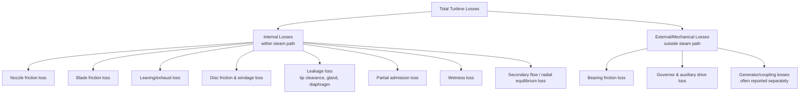
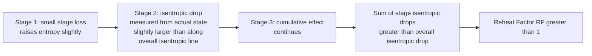

## Turbine Losses and Efficiency

### Overview

Steam turbine efficiency is governed by the cumulative effect of internal losses occurring throughout the expansion path — in nozzles, moving blades, clearances, exhaust, and mechanical/auxiliary systems — that cause actual work output to fall short of the ideal (isentropic) work available from a given enthalpy drop. Understanding and quantifying these losses is essential for stage design, performance prediction, and diagnosing underperformance in operating turbines.

**Key Points**

- Efficiency is assessed at multiple levels: nozzle, diagram (blading), stage, internal (overall internal), and mechanical/overall.
- Losses are broadly classified as internal (thermodynamic/aerodynamic, within the steam path) and external (mechanical, auxiliary).
- The reheat factor causes multistage overall efficiency to slightly exceed the simple average of individual stage efficiencies.
- Key loss mechanisms include friction, leakage, leaving loss, wetness, and disc/windage losses.
- Efficiency definitions must be carefully distinguished, since different references may define "stage efficiency" or "internal efficiency" with different scope boundaries.

### Efficiency Definitions Hierarchy

**Nozzle efficiency** — captures friction loss within the nozzle only:

$$\eta_{nozzle} = \frac{V_{actual}^2}{V_{ideal}^2} = C_v^2$$

**Diagram (blading) efficiency** — ratio of actual work done on the blades (from the velocity diagram) to the kinetic energy supplied to the moving blades:

$$\eta_{diagram} = \frac{W}{\tfrac{1}{2}V_1^2} = \frac{U(V_{w1} \pm V_{w2})}{\tfrac{1}{2}V_1^2}$$

**Stage efficiency** — combines nozzle and diagram efficiency, representing the fraction of the stage's isentropic enthalpy drop actually converted to blade work:

$$\eta_{stage} = \eta_{nozzle} \times \eta_{diagram} = \frac{W}{\Delta h_{isentropic,stage}}$$

**Internal (overall internal) efficiency** — accounts for the reheat factor across all stages plus stage-to-stage carry-over and other cumulative internal effects:

$$\eta_{internal} = \eta_{stage,avg} \times RF$$

**Overall (brake or shaft) efficiency** — further reduces internal efficiency by mechanical losses (bearing friction, governor drive, etc.):

$$\eta_{overall} = \eta_{internal} \times \eta_{mechanical}$$

**Mechanical efficiency:**

$$\eta_{mechanical} = \frac{\text{Shaft (brake) power output}}{\text{Internal (indicated) power developed by steam}}$$

### Classification of Losses

### Internal Loss Mechanisms in Detail

**1. Nozzle friction loss:** Boundary layer friction along nozzle walls reduces actual exit velocity below the ideal isentropic value, quantified by $C_v$ (typically 0.93–0.98). This "lost" kinetic energy reappears as increased enthalpy (partial reheating) of the steam entering the moving blades, feeding into the reheat factor recovery mechanism.

**2. Blade friction loss:** Friction as steam flows over the moving blade surface reduces relative exit velocity below the ideal value, captured by the blade velocity coefficient:

$$k = \frac{V_{r2}}{V_{r1}} \quad (\text{typically } 0.7\text{–}0.9)$$

**3. Leaving (exhaust) loss:** Kinetic energy in the final stage's exit absolute velocity $V_2$ that is not recovered as useful work, particularly significant when $\alpha_2$ deviates substantially from 90° (i.e., when there is a large residual tangential or excessive axial velocity component leaving the last stage):

$$\text{Leaving loss} = \frac{V_{2,last\ stage}^2}{2}$$

This loss is a major factor in condensing turbine LP-end design, since the exhaust must flow into a large-diameter condenser neck at low pressure with correspondingly high specific volume and velocity.

**4. Disc friction (windage) loss:** Power dissipated by the rotor disc "paddling" through the steam-filled casing atmosphere, roughly proportional to $\rho \cdot D^4 \cdot N^3$ (density, disc diameter to the fourth power, rotational speed cubed) — this loss is especially significant in impulse stages using partial admission, and in stages operating in low-density (vacuum-side) environments where windage can still be non-negligible due to high rotational speed.

**5. Leakage losses:**

- **Tip clearance leakage:** steam bypassing the intended blade passage over the radial clearance gap between blade tip and casing (or diaphragm), more significant in reaction stages due to the pressure differential across moving rows.
- **Gland (shaft seal) leakage:** steam escaping along the shaft where it penetrates the casing, controlled by labyrinth glands.
- **Diaphragm leakage:** in reaction and impulse-reaction hybrid designs, leakage across the diaphragm packing that separates stages.

**6. Partial admission loss:** In stages where nozzles occupy only part of the annular arc (common in small HP control stages), blades experience windage drag during the non-admission arc, and there are additional losses at the sudden admission/cutoff boundaries ("scavenging" losses).

**7. Wetness loss:** As steam expands into the two-phase (wet) region in LP stages, liquid droplets do not accelerate as efficiently as vapor, causing a velocity lag between phases and reduced effective kinetic energy transfer. An approximate empirical correction (Baumann's rule) is commonly applied:

$$\eta_{wet\ stage} = \eta_{dry\ stage} \times \left[1 - K(1-\bar{x})\right]$$

where $\bar{x}$ is the mean dryness fraction across the stage and $K$ is the Baumann coefficient (commonly taken as approximately 0.4–1.0 depending on convention and blade design). [Unverified — Baumann coefficient value varies by source; some references specify K≈1 for the simplified form, others use stage-specific empirical values]

**8. Secondary flow and radial equilibrium losses:** Three-dimensional flow effects near blade root and tip, including secondary vortices generated by the interaction of the blade boundary layer with the annulus wall boundary layers, become increasingly significant for long, low-aspect-ratio blades typical of LP stages.

### External (Mechanical) Losses

- **Bearing friction:** power dissipated in journal and thrust bearings supporting the rotor.
- **Governor and auxiliary equipment drive:** power tapped off the shaft to drive the governor mechanism, lubricating oil pumps (if shaft-driven), and similar auxiliaries.
- These losses are typically small relative to internal losses (often only 1–3% of total power) but are still tracked separately since they represent losses outside the thermodynamic steam path.

### Reheat Factor and Its Role in Efficiency

Because friction losses in each stage "reheat" the steam slightly (raising its enthalpy above what a purely isentropic expansion would give at that pressure), the available isentropic enthalpy drop for each subsequent stage — measured from the actual (not ideal) state point — is slightly larger than it would be along a single overall isentropic line. Summing these individual stage isentropic drops gives a total exceeding the overall isentropic drop between inlet and final exhaust pressure, expressed by the reheat factor:

$$RF = \frac{\sum_{i} \Delta h_{isentropic,stage\ i}}{\Delta h_{isentropic,overall}} > 1$$

This is illustrated on the Mollier (h-s) diagram, where the actual expansion "condition line" lies to the right of (higher entropy than) the ideal isentropic line, causing constant-pressure lines to fan out slightly as entropy increases, giving each successive stage a marginally larger isentropic drop for the same pressure ratio.

### Example — Efficiency Chain Calculation

A turbine stage has nozzle velocity coefficient $C_v = 0.96$, diagram efficiency $\eta_{diagram} = 0.82$, average stage efficiency across all stages of $\eta_{stage,avg} = 0.78$, reheat factor $RF = 1.04$, and mechanical efficiency $\eta_{mechanical} = 0.98$. Find the nozzle efficiency, internal efficiency, and overall efficiency.

1. Nozzle efficiency: $\eta_{nozzle} = C_v^2 = 0.96^2 = 0.9216 \Rightarrow 92.16\%$
2. Verification of stage efficiency consistency: $\eta_{stage} = \eta_{nozzle} \times \eta_{diagram} = 0.9216 \times 0.82 = 0.756 \Rightarrow 75.6\%$ (close to the given average, as expected for a representative stage)
3. Internal efficiency: $\eta_{internal} = \eta_{stage,avg} \times RF = 0.78 \times 1.04 = 0.8112 \Rightarrow 81.12\%$
4. Overall efficiency: $\eta_{overall} = \eta_{internal} \times \eta_{mechanical} = 0.8112 \times 0.98 = 0.795 \Rightarrow 79.5\%$

### Loss Distribution — Typical Order of Magnitude

| Loss Type | Typical Relative Magnitude | Most Affected Section |
| --- | --- | --- |
| Nozzle friction | Small–moderate (2–8% of stage KE) | All stages |
| Blade friction | Small–moderate (10–30% reduction in relative velocity via k) | All stages |
| Leaving loss | Small (early stages), significant (last stage) | LP last stage |
| Disc friction/windage | Small overall, notable in partial-admission HP stages | HP control stage |
| Leakage (tip/gland/diaphragm) | Small–moderate, cumulative | Reaction stages, long blades |
| Wetness loss | Moderate–significant | LP wet-steam stages |
| Mechanical losses | Very small (1–3%) | Bearings, governor drive |

*(Note: figures are illustrative order-of-magnitude ranges for conceptual understanding; actual values are turbine- and load-specific.)* [Unverified]

### Factors Affecting Overall Efficiency in Practice

- **Load (part-load operation):** efficiency typically peaks near design load and falls off at very low or very high loads due to off-optimum velocity ratios and increased relative losses (e.g., windage becomes proportionally larger at low flow).
- **Steam conditions:** higher inlet pressure/temperature (supercritical, ultra-supercritical conditions) generally allow higher cycle efficiency but require careful blade material and stress considerations.
- **Condenser vacuum:** deeper vacuum increases available enthalpy drop but also increases specific volume and leaving loss challenges at the LP exhaust.
- **Blade and seal condition:** erosion, fouling, and seal wear over operational lifetime progressively degrade efficiency from as-designed values. [Inference]
- **Manufacturing tolerances:** tip clearances, surface finish, and profile accuracy directly affect leakage and friction loss magnitudes relative to design intent.

### Practical Design and Diagnostic Notes

- Comparing measured stage pressure/temperature data against design Mollier diagram state points is a standard diagnostic technique for identifying which stages are underperforming (excess entropy rise indicates higher-than-design losses in that stage).
- Turbine performance testing (per standards such as ASME PTC 6) provides acceptance test methodology for verifying guaranteed efficiency and heat rate values. [Unverified — specific standard applicability depends on turbine type, contract terms, and testing scope]
- Baumann's rule (or refined modern wetness-loss correlations) remains widely used as a first-order correction for LP wet-stage efficiency in preliminary design, though more detailed CFD-based wetness models are used in modern detailed design.

**Next Steps**

- Mollier (h-s) Diagram Analysis of Multistage Expansion
- Wetness and Erosion Effects in Low-Pressure Turbine Stages
- Turbine Governing Methods: Throttle, Nozzle Control, and Bypass Governing
- Condenser and Exhaust System Design for Steam Turbines
- Steam Turbine Cycle Enhancements: Reheat and Regenerative Feedwater Heating
- Turbine Performance Testing and Heat Rate Calculation