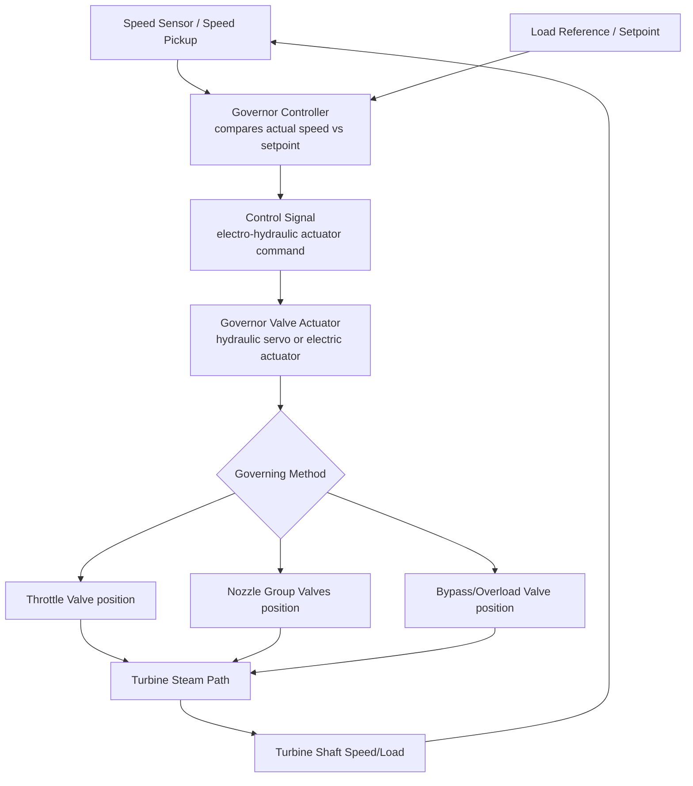

## Governing and Control Systems

### Overview

Governing systems regulate steam turbine speed and load by controlling steam flow into the turbine in response to changes in demand, while control systems encompass the broader instrumentation and protection logic (speed, pressure, vibration, temperature monitoring) that ensures safe, stable operation across the full load range. Effective governing is essential both for maintaining constant rotational speed (critical for grid-frequency-synchronized generators) and for protecting the turbine from dangerous overspeed conditions, particularly upon sudden loss of electrical load.

**Key Points**

- Governing methods: throttle governing, nozzle control (group) governing, and bypass (relief valve) governing.
- The governor responds to speed deviation, adjusting steam flow to restore the setpoint.
- Modern turbines predominantly use electro-hydraulic governing systems rather than purely mechanical flyball governors.
- Overspeed trip systems provide independent emergency protection distinct from normal governing.
- Governing method choice interacts with turbine staging design (nozzle control pairs naturally with velocity-compounded first stages).

### Why Governing Is Necessary

A steam turbine driving a synchronous generator connected to an electrical grid must maintain a nearly constant rotational speed (matching grid frequency — 3000 rpm for 50 Hz systems, 3600 rpm for 60 Hz systems) regardless of fluctuations in electrical load demand. Without active control:

- An increase in electrical load would decelerate the turbine-generator shaft (since more energy is being extracted electrically than is being supplied by steam), risking under-frequency operation.
- A sudden loss of electrical load (e.g., generator breaker trip) would cause the turbine to rapidly accelerate toward dangerous overspeed, since the mechanical steam energy input would suddenly exceed the (near-zero) electrical output, risking rotor damage from excessive centrifugal stress.

The governing system continuously senses speed (and often load) and adjusts steam flow to counteract these effects, while independent overspeed protection systems provide a final safety layer.

### Governing Methods

**1. Throttle Governing**

A single control (throttle) valve upstream of the turbine inlet is throttled (partially closed) to reduce steam pressure and flow when less power is required, and opened further as demand increases.

- **Mechanism:** throttling is an irreversible (constant enthalpy, roughly) process that reduces steam pressure without doing useful work, so the turbine effectively operates on a lower available enthalpy drop at part load.
- **Advantage:** simple, applicable to any stage/compounding arrangement (impulse or reaction), full-arc admission maintained at all times (uniform, symmetric flow around the annulus).
- **Disadvantage:** throttling losses reduce part-load efficiency, since energy is thermodynamically "wasted" as an irreversible pressure drop rather than being converted to work.

**2. Nozzle Control (Group) Governing**

The first-stage nozzles are divided into multiple groups, each controllable by a separate governor valve. At part load, some nozzle groups are shut completely (rather than throttled), while the remaining active groups operate at or near full design pressure drop and efficiency.

- **Mechanism:** reducing flow by closing groups of nozzles (partial-arc admission) rather than throttling all the flow, so active nozzle groups continue operating near their design pressure ratio and efficiency.
- **Advantage:** better part-load efficiency than throttle governing, since most of the flow that IS passing through active nozzles is not throttled.
- **Disadvantage:** requires a stage design tolerant of partial admission (commonly a velocity-compounded/Curtis first stage, since impulse stages handle partial admission better than reaction stages); introduces partial-admission losses (windage on non-admitting arc, transient blade loading as blades pass in and out of the admission arc) and non-uniform thermal/mechanical loading around the annulus.

**3. Bypass (Overload/Relief Valve) Governing**

Used to permit brief overload operation beyond normal maximum capacity: a bypass valve admits additional steam directly into a downstream (intermediate) stage, bypassing the earlier stages, when load demand exceeds what the normal admission path can supply.

- **Mechanism:** supplementary steam is injected at an intermediate pressure point in the expansion, adding mass flow (and hence power) beyond the capacity of the initial stages alone.
- **Advantage:** allows short-term overload capability without oversizing the entire turbine for a rarely-needed peak condition.
- **Disadvantage:** bypassed steam does not do work in the skipped stages, so overload operation is less efficient than normal-range operation; used only for occasional peak/overload conditions, not continuous operation.

**Combination governing:** many turbines combine throttle governing (fine control, especially at low part-load and during startup) with nozzle control (coarser, more efficient control across the main load range) and bypass governing (for overload capability).

### Governing System Architecture

### Mechanical (Flyball/Centrifugal) Governors — Classical Reference

Historically, turbines used mechanical centrifugal (flyball) governors: rotating weights driven off the turbine shaft move outward under centrifugal force as speed increases, and this radial movement is mechanically linked to the governor valve, closing it as speed rises above setpoint and opening it as speed falls.

**Governor characteristic (droop):** classical mechanical (and many modern) governors are designed with intentional "speed droop" — a small proportional decrease in speed as load increases — to allow stable load sharing between multiple generators operating in parallel on a common grid:

$$\text{Droop} (\%) = \frac{N_{no-load} - N_{full-load}}{N_{rated}} \times 100$$

Typical droop settings for grid-connected turbine-generators are commonly in the range of 4–5%. [Unverified — exact standard droop value varies by grid code and utility practice]

### Modern Electro-Hydraulic and Digital Governing Systems

Contemporary turbines predominantly use **Electro-Hydraulic Control (EHC)** or fully digital governing systems:

- **Speed sensing:** electronic (magnetic pickup or similar) speed sensors provide fast, accurate speed feedback compared to mechanical flyball mechanisms.
- **Controller:** a digital control system (often integrated into the plant's Distributed Control System, DCS) implements the governing algorithm (typically PID-based speed/load control) and coordinates with plant-level load dispatch signals.
- **Actuation:** electro-hydraulic servo valves position the governor (steam admission) valves based on the digital controller's output signal, combining fast electronic response with the high force capability of hydraulic actuation needed to move large steam valves against high differential pressure.
- **Advantages over mechanical governors:** faster response, more precise control, easier integration with plant automation and remote load dispatch, adjustable control parameters without mechanical modification, and better diagnostic/monitoring capability.

### Overspeed Protection — Independent from Normal Governing

Overspeed protection is a distinct, independent safety system from normal governing, designed to trip (rapidly close) the main stop/emergency valves if speed exceeds a dangerous threshold, protecting against catastrophic rotor failure.

- **Mechanical overspeed trip (classical):** an eccentric spring-loaded bolt or ring mounted on the shaft that flies outward at a preset overspeed (commonly around 110% of rated speed) to mechanically trip the trip/throttle valve linkage independent of the normal governor.
- **Electronic overspeed protection:** redundant electronic speed sensors independently monitor speed and trigger rapid closure of stop and control valves via the trip system if overspeed thresholds are exceeded, often with multiple independent trip channels (e.g., 2-out-of-3 voting logic) for reliability.
- **Typical trip setpoint:** commonly around 110% of rated speed for the primary overspeed trip, with additional backup/mechanical trip typically set slightly higher, though exact values are turbine-manufacturer- and application-specific. [Unverified — exact trip setpoints vary by manufacturer, turbine type, and regulatory/design standard]

### Governing Response to Load Rejection

A sudden and complete loss of electrical load (generator breaker opens unexpectedly) is one of the most demanding transient events for a governing system:

1. Electrical load instantaneously drops to near zero, but steam flow (and hence mechanical power input) initially remains at its pre-trip value.
2. The rotor rapidly accelerates due to the large excess of mechanical power input over (near-zero) electrical output.
3. The governor must rapidly close the governing (and if necessary, stop) valves to cut steam flow before the overspeed trip threshold is reached.
4. Governor valve closure speed and governor loop response time are critical design/tuning parameters to ensure the turbine does not reach the independent overspeed trip setpoint during this transient — successfully "riding through" a full load rejection without tripping is a key design and commissioning test criterion for many turbines.

### Governing Method Comparison

| Aspect | Throttle Governing | Nozzle Control Governing | Bypass Governing |
| --- | --- | --- | --- |
| Part-load efficiency | Lower (throttling loss across full range) | Higher (active nozzles near design efficiency) | Not applicable to normal range; used for overload only |
| Stage compatibility | Any staging arrangement | Best suited to impulse (especially velocity-compounded) first stage | Requires an intermediate admission point in the design |
| Complexity | Simplest | More complex (multiple valve/nozzle groups) | Additional valve and piping, used occasionally |
| Typical use | Small turbines, or combined with nozzle control for fine control | Medium–large turbines for efficient part-load operation | Peak/overload capability in larger units |

### Practical Design and Operational Notes

- Governing valve sequencing (the order in which multiple nozzle-control valves open as load increases) is typically designed to maintain smooth, near-linear power output versus valve position, and to minimize the number of valves operating in a partially-throttled (least efficient) state at any given load. [Inference]
- Governor tuning (PID gains, valve response rates) must balance fast disturbance rejection (for grid stability and overspeed protection) against avoiding excessive valve wear or steam path thermal cycling from overly aggressive control action.
- Integration with plant-level automatic generation control (AGC) allows the turbine governor to respond to grid dispatch signals for frequency regulation and economic load allocation across multiple generating units, subject to droop and response rate limits.
- Startup and low-load operation typically rely more heavily on throttle (or a dedicated startup/bypass) governing due to partial-admission thermal and mechanical loading concerns at very low steam flows through nozzle-control groups. [Inference]

**Next Steps**

- Overspeed Protection and Turbine Trip Systems
- Distributed Control System (DCS) Integration for Power Plant Turbines
- Load Rejection and Turbine Transient Response Analysis
- Turbine Startup Procedures and Thermal Stress Management
- Condenser and Exhaust System Design for Steam Turbines
- Turbine Performance Testing and Heat Rate Calculation