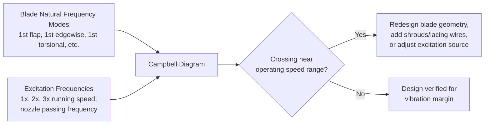

## Turbine Blade Materials and Design Considerations

### Overview

Steam turbine blades operate under a demanding combination of high centrifugal stress, steam bending forces, elevated temperature (in HP/IP stages), corrosive/erosive wet-steam environments (in LP stages), and cyclic/vibratory loading. Blade material selection and mechanical design must jointly satisfy strength, creep resistance, corrosion/erosion resistance, and fatigue/vibration requirements across vastly different operating conditions from the HP inlet to the LP exhaust.

**Key Points**

- Blade materials vary by stage location: high-temperature alloy steels for HP/IP stages, stainless steels for LP stages, often with erosion-resistant treatments at LP last-stage leading edges.
- Primary stresses on a blade: centrifugal tensile stress, bending stress from steam force, and thermal stress from temperature gradients.
- Blade root fixing methods (fir-tree, T-root, pinned) transmit centrifugal and bending loads from blade to disc.
- Vibration (natural frequency) analysis is essential to avoid resonance with harmonics of rotational speed or nozzle passing frequency (Campbell diagram analysis).
- Erosion protection at LP last-stage leading edges is a critical durability consideration due to water droplet impact in wet steam.

### Operating Environment by Stage Location

| Stage Location | Typical Temperature | Typical Pressure | Key Material Concerns |
| --- | --- | --- | --- |
| HP (high-pressure) | Up to ~565–620°C in modern supercritical/ultra-supercritical units | High | Creep strength, high-temperature oxidation resistance, thermal fatigue |
| IP (intermediate-pressure) | Moderate–high (often reheat temperature, similar to HP) | Moderate | Creep strength, corrosion resistance |
| LP (low-pressure) | Low, often into the wet-steam (two-phase) region | Low, down to vacuum at condenser end | Corrosion, erosion (water droplet impact), stress corrosion cracking, long-blade centrifugal stress |

### Primary Stresses on Turbine Blades

**1. Centrifugal (tensile) stress:** the dominant stress in long, high-speed rotating blades, arising from the blade's own mass rotating at high angular velocity:

$$\sigma_{centrifugal} = \rho \cdot \omega^2 \cdot \int_{r}^{r_{tip}} r \, dr \approx \frac{\rho \omega^2}{2}(r_{tip}^2 - r^2)$$

for a uniform cross-section blade, where $\rho$ is blade material density, $\omega$ is angular velocity, and $r$ is the radial position of interest (stress is maximum at the blade root, $r = r_{root}$).

**2. Bending stress:** caused by the tangential and axial steam forces acting on the blade (from the momentum/reaction forces analyzed via the velocity diagram), producing a bending moment about the blade root, particularly significant for longer blades with larger moment arms.

**3. Thermal stress:** arising from temperature gradients within the blade (e.g., during rapid startup/shutdown transients) and from differential thermal expansion between blade and disc/rotor materials, most significant in HP/IP stages exposed to high and rapidly changing steam temperatures.

**4. Vibratory (dynamic/fatigue) stress:** superimposed cyclic stresses from unsteady aerodynamic forces (e.g., nozzle wake passing frequency, partial admission pulsing) that can cause high-cycle fatigue failure if a blade's natural frequency coincides with an excitation frequency (resonance).

### Blade Material Selection by Stage

**HP and IP Stage Blades:**

- **Martensitic stainless/alloy steels** (e.g., 12% chromium steels, such as those in the AISI 400-series family) are widely used for their combination of good creep strength, oxidation resistance at elevated temperature, and adequate toughness.
- **Advanced alloy steels** with additions of molybdenum, vanadium, and other elements provide improved creep-rupture strength for higher-temperature ultra-supercritical applications.
- **Nickel-based superalloys** may be used in the most demanding, highest-temperature locations of advanced ultra-supercritical or specialty turbines, though this is less common than in gas turbine applications due to steam turbine temperatures generally being lower than gas turbine hot-section temperatures.

**LP Stage Blades:**

- **Stainless steels** (often 12–13% chromium martensitic stainless steels, sometimes precipitation-hardened variants) are standard for LP blading, balancing adequate strength with corrosion resistance in the wet-steam environment.
- **Titanium alloys** are used in some modern large last-stage LP blades (especially very long blades in large utility turbines) due to titanium's favorable strength-to-density ratio, which reduces centrifugal stress for a given blade length compared to steel — enabling longer last-stage blades and improved cycle efficiency (lower leaving loss) for large condensing turbines. [Unverified — titanium blade adoption is manufacturer- and unit-specific, not universal across all turbine designs]

**Erosion-Resistant Treatments:**

- **Stellite (cobalt-chromium alloy) shields or inserts** brazed or otherwise attached to the leading edge of last-stage LP blades, providing hard, erosion-resistant surfaces to withstand high-velocity water droplet impact from the wet steam.
- **Flame/induction hardening** of blade leading edges as an alternative or supplementary erosion protection method.
- **Laser shock peening or other surface treatments** may be applied in some modern designs to improve fatigue resistance in addition to erosion protection. [Inference — specific treatment combinations are proprietary and manufacturer-specific]

### Blade Root (Fixing) Types

The blade root transmits the combined centrifugal force, bending moment, and vibratory loads from the blade aerofoil into the rotor disc or drum. Common root designs include:

- **Fir-tree (Christmas-tree) root:** a serrated, multi-tooth profile that distributes load across multiple engagement surfaces, widely used in modern turbines for its efficient load distribution and relatively compact axial length.
- **T-root (or inverted T-root):** a simpler T-shaped root engaging a corresponding T-shaped groove in the disc rim, used in some designs, particularly for smaller or lower-stress blades.
- **Pinned root:** an older design using a pin through blade root and disc lugs, less common in modern high-stress applications but historically significant.
- **Side-entry vs. axial-entry root:** describes the direction blades are inserted into the disc groove during assembly, affecting disc rim design and blade retention method (locking pieces/blades at the groove ends).

### Blade Root Cross-Section (svg_diagram)

<svg viewBox="0 0 500 380" xmlns="http://www.w3.org/2000/svg" font-family="Arial, sans-serif">
<text x="250" y="25" font-size="16" text-anchor="middle" font-weight="bold">Fir-Tree Blade Root Profile (svg_diagram)</text>
<!-- Blade aerofoil (simplified) -->
<path d="M 220,40 C 260,50 270,90 250,140 C 235,160 225,150 220,140 C 210,90 200,55 220,40 Z" fill="#a8c8f0" stroke="#1a5fb4" stroke-width="2"/>
<text x="330" y="90" font-size="12" fill="#1a5fb4">Aerofoil (blade body)</text>
<!-- Platform -->
<rect x="180" y="140" x2="320" y="160" width="140" height="20" fill="#c8c8c8" stroke="#555" stroke-width="1.5"/>
<text x="330" y="155" font-size="12" fill="#333">Platform</text>
<!-- Fir tree root (serrated teeth) -->

<path d="M 210,160
L 195,175 L 210,180
L 190,200 L 210,205
L 185,225 L 210,230
L 190,250 L 210,255
L 210,290
L 290,290
L 290,255 L 310,250
L 290,230 L 315,225
L 290,205 L 310,200
L 290,180 L 305,175
L 290,160 Z" fill="`#e8b830`" stroke="#333" stroke-width="1.5"/>

<text x="340" y="220" font-size="12" fill="#333">Fir-tree root (serrated teeth)</text>

<text x="340" y="238" font-size="12" fill="#333">engages matching</text>

<text x="340" y="256" font-size="12" fill="#333">disc rim groove</text>

<!-- Disc rim representation -->
<rect x="150" y="290" width="200" height="60" fill="#d0d0d0" stroke="#555" stroke-width="1.5"/>
<text x="250" y="325" font-size="13" text-anchor="middle" fill="#333">Rotor Disc Rim</text>
<!-- centrifugal force arrow -->
<line x1="235" y1="140" x2="235" y2="60" stroke="#c01c28" stroke-width="2"/>
<polygon points="235,60 228,75 242,75" fill="#c01c28"/>
<text x="245" y="75" font-size="12" fill="#c01c28">Centrifugal force</text>
</svg>

### Vibration and Resonance Considerations

Blades are subject to periodic excitation forces at frequencies related to shaft rotational speed and the number of upstream/downstream stationary vanes (nozzle passing frequency = number of nozzles × rotational speed). If a blade's natural frequency coincides with such an excitation frequency (or its harmonics) at an operating speed, resonance can cause rapid fatigue failure.

**Campbell diagram** is the standard tool for vibration design verification: it plots blade natural frequencies (for various vibration modes) against rotational speed, alongside lines representing excitation frequencies (multiples of running speed, nozzle passing frequency, etc.). Design intent is to avoid intersections ("crossings") of natural frequency lines with excitation lines at or near the normal operating speed range, or to ensure adequate margin if a crossing is unavoidable at an off-design or transient speed.

**Mitigation techniques for problematic resonances:**

- **Shrouding (integral or separate shroud bands)** connecting blade tips in groups, altering the coupled vibration mode frequencies of the blade group.
- **Lacing wires** (damping wires threaded through mid-span holes in a row of blades) used particularly in some LP long-blade designs to provide friction damping and alter modal frequencies.
- **Snubbers/dampers** at blade tips or mid-span to provide friction damping between adjacent blades.
- **Geometric redesign** (changing blade thickness distribution, root fillet, or aerofoil profile) to shift natural frequencies away from problematic excitation lines.

### Erosion Mechanisms in LP Stages

As steam expands into the wet-steam (two-phase) region in LP stages, water droplets form and, due to their higher inertia relative to vapor, lag behind the accelerating vapor flow. This creates a relative velocity between droplets and blade surfaces, particularly pronounced at the leading edge of rotating blades (especially the last stage, operating at the highest blade tip speeds and wettest steam conditions), causing progressive material erosion from repeated droplet impact.

**Erosion mitigation approaches:**

- Stellite shields or hardened leading-edge inserts (as noted above).
- Moisture separation features upstream (e.g., moisture-removal grooves in stationary blade rows, external moisture separators in some cycle designs) to reduce the liquid fraction reaching the most vulnerable rotating blade rows.
- Blade profile design to minimize local droplet impact velocity and angle where practical.

### Example — Centrifugal Stress Estimate

A uniform-section LP last-stage blade has root radius $r_{root} = 0.8\ \text{m}$, tip radius $r_{tip} = 1.3\ \text{m}$, material density $\rho = 7800\ \text{kg/m}^3$ (typical steel), and rotates at $N = 3000\ \text{rpm}$. Estimate the centrifugal stress at the blade root (uniform cross-section approximation).

1. Angular velocity: $\omega = \dfrac{2\pi N}{60} = \dfrac{2\pi \times 3000}{60} = 314.16\ \text{rad/s}$
2. Centrifugal stress at root:

   $$\sigma_{root} = \frac{\rho \omega^2}{2}(r_{tip}^2 - r_{root}^2) = \frac{7800 \times 314.16^2}{2}(1.3^2 - 0.8^2)$$
3. Compute: $314.16^2 = 98{,}696$; $\dfrac{7800 \times 98{,}696}{2} = 384{,}913{,}200$; $(1.69 - 0.64) = 1.05$
4. $\sigma_{root} = 384{,}913{,}200 \times 1.05 \approx 4.04\times10^{8}\ \text{Pa} = 404\ \text{MPa}$

This illustrates why long LP last-stage blades are among the most heavily stressed components in the turbine, motivating the use of lower-density materials (e.g., titanium) or tapered/twisted blade profiles (reducing effective mass at larger radii) to manage stress within material allowable limits.

### Tapering and Twisting of Long Blades

Long blades (especially LP last-stage blades) are typically **tapered** (cross-sectional area decreasing from root to tip) to reduce centrifugal stress at the root compared to a uniform-section blade, and **twisted** (blade angle varying along the span) to accommodate the variation in blade speed $U = \omega r$ from root to tip, maintaining a near-optimum velocity triangle at each radial section (a "free vortex" or similar radial design approach).

### Practical Design and Material Notes

- Blade material selection must jointly satisfy creep-rupture strength (HP/IP, long-term high-temperature service) or corrosion/erosion resistance (LP, wet-steam) along with adequate fatigue strength across the full range of steady and transient operating conditions.
- Non-destructive testing (ultrasonic, dye penetrant, etc.) of blade roots and aerofoils is a standard quality control and in-service inspection practice, given the safety-critical nature of blade integrity at high rotational speeds. [Inference]
- Root design (fir-tree profile details, number of teeth, engagement length) is typically optimized via finite element analysis to achieve acceptable stress concentration factors at each engagement point. [Inference]
- Material and design choices are continuously evolving with advances in ultra-supercritical steam conditions (requiring higher-temperature-capable alloys) and larger, more efficient LP last-stage designs (favoring advanced materials like titanium for longer blades).

**Next Steps**

- Wetness and Erosion Effects in Low-Pressure Turbine Stages
- Rotor Construction: Disc-and-Diaphragm vs. Drum-Type Rotors
- Turbine Vibration Analysis and Campbell Diagram Applications
- Creep and Fatigue Life Assessment of High-Temperature Turbine Components
- Turbine Startup Procedures and Thermal Stress Management
- Condenser and Exhaust System Design for Steam Turbines