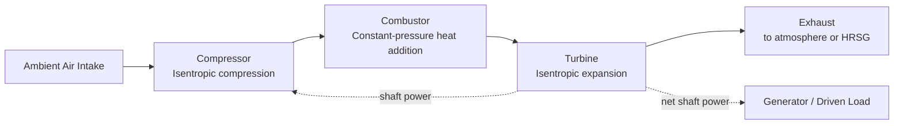
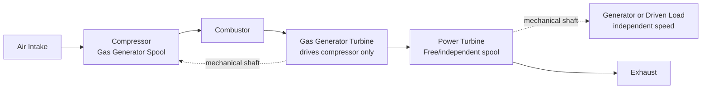

## Gas Turbine Components and Configurations

### Overview

A gas turbine (combustion turbine) converts fuel chemical energy into mechanical shaft work through a continuous cycle of air compression, fuel combustion, and hot-gas expansion, typically following the Brayton cycle. The three core components — compressor, combustor, and turbine — are common to virtually all configurations, but arrangement (single-shaft vs. multi-shaft), cycle type (simple vs. regenerative/combined), and application (industrial power generation vs. aeroderivative) vary considerably based on operating requirements.

**Key Points**

- Core components: compressor, combustor (combustion chamber), turbine, all mounted on one or more shafts.
- Two primary configurations: single-shaft (all compressor and turbine stages on one shaft) and multi-shaft/split-shaft (separate gas generator and power turbine shafts).
- Industrial (heavy-duty frame) gas turbines and aeroderivative gas turbines represent two major design philosophies with different trade-offs.
- Auxiliary systems (fuel, lubrication, starting, control) are essential for safe and reliable operation alongside the core thermodynamic components.
- Combined-cycle and cogeneration configurations extend the simple Brayton cycle for improved overall efficiency using turbine exhaust heat.

### Core Components

**1. Compressor**

Draws in ambient air and compresses it through a series of rotating (rotor) and stationary (stator) blade rows, raising pressure (and temperature) before combustion. Nearly all modern gas turbines use **axial-flow compressors** (air flows generally parallel to the shaft axis through many stages), though **centrifugal compressors** are used in smaller gas turbines and some auxiliary power units due to their robustness and single-stage pressure ratio capability.

- Compresses air typically to pressure ratios of 10:1 to over 40:1 in modern advanced designs, depending on turbine class and technology generation. [Unverified — exact pressure ratio ranges vary significantly by manufacturer, model, and generation]
- Consumes a very large fraction (commonly 50–65%) of the turbine's gross power output internally, meaning net output is substantially less than the gross power developed by the turbine section. [Unverified — exact fraction depends on pressure ratio, efficiency, and cycle design]

**2. Combustor (Combustion Chamber)**

Fuel (natural gas, liquid distillate, or other fuels) is injected and burned continuously with compressed air from the compressor, raising gas temperature substantially before entry to the turbine section.

- **Can-type combustors:** individual cylindrical combustion cans arranged around the shaft, historically common in early and some industrial designs.
- **Annular combustors:** a single continuous annular combustion chamber surrounding the shaft, common in modern aeroderivative and many industrial designs for more compact packaging and more uniform temperature distribution.
- **Can-annular (cannular) combustors:** a hybrid arrangement with multiple can-shaped liners arranged within a common annular casing, used in various industrial and aero designs.
- Modern combustors increasingly use **Dry Low NOx (DLN) or Dry Low Emissions (DLE)** designs employing lean premixed combustion to minimize NOx formation without water/steam injection.

**3. Turbine (Expander) Section**

Hot, high-pressure gas from the combustor expands through turbine blade rows, extracting energy to drive the compressor and (via additional stages or a separate shaft) the external load (generator, compressor, or other driven equipment).

- Turbine inlet temperatures in modern advanced gas turbines commonly exceed 1400–1600°C in the hottest, most advanced designs, necessitating extensive blade cooling and advanced high-temperature materials. [Unverified — exact firing temperatures are manufacturer/model-specific and continually advancing with technology]
- The first turbine stages (highest temperature) typically use internally air-cooled blades and vanes, along with thermal barrier coatings, to withstand gas temperatures that can exceed the melting point of the base blade material.

### Basic Brayton Cycle Flow

### Single-Shaft Configuration

All compressor stages, turbine stages (both the stages driving the compressor and any additional power-extraction stages), and the driven load (typically a generator) are mounted on a single common shaft rotating at one fixed speed.

**Characteristics:**

- Simpler mechanical arrangement, fewer bearings, generally lower capital cost.
- Runs at a fixed speed (matched to generator synchronous speed via direct coupling or, less commonly, through a gearbox), making it well-suited to constant-speed power generation applications.
- Less flexible for variable-speed mechanical drive applications (e.g., driving a variable-speed compressor or pump) since the entire shaft, including the gas-generator compressor, would need to change speed together.
- Widely used for utility and industrial power generation, especially in larger single-shaft industrial "frame" turbines.

### Multi-Shaft (Split-Shaft / Two-Shaft) Configuration

The gas generator section (compressor plus the turbine stages needed to drive it) rotates as one mechanically independent spool, while a separate **power turbine** (free turbine), aerodynamically coupled only through the gas stream (not mechanically connected to the gas generator shaft), extracts the remaining energy to drive the external load at its own independent speed.

**Characteristics:**

- The power turbine can operate at a speed independent of the gas generator, allowing better matching to variable-speed driven equipment (compressors, pumps) without a gearbox, or allowing a gearbox to more easily adapt power turbine speed to generator speed.
- Common in aeroderivative gas turbines (derived from aircraft jet engine cores) and many mechanical-drive industrial applications.
- Offers operational flexibility (e.g., easier starting, since only the smaller gas generator spool must be brought up to self-sustaining speed initially) compared to spinning up a large single-shaft unit with integrated generator inertia.

### Industrial (Heavy-Duty Frame) vs. Aeroderivative Gas Turbines

| Aspect | Industrial (Heavy-Duty Frame) | Aeroderivative |
| --- | --- | --- |
| Origin | Purpose-designed for stationary power/industrial use | Derived from aircraft jet engine cores, adapted for industrial use |
| Weight/size | Heavier, more robust construction | Lighter, more compact for given power output |
| Startup time | Slower (minutes to tens of minutes to full load) | Faster (can reach full load in a few minutes), valued for peaking/backup applications |
| Efficiency (simple cycle) | Moderate, often optimized for combined-cycle integration | Often higher simple-cycle efficiency due to aero-derived aerodynamic technology |
| Maintenance approach | On-site major maintenance/overhaul common | Modular design often allows engine core swap-out for off-site overhaul |
| Typical application | Base-load and combined-cycle utility power generation | Peaking power, mechanical drive, offshore platforms, distributed generation |

### Cycle Configuration Variants

**Simple Cycle:** the basic Brayton cycle as described above, with turbine exhaust discharged directly to atmosphere. Simplest and lowest-cost configuration, but with comparatively lower thermal efficiency since substantial energy remains in the hot exhaust gas.

**Regenerative (Recuperated) Cycle:** exhaust gas heat is used to preheat compressed air before it enters the combustor (via a recuperator/regenerator heat exchanger), reducing fuel consumption for a given turbine output and improving simple-cycle efficiency, at the cost of additional equipment (recuperator), some pressure drop, and increased capital cost. More common in smaller gas turbines (including some microturbines) where combined-cycle steam bottoming is impractical.

**Combined Cycle:** turbine exhaust heat is recovered in a Heat Recovery Steam Generator (HRSG) to raise steam, which drives a separate steam turbine (Rankine cycle) for additional power output — this Brayton-topping/Rankine-bottoming combination achieves substantially higher overall thermal efficiency than either cycle alone, and is the dominant configuration for modern large gas-fired utility power plants.

**Cogeneration (CHP — Combined Heat and Power):** turbine exhaust heat (directly, or via an HRSG producing process steam) is used to supply industrial process heat or building heating/cooling needs in addition to (or instead of) generating additional electrical power, maximizing overall fuel utilization efficiency for facilities with substantial thermal energy demand alongside power needs.

### Auxiliary and Support Systems

- **Air inlet system:** filtration (to protect compressor blades from fouling/erosion by airborne particulates), inlet guide vanes (often variable, for compressor surge/performance control), and sometimes inlet cooling (evaporative cooling, chilling) to boost power output in hot ambient conditions.
- **Fuel system:** fuel handling, metering, and control appropriate to the fuel type (natural gas, liquid distillate, dual-fuel capability), including fuel gas conditioning/compression as needed for combustor pressure requirements.
- **Lubrication system:** supplies bearings and, in many designs, hydraulic actuators (variable inlet guide vanes, fuel control valves) with lubricating/hydraulic oil, typically including pumps, coolers, and filtration.
- **Starting system:** brings the turbine (or gas generator spool) up to self-sustaining speed, using methods such as an electric starting motor, a static frequency converter driving the generator as a motor, a diesel engine, or (in some older/smaller designs) compressed air or hydraulic starters.
- **Control and protection system:** monitors and controls speed, temperature, vibration, and combustion parameters, and provides automatic protective trip functions for abnormal conditions (overspeed, over-temperature, flame-out, excessive vibration).
- **Cooling systems:** internal blade/vane cooling (compressor-bleed air routed through internal passages of hot-section components) is essential in modern high-firing-temperature turbines to keep metal temperatures within material limits despite gas temperatures that may exceed those limits.

### Rotor and Casing Construction Considerations

- **Casing design:** typically horizontally split for maintenance access in larger industrial units, allowing the upper casing half to be lifted for inspection/repair of internals without full rotor removal.
- **Bearing arrangement:** journal bearings (and thrust bearings to manage axial loads from pressure differentials across compressor and turbine sections) support the rotor(s); multi-shaft designs require careful management of the aerodynamic (non-mechanical) coupling and clearances between gas generator and power turbine sections.
- **Blade cooling architecture:** internal cooling passages (often intricate serpentine channels manufactured via investment casting), film cooling holes on blade surfaces, and thermal barrier coatings (ceramic-based coatings on blade/vane surfaces) collectively manage first-stage and other hot-section component temperatures.

### Example — Component Power Balance Concept

A gas turbine has a gross turbine section output of 150 MW, of which the compressor consumes 90 MW to compress the working air. Estimate the net (useful) shaft power output.

1. Net shaft power = Gross turbine power − Compressor power consumption
2. Net power = 150 MW − 90 MW = 60 MW
3. This illustrates the "back-work ratio" concept: here, back-work ratio = 90/150 = 0.60 (60% of gross turbine work is consumed internally by the compressor), leaving 40% as useful net output — a characteristic feature distinguishing gas turbine (Brayton cycle) plants from steam turbine (Rankine cycle) plants, where pump work consumption is comparatively very small.

### Practical Design Notes

- Configuration selection (single-shaft vs. multi-shaft, simple vs. combined cycle) is driven primarily by the application: fixed-speed power generation favors single-shaft with generator direct-coupled; variable-speed mechanical drive or applications valuing fast-start flexibility often favor multi-shaft aeroderivative designs.
- Combined-cycle configuration is the dominant choice for new large gas-fired base-load and intermediate-load power plants due to its substantially higher overall efficiency compared to simple-cycle operation.
- Ambient conditions (temperature, altitude, humidity) significantly affect gas turbine power output and efficiency (generally decreasing output as ambient temperature rises, due to reduced air density and increased compressor work), motivating inlet cooling systems in hot climates. [Inference]

**Next Steps**

- Brayton Cycle Thermodynamic Analysis and Efficiency
- Gas Turbine Compressor Design: Axial vs. Centrifugal Stages
- Combustion System Design and Emissions Control (Dry Low NOx)
- Turbine Blade Cooling Techniques and Thermal Barrier Coatings
- Combined Cycle Power Plant Design and Heat Recovery Steam Generators
- Gas Turbine Starting Systems and Control Architecture