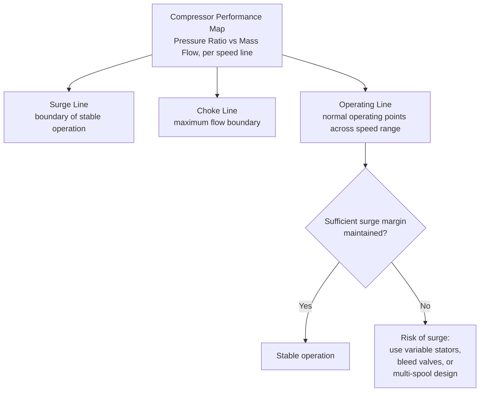

## Axial and Centrifugal Compressor Design

### Overview

The compressor is the component of a gas turbine responsible for raising the pressure of incoming air before combustion, consuming a substantial fraction of the turbine's gross power output in the process. Two fundamentally different aerodynamic approaches are used: axial-flow compressors, which compress air through a series of stages with flow remaining generally parallel to the shaft, and centrifugal (radial) compressors, which use rotational (centrifugal) effects to accelerate and diffuse air radially outward. Each has distinct performance characteristics, efficiency, and application suitability.

**Key Points**

- Axial compressors dominate large gas turbines due to higher achievable efficiency and better matching to high mass flow rates.
- Centrifugal compressors offer robustness, simplicity, and high single-stage pressure ratio, favoring smaller turbines and auxiliary power units.
- Stage pressure rise in axial compressors is limited per stage, requiring many stages in series for high overall pressure ratio.
- Compressor surge and stall are critical operational limits requiring careful aerodynamic design and control (variable stator vanes, bleed valves).
- Velocity triangle analysis (similar in principle to turbine stage analysis, but for compression rather than expansion) underlies axial compressor stage design.

### Axial-Flow Compressors

**Basic Working Principle**

An axial compressor consists of alternating rows of rotating blades (rotor) and stationary blades (stator), with airflow moving generally parallel to the shaft axis through each stage. Each rotor row imparts kinetic energy (increases absolute velocity and swirl) to the air by doing work on it; each following stator row then diffuses this kinetic energy into a static pressure rise by decelerating the flow (converting velocity head into pressure head) while removing the swirl imparted by the rotor, preparing the flow for the next stage.

$$\text{Rotor: does work on air (Euler work equation), increases } V \text{ and swirl}$$

$$\text{Stator: diffuses flow (decelerates), converts KE to pressure rise, removes swirl}$$

**Stage Pressure Rise and Euler Work**

The work done per unit mass by a compressor rotor stage follows Euler's turbomachinery equation (same fundamental form as for turbines, but with energy added to the fluid rather than extracted):

$$W_{stage} = U(V_{w2} - V_{w1})$$

where $V_{w1}$ and $V_{w2}$ are the tangential (whirl) velocity components of air at rotor inlet and exit, and $U$ is blade speed.

**Degree of Reaction in Axial Compressors**

Analogous to turbine reaction staging, compressor stages are characterized by degree of reaction, defined as the fraction of static enthalpy (pressure) rise occurring in the rotor relative to the total stage rise:

$$R = \frac{\Delta h_{rotor}}{\Delta h_{stage}}$$

A **50% reaction stage** design (symmetric velocity triangles, similar in concept to the Parsons turbine stage) is common, as it balances the diffusion (deceleration) burden between rotor and stator blade rows, helping to avoid excessive diffusion (and associated flow separation risk) in any single row.

### Axial Compressor Stage Velocity Diagram (svg_diagram)

<svg xmlns="http://www.w3.org/2000/svg" viewBox="0 0 700 380" font-family="Arial, sans-serif">
<text x="350" y="25" font-size="16" text-anchor="middle" font-weight="bold">Axial Compressor Stage Velocity Triangles (svg_diagram)</text>

<line x1="80" y1="300" x2="620" y2="300" stroke="black" stroke-width="2" />
<text x="350" y="320" font-size="14" text-anchor="middle">U (blade velocity)</text>
<polygon points="620,300 610,295 610,305" fill="black" />
<circle cx="280" cy="300" r="3" fill="black" />

<line x1="280" y1="300" x2="280" y2="150" stroke="#1a5fb4" stroke-width="2.5" />
<polygon points="280,150 273,165 287,165" fill="#1a5fb4" />
<text x="230" y="220" font-size="14" fill="#1a5fb4" font-weight="bold">V1 (axial inlet)</text>
<line x1="80" y1="300" x2="280" y2="150" stroke="#c01c28" stroke-width="2.5" />
<polygon points="280,150 265,158 272,170" fill="#c01c28" />
<text x="140" y="210" font-size="14" fill="#c01c28" font-weight="bold">Vr1</text>
<text x="150" y="292" font-size="12">β1</text>

<line x1="280" y1="300" x2="420" y2="130" stroke="#2ec27e" stroke-width="2.5" />
<polygon points="420,130 405,140 415,148" fill="#2ec27e" />
<text x="380" y="200" font-size="14" fill="#2ec27e" font-weight="bold">V2 (with swirl)</text>
<line x1="620" y1="300" x2="420" y2="130" stroke="#f5921e" stroke-width="2.5" />
<polygon points="420,130 435,142 428,152" fill="#f5921e" />
<text x="500" y="200" font-size="14" fill="#f5921e" font-weight="bold">Vr2</text>
<text x="540" y="292" font-size="12">β2</text>

<text x="80" y="345" font-size="12" fill="#333">Rotor does work: increases absolute velocity V1→V2 (adds swirl)</text>

<text x="80" y="362" font-size="12" fill="#333">Note: relative velocity DECREASES Vr1→Vr2 (diffusion in rotor frame, unlike turbine blading)</text>

</svg>

### Key Design Distinction from Turbine Blading

A critical difference from turbine blade design: in a compressor rotor, the relative velocity **decreases** from inlet to exit ($V_{r2} < V_{r1}$), since the blade passage acts as a diffuser (diverging passage in the relative frame) rather than a nozzle. This diffusion process is inherently more susceptible to flow separation than the accelerating flow in turbine blade passages, making compressor aerodynamic design generally more challenging and limiting the achievable pressure rise (and hence work input) per stage.

**de Haller criterion** (a common practical guideline limiting diffusion per stage to avoid excessive separation risk):

$$\frac{V_{r2}}{V_{r1}} \geq 0.72 \quad \text{(approximate practical lower limit)}$$

[Unverified — specific numeric threshold varies slightly between references and design practices; treat as an approximate design guideline rather than an absolute rule]

### Multi-Staging in Axial Compressors

Because each stage's pressure rise is limited by diffusion constraints (typically each stage contributing only a modest pressure ratio, often in the range of roughly 1.1–1.4 per stage depending on design and blade loading), achieving typical overall compressor pressure ratios of 15:1 to 40:1 or higher requires many stages in series (commonly ranging from roughly 10 to over 20 stages in large modern axial compressors). [Unverified — exact stage count and per-stage pressure ratio are design- and technology-generation-specific]

**Blade twist and annulus convergence:** as air is progressively compressed through successive stages, its density increases and specific volume decreases; to maintain roughly consistent axial velocity for continuity, the annulus area typically decreases from front to rear of the compressor (accomplished by tapering blade height and/or reducing outer casing diameter along the compressor length).

### Compressor Surge and Stall

**Rotating stall:** localized flow separation on one or more blades in a row that propagates circumferentially around the annulus at a fraction of rotor speed, reducing local stage performance without necessarily causing complete flow breakdown.

**Surge:** a more severe, global instability in which the entire compressor experiences periodic flow reversal (air momentarily flows backward through the compressor) due to operating at too low a flow rate relative to the pressure rise being demanded, causing violent pressure/flow oscillations that can damage blading and other components if not promptly corrected.

**Surge margin:** the design and operational margin maintained between the normal operating point and the surge line on the compressor performance map, ensuring stable operation across the expected range of speeds and loads.

**Anti-surge/anti-stall design and control measures:**

- **Variable Inlet Guide Vanes (VIGVs) and Variable Stator Vanes (VSVs):** adjustable-angle vanes in the front stages that can be repositioned (typically as a function of speed and/or load) to maintain favorable incidence angles across the operating range, particularly important at part-speed/part-load conditions.
- **Interstage bleed valves:** valves that bleed off (discharge) air from an intermediate compressor stage during startup or off-design conditions, reducing the effective pressure ratio demanded of the front stages and helping avoid stall/surge during transients.
- **Multi-spool (split-shaft compressor) design:** dividing the compressor into low-pressure and high-pressure spools rotating at different speeds (each optimized for its local flow conditions), improving off-design matching and surge margin compared to a single-spool design — common in aeroderivative-influenced designs.

### Centrifugal (Radial) Compressors

**Basic Working Principle**

Air enters axially near the center (eye) of a rotating impeller and is thrown radially outward by centrifugal action, gaining significant velocity (and hence kinetic energy) as it moves to larger radius. This high-velocity air then passes through a stationary diffuser (vaned or vaneless), where velocity is converted to static pressure rise, and typically a volute (scroll) collects and further diffuses the flow before delivery to the next component.

**Characteristics:**

- Can achieve a relatively high pressure ratio in a single stage (commonly in the range of roughly 4:1 to 8:1 or higher for advanced designs), compared to the much lower per-stage pressure ratio of axial stages. [Unverified — achievable single-stage pressure ratio varies significantly with impeller design, tip speed, and technology]
- More tolerant of a wider operating flow range and generally more resistant to surge/stall issues compared to axial compressors, due to less severe diffusion constraints in a single well-designed stage.
- Generally lower peak efficiency than a well-designed multi-stage axial compressor at comparable overall pressure ratio and flow rate, and less suited to very high mass flow rates due to less favorable frontal area/flow capacity scaling.
- More robust to foreign object damage and fouling in some respects, and simpler/cheaper to manufacture for smaller sizes.
- Common in smaller gas turbines, auxiliary power units (APUs), turbochargers, and some industrial process compressors, but rarely used as the sole compressor in large utility-scale gas turbines (though may appear as a final high-pressure stage in some multi-spool designs combining axial and centrifugal elements). [Inference — combined axial-centrifugal arrangements are a recognized but not universal design choice]

### Slip Factor in Centrifugal Compressors

Due to the finite number of impeller blades and the resulting relative eddy/circulation effect within each blade passage, the actual tangential (whirl) velocity component of air leaving the impeller is somewhat less than the ideal value assuming perfect flow guidance by the blades. This is captured by the **slip factor**:

$$\sigma = \frac{V_{w2,actual}}{V_{w2,ideal}} \quad (\text{typically } 0.85\text{–}0.95 \text{ for well-designed impellers})$$

A commonly used empirical correlation (Stanitz) for radial-bladed impellers:

$$\sigma \approx 1 - \frac{0.63\pi}{Z}$$

where $Z$ is the number of impeller blades. [Unverified — multiple slip factor correlations exist (Stanitz, Stodola, and others); applicability depends on blade geometry and impeller type]

### Axial vs. Centrifugal Compressor Comparison

| Aspect | Axial-Flow Compressor | Centrifugal Compressor |
| --- | --- | --- |
| Pressure ratio per stage | Low (roughly 1.1–1.4 typical) | High (roughly 4:1–8:1+ typical) |
| Number of stages for high overall ratio | Many (10–20+) | Few (often 1–2) |
| Efficiency at high mass flow | Higher | Generally lower |
| Frontal area for given flow | Smaller (better for large flow rates) | Larger relative to flow capacity |
| Surge/stall sensitivity | More sensitive, requires VIGV/VSV/bleed control | More tolerant, wider stable operating range |
| Typical application | Large industrial and aeroderivative gas turbines | Small gas turbines, APUs, turbochargers, some industrial compressors |
| Manufacturing complexity/cost | Higher (many precision blade rows) | Lower for comparable small-scale application |

### Example — Axial Compressor Stage Work Estimate

An axial compressor stage has blade speed $U = 250\ \text{m/s}$, inlet whirl component $V_{w1} = 0$ (axial inlet, no pre-swirl), and exit whirl component $V_{w2} = 120\ \text{m/s}$. Find the stage work input per unit mass flow and the theoretical stage temperature rise assuming $c_p = 1005\ \text{J/(kg·K)}$ for air.

1. Stage work: $W = U(V_{w2} - V_{w1}) = 250 \times (120 - 0) = 30{,}000\ \text{J/kg} = 30\ \text{kJ/kg}$
2. Theoretical temperature rise: $\Delta T = \dfrac{W}{c_p} = \dfrac{30{,}000}{1005} = 29.85\ \text{K}$

This per-stage temperature rise (and corresponding pressure rise via the polytropic/isentropic relations) illustrates why many such stages are needed in series to achieve the large overall pressure ratios required by modern gas turbines.

### Practical Design and Selection Notes

- Compressor design selection (axial vs. centrifugal, single-spool vs. multi-spool) is driven by required mass flow rate, overall pressure ratio, efficiency targets, and application-specific factors (size/weight constraints, off-design operating range, cost).
- Blade fouling from airborne contaminants progressively degrades compressor (and hence overall turbine) performance over time, motivating periodic compressor washing (online or offline) as a standard maintenance practice. [Inference]
- Variable geometry (VIGV/VSV) design adds mechanical complexity and control system requirements but is essential for achieving good part-load efficiency and operability across a wide speed range in modern high-pressure-ratio axial compressors.
- Compressor efficiency directly and significantly affects overall gas turbine cycle efficiency, given the large fraction of turbine work consumed by compression (back-work ratio), making compressor aerodynamic design a critical driver of overall gas turbine performance.

**Next Steps**

- Brayton Cycle Thermodynamic Analysis and Efficiency
- Compressor Surge Control Systems and Anti-Surge Valve Design
- Combustion System Design and Emissions Control (Dry Low NOx)
- Turbine Blade Cooling Techniques and Thermal Barrier Coatings
- Gas Turbine Off-Design Performance and Part-Load Operation
- Multi-Spool Gas Turbine Architecture and Matching