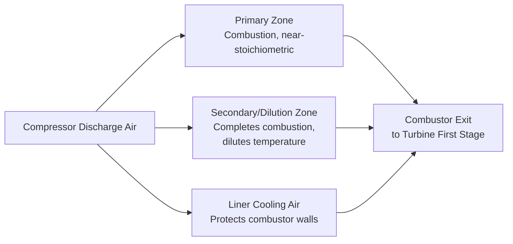
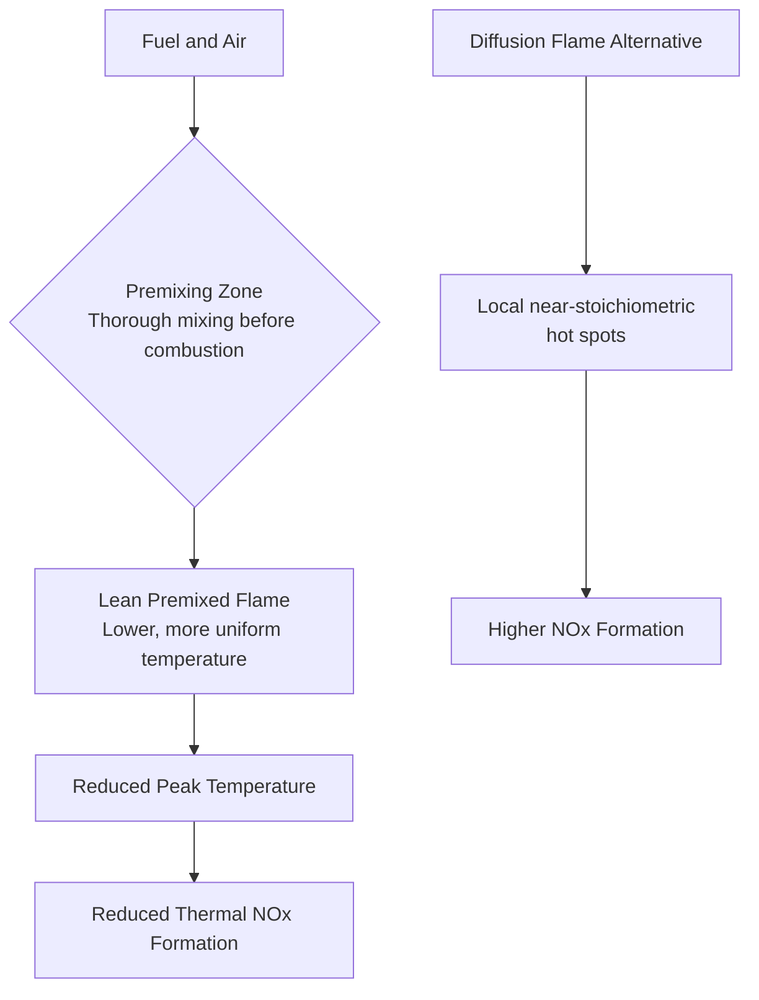

## Combustor Design and Operation

### Overview

The combustor (combustion chamber) is where compressed air from the compressor is mixed with fuel and burned continuously, raising gas temperature substantially before it enters the turbine section. Combustor design must simultaneously achieve stable, efficient combustion across a wide operating range, deliver a controlled and uniform temperature profile to protect downstream turbine components, minimize pollutant emissions, and maintain acceptable pressure loss — a demanding combination of aerothermal, mechanical, and chemical engineering requirements.

**Key Points**

- Combustor configurations: can-type, annular, and can-annular (cannular).
- Combustion airflow is divided into primary (combustion), secondary (dilution), and cooling air streams.
- Modern combustors predominantly use lean premixed (Dry Low NOx/DLE) combustion to minimize NOx formation.
- Flame stability, ignition, and turndown (operation across a wide load range) are key operational design challenges.
- Combustor exit temperature profile (pattern factor) directly affects downstream turbine blade life and cooling design.

### Basic Combustor Function and Airflow Distribution

Air entering the combustor from the compressor is not all used directly for combustion; it is divided into distinct streams serving different purposes:

- **Primary (combustion) zone air:** roughly stoichiometric or slightly fuel-rich air-fuel mixture in the primary zone, sustaining the core flame and enabling efficient, stable combustion.
- **Secondary (dilution) zone air:** additional air introduced downstream of the primary zone to complete combustion and, critically, to dilute and cool the very hot primary-zone combustion products down to the temperature the turbine's first-stage components can tolerate.
- **Liner cooling air:** air flowing along the inner and outer surfaces of the combustor liner (historically via film cooling holes/louvers, increasingly via more advanced effusion or impingement cooling in modern designs) to protect the liner material from the extreme combustion temperatures.

### Combustor Configurations

**1. Can-Type Combustors**

Individual cylindrical combustion "cans" (each a self-contained combustor with its own liner, fuel nozzle, and igniter as needed) arranged in a circular array around the shaft, with hot gas from each can typically collected via a transition piece before entering the turbine annulus.

- Advantages: individual cans can be removed/serviced somewhat independently; historically simpler development and testing (each can tested individually).
- Disadvantages: larger overall size and weight for a given flow capacity compared to annular designs; less uniform circumferential temperature distribution at turbine inlet.

**2. Annular Combustors**

A single continuous annular (ring-shaped) combustion chamber surrounding the shaft, with multiple fuel nozzles distributed around the annulus feeding into the common chamber.

- Advantages: more compact and lighter for a given flow capacity; generally more uniform circumferential temperature distribution at turbine inlet (better pattern factor); lower pressure loss and surface area (less cooling air required) compared to equivalent can-type designs.
- Disadvantages: more complex to develop/test as an integrated unit (though modern rig testing methods have substantially addressed this); repair of the full annular liner assembly can be more involved than servicing individual can liners.
- Predominant configuration in modern aeroderivative gas turbines and increasingly common in modern industrial designs.

**3. Can-Annular (Cannular) Combustors**

A hybrid arrangement: multiple individual can-shaped combustor liners (each with its own fuel nozzle) are arranged within a common annular outer casing, with cross-fire tubes connecting adjacent cans to propagate ignition from an igniter-equipped can to all others during startup.

- Advantages: combines some individual-can serviceability/testability with more compact packaging than pure can-type designs; widely used historically and in many industrial gas turbines.
- Disadvantages: intermediate complexity and pattern factor performance between pure can-type and pure annular designs.

### Combustor Configuration Comparison

| Aspect | Can-Type | Annular | Can-Annular |
| --- | --- | --- | --- |
| Size/weight for given flow | Larger | Most compact | Intermediate |
| Circumferential temperature uniformity | Lower | Highest | Intermediate |
| Serviceability of individual liner | High (independent cans) | Lower (integrated ring) | Moderate (individual cans within common casing) |
| Development/testing complexity | Simpler (test individual cans) | More complex (integrated rig testing) | Intermediate |
| Typical application | Older/some industrial designs | Modern aeroderivative, many modern industrial | Many industrial gas turbines (various eras) |

### Combustion Chemistry and Stoichiometry Basics

Complete combustion of a hydrocarbon fuel with air follows the general form (for a simple hydrocarbon $C_xH_y$):

$$C_xH_y + \left(x + \frac{y}{4}\right)O_2 \rightarrow x\,CO_2 + \frac{y}{2}H_2O$$

with atmospheric nitrogen (and excess oxygen, in the typically fuel-lean overall gas turbine combustion process) passing through largely unreacted (aside from NOx formation, discussed below). Gas turbine combustors typically operate with substantial **overall excess air** (well beyond stoichiometric), since the bulk of compressor discharge air serves dilution and cooling functions rather than direct combustion — overall equivalence ratios are often quite fuel-lean even though the primary zone itself may be near-stoichiometric or locally rich for flame stability.

### Emissions Formation and Control

**NOx (nitrogen oxides) formation** occurs predominantly via the thermal (Zeldovich) mechanism, which is strongly temperature-dependent — NOx formation rates increase sharply above approximately 1500–1800 K flame temperature, making peak flame temperature the primary lever for NOx control. [Unverified — exact threshold temperatures vary by source and specific reaction mechanism details]

**CO (carbon monoxide) and unburned hydrocarbons (UHC)** typically result from incomplete combustion, often associated with insufficient residence time, poor mixing, or excessively low local flame temperatures (particularly at low-load/part-load conditions where flame temperatures drop).

**Traditional NOx control (older designs):** water or steam injection directly into the combustion zone to lower peak flame temperature, effective at reducing NOx but at the cost of reduced efficiency (using useful water/steam for dilution rather than power generation) and increased water consumption/treatment requirements.

**Dry Low NOx (DLN) / Dry Low Emissions (DLE) combustion:** the dominant modern approach, using **lean premixed combustion** — fuel and air are thoroughly premixed before entering the combustion zone at an overall lean (excess air) equivalence ratio, avoiding the very high local flame temperatures associated with diffusion flames (where fuel and air mix and burn simultaneously, creating localized near-stoichiometric hot spots) or rich-then-diluted combustion.

**Lean premixed combustion challenges:**

- **Lean blowout:** if the mixture becomes too lean (e.g., at low load), the flame can become unstable and extinguish, requiring careful staging/control across the load range.
- **Combustion dynamics (thermoacoustic instability):** lean premixed flames are more susceptible to pressure oscillations arising from coupling between unsteady heat release and acoustic resonances in the combustor, potentially causing damaging vibration if not adequately damped/controlled through combustor geometry, fuel staging, or active control systems.
- **Multiple fuel injection stages/nozzles per combustor** are typically used, with different stages activated or fuel-split-adjusted across the load range to maintain stable, low-emission combustion from low load to full load (a technique sometimes called fuel staging).

### Flame Stability and Ignition

**Flame stabilization mechanisms:** combustors typically use swirler vanes near the fuel nozzle to create a recirculation zone (a region of reversed flow) that continuously recirculates hot combustion products back toward the fresh fuel-air mixture, providing continuous ignition source and stabilizing the flame against blowoff at the high air velocities present in the combustor.

**Ignition system:** electrical spark igniters (in one or more cans/locations, with cross-fire tubes propagating flame to adjacent cans/zones in can-annular designs) initiate combustion during startup; some designs may use torch igniters (a small pilot flame) for more robust ignition in demanding conditions.

**Turndown ratio:** the range of load (fuel flow) over which the combustor can maintain stable, acceptable-emissions combustion, from minimum stable load up to full load — an important operability metric, particularly for turbines expected to operate flexibly across a wide load range (e.g., for grid balancing with variable renewable generation).

### Combustor Exit Temperature Profile — Pattern Factor and Profile Factor

The temperature distribution at combustor exit (turbine inlet) is not perfectly uniform, and this non-uniformity critically affects turbine first-stage blade/vane life, since local hot spots can significantly exceed the average temperature and drive localized material degradation.

**Pattern factor** quantifies circumferential/local peak temperature non-uniformity:

$$PF = \frac{T_{max} - T_{avg}}{T_{avg} - T_{inlet}}$$

**Profile factor (radial temperature profile)** describes the desired radial temperature distribution at combustor exit — often deliberately designed with a slightly cooler profile near the blade root and tip (where stress concentrations or sealing/clearance considerations are more critical) and a peak temperature biased toward the blade mid-span, rather than a flat uniform profile, to optimize overall blade life given the combined thermal and mechanical stress distribution. [Inference — specific profile shaping targets are proprietary to individual manufacturers]

Lower pattern factor (more uniform exit temperature) is generally desirable to avoid unnecessarily conservative (lower) average firing temperature limits driven by localized hot-spot concerns, directly affecting achievable cycle efficiency and power output.

### Combustor Materials and Cooling

Combustor liners operate in direct proximity to flame temperatures that can locally exceed 2000°C (well above the melting point of any practical structural metal), requiring effective cooling and/or thermal barrier protection:

- **Liner materials:** high-temperature nickel-based superalloys, sometimes with thermal barrier coatings (ceramic-based coatings) to further reduce metal surface temperature.
- **Cooling techniques:** evolved from simple film cooling (louvers directing a cooling air film along the liner inner surface) in older designs, to more advanced effusion cooling (many small holes distributed across the liner surface providing more uniform, effective cooling with less cooling air consumption) and impingement cooling (cooling air jets directed onto the liner backside) in modern high-performance combustor designs.
- **Transition piece** (in can and can-annular designs): the duct connecting each combustor liner exit to the turbine first-stage nozzle annulus, itself requiring similar high-temperature material and cooling considerations.

### Fuel Flexibility and Dual-Fuel Capability

Many industrial gas turbines are designed for fuel flexibility, commonly natural gas as primary fuel with liquid distillate (diesel-type fuel) as a backup, requiring dual-fuel nozzle designs and appropriate fuel system switching capability. Some modern combustors are also being adapted or designed for hydrogen or hydrogen-blended fuel combustion, which introduces additional considerations (different flame speed, flashback risk, and NOx formation characteristics compared to natural gas) actively being addressed in ongoing industry development. [Unverified — hydrogen combustion capability and blend limits vary significantly by manufacturer, model, and specific combustor design generation; consult current manufacturer documentation for specific capability claims]

### Example — Pattern Factor Calculation

A combustor has average turbine inlet temperature $T_{avg} = 1400°C$, maximum local exit temperature $T_{max} = 1480°C$, and compressor discharge (combustor inlet) temperature $T_{inlet} = 450°C$. Calculate the pattern factor.

1. Numerator: $T_{max} - T_{avg} = 1480 - 1400 = 80°C$
2. Denominator: $T_{avg} - T_{inlet} = 1400 - 450 = 950°C$
3. Pattern factor: $PF = 80/950 = 0.084$

A lower pattern factor (closer to zero) indicates a more uniform combustor exit temperature distribution, generally allowing higher achievable average firing temperature for a given peak-temperature material/cooling limit on the first-stage turbine components.

### Practical Design and Operational Notes

- Combustor design is one of the most iteratively developed and tested components in gas turbine engineering, given the tight coupling between combustion stability, emissions compliance, and downstream turbine durability.
- Modern DLN/DLE combustor operation typically requires more sophisticated control systems (fuel staging schedules, combustion dynamics monitoring, and sometimes active instability suppression) compared to older diffusion-flame or water/steam-injection designs.
- Combustion dynamics (thermoacoustic) monitoring, using dynamic pressure sensors in the combustor, is a standard practice in many modern lean premixed combustor installations to detect and manage potentially damaging pressure oscillations. [Inference]
- Regulatory emissions limits (NOx, CO, and increasingly CO2-related considerations) continue to be a primary driver of combustor technology development, alongside efficiency and fuel flexibility (including growing interest in low-carbon and hydrogen-capable fuels).

**Next Steps**

- Combustion Dynamics and Thermoacoustic Instability Control
- Turbine Blade Cooling Techniques and Thermal Barrier Coatings
- Gas Turbine Emissions Regulations and Compliance Testing
- Hydrogen and Alternative Fuel Combustion in Gas Turbines
- Gas Turbine Off-Design Performance and Part-Load Operation
- Fuel System Design: Natural Gas, Liquid Distillate, and Dual-Fuel Configurations