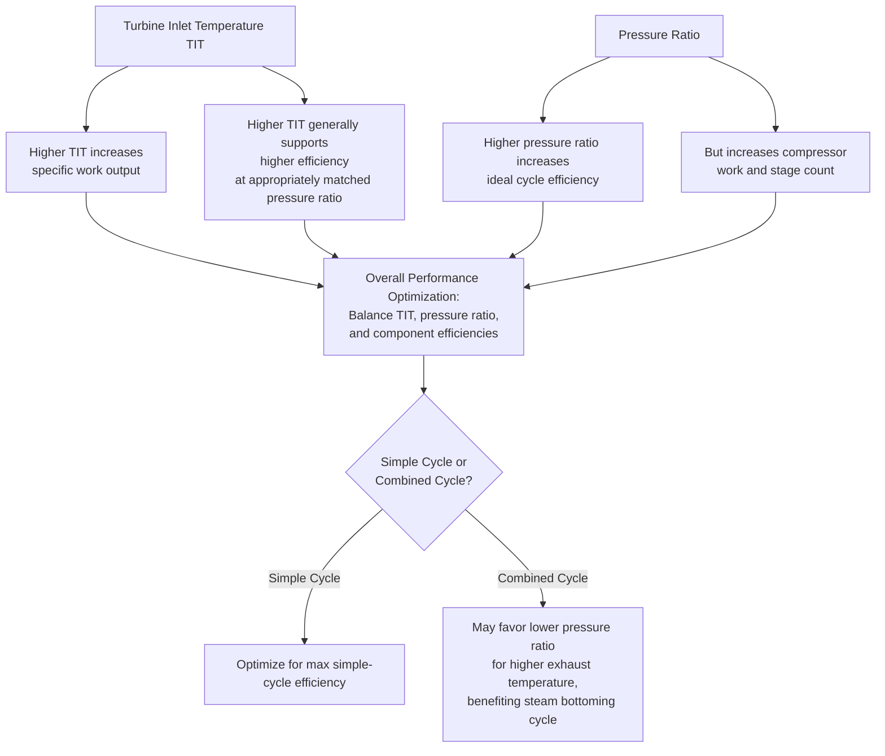

## Gas Turbine Performance Parameters

### Overview

Gas turbine performance is characterized by a set of interrelated thermodynamic and operational parameters — thermal efficiency, specific work, pressure ratio, firing temperature, heat rate, and back-work ratio among them — that together determine power output, fuel consumption, and suitability for a given application. Understanding how these parameters interact, and how ambient and operating conditions affect them, is essential for turbine selection, performance prediction, and diagnostic evaluation.

**Key Points**

- Core performance metrics: thermal efficiency, specific work output, heat rate, and back-work ratio.
- Pressure ratio and turbine inlet (firing) temperature are the two primary design variables governing achievable efficiency and specific work.
- Ambient temperature, pressure (altitude), and humidity significantly affect gas turbine power output and efficiency.
- ISO conditions provide a standardized reference basis for comparing turbine performance ratings across manufacturers.
- Part-load performance and degradation over time are important operational performance considerations distinct from new-and-clean rated performance.

### Core Performance Parameters

**1. Thermal Efficiency**

The ratio of net useful work output to fuel energy input (Lower Heating Value basis is standard for gas turbine efficiency reporting):

$$\eta_{thermal} = \frac{W_{net}}{Q_{in}} = \frac{W_{turbine} - W_{compressor}}{\dot{m}_{fuel} \times LHV}$$

Simple-cycle gas turbine thermal efficiencies for modern large industrial units commonly range from roughly 35% to over 40% for the most advanced designs, while combined-cycle configurations (adding a steam bottoming cycle) can achieve efficiencies exceeding 60% in the most advanced modern plants. [Unverified — exact efficiency figures are manufacturer-, model-, and technology-generation-specific and continue to advance]

**2. Specific Work Output**

Net work output per unit mass flow of air/gas through the turbine:

$$w_{net} = \frac{W_{net}}{\dot{m}_{air}} \quad \text{(typically expressed in kJ/kg)}$$

Higher specific work allows a given power output to be achieved with a smaller (lower mass flow) turbine, generally reducing capital cost per unit of power — a key driver in advanced cycle and firing-temperature development.

**3. Back-Work Ratio**

The fraction of gross turbine work consumed internally by the compressor:

$$BWR = \frac{W_{compressor}}{W_{turbine,gross}}$$

Gas turbines characteristically have a much higher back-work ratio (commonly 40–65%) than steam turbine (Rankine cycle) plants, where feedwater pump work is a very small fraction of turbine output — this fundamental difference arises because compressing a gas requires substantially more work than pumping a liquid to an equivalent pressure ratio (due to the much larger specific volume change of a gas during compression compared to the nearly incompressible behavior of a liquid).

**4. Heat Rate**

The inverse-efficiency metric commonly used in the power industry, expressing fuel energy input required per unit of net electrical output:

$$HR = \frac{Q_{in}}{W_{net}} = \frac{3600}{\eta_{thermal}} \quad \text{(kJ/kWh, when } \eta \text{ is a fraction and using SI energy units)}$$

Lower heat rate indicates better (more fuel-efficient) performance — this is essentially the reciprocal of thermal efficiency, expressed in fuel-energy-per-output-energy terms rather than as a dimensionless ratio.

### Pressure Ratio and Firing Temperature — The Two Primary Design Levers

**Pressure Ratio ($r_p$):** the ratio of compressor discharge pressure to inlet pressure. For a simple ideal Brayton cycle, thermal efficiency increases with pressure ratio (up to a point, considering real component efficiencies):

$$\eta_{Brayton,ideal} = 1 - \frac{1}{r_p^{(\gamma-1)/\gamma}}$$

**Turbine Inlet (Firing) Temperature ($T_3$ or TIT):** the gas temperature entering the first turbine stage — the single most influential parameter for both specific work output and (in combination with pressure ratio) overall cycle efficiency in real (non-ideal) cycles. Higher firing temperature increases specific work substantially, allowing more power from a given air mass flow, and generally supports higher efficiency when appropriately combined with optimized pressure ratio — but is fundamentally limited by turbine blade material temperature capability and cooling technology.

**General optimization relationship:** for maximum efficiency at a given firing temperature, there exists an optimum pressure ratio (which increases as firing temperature increases); for maximum specific work at a given firing temperature, a different (typically lower) optimum pressure ratio applies. Real cycle design involves balancing these competing optima against practical constraints (compressor stage count/cost, turbine cooling requirements, and combined-cycle integration considerations for the bottoming steam cycle, which benefits from higher exhaust temperature — often favoring a somewhat lower gas turbine pressure ratio than would be optimal for simple-cycle efficiency alone). [Inference — exact optimum trade-off point is application- and technology-specific]

### ISO Standard Conditions

Gas turbine performance ratings are conventionally referenced to standardized **ISO conditions** to allow fair comparison across manufacturers and models, independent of actual site ambient conditions:

- Ambient temperature: 15°C (59°F)
- Ambient pressure: 1.013 bar (sea level, 101.325 kPa)
- Relative humidity: 60%
- No inlet or exhaust pressure losses (ducting losses)

Actual site performance typically differs from ISO-rated performance due to ambient conditions and installation-specific losses, requiring correction factors applied by manufacturers or through performance software for accurate site-specific predictions.

### Ambient Condition Effects on Performance

**Ambient Temperature:** as ambient temperature rises above ISO conditions, air density decreases, reducing mass flow rate through the (essentially fixed-volumetric-flow) compressor for a given rotational speed, which reduces both power output and efficiency. This effect is often visualized via a manufacturer-provided "temperature correction curve," and is one of the most significant environmental factors affecting gas turbine output — power output can decrease by a significant percentage (commonly cited in the range of roughly 0.5–1% power loss per °C above ISO conditions, though the exact sensitivity varies by turbine model) as ambient temperature rises. [Unverified — exact sensitivity coefficient varies significantly by turbine design and is best obtained from manufacturer-specific performance curves]

**Ambient Pressure (Altitude):** higher elevation sites experience lower ambient pressure and hence lower air density, similarly reducing mass flow and power output roughly in proportion to the reduction in ambient pressure (density) relative to sea-level ISO conditions.

**Humidity:** higher humidity slightly reduces air density (moist air is less dense than dry air at the same temperature and pressure) and affects combustion and expansion properties marginally; the overall effect on power output is generally smaller than temperature or altitude effects but is included in comprehensive performance correction methodologies.

**Inlet and Exhaust System Losses:** pressure losses in inlet filtration/ducting and exhaust ducting/silencing/HRSG backpressure (in combined-cycle or cogeneration applications) reduce both power output and efficiency relative to the idealized ISO rating with no such losses, and are accounted for via site-specific pressure loss correction factors provided by the manufacturer.

### Inlet Air Cooling — Recovering Hot-Weather Performance Losses

Because high ambient temperature significantly derates gas turbine output, various inlet air cooling techniques are used (particularly valuable for peaking plants operating during hot-weather high-demand periods):

- **Evaporative cooling:** water is sprayed or wetted media is used to evaporatively cool inlet air (using the latent heat of vaporization to reduce air temperature), effective primarily in hot, dry (low ambient humidity) climates.
- **Mechanical chilling:** refrigeration-based chillers cool inlet air below what evaporative cooling alone can achieve, effective even in humid climates, at the cost of additional capital equipment and parasitic power consumption for the chiller system.
- **Thermal energy storage (ice storage) systems:** ice is made during off-peak (cooler, lower electricity price) periods and used to chill inlet air during peak demand periods, shifting parasitic cooling power consumption to off-peak times.

### Part-Load Performance

Gas turbine efficiency generally decreases at part load compared to full (rated) load, since component efficiencies (compressor, turbine) and cycle temperature ratios typically depart from their full-load design optimum as load is reduced (e.g., firing temperature is often reduced at part load via fuel flow reduction, and compressor operation moves along its performance map away from the design point). Multi-shaft (split-shaft) configurations can sometimes offer better part-load efficiency characteristics than single-shaft designs in some applications, since gas generator speed can be optimized somewhat independently of power turbine/load speed. [Inference — specific part-load behavior is highly design- and control-strategy-dependent]

### Performance Degradation Over Time

Actual operating performance typically degrades gradually from new-and-clean rated performance due to:

- **Compressor fouling:** airborne contaminant deposits on compressor blades increasing surface roughness and altering blade profiles, reducing compressor efficiency and mass flow capacity — addressed through periodic compressor washing (online or offline).
- **Hot-section component wear:** erosion, oxidation, and coating degradation of turbine blades/vanes over operating hours, gradually reducing turbine efficiency and increasing clearances (tip leakage).
- **Increased clearances generally:** wear and thermal cycling effects gradually increase internal clearances (compressor and turbine blade tips, seals), increasing leakage losses over time.

Manufacturers typically distinguish between **recoverable degradation** (addressable through maintenance actions like compressor washing) and **non-recoverable degradation** (requiring component replacement/overhaul to fully restore, such as blade coating wear or erosion). [Inference — specific degradation rates and recoverability fractions are highly turbine-, environment-, and maintenance-practice-specific]

### Example — Heat Rate and Efficiency Relationship

A gas turbine has a thermal efficiency of 38% (LHV basis). Calculate the corresponding heat rate in kJ/kWh and in the commonly used industry unit of Btu/kWh.

1. Heat rate in kJ/kWh: $HR = \dfrac{3600}{0.38} = 9473.7\ \text{kJ/kWh}$
2. Conversion to Btu/kWh (1 kJ ≈ 0.9478 Btu): $HR_{Btu} = 9473.7 \times 0.9478 \approx 8979\ \text{Btu/kWh}$

This illustrates the inverse relationship between efficiency and heat rate: as efficiency increases, heat rate (fuel consumption per unit of electrical output) decreases, and vice versa.

### Example — Ambient Temperature Derating Illustration

A gas turbine is ISO-rated at 150 MW output at 15°C ambient. Using an illustrative derating sensitivity of 0.7% power loss per °C above ISO temperature, estimate output at 35°C ambient.

1. Temperature rise above ISO: $35 - 15 = 20°C$
2. Total derating: $20 \times 0.7\% = 14\%$
3. Estimated output: $150\ \text{MW} \times (1 - 0.14) = 150 \times 0.86 = 129\ \text{MW}$

[Inference — this example uses an illustrative derating sensitivity for demonstration; actual sensitivity must be obtained from the specific turbine manufacturer's performance curves for any real application]

### Key Performance Parameters Summary Table

| Parameter | Typical Influence | Design/Operational Significance |
| --- | --- | --- |
| Pressure ratio | Higher generally increases ideal efficiency | Balanced against compressor stage count/cost and combined-cycle exhaust temperature needs |
| Firing (turbine inlet) temperature | Higher increases specific work and generally supports higher efficiency | Limited by blade material/cooling technology; primary technology development driver |
| Back-work ratio | Characteristically high (40–65%) for gas turbines | Fundamental Brayton cycle characteristic distinguishing it from Rankine cycle plants |
| Ambient temperature | Higher ambient reduces power output and efficiency | Drives inlet cooling system consideration for hot-climate/peaking applications |
| Ambient pressure (altitude) | Higher altitude reduces power output | Site-specific derating consideration |
| Degradation over time | Gradual efficiency/output decline between overhauls | Managed via compressor washing, inspection intervals, and overhaul planning |

### Practical Design and Evaluation Notes

- Comparing turbine models purely on ISO-rated efficiency/output can be misleading without considering site-specific ambient conditions, fuel type, and installation losses — a full site-corrected performance evaluation is standard practice for project-specific turbine selection.
- Combined-cycle plant designers must jointly optimize gas turbine and steam bottoming cycle parameters, since gas turbine exhaust temperature and mass flow directly determine achievable steam cycle performance, sometimes favoring a gas turbine configuration that is not individually optimal for simple-cycle efficiency alone.
- Ongoing technology development continues to push firing temperatures higher (enabled by advances in blade cooling, materials, and thermal barrier coatings), which remains the primary lever for continued efficiency and specific work improvements in new gas turbine generations.

**Next Steps**

- Brayton Cycle Thermodynamic Analysis and Efficiency
- Combined Cycle Power Plant Design and Heat Recovery Steam Generators
- Turbine Blade Cooling Techniques and Thermal Barrier Coatings
- Gas Turbine Off-Design Performance and Part-Load Operation
- Compressor Fouling, Washing, and Performance Degradation Management
- Inlet Air Cooling Systems: Evaporative, Chilling, and Thermal Storage