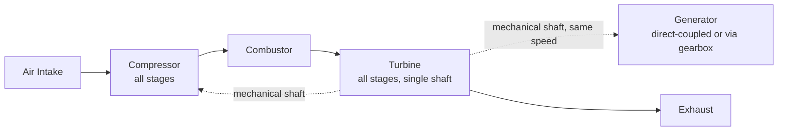
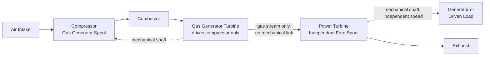
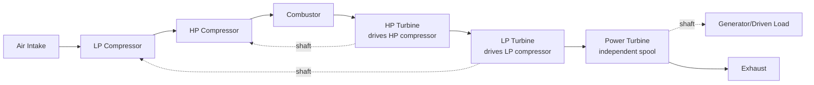

## Single-Shaft and Multi-Shaft Configurations

### Overview

The mechanical arrangement of a gas turbine's rotating spools — whether all compressor and turbine stages share a single common shaft or are divided into separate independently rotating spools — fundamentally shapes the machine's starting behavior, speed flexibility, part-load characteristics, and suitability for different applications. This choice, made early in the design process, has cascading effects on control system design, mechanical complexity, and operational flexibility.

**Key Points**

- Single-shaft: all compressor stages, turbine stages, and the driven load rotate together on one common shaft at one fixed speed.
- Multi-shaft (split-shaft): the gas generator (compressor plus its driving turbine stages) and the power turbine (driving the external load) are mechanically independent, coupled only aerodynamically through the gas stream.
- Multi-shaft designs can extend to three or more spools (e.g., separate low-pressure and high-pressure compressor spools plus a power turbine) in more complex aeroderivative-influenced architectures.
- Configuration choice strongly influences starting requirements, speed control strategy, and matching to variable-speed versus fixed-speed driven equipment.
- Single-shaft is the dominant choice for large fixed-speed utility power generation; multi-shaft is common in aeroderivative and mechanical-drive applications.

### Single-Shaft Configuration

**Architecture**

All compressor stages, all turbine stages (both those extracting energy solely to drive the compressor and any additional stages providing net output), and the external load (typically a generator, direct-coupled or via a speed-reduction gearbox) rotate as a single mechanically rigid assembly on one shaft line.

**Operating Characteristics**

- The entire rotating assembly, including generator rotor inertia, operates at a single fixed speed (synchronous speed matching grid frequency when direct generator-coupled) across the normal operating range, with load variation achieved by varying fuel flow (and hence firing temperature/mass flow) rather than shaft speed.
- Starting requires bringing the entire rotating assembly — including the relatively large generator rotor inertia — up to self-sustaining (light-off and acceleration) speed, typically requiring a more powerful starting system (electric motor, static frequency converter, or diesel starter engine) compared to spinning up only a smaller gas generator spool.
- Compressor operating point is directly tied to the fixed generator speed, simplifying some aspects of compressor aerodynamic matching (compressor always operates along a fixed-speed line on its performance map, varying only in flow/pressure ratio with load via fuel flow and IGV/VSV positioning) but reducing flexibility to independently optimize compressor speed for part-load conditions.

**Advantages:**

- Simpler mechanical arrangement — fewer bearings, no aerodynamic coupling uncertainty between spools, generally lower parts count and potentially lower capital cost for a given power rating.
- Well-suited and widely proven for fixed-speed power generation applications, which represent the majority of gas turbine installed capacity worldwide (utility and industrial power generation).
- Simpler shaft dynamics analysis (single rotor system rather than multiple coupled/independent rotor dynamics to analyze).

**Disadvantages:**

- Less flexible for variable-speed mechanical-drive applications, since the compressor (part of the same fixed-speed shaft) cannot be independently speed-optimized for a variable-speed driven load without a separate variable-speed coupling device (e.g., a variable-speed gearbox or clutch arrangement, adding complexity).
- Starting the full rotating assembly (including generator inertia) generally requires more starting power/torque and can result in somewhat longer startup times compared to spinning up only a lighter gas generator spool in a multi-shaft design.

### Multi-Shaft (Split-Shaft / Two-Shaft) Configuration

**Architecture**

The **gas generator** — comprising the compressor and the turbine stage(s) whose sole function is to drive that compressor — forms one mechanically independent rotating spool. A separate **power turbine** (also called a free turbine, since it is not mechanically linked to the gas generator shaft) is positioned downstream, extracting the remaining available energy from the hot gas stream to drive the external load at its own independent rotational speed, with the two spools connected only through the aerodynamic coupling of the flowing combustion gas passing from one to the other.

**Operating Characteristics**

- The gas generator spool speed adjusts to meet the energy demand of the power turbine (and hence the external load), while the power turbine spool speed can be controlled largely independently (within aerodynamic limits) — often held at a fixed speed for generator-drive applications (matching grid frequency via direct coupling or gearbox) or allowed to vary for variable-speed mechanical-drive applications (compressor or pump drive).
- Starting requires bringing only the (typically smaller, lower-inertia) gas generator spool up to self-sustaining speed; the power turbine spool, being aerodynamically driven, begins rotating as a consequence of gas generator operation without requiring separate direct starting torque, generally simplifying and potentially speeding up the starting sequence.
- This decoupling gives multi-shaft designs a natural advantage in applications requiring variable output speed or particularly fast/flexible starting.

**Advantages:**

- Speed independence between gas generator and power turbine allows better matching to variable-speed driven equipment (compressors, pumps) without necessarily requiring a variable-speed gearbox.
- Generally faster and lower-torque-demand starting sequence, since only the smaller gas generator spool inertia must be initially overcome, valued particularly in aeroderivative designs favoring fast-start/fast-response applications (peaking power, grid frequency support).
- Common heritage from aircraft jet engine core technology (in aeroderivative gas turbines), bringing associated benefits of lighter weight, higher simple-cycle efficiency, and modular maintenance (engine core swap-out) to industrial applications.

**Disadvantages:**

- More complex mechanical arrangement — additional bearing sets, more complex rotor dynamics analysis (two independently rotating spools with aerodynamic rather than mechanical coupling), and typically higher parts count/complexity than single-shaft designs.
- Aerodynamic matching between gas generator and power turbine across the full operating range (from startup through full load) requires careful design to ensure stable, efficient operation at all conditions, adding design complexity compared to a single fixed-speed-line compressor matching problem in single-shaft designs.

### Single-Shaft vs. Multi-Shaft Comparison

| Aspect | Single-Shaft | Multi-Shaft (Two-Shaft) |
| --- | --- | --- |
| Number of independent rotating spools | One | Two (or more, in advanced multi-spool designs) |
| Speed flexibility of driven load | Fixed (tied to single shaft speed) | Independent power turbine speed possible |
| Starting complexity/power required | Higher (full assembly including generator inertia) | Lower (only gas generator spool initially) |
| Typical starting time | Generally longer | Generally shorter, valued for fast-start applications |
| Mechanical complexity | Lower (single rotor system) | Higher (multiple bearing sets, coupled rotor dynamics) |
| Typical application | Fixed-speed utility/industrial power generation | Mechanical drive (variable speed), aeroderivative power generation, fast-response peaking |
| Part-load flexibility | Compressor tied to fixed speed line | Gas generator speed can adjust somewhat independently with load |

### Extended Multi-Spool Architectures

Beyond the basic two-shaft (gas generator plus power turbine) arrangement, more complex designs — particularly aeroderivative gas turbines directly descended from multi-spool aircraft jet engines — may feature three (or more) independent spools:

- **Low-pressure (LP) compressor spool** and **high-pressure (HP) compressor spool**, each driven by its own corresponding turbine stage(s), rotating at different (independently determined) speeds — improving off-design aerodynamic matching and surge margin across a wide operating range compared to a single-spool compressor.
- **Power turbine (free turbine) spool**, downstream of the HP and LP gas generator turbine stages, driving the external load independently of both gas generator spools.

This multi-spool approach further improves part-load efficiency and operational flexibility at the cost of additional mechanical complexity, and is more characteristic of aeroderivative-technology-based industrial gas turbines than of large heavy-duty single-shaft industrial frame units. [Inference — specific spool count and configuration details are manufacturer- and model-specific]

### Application Matching Guidance

| Application | Typically Favored Configuration | Rationale |
| --- | --- | --- |
| Large utility base-load power generation | Single-shaft | Simplicity, proven reliability, fixed-speed grid synchronization |
| Combined-cycle power generation | Single-shaft (commonly) or multi-shaft | Either can work; single-shaft common in large heavy-duty frame combined-cycle plants |
| Peaking/fast-response power generation | Multi-shaft (often aeroderivative) | Fast start capability, quick load response |
| Mechanical drive (compressor/pump, variable speed) | Multi-shaft | Independent power turbine speed matches variable-speed driven equipment |
| Offshore platform power/mechanical drive | Multi-shaft (aeroderivative common) | Compact size/weight, fast start, modular maintenance (engine swap) |

### Rotor Dynamics and Bearing Considerations

- **Single-shaft:** requires careful analysis of a single, typically long rotor system (spanning compressor through turbine sections, often including the generator rotor if direct-coupled) for critical speed avoidance and adequate vibration margins across the full operating speed range.
- **Multi-shaft:** requires independent rotor dynamics analysis for each spool, plus careful attention to the aerodynamic (non-mechanical) interface between gas generator and power turbine, including axial and radial clearance management given that the two spools are not mechanically constrained to maintain fixed relative positions in the way a single rigid shaft would be. [Inference — specific analysis methodology is manufacturer/design-specific]

### Practical Design and Selection Notes

- Configuration selection is fundamentally driven by the intended application's speed requirements (fixed vs. variable) and starting/response time priorities, rather than by efficiency considerations alone — both configurations can achieve high efficiency when well-designed for their intended duty.
- Aeroderivative gas turbines' multi-shaft heritage (from aircraft engine cores) provides inherent advantages for applications valuing fast start, light weight, and modular maintenance, explaining their popularity in peaking power, offshore, and mechanical-drive markets despite generally smaller size ratings than the largest heavy-duty single-shaft industrial frame units.
- Some large modern single-shaft heavy-duty gas turbines have increasingly incorporated design features (such as improved starting systems and combustion technology) to narrow the historical fast-start gap with aeroderivative multi-shaft designs, reflecting growing market demand for flexible, fast-responding generation to complement variable renewable energy sources. [Inference]

**Next Steps**

- Gas Turbine Starting Systems and Control Architecture
- Rotor Dynamics and Critical Speed Analysis in Turbomachinery
- Gas Turbine Off-Design Performance and Part-Load Operation
- Combined Cycle Power Plant Design and Heat Recovery Steam Generators
- Mechanical Drive Applications: Compressor and Pump Drive Turbines
- Fast-Start Gas Turbine Technology for Grid Flexibility