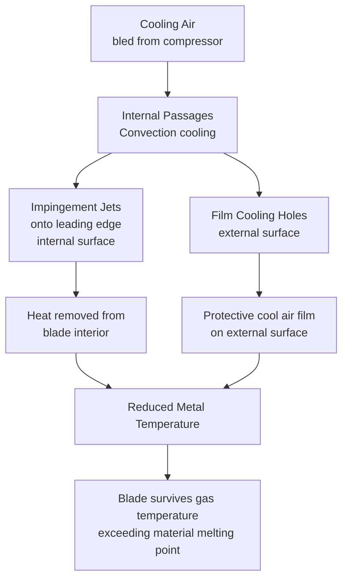
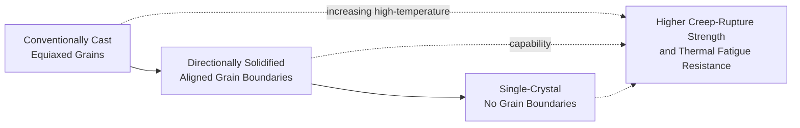

## Turbine Blade Cooling and High-Temperature Materials

### Overview

Modern gas turbine firing temperatures substantially exceed the melting point capability of any practical structural blade material, making sophisticated internal and film cooling techniques, combined with advanced high-temperature alloys and thermal barrier coatings, essential for turbine hot-section durability. The continuous advancement of blade cooling and materials technology has been, and remains, the primary enabler of rising firing temperatures and the corresponding efficiency and specific work gains that define successive generations of gas turbine technology.

**Key Points**

- Gas temperatures at turbine inlet commonly exceed the melting point of blade base materials, making cooling essential rather than optional.
- Cooling air is bled from the compressor (at the cost of reduced net cycle power/efficiency) and routed through internal blade passages and film cooling holes.
- Key cooling techniques: internal convection cooling, impingement cooling, and film cooling.
- Nickel-based superalloys, often single-crystal or directionally solidified, are standard for the hottest first-stage blades and vanes.
- Thermal barrier coatings (TBCs) provide an additional insulating layer, reducing metal surface temperature beneath the coating.

### Why Cooling Is Necessary

Modern advanced gas turbines commonly operate with turbine inlet (firing) temperatures well above 1400°C, and in the most advanced designs exceeding 1600°C — temperatures that substantially exceed the melting point of nickel-based superalloys (typically in the range of roughly 1300–1400°C) used for turbine blades. [Unverified — exact firing temperatures and alloy melting points vary by specific technology generation and manufacturer] Without cooling, first-stage blades and vanes (which see the hottest, highest-pressure gas directly from the combustor) would fail almost immediately. Cooling technology allows metal surface temperatures to be maintained safely below material limits despite gas temperatures far exceeding those limits, by continuously removing heat from the blade via internal air flow.

$$T_{gas} \gg T_{metal,limit} \gg T_{metal,limit} - \Delta T_{cooling\ effectiveness}$$

### Cooling Air Source and the Efficiency Trade-off

Cooling air is typically bled directly from one or more compressor stages (at a pressure appropriate to overcome the local gas path pressure at the cooling destination) and routed through internal passages to the blades and vanes requiring cooling. This bled air:

- Bypasses the combustor, so it does not contribute to combustion heat release in the same way as the main flow.
- Is eventually reintroduced into the main gas path (via internal cooling passages exiting into the flow, or via film cooling holes on blade surfaces), but at a lower temperature and often with some aerodynamic mixing loss, reducing the ideal work potential of that portion of the flow compared to fully participating in combustion and expansion.
- Represents an inherent efficiency penalty: increasing the fraction of compressor air diverted to cooling reduces net cycle efficiency and specific work, creating a fundamental trade-off between the benefit of higher firing temperature (enabled by more aggressive cooling) and the cooling air penalty itself.

This trade-off is a central driver of continued research into more effective (lower cooling-air-consumption for a given cooling effectiveness) cooling techniques and materials, since more efficient cooling technology allows a greater share of the firing-temperature-increase benefit to be realized as net efficiency gain rather than being offset by increased cooling air penalty. [Inference]

### Primary Cooling Techniques

**1. Internal Convection Cooling**

Cooling air flows through internal passages cast into the blade (often intricate serpentine channel networks manufactured via investment casting with ceramic cores), absorbing heat by convection as it flows through the blade interior before exiting (typically at the blade tip or trailing edge, or feeding into film cooling holes).

**2. Impingement Cooling**

Cooling air is directed as discrete jets through small holes in an internal insert or baffle, impinging directly onto the inner surface of the blade wall at high local velocity, providing a very high local heat transfer coefficient — particularly effective for cooling the leading edge region, which experiences the highest local gas-side heat flux due to flow stagnation.

**3. Film Cooling**

Cooling air is ejected through small holes distributed across the external blade surface, forming a thin protective film of relatively cool air that shields the blade surface from direct contact with the hot mainstream gas, reducing the effective gas-side heat transfer to the blade surface downstream of each hole row.

**Combined cooling schemes:** modern high-performance first-stage blades typically employ a combination of all three techniques within a single blade design — internal serpentine convection passages, targeted impingement cooling at the leading edge and other high-heat-flux regions, and multiple rows of film cooling holes distributed across the external surface — engineered together to achieve required cooling effectiveness with minimum cooling air consumption.

### Turbine Blade Cross-Section — Cooling Passages (svg_diagram)

<svg xmlns="http://www.w3.org/2000/svg" viewBox="0 0 600 400" font-family="Arial, sans-serif">
<text x="300" y="25" font-size="16" text-anchor="middle" font-weight="bold">Cooled Turbine Blade Cross-Section (svg_diagram)</text>

<path d="M 100,200 C 150,120 300,100 480,180 C 500,190 500,210 480,220 C 300,300 150,280 100,200 Z" fill="none" stroke="#333" stroke-width="3" />

<path d="M 130,160 C 160,140 190,140 210,160 C 220,180 220,220 210,240 C 190,260 160,260 130,240 C 120,220 120,180 130,160 Z" fill="none" stroke="#c01c28" stroke-width="2" stroke-dasharray="4,3" />
<circle cx="150" cy="190" r="3" fill="#c01c28" />
<circle cx="165" cy="175" r="3" fill="#c01c28" />
<circle cx="165" cy="225" r="3" fill="#c01c28" />
<circle cx="150" cy="210" r="3" fill="#c01c28" />
<text x="140" y="130" font-size="11" fill="#c01c28">Impingement insert</text>

<path d="M 230,180 L 320,180 L 320,220 L 400,220 L 400,180" fill="none" stroke="#1a5fb4" stroke-width="3" />
<text x="280" y="250" font-size="11" fill="#1a5fb4">Serpentine convection cooling passages</text>

<circle cx="200" cy="140" r="2.5" fill="#2ec27e" />
<circle cx="240" cy="128" r="2.5" fill="#2ec27e" />
<circle cx="280" cy="118" r="2.5" fill="#2ec27e" />
<circle cx="320" cy="115" r="2.5" fill="#2ec27e" />
<circle cx="360" cy="120" r="2.5" fill="#2ec27e" />
<circle cx="400" cy="135" r="2.5" fill="#2ec27e" />
<circle cx="440" cy="160" r="2.5" fill="#2ec27e" />
<text x="330" y="90" font-size="11" fill="#2ec27e">Film cooling holes (external surface)</text>

<line x1="470" y1="195" x2="490" y2="197" stroke="#f5921e" stroke-width="4" />
<text x="440" y="230" font-size="11" fill="#f5921e">Trailing edge cooling slot</text>

<text x="60" y="350" font-size="12" fill="#333">Note: schematic representation — actual internal geometry is</text>

<text x="60" y="368" font-size="12" fill="#333">substantially more complex, manufactured via investment casting</text>

</svg>

### High-Temperature Blade Materials

**Nickel-Based Superalloys**

The standard material class for turbine blades and vanes in the hottest turbine sections, chosen for their exceptional combination of high-temperature strength (creep resistance), fatigue resistance, and oxidation/corrosion resistance at operating temperatures that can exceed 1000°C in the base metal itself (before accounting for further temperature reduction from internal cooling).

**Manufacturing/microstructure classes (in order of increasing high-temperature capability):**

1. **Conventionally cast (equiaxed) superalloys:** polycrystalline structure with grains oriented randomly; adequate for less demanding applications but limited in high-temperature creep resistance compared to more advanced processing.
2. **Directionally solidified (DS) superalloys:** grain boundaries are aligned parallel to the blade's primary stress axis (radially, along the centrifugal loading direction) during controlled solidification, eliminating transverse grain boundaries that would otherwise be preferential creep failure sites, improving high-temperature creep-rupture life.
3. **Single-crystal (SX) superalloys:** the entire blade is grown as a single continuous crystal with no grain boundaries at all, providing the highest achievable creep-rupture strength and thermal fatigue resistance, and used for the most demanding first-stage blades in advanced modern gas turbines.

### Thermal Barrier Coatings (TBCs)

A ceramic-based coating system applied to the external surface of turbine blades and vanes (and sometimes combustor liners), providing an additional insulating layer that reduces the temperature at the underlying metal substrate surface for a given gas-side temperature, effectively allowing either a higher gas temperature for the same metal temperature or a reduced cooling air requirement for the same gas temperature.

**Typical TBC system structure:**

- **Bond coat:** a metallic layer (commonly a MCrAlY-type alloy, where M represents nickel, cobalt, or a combination) applied directly to the substrate, providing oxidation/corrosion resistance and improving adhesion of the outer ceramic layer.
- **Thermally Grown Oxide (TGO) layer:** a thin oxide layer that forms naturally between the bond coat and ceramic topcoat during service, whose growth and stability significantly affects overall TBC system durability and failure mode.
- **Ceramic topcoat:** commonly yttria-stabilized zirconia (YSZ), providing the primary thermal insulation function due to its low thermal conductivity and reasonable thermal expansion compatibility with the metallic substrate.

**TBC application methods:** air plasma spray (APS) and electron beam physical vapor deposition (EB-PVD) are the two predominant application techniques, each producing different coating microstructures (APS typically produces a more porous, lamellar structure; EB-PVD produces a columnar microstructure with improved strain tolerance, often preferred for the most demanding rotating blade applications). [Unverified — specific coating method selection is application- and manufacturer-specific]

### Failure Modes and Durability Considerations

- **Creep:** slow, time-dependent plastic deformation under sustained high temperature and stress (centrifugal load), a primary life-limiting mechanism for turbine blades operating for extended periods at high temperature.
- **Thermal fatigue (low-cycle fatigue):** cyclic stresses arising from repeated startup/shutdown thermal transients, causing progressive crack initiation and growth over the number of operating cycles rather than operating hours.
- **Oxidation and hot corrosion:** chemical degradation of blade material (and coatings) from prolonged exposure to hot combustion gases, potentially accelerated by contaminants (sulfur, sodium, vanadium compounds) present in some fuels or ingested air, particularly relevant in marine or industrial environments with corrosive contaminants.
- **TBC spallation:** loss of adhesion and flaking-off of the ceramic topcoat, typically initiated by TGO layer growth stresses or thermal cycling, which can rapidly expose the underlying substrate to full gas temperature and accelerate subsequent material degradation if not detected and addressed.
- **Foreign object damage (FOD) and erosion:** physical damage from ingested particulates or debris, potentially compromising both the coating and underlying blade structural integrity.

### Cooling Effectiveness Concept

A common non-dimensional parameter used to characterize cooling performance is cooling effectiveness:

$$\varepsilon = \frac{T_{gas} - T_{metal}}{T_{gas} - T_{coolant}}$$

Higher cooling effectiveness indicates the metal temperature is closer to the coolant supply temperature (better cooling performance) for a given gas and coolant temperature; effective modern first-stage blade cooling designs can achieve substantial cooling effectiveness values, allowing metal temperatures well below gas temperature despite the large temperature difference involved. [Unverified — specific achievable effectiveness values are design- and technology-generation-specific]

### Example — Cooling Effectiveness Calculation

A turbine blade experiences a local gas temperature of $T_{gas} = 1500°C$, achieves a metal surface temperature of $T_{metal} = 950°C$, using cooling air supplied at $T_{coolant} = 450°C$ (typical compressor bleed air temperature at an intermediate stage). Calculate the cooling effectiveness.

1. Numerator: $T_{gas} - T_{metal} = 1500 - 950 = 550°C$
2. Denominator: $T_{gas} - T_{coolant} = 1500 - 450 = 1050°C$
3. Cooling effectiveness: $\varepsilon = 550/1050 = 0.524$

This indicates the cooling scheme reduces the metal temperature by roughly 52% of the total available gas-to-coolant temperature difference — a reasonably effective, though not exceptionally aggressive, cooling design by modern advanced first-stage blade standards. [Inference — specific benchmark comparison depends on the particular blade row and technology generation being referenced]

### Practical Design and Development Notes

- Blade cooling design is an intensely iterative, computationally intensive discipline combining internal flow (heat transfer and pressure drop through complex internal passage networks), external aerodynamics (film cooling hole placement and blowing ratio optimization), and structural/thermal stress analysis.
- Manufacturing of cooled blades (particularly single-crystal blades with intricate internal cooling geometry) relies heavily on investment casting with ceramic cores to form the internal passages, followed by precision machining of film cooling holes (often via laser drilling or electrical discharge machining).
- Continued advancement in cooling technology, materials (including potential future ceramic matrix composite, CMC, blade/vane applications in the hottest sections of some advanced designs), and coatings remains the primary technology pathway for further gas turbine efficiency and specific work improvements. [Inference — CMC adoption in rotating turbine blades remains an active area of development rather than universally established practice as of the knowledge cutoff]

**Next Steps**

- Ceramic Matrix Composites (CMC) in Gas Turbine Hot Sections
- Creep and Fatigue Life Assessment of High-Temperature Turbine Components
- Combustor Design and Operation (Firing Temperature and Pattern Factor Interface)
- Gas Turbine Performance Parameters and Firing Temperature Trade-offs
- Turbine Blade Manufacturing: Investment Casting and Single-Crystal Growth
- Non-Destructive Inspection Methods for Turbine Hot-Section Components