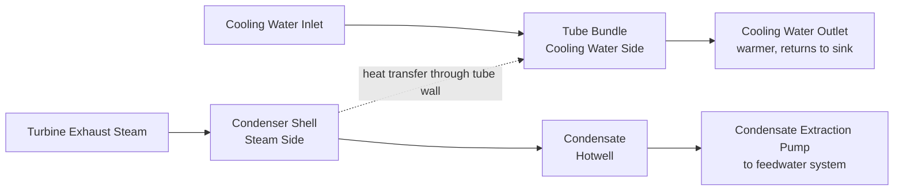
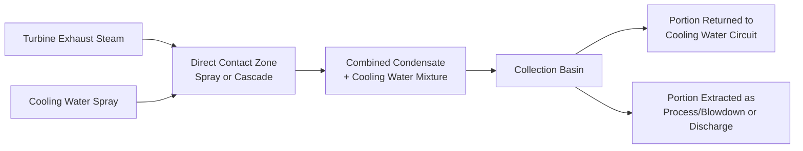

## Surface and Direct-Contact Condensers

### Overview

The condenser is a critical component in the Rankine (steam power) cycle, condensing turbine exhaust steam back into liquid water at sub-atmospheric pressure, thereby maximizing the enthalpy drop available across the turbine and enabling efficient feedwater recovery for reuse in the boiler. Two fundamentally different condenser types are used — surface condensers, where steam and cooling water remain physically separated by tube walls, and direct-contact condensers, where steam and cooling water mix directly — each suited to different applications based on water quality requirements and cycle configuration.

**Key Points**

- Surface condensers keep steam and cooling water physically separated, preserving condensate purity for boiler feedwater reuse.
- Direct-contact condensers mix steam and cooling water directly, offering simpler construction and lower cost but unsuitable where high-purity condensate recovery is required.
- Condenser vacuum (back pressure) directly affects turbine efficiency and available enthalpy drop — deeper vacuum improves cycle efficiency.
- Key surface condenser design parameters: heat transfer area, cooling water flow rate and temperature rise, tube material and cleanliness, and air removal (vacuum) system performance.
- Condenser performance directly interacts with cooling water system design (once-through, cooling tower, or other heat rejection method).

### Role of the Condenser in the Rankine Cycle

The condenser serves several essential functions in a steam power cycle:

- **Maximizes turbine work output:** by maintaining a very low exhaust pressure (deep vacuum, often around 0.05–0.10 bar absolute or lower in large utility condensing turbines), the condenser allows the turbine to expand steam through a much larger enthalpy drop than would be possible exhausting to atmospheric pressure, directly increasing net cycle work and efficiency.
- **Recovers condensate for boiler feedwater:** condensed steam (condensate) is collected and returned to the feedwater system for reuse in the boiler, closing the working fluid loop and avoiding continuous fresh makeup water consumption (and the associated water treatment cost/energy).
- **Removes non-condensable gases:** air and other non-condensable gases that leak into the sub-atmospheric condenser (or are carried in with the steam) must be continuously removed to maintain vacuum and avoid degrading heat transfer performance.

$$\eta_{Rankine} \uparrow \quad \text{as} \quad p_{condenser} \downarrow \quad \text{(deeper vacuum increases cycle efficiency)}$$

### Surface Condensers

**Basic Working Principle**

In a surface condenser, turbine exhaust steam flows over the outside of a large bundle of tubes through which cooling water flows internally, condensing on the tube outer surfaces without direct physical contact with the cooling water. Heat is transferred from the condensing steam, through the tube wall, to the cooling water, which carries the heat away to the ultimate heat sink (river, sea, cooling tower, etc.).

**Key Design Features:**

- **Tube bundle arrangement:** typically thousands of individual tubes arranged in a bundle, with steam flowing over/around the tube exterior (shell side) and cooling water flowing inside the tubes (tube side), often in a single or multi-pass configuration to achieve required cooling water velocity and temperature rise.
- **Hotwell:** a collection reservoir at the bottom of the condenser shell where condensed steam (condensate) accumulates before being extracted by condensate extraction pumps for return to the feedwater system.
- **Air removal system:** since the condenser operates under vacuum, any air in-leakage (through shaft seals, flanges, valve stems, or other points below atmospheric pressure) must be continuously removed, typically via steam jet air ejectors or mechanical vacuum pumps, to prevent accumulation of non-condensable gases that would blanket tube surfaces and severely degrade heat transfer.
- **Tube material:** selected based on cooling water quality (fresh water vs. seawater) and corrosion/erosion considerations — common materials include admiralty brass, copper-nickel alloys, stainless steel, or titanium (particularly for seawater-cooled condensers, where titanium's excellent corrosion resistance justifies its higher cost).

**Advantages of Surface Condensers:**

- Condensate remains completely separate from (and uncontaminated by) cooling water, allowing high-purity condensate to be returned directly to the boiler feedwater system — essential for modern high-pressure boilers, which require very high feedwater purity to avoid scaling, corrosion, and deposition on boiler heat transfer surfaces and turbine blades.
- Compatible with any cooling water source, including seawater or contaminated water sources, since the cooling water never mixes with the working (boiler feedwater) fluid.
- Standard choice for essentially all modern utility and large industrial steam power plants.

**Disadvantages of Surface Condensers:**

- More complex and expensive construction (large tube bundle, shell, tube sheets, waterboxes) compared to direct-contact designs.
- Heat transfer is limited by the tube wall thermal resistance and potential fouling on both steam and water sides, requiring larger heat transfer area (and hence larger physical size) for a given heat rejection duty compared to direct-contact designs.
- Susceptible to performance degradation from tube fouling (scaling, biological growth, sediment deposition) and tube leaks (which can allow cooling water to contaminate condensate if not promptly detected and addressed).

### Direct-Contact Condensers

**Basic Working Principle**

Turbine exhaust steam is brought into direct physical contact with cooling water (typically sprayed or cascaded through the steam flow), condensing rapidly through direct mixing and heat/mass transfer, with the resulting condensate-cooling-water mixture collected together as a single combined stream.

**Types of Direct-Contact Condensers:**

- **Spray-type:** cooling water is sprayed as fine droplets directly into the steam flow, providing large contact surface area for rapid heat transfer.
- **Jet-type:** high-velocity water jets both condense the steam and, in some ejector-style configurations, help maintain vacuum by entraining and removing non-condensable gases along with the condensing steam.
- **Barometric condensers:** a specific direct-contact configuration using a tall vertical column (barometric leg) to allow the condensate-water mixture to drain by gravity against atmospheric pressure without requiring a mechanical extraction pump, commonly used in some process industry and smaller power applications.

**Advantages of Direct-Contact Condensers:**

- Simpler, more compact, and generally less expensive construction than surface condensers, since no tube bundle or heat-transfer-limiting tube wall is required.
- Very effective heat transfer (direct contact eliminates tube wall thermal resistance), often allowing a smaller/more compact unit for a given heat rejection duty compared to an equivalent surface condenser.
- Simpler air removal in some designs, since non-condensable gases are not obstructed by tube surfaces in the same way.

**Disadvantages of Direct-Contact Condensers:**

- Condensate is mixed with cooling water and cannot be directly returned to a high-purity boiler feedwater system unless the cooling water itself is of very high (essentially demineralized/treated) purity — this severely restricts application in modern high-pressure steam power cycles, where feedwater purity requirements are stringent.
- Primarily suited to applications where high condensate purity is not required for reuse — for example, some geothermal power plants (where the "condensate" need not be returned to a boiler in the conventional closed-cycle sense), certain process industry applications, or systems using demineralized water throughout.
- Not the standard choice for conventional fossil-fuel or nuclear utility steam power plants, where feedwater purity is a critical operational and equipment-life consideration.

### Surface vs. Direct-Contact Condenser Comparison

| Aspect | Surface Condenser | Direct-Contact Condenser |
| --- | --- | --- |
| Steam/cooling water contact | Separated by tube walls | Direct mixing |
| Condensate purity | High (uncontaminated, suitable for boiler feedwater) | Contaminated by cooling water (unsuitable for direct boiler reuse unless cooling water is very pure) |
| Construction complexity/cost | Higher (tube bundle, shell, waterboxes) | Lower (simpler spray/cascade design) |
| Heat transfer effectiveness for given size | Limited by tube wall resistance and fouling | Generally higher, more compact for given duty |
| Typical application | Standard utility/industrial steam power plants | Geothermal plants, certain process applications, systems tolerant of mixed water quality |
| Air removal | Requires dedicated air ejector/vacuum pump system, sensitive to air blanketing tube surfaces | Often simpler, less prone to blanketing effects |

### Condenser Vacuum and Its Effect on Cycle Performance

Condenser pressure (vacuum level) directly determines the turbine's exhaust (back) pressure, which in turn determines the total enthalpy drop available across the turbine for a given inlet condition. Deeper vacuum (lower absolute condenser pressure) increases available enthalpy drop and hence cycle efficiency, but is limited by:

- **Cooling water temperature:** the condenser pressure corresponds to the saturation temperature of steam at that pressure, which must be achievable given the available cooling water temperature and the practical minimum temperature approach (terminal temperature difference) achievable in the condenser heat exchanger.
- **Air in-leakage:** excessive air in-leakage degrades achievable vacuum by increasing the effective total pressure in the condenser shell (partial pressure of air adds to the partial pressure of steam) and by blanketing tube surfaces, reducing effective heat transfer area.
- **Condenser fouling:** scale, biological growth, or sediment on tube surfaces increases thermal resistance, requiring a larger temperature difference (and hence higher condenser pressure/lower vacuum) to reject the same heat load.

### Condenser Performance Parameters

**Terminal Temperature Difference (TTD):** the difference between the condenser saturation temperature (corresponding to condenser pressure) and the cooling water outlet temperature, a key indicator of heat transfer performance — a smaller TTD generally indicates better heat transfer effectiveness (larger/cleaner heat transfer surface relative to duty) for a given design.

$$TTD = T_{sat} - T_{cooling\ water,outlet}$$

**Condenser duty (heat rejection rate):**

$$Q_{condenser} = \dot{m}_{steam} \times (h_{steam,in} - h_{condensate,out})$$

**Cooling water flow rate** required for a given condenser duty and allowable cooling water temperature rise:

$$\dot{m}_{cooling\ water} = \frac{Q_{condenser}}{c_p \times \Delta T_{cooling\ water}}$$

### Example — Cooling Water Flow Rate Calculation

A surface condenser must reject $Q = 400\ \text{MW}$ of heat from condensing turbine exhaust steam. Cooling water enters at 20°C and is allowed to rise by $\Delta T = 10°C$ before returning to the heat sink. Using $c_p = 4.18\ \text{kJ/(kg·K)}$ for water, calculate the required cooling water mass flow rate.

1. Convert duty to consistent units: $Q = 400{,}000\ \text{kJ/s}$
2. Required flow rate: $\dot{m} = \dfrac{Q}{c_p \times \Delta T} = \dfrac{400{,}000}{4.18 \times 10} = \dfrac{400{,}000}{41.8} = 9569\ \text{kg/s}$
3. This corresponds to approximately $9.57\ \text{m}^3/\text{s}$ (using water density $\approx 1000\ \text{kg/m}^3$), illustrating the very large cooling water flow rates characteristic of large utility condenser systems.

### Air Removal Systems for Surface Condensers

Since surface condensers operate under vacuum, continuous removal of non-condensable gases (air in-leakage, plus any non-condensable gases carried with the steam) is essential to maintain design vacuum:

- **Steam jet air ejectors (SJAE):** use high-pressure motive steam through a venturi/nozzle arrangement to entrain and remove air and non-condensable gases from the condenser, historically the most common method in large utility plants due to simplicity and reliability, though requiring continuous motive steam consumption.
- **Liquid ring vacuum pumps:** mechanical vacuum pumps using a rotating liquid ring to compress and remove non-condensable gases, increasingly used as an alternative or supplement to steam jet ejectors, particularly valued for not consuming motive steam (improving overall plant efficiency slightly) and offering good turndown characteristics.
- **Hybrid systems:** combining steam jet ejectors (often for initial hogging/evacuation during startup, requiring high capacity for a short duration) with liquid ring vacuum pumps (for continuous normal operation) in some modern plant designs. [Inference — specific combination and sizing approach is plant-specific]

### Practical Design and Operational Notes

- Condenser tube cleanliness is a critical ongoing maintenance concern — fouling (biological growth, scaling, sediment) progressively degrades heat transfer performance and hence achievable vacuum and cycle efficiency, motivating periodic cleaning (mechanical tube cleaning systems, chemical treatment, or online ball-cleaning systems in some designs).
- Condenser tube material selection must balance cost, corrosion resistance (particularly critical for seawater or brackish cooling water sources), and thermal conductivity, with titanium increasingly favored for seawater applications despite higher initial cost, due to superior long-term corrosion resistance and reduced fouling tendency in many cases. [Inference — material selection is plant- and water-source-specific]
- Condenser tube leaks (allowing cooling water into the steam/condensate side) are a serious operational concern in surface condensers, since even small leaks can introduce contaminants into the high-purity feedwater system, motivating condensate quality monitoring (e.g., conductivity monitoring) as a standard operational practice for early leak detection.
- The choice between once-through cooling (using large volumes of water from a river, lake, or ocean with only a modest temperature rise before return) and closed-loop cooling (using cooling towers to reject heat to atmosphere, allowing a much larger temperature rise and smaller water withdrawal) is a major plant design decision interacting closely with condenser and overall cooling system design, driven substantially by water availability and environmental/regulatory considerations.

**Next Steps**

- Cooling Tower Design: Natural Draft vs. Mechanical Draft Systems
- Condensate and Feedwater System Design
- Steam Jet Air Ejectors and Vacuum System Design
- Once-Through vs. Closed-Loop Cooling Water System Selection
- Condenser Tube Fouling, Cleaning, and Leak Detection
- Rankine Cycle Efficiency and the Effect of Condenser Vacuum