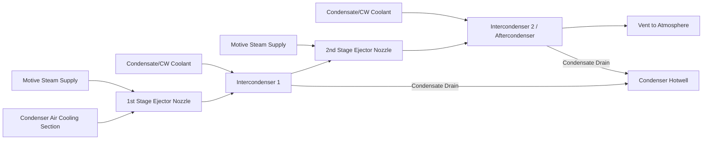

## Condenser Vacuum and Air Extraction Systems

### Overview

Condenser vacuum is the sub-atmospheric pressure maintained on the steam (shell) side of a surface condenser, produced by continuously removing steam and non-condensable gases (NCGs) so that turbine exhaust steam condenses at the lowest practical temperature. Air extraction systems are the auxiliary equipment—ejectors, vacuum pumps, and associated piping—that remove air and other NCGs that leak into or are carried into the condenser, since these gases would otherwise accumulate and destroy the vacuum.

Vacuum is central to Rankine cycle efficiency: lowering the condenser back pressure lowers the heat-rejection temperature, which increases the net work extracted per unit of steam and improves cycle thermal efficiency, per the Carnot-limited behavior of the Rankine cycle.

### Thermodynamic Basis

For a Rankine cycle, thermal efficiency is approximately

$$\eta_{th} = 1 - \frac{Q_{out}}{Q_{in}}$$

where $Q_{out}$ is heat rejected in the condenser. Since the condensing temperature $T_c$ is fixed by condenser pressure (steam condenses at the saturation temperature corresponding to that pressure), reducing condenser pressure $P_c$ reduces $T_c$, which reduces $Q_{out}$ and increases $\eta_{th}$.

A useful approximate relation, treating the cycle as an idealized heat engine bounded by boiler temperature $T_h$ and condenser temperature $T_c$ (both in Kelvin):

$$\eta_{Carnot} = 1 - \frac{T_c}{T_h}$$

This is an upper-bound idealization; real Rankine efficiency is always lower due to irreversibilities, but the qualitative trend—lower $T_c$ (deeper vacuum) improves efficiency—holds directly.

**Key Points**

- Typical condenser vacuum: 25–29.5 in. Hg (approximately 3.4–12.7 kPa absolute), depending on cooling water temperature and design.
- Every 1 in. Hg improvement in vacuum can improve turbine heat rate by roughly 1–2%, though the exact figure is plant- and load-dependent. [Inference]
- Vacuum is not "created" by extraction equipment alone; it results primarily from steam condensing to a much smaller liquid volume, drastically reducing specific volume and pressure. Extraction equipment removes air/NCGs that would otherwise blanket tube surfaces and raise back pressure.

### Why Air/NCG Removal Is Necessary

Non-condensable gases enter the condenser through:

- Air in-leakage at sub-atmospheric joints, glands, valve stems, expansion joints, and flanges
- Dissolved gases carried in with feedwater and makeup water
- Chemical dosing byproducts (e.g., decomposition of certain treatment chemicals)

Effects of NCG accumulation:

1. **Blanketing effect**: Air forms an insulating film on condenser tube surfaces, reducing the effective heat transfer coefficient.
2. **Partial pressure addition**: Per Dalton's Law, total condenser pressure is the sum of steam partial pressure and NCG partial pressure:

$$P_{total} = P_{steam} + P_{air}$$

For a fixed total pressure, more air means lower steam partial pressure, which corresponds to a lower saturation temperature than intended, or for a fixed target vacuum, air presence forces total pressure upward.

3. **Corrosion**: Dissolved oxygen carried back into feedwater accelerates corrosion in the boiler and piping.
4. **Reduced heat transfer**: Combined with fouling, air blanketing can significantly de-rate condenser thermal performance.

**Key Points**

- Even small air in-leakage (a few kg/hr in a large utility condenser) can measurably degrade vacuum if extraction capacity is insufficient.
- Air removal equipment must handle both the steady in-leakage rate and startup transients (large air volumes present before vacuum is established).

### Condenser Types (Brief Context)

- **Surface condenser**: Shell-and-tube heat exchanger; steam condenses on the shell side over tubes carrying cooling water. Most common in utility and large industrial plants; allows condensate recovery for feedwater.
- **Direct-contact (jet) condenser**: Cooling water sprays directly into steam; simpler, cheaper, but condensate is mixed with cooling water and generally not reused as feedwater. Less common in modern steam power plants due to water quality and environmental constraints.

Air extraction systems discussed below apply primarily to surface condensers, where NCG removal is a distinct, controllable auxiliary function.

### Air Extraction Equipment Types

#### 1. Steam Jet Air Ejectors (SJAE)

The traditional and still widely used method in large power plants.

**Principle**: High-pressure motive steam expands through a converging-diverging nozzle, reaching supersonic velocity and creating a low-pressure region. This entrains air/NCG-vapor mixture from the condenser air-removal section, and the mixture is compressed through a diffuser section as kinetic energy converts back to pressure (based on the Venturi/jet-pump principle).

**Typical configuration**:

- **First stage (hogging ejector)**: Used only during startup to rapidly evacuate large air volumes from the condenser shell before/during startup, establishing initial vacuum quickly. Often bypassed or shut down once running vacuum is established.
- **Second and further stages (holding ejectors)**: Continuously operate during normal operation, typically arranged in 2-stage or sometimes 3-stage series, each with an intercondenser between stages to condense motive steam and reduce the gas volume handled by the next stage.

**Intercondensers/Aftercondensers**: Small shell-and-tube condensers between ejector stages that condense the steam component of the ejector discharge (mixture of motive steam + entrained vapor), using condensate or circulating water as coolant. This dramatically reduces the volumetric flow the next stage must handle, since only the residual air/NCG passes forward while condensed steam drains back, often to the main condenser hotwell or a drain system.

**Key Points**

- SJAEs have no moving parts, are highly reliable, and require essentially no maintenance beyond nozzle/diffuser inspection.
- Motive steam consumption is a continuous efficiency penalty (steam that does not do turbine work), typically extracted from an auxiliary steam header or an extraction point.
- Ejector performance is sensitive to motive steam pressure; low motive pressure degrades vacuum-holding capability.

#### 2. Liquid Ring Vacuum Pumps (LRVP)

Mechanical rotating pumps increasingly used, especially where reducing steam consumption or improving load-following flexibility is desired.

**Principle**: An eccentrically mounted impeller rotates within a cylindrical casing partially filled with sealing liquid (usually water). Centrifugal force forms a rotating liquid ring that follows the casing wall, creating expanding and contracting volumes between impeller blades and the liquid ring—analogous to a liquid piston. Expanding volumes draw in gas (suction), contracting volumes compress and discharge it.

**Key Points**

- LRVPs draw electrical power rather than motive steam, which can reduce overall auxiliary steam demand.
- Sealing water requires cooling (via a heat exchanger or cooling tower) since compression heat and any vapor condensation load the seal water thermally.
- Often installed as skid-mounted packages with separator vessels, seal water heat exchangers, and control valves.
- Multiple units or multi-stage configurations may be used for deeper vacuum or larger air loads.

#### 3. Hybrid/Combination Systems

Some plants use a **hogging ejector for startup** paired with **LRVPs or SJAEs for continuous holding duty**, balancing rapid startup evacuation against efficient steady-state operation.

#### 4. Mechanical Vacuum Pumps (Rotary/Rotary-Vane, less common in large utility service)

Used more in smaller or industrial process condensers; similar displacement principle to LRVPs but with dry or lightly lubricated mechanisms in some designs.

### System Components (Typical SJAE Train)

**Component functions:**

- **Air cooling section**: A baffled zone within the condenser shell where the coldest cooling water enters, designed to sub-cool the air/vapor mixture before extraction, minimizing the amount of steam vapor carried to the ejector (improves ejector efficiency and reduces motive steam waste).
- **Suction piping**: Connects the air cooling section to the first-stage ejector; sized to minimize pressure drop, since even small drops here directly worsen achievable vacuum.
- **Motive steam control valve/pressure regulator**: Maintains stable motive steam pressure to the ejector nozzles, critical for consistent performance.
- **Intercondensers**: Reduce gas volume between stages; often integrated with the main condenser's cooling water circuit.
- **Loop seals/drain traps**: Allow condensate to drain from intercondensers back to the hotwell against the vacuum differential without breaking vacuum, using a water-leg seal.
- **Final vent**: Discharges residual non-condensable gas to atmosphere, sometimes through a silencer or radiation monitor (in nuclear plants, for effluent monitoring).

### Vacuum Instrumentation and Monitoring

**Key Points**

- **Condenser pressure/vacuum gauges**: Typically absolute pressure transmitters (not simple vacuum gauges referenced to local atmosphere) reading in in. Hg abs, kPa abs, or mbar abs, since local barometric pressure varies with weather and elevation.
- **Circulating water inlet/outlet temperatures**: Used with condenser pressure to calculate terminal temperature difference (TTD) and cleanliness factor, diagnosing whether poor vacuum stems from air in-leakage, tube fouling, or insufficient cooling water flow.
- **Air in-leakage measurement**: Often measured directly by isolating extraction equipment and timing pressure rise in the condenser shell, or by flow-metering the ejector/LRVP discharge; compared against design/acceptable limits (commonly a few kg/hr for large units, though limits are unit-specific). [Unverified — exact acceptable in-leakage thresholds vary significantly by condenser size, manufacturer specification, and applicable standards such as HEI (Heat Exchange Institute) guidelines.]
- **Dissolved oxygen (DO) in condensate**: An indirect indicator of air in-leakage; rising DO trends often correlate with increasing air ingress even before vacuum visibly degrades.

### Terminal Temperature Difference (TTD) and Diagnostics

$$TTD = T_{sat} - T_{CW,out}$$

where $T_{sat}$ is the saturation temperature corresponding to condenser pressure, and $T_{CW,out}$ is the circulating water outlet temperature.

- Rising TTD with stable cooling water flow and inlet temperature typically indicates tube fouling or air blanketing rather than a cooling water-side problem.
- Combined with cleanliness factor (ratio of actual to design overall heat transfer coefficient), TTD trending is a primary diagnostic tool for condenser performance degradation, of which air in-leakage is one contributing cause among several (the others being tube fouling/scaling and insufficient cooling water flow).

### Common Causes of Air In-Leakage

- Turbine shaft gland seals (especially at sub-atmospheric-pressure end stages) with degraded packing or seal steam supply issues
- Valve stem packing on valves operating below atmospheric pressure
- Flanged joints, expansion joints, and manway gaskets on the condenser shell and low-pressure turbine casing
- Instrument connections and sample points
- Vacuum breaker valves that fail to fully reseat
- Condensate pump seals (mechanical seal or packing degradation) on the suction side

**Example**

A plant notices condenser vacuum degrading from 28.5 in. Hg to 27.0 in. Hg over several weeks with stable cooling water conditions. Operators perform a helium leak test or an ultrasonic leak survey around LP turbine gland seals and condenser expansion joints, locating a degraded expansion joint bellows as the source. After repair, vacuum returns to design levels, confirming air in-leakage (rather than fouling) as the root cause.

### Startup Sequence Considerations

1. Prior to turbine roll, the condenser shell is at or near atmospheric pressure, filled largely with air.
2. The hogging ejector (or a dedicated large-capacity startup vacuum pump) is placed in service to rapidly reduce shell pressure, since holding ejectors/LRVPs are typically sized only for steady-state air in-leakage rates and would take excessively long to evacuate the full air volume from atmospheric conditions.
3. Once a sufficient vacuum threshold is reached (often specified by the turbine manufacturer, commonly in the range where turbine rolling/warming can safely begin), the hogging ejector is secured and holding ejectors/LRVPs take over continuous duty.
4. Vacuum continues improving as steam flow through the turbine begins and condensing rate increases, further reducing shell volume of vapor.

**Next Steps**

- Circulating Water (CW) System Design and Cooling Tower Interaction
- Condenser Tube Materials, Fouling, and Cleaning Systems (mechanical/chemical)
- Feedwater Heaters and Deaeration
- Condensate Polishing Systems
- Turbine Back-Pressure Effects on Heat Rate and Turbine Exhaust Annulus Design
- HEI (Heat Exchange Institute) Standards for Condenser Performance
- Vacuum Breaker Valves and Emergency Condenser Isolation
- Dissolved Oxygen Control and Feedwater Chemistry