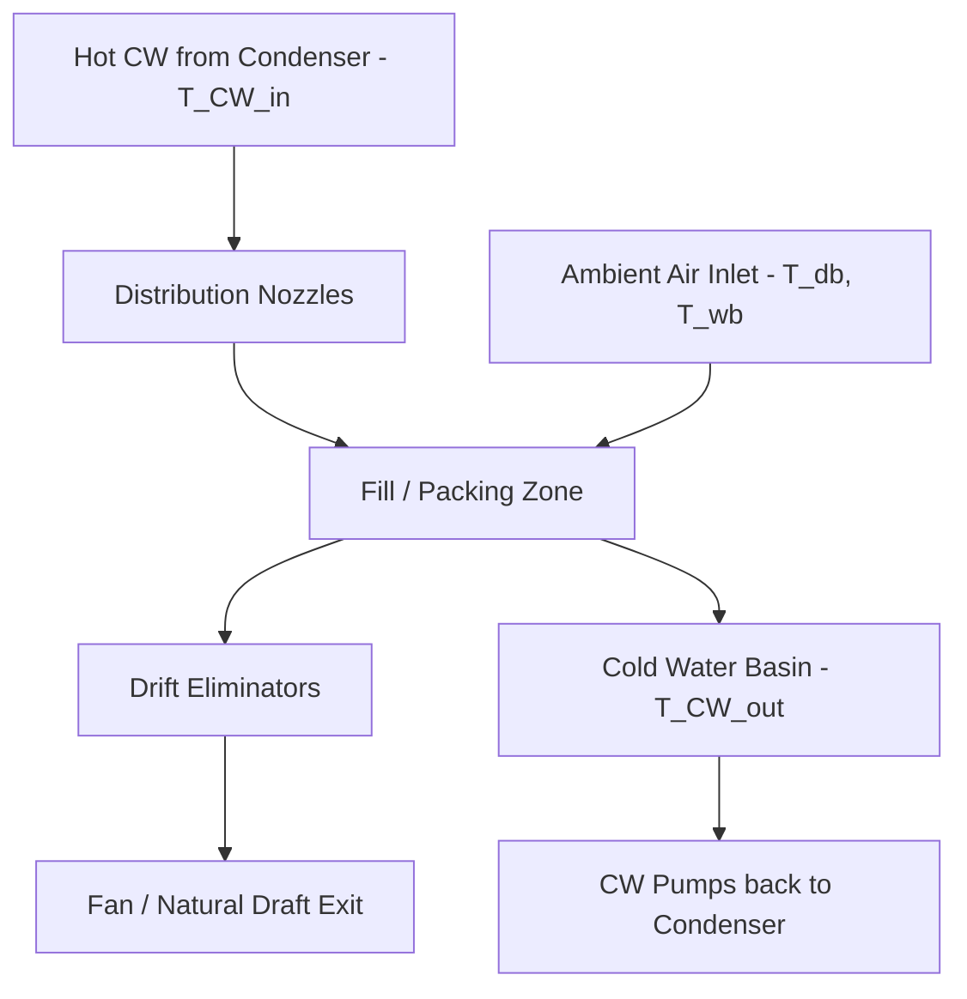

## Cooling Towers: Wet, Dry, and Hybrid Systems


### Overview

Cooling towers reject waste heat from a power plant's condenser cooling water (or other process cooling loops) to the atmosphere, allowing the circulating water to be cooled and reused rather than drawn once-through from a natural water body. They are a critical component of the heat rejection system in the overall Rankine cycle, directly influencing achievable condenser vacuum and, therefore, cycle efficiency.

Three broad categories exist, distinguished by the mechanism of heat transfer to the atmosphere:

- **Wet (evaporative) cooling towers**: Reject heat primarily through evaporation of a small fraction of the circulating water into air.
- **Dry cooling towers**: Reject heat purely by sensible heat transfer through finned-tube heat exchangers, with no water evaporation or loss.
- **Hybrid (wet/dry) cooling towers**: Combine both mechanisms, often to reduce visible plume formation, limit water consumption, or provide operational flexibility across seasons.

### Thermodynamic Basis

#### Wet Cooling: Evaporative Heat Rejection

Wet towers exploit the latent heat of vaporization of water, which is far larger than its sensible heat capacity. The heat rejected per unit mass of water evaporated is approximately the latent heat of vaporization $h_{fg}$ (roughly 2260 kJ/kg at atmospheric pressure, varying with temperature), compared to sensible cooling of roughly 4.2 kJ/kg per °C of water temperature drop. This means a wet tower can reject large heat loads while evaporating only a small percentage (typically 1–2%) of the circulating water flow.

The driving potential for evaporation is governed by the difference between the water surface vapor pressure (at water temperature) and the vapor pressure of the surrounding air, related to the **wet-bulb temperature** of ambient air rather than dry-bulb temperature. This is the fundamental reason wet cooling tower performance is referenced to wet-bulb temperature:

$$Approach = T_{CW,out} - T_{wb}$$

where $T_{CW,out}$ is the cold water temperature leaving the tower and $T_{wb}$ is the ambient wet-bulb temperature. Approach is always positive; typical design approaches range roughly 4–8°C (7–15°F) for a well-designed wet tower.

**Range** is the temperature drop of the circulating water across the tower:

$$Range = T_{CW,in} - T_{CW,out}$$

#### Dry Cooling: Sensible Heat Rejection

Dry towers reject heat by convective and conductive transfer through a heat exchanger surface (finned tubes) to ambient air, with no phase change of the cooling medium. Because only sensible heat transfer is used, performance is governed by the ambient **dry-bulb temperature**, and the achievable approach temperature is inherently larger than for wet systems:

$$Approach_{dry} = T_{CW,out} - T_{db}$$

Typical dry-cooling approaches are significantly larger (10–20°C or more) than wet-tower approaches, since sensible-only heat transfer through air is thermodynamically less efficient at rejecting large heat loads per unit of air/surface area, and dry-bulb temperatures are generally higher than wet-bulb temperatures for the same air condition (except at 100% relative humidity, where they're equal).

**Key Points**

- Dry-bulb temperature is always ≥ wet-bulb temperature (equal only at saturation/100% RH).
- Because dry cooling references the higher dry-bulb temperature and has a larger approach, dry-cooled plants generally operate at higher, less efficient condenser back pressures than comparable wet-cooled plants, especially on hot, dry days.
- This translates to a measurable heat-rate penalty for dry-cooled plants relative to wet-cooled plants, particularly during high ambient temperature periods. [Inference — exact penalty magnitude is plant- and climate-specific.]

### Wet Cooling Tower Types

#### 1. Natural Draft Cooling Towers

Large hyperbolic concrete shell towers that rely on the **chimney (stack) effect**: warm, moist air inside the tower is less dense than ambient air outside, creating a natural buoyant draft that draws air upward through the fill and water spray without mechanical fans.

**Key Points**

- Common at large baseload thermal and nuclear plants (very large, easily recognizable hyperbolic shape).
- Very low auxiliary power consumption (no fan power) but high capital cost and large footprint/height (often 100–200 m tall).
- Performance is sensitive to ambient conditions and wind; shell height and diameter are engineered around design heat load and local meteorology.

#### 2. Mechanical Draft Cooling Towers

Use fans to force or induce airflow through the tower, giving more controllable and compact performance than natural draft designs.

- **Induced draft**: Fan(s) mounted at the top of the tower pull air upward through the fill (counterflow) or across it (crossflow). Air enters at the base/sides and is drawn through and discharged at the top by the fan.
- **Forced draft**: Fan(s) mounted at the base push air into the tower and up through the fill. Less common for large utility service due to recirculation issues (discharged humid air can be re-entrained into the fan intake) and generally lower efficiency compared to induced draft designs.

**Flow arrangement subtypes:**

- **Counterflow**: Air flows vertically upward, opposite to the downward-falling water. Generally more thermally efficient per unit of fill volume due to more favorable temperature/humidity driving-force profiles.
- **Crossflow**: Air flows horizontally through the falling water curtain. Simpler mechanical design, easier maintenance access to fill, typically lower pumping head requirements (lower spray elevation), but somewhat less thermally efficient than counterflow for the same footprint. [Inference — general engineering consensus; exact efficiency differential depends on specific fill design and tower geometry.]

```mermaid
flowchart TD
    subgraph Induced_Draft_Counterflow (svg_diagram)
    A[Hot Water Distribution] --> B[Fill / Packing]
    B --> C[Cold Water Basin]
    D[Ambient Air Inlet - Louvers] --> B
    B --> E[Fan - Induced Draft]
    E --> F[Moist Air Discharge]
    end
```

#### 3. Fill (Packing) Types

Fill material maximizes air-water contact surface area and residence time.

- **Splash fill**: Water cascades over staggered horizontal bars/slats, breaking into droplets. Durable, resistant to fouling, tolerant of poor water quality, but lower thermal efficiency per unit volume.
- **Film fill**: Water flows as a thin film over closely spaced corrugated PVC sheets. Much higher surface area and thermal efficiency per unit volume, but more susceptible to fouling/clogging with poor water quality (high suspended solids, biological growth), requiring cleaner circulating water chemistry.

**Key Points**

- Fill selection is a direct tradeoff between thermal performance and water quality tolerance/maintenance.
- Fill degradation (scaling, biofouling, physical damage) is a leading cause of cooling tower thermal performance loss over time.

### Wet Cooling Tower Components

- **Hot water distribution system**: Basins, troughs, or pressurized spray nozzles distributing incoming hot circulating water evenly across the fill.
- **Fill/packing**: As described above.
- **Drift eliminators**: Baffled sections downstream of the fill that remove entrained water droplets ("drift") from the exiting air stream, minimizing water loss and reducing deposition of dissolved solids on surrounding equipment/vegetation.
- **Cold water basin**: Collects cooled water at the tower base for return to the condenser via circulating water pumps.
- **Air inlet louvers**: Control and direct airflow into the tower while minimizing water splash-out.
- **Fan and drive system** (mechanical draft only): Includes fan blades, gearbox/speed reducer, motor, and drive shaft; often equipped with variable-speed or two-speed control for load/ambient following.
- **Structural frame/casing**: Fiberglass-reinforced plastic (FRP), wood, or concrete, depending on tower type and era.

### Water Balance and Makeup Requirements

Wet cooling towers continuously lose water through three mechanisms, requiring makeup water addition:

$$Makeup = Evaporation + Drift + Blowdown$$

- **Evaporation loss**: The primary heat-rejection mechanism itself; roughly proportional to the heat load rejected and the range.
- **Drift loss**: Fine water droplets entrained in the discharge air stream that escape past drift eliminators; modern eliminators typically limit drift to a very small fraction of circulating flow (commonly well under 0.001%, though exact guaranteed values are eliminator/manufacturer-specific). [Unverified — precise drift rates vary by eliminator design and are typically vendor-guaranteed rather than universal constants.]
- **Blowdown**: Deliberate discharge of a portion of circulating water to control the buildup of dissolved solids (since evaporation concentrates minerals left behind), preventing scaling and fouling. Blowdown rate is set based on target **cycles of concentration** (COC):

$$COC = \frac{Concentration_{CW}}{Concentration_{makeup}}$$

Higher COC reduces blowdown volume (water savings) but increases scaling/corrosion risk, requiring more aggressive water treatment.

**Example**

A plant rejecting 500 MW of waste heat through a wet cooling tower with a 10°C range will evaporate water roughly proportional to the heat load divided by the latent heat of vaporization; combined with blowdown and drift, a large utility-scale wet tower commonly requires makeup water flows in the range of several thousand gallons per minute per hundred MW of thermal rejection, though the precise figure depends on ambient wet-bulb, range, approach, and COC. [Inference — order-of-magnitude engineering estimate; exact flows are project-specific and calculated via detailed heat/mass balance.]

### Dry Cooling Tower Types

#### 1. Direct Dry Cooling (Air-Cooled Condenser, ACC)

Turbine exhaust steam is ducted directly to large banks of finned-tube air-cooled heat exchanger modules, typically arranged in an A-frame configuration with forced-draft fans beneath, condensing steam directly by rejecting heat to ambient air without an intermediate water loop.

**Key Points**

- Eliminates the surface condenser and circulating water loop entirely for the main steam path (though condensate is still collected and returned to the feedwater system).
- Requires very large heat transfer surface area (extensive finned-tube banks) due to the lower heat transfer coefficient of air compared to water/evaporation.
- Common in water-scarce regions or where environmental permitting restricts water withdrawal/discharge.

#### 2. Indirect Dry Cooling (Heller System / with Natural or Mechanical Draft Tower)

Steam is condensed in a conventional surface condenser using a closed-loop water circuit, which then rejects heat to ambient air through finned-tube heat exchangers (often called a "dry cooling tower" or "radiator" arrangement), sometimes housed within a natural-draft tower shell for buoyancy-driven airflow (the Heller system, historically associated with natural-draft dry towers).

**Key Points**

- Allows retention of a conventional surface condenser and jet-condensing arrangement while avoiding evaporative water loss.
- Generally has higher capital cost and higher parasitic fan power (for mechanical draft variants) than wet cooling.
- Performance degrades more significantly at high ambient temperatures since it relies on dry-bulb temperature and sensible heat transfer alone, requiring larger heat exchanger surface area to maintain acceptable back pressure across the full range of ambient conditions.

**Comparison: Wet vs. Dry**

| Characteristic | Wet Cooling | Dry Cooling |
| --- | --- | --- |
| Water consumption | High (evaporative) | Minimal/none |
| Reference temperature | Wet-bulb | Dry-bulb |
| Typical approach | ~4–8°C | ~10–20°C+ |
| Achievable back pressure | Lower | Higher |
| Capital cost | Lower (typically) | Higher (typically) |
| Parasitic power | Lower (fans, pumps) | Higher (large fan arrays) |
| Site suitability | Water-available sites | Water-scarce/arid sites |
| Visible plume | Yes (water vapor) | No |

### Hybrid (Wet/Dry) Cooling Towers

Hybrid towers combine a wet section and a dry section, either in series or parallel airflow paths, within a single structure or paired system.

**Primary motivations:**

1. **Plume abatement**: The dry section reheats and mixes with the saturated moist air from the wet section, raising its temperature enough to prevent visible fog/plume formation, particularly valued near airports, highways, or residential areas where visible plumes or fogging/icing are undesirable.
2. **Water conservation with performance retention**: Operating predominantly in dry mode during cooler months or lower-load periods, switching to wet (or combined) mode during hot weather or peak load, balancing water savings against performance.

**Configurations:**

- **Series (plume-abated) hybrid**: Air passes through the dry (finned-tube) section first, then the wet section, with the two air streams typically combined at discharge to control the final humidity/temperature of the exiting air.
- **Parallel hybrid**: Separate wet and dry cells operate independently, with control systems apportioning heat load between them based on ambient conditions, water availability, or plume-control targets.

**Key Points**

- Hybrid towers cost more than either pure wet or pure dry towers due to the combined equipment and more complex controls.
- Widely used at plants with specific environmental permitting requirements (e.g., visible plume restrictions) rather than purely for thermodynamic performance.

### Cooling Tower Performance Diagram (Wet Tower, Counterflow)



### Water Treatment Considerations (Wet Systems)

- **Scale control**: Preventing precipitation of calcium carbonate, calcium sulfate, and silica as dissolved solids concentrate due to evaporation; managed via COC limits, acid/scale inhibitor dosing, and side-stream softening in some cases.
- **Corrosion control**: Managing dissolved oxygen, pH, and chloride levels to protect tower structure (especially metal components) and downstream piping/condenser tubes.
- **Biological control (biocides)**: Preventing algae, bacteria (including Legionella risk management), and biofilm growth in fill and basins, typically via oxidizing (chlorine, bromine) and non-oxidizing biocide dosing programs.
- **Legionella risk**: Wet cooling towers are a recognized potential source of Legionella bacteria proliferation in warm water/mist environments; industry guidance (e.g., ASHRAE 188) addresses inspection, monitoring, and disinfection protocols. [Unverified — specific regulatory requirements vary by jurisdiction and should be confirmed against applicable local/national codes.]

### Environmental and Regulatory Considerations

- **Water withdrawal/discharge permitting**: Wet towers require makeup water sourcing and blowdown discharge, both subject to environmental permitting (e.g., thermal discharge limits, total dissolved solids limits).
- **Plume visibility**: A land-use and public perception consideration, addressed via hybrid plume-abated designs where required.
- **Noise**: Mechanical draft fans and falling water generate noise, relevant for siting near residential areas.
- **Freeze protection**: Wet towers in cold climates require freeze-protection measures (basin heaters, reduced airflow/fan cycling in winter, ice detection) to prevent fill and basin damage.

**Next Steps**

- Circulating Water (CW) Pump Systems and Piping Design
- Condenser Performance Diagnostics (TTD, Cleanliness Factor)
- Water Treatment Chemistry for Cooling Systems (scale, corrosion, biological control)
- Air-Cooled Condenser (ACC) Design Details and Backpressure Control
- Plume Abatement Design Calculations
- Cooling Tower Fill Selection and Fouling Mitigation
- Environmental Permitting for Thermal Discharge and Water Withdrawal