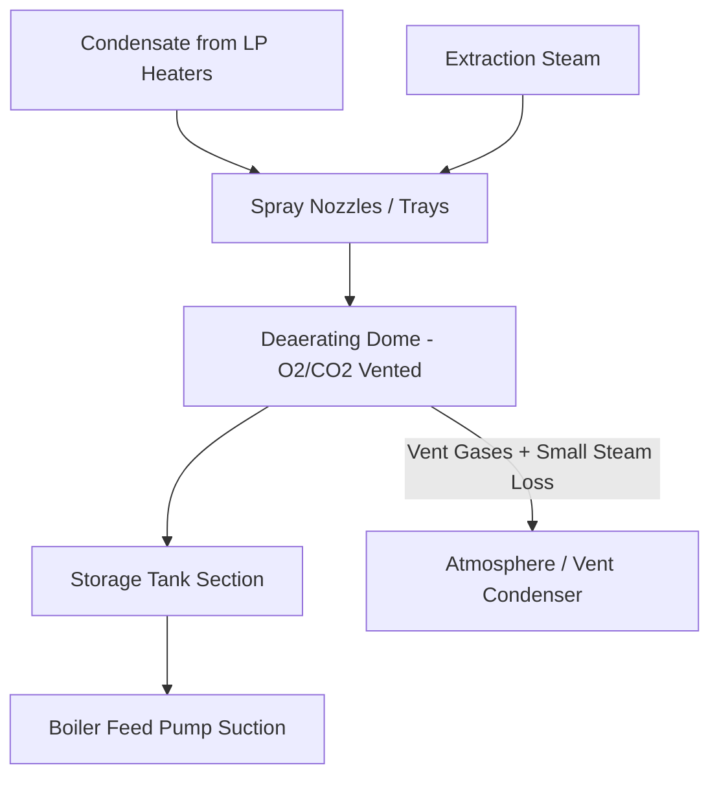
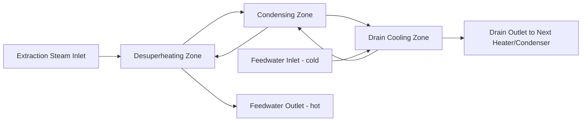

## Open and Closed Feedwater Heaters

### Overview

Feedwater heaters are heat exchangers that raise the temperature of condensate/feedwater on its path from the condenser to the boiler (or steam generator), using steam extracted from the turbine at various pressure stages. This process, called **regenerative feedwater heating**, is a key efficiency-improving modification to the basic Rankine cycle, implemented in essentially all modern steam power plants above small scale.

Feedwater heaters are classified into two fundamental types based on how the heating steam and feedwater interact:

- **Open (direct-contact) feedwater heaters**: Extraction steam and feedwater physically mix together.
- **Closed (surface) feedwater heaters**: Extraction steam and feedwater remain separated by tube walls, exchanging heat without mixing.

### Thermodynamic Basis: The Regenerative Rankine Cycle

In a basic Rankine cycle, feedwater is pumped directly from condenser conditions to boiler pressure and enters the boiler at a relatively low temperature, requiring a large amount of heat addition at the (often lower-temperature) early stage of boiler heat transfer, which happens irreversibly across a large temperature difference and increases cycle entropy generation.

By extracting steam at intermediate pressures from the turbine and using it to preheat feedwater before boiler entry, the average temperature at which heat is added to the working fluid increases, which raises cycle efficiency:

$$\eta_{th} = 1 - \frac{Q_{out}}{Q_{in}}$$

Since regeneration reduces $Q_{in}$ needed from the boiler for the same net cycle work (part of the heating "cost" is paid by extraction steam that would otherwise have done less useful work at the low-pressure end of the turbine anyway), the net effect is improved thermal efficiency, typically in the range of several percentage points for a well-designed regenerative feedwater heating train. [Inference — general magnitude; exact efficiency gain depends on number and arrangement of heaters, pressures selected, and cycle configuration.]

**Key Points**

- Extraction steam taken for feedwater heating no longer expands through the remaining turbine stages, so it produces less mechanical work than it would if it stayed in the main steam path to the condenser — this is the "cost" of regeneration, offset by the larger benefit of reduced boiler heat input at low temperature.
- The number of feedwater heaters and their extraction pressures are optimized economically; more heaters yield diminishing efficiency returns while increasing capital cost and plant complexity.
- Utility-scale plants commonly use 5–8 feedwater heaters in a full train (a mix of low-pressure, an open deaerating heater, and high-pressure heaters).

### Open (Direct-Contact) Feedwater Heaters

#### Principle

In an open feedwater heater, extraction steam is sprayed or cascaded directly into a body of feedwater within a single vessel, and the two streams mix completely, exiting as a single saturated liquid stream at the extraction steam's saturation pressure/temperature.

Since the two streams fully mix, an open feedwater heater requires that both streams be brought to the same pressure before entering the vessel — meaning a pump is needed on the low-pressure (condensate) side to raise its pressure up to the heater's operating pressure before the mixing occurs, and typically another pump is needed downstream of the heater to raise the combined stream to the pressure of the next component in the feedwater train.

**Key Points**

- Open feedwater heaters achieve excellent thermal performance because direct mixing eliminates any temperature approach limitation associated with a heat transfer surface — the outlet water temperature equals the saturation temperature of the extraction steam pressure.
- The requirement for matching pressures before mixing means open heaters introduce additional pump stages into the feedwater train, increasing capital cost and complexity compared to closed heaters at the same location.
- Due to this pumping requirement, most feedwater heater trains use only **one** open heater, strategically placed to simultaneously serve as the **deaerator**.

#### The Deaerating Feedwater Heater (DA)

The single open feedwater heater in most plants is combined with deaeration function and is typically referred to as the **deaerator** or **DA heater**. This is a specialized open feedwater heater designed to simultaneously:

1. Heat feedwater via direct-contact mixing with extraction steam
2. Mechanically and thermally strip dissolved gases (primarily oxygen and carbon dioxide) from the feedwater

**Deaeration principle**: Per Henry's Law, the solubility of a gas in a liquid decreases as the liquid's temperature rises toward its boiling point at the prevailing pressure, and as the partial pressure of that gas above the liquid decreases. By spraying/cascading feedwater through a steam atmosphere and heating it to very near the saturation temperature at the deaerator's operating pressure, dissolved oxygen and CO₂ are driven out of solution and vented (along with a small amount of steam) from the top of the vessel.

**Key Points**

- Dissolved oxygen in feedwater is a major driver of corrosion in boiler tubes, economizers, and feedwater piping; deaeration is essential to protect these components (residual oxygen is typically further scavenged chemically, e.g., with hydrazine or oxygen scavenger substitutes, downstream of the DA).
- The DA heater is typically positioned at an intermediate pressure in the feedwater train, physically often mounted on an elevated structure to provide adequate net positive suction head (NPSH) for the downstream boiler feed pumps.
- The DA vessel typically includes a spray/tray section (for deaeration contact) and a storage tank section below (to buffer feedwater supply and accommodate load transients), often built as a horizontal vessel with the storage tank integral beneath the deaerating dome.

### Closed (Surface) Feedwater Heaters

#### Principle

In a closed feedwater heater, feedwater flows through a tube bundle while extraction steam condenses on the shell side (outside the tubes), transferring heat through the tube walls without the two streams mixing. This is functionally similar to a small shell-and-tube surface condenser, except the extraction steam typically fully condenses and often sub-cools slightly before draining.

**Key Points**

- Because the streams never mix, feedwater on the tube side can remain at boiler feed pump discharge pressure (or an intermediate pressure) throughout, without needing to match the extraction steam pressure — this avoids the extra pumping stages required by open heaters.
- Closed heaters are therefore used for the majority of feedwater heating duties in a typical train (all except the single open/DA heater), since they can be arranged in series on a single continuous feedwater pressure without intermediate pumps.
- A temperature approach (analogous to condenser TTD) exists between the extraction steam saturation temperature and the feedwater outlet temperature, since heat transfer across a finite surface area requires a temperature difference; this approach is a key design/performance parameter, and closed heaters can never achieve the theoretical ideal of matching extraction steam saturation temperature exactly. [Inference — standard heat exchanger behavior; specific approach values are heater-design-dependent.]

#### Closed Heater Zones

A well-designed closed feedwater heater is often divided internally into up to three thermal zones to maximize heat recovery from the extraction steam:

1. **Desuperheating zone (optional)**: If extraction steam arrives superheated, an internal baffled section near the steam inlet uses the hottest feedwater (just before it exits the heater) to remove superheat from the incoming steam before it reaches the main condensing zone. This can raise feedwater outlet temperature above what would be achievable using only the saturation temperature of the extraction steam.
2. **Condensing zone**: The main heat transfer zone where extraction steam condenses on the outside of the tube bundle at essentially constant saturation temperature/pressure, transferring the bulk of the latent heat to the feedwater flowing through the tubes.
3. **Drain cooling (sub-cooling) zone (optional)**: An internal baffled section where the coldest incoming feedwater cools the condensed drain (condensate) below its saturation temperature before it exits the heater, recovering additional sensible heat that would otherwise be discarded, and also reducing flash steam formation when the drain is routed to a lower-pressure heater or the condenser.

**Key Points**

- Not every closed heater includes all three zones; simpler designs use only the condensing zone, while higher-performance heaters (especially high-pressure heaters near the boiler) commonly incorporate desuperheating and drain cooling to maximize thermal recovery.
- The **Terminal Temperature Difference (TTD)** for a closed feedwater heater is defined analogously to condenser TTD:

$$TTD = T_{sat,extraction} - T_{FW,out}$$

A smaller (or even slightly negative, in desuperheating-zone-equipped heaters) TTD indicates better heat transfer performance; TTD tends to increase over time as tubes foul or scale, serving as a key performance-monitoring parameter.

- **Drain Cooler Approach (DCA)** is a related performance parameter for heaters with drain cooling zones:

$$DCA = T_{drain,out} - T_{FW,in}$$

### Feedwater Heater Arrangement in a Typical Train

A typical utility-scale regenerative feedwater heating train, in order of increasing pressure from condenser to boiler:

1. **Low-pressure (LP) closed heaters** (several stages): Heat condensate leaving the condenser hotwell using progressively higher-pressure LP turbine extraction points; arranged in series, often located within the condenser neck ("integral" heaters) or as separate shell units.
2. **Deaerating (open) heater**: Receives condensate from the last LP heater; deaerates and heats it further using an intermediate-pressure extraction point; feeds the boiler feed pump suction.
3. **High-pressure (HP) closed heaters** (typically 1–3 stages): Located downstream of the boiler feed pump discharge, heating feedwater at full (or near-full) boiler pressure using higher-pressure extraction steam, up to and including sometimes the highest-pressure extraction point taken directly from the main steam or an early HP turbine stage/cold reheat line.

**Key Points**

- Drains from HP closed heaters are typically **cascaded backward** (to the next lower-pressure heater, and eventually to the deaerator or condenser) rather than pumped forward, since draining to a lower-pressure point is passive and simple; some designs instead use **drain pump-forward** arrangements to inject drains directly into the main feedwater stream at the heater's own pressure level, improving efficiency slightly by avoiding the throttling/flashing loss inherent in cascading.
- LP heater drains cascade similarly down toward the condenser hotwell.
- This cascading/pump-forward design choice is a classic thermal-economic optimization tradeoff between simplicity (cascading) and efficiency (pump-forward), and specific choices are plant/design-specific. [Inference — general industry practice; not universal across all plant designs.]

### Comparison: Open vs. Closed Feedwater Heaters

| Characteristic | Open (Direct-Contact) | Closed (Surface) |
| --- | --- | --- |
| Steam/water mixing | Yes, full mixing | No, separated by tubes |
| Outlet temperature | Equals extraction steam $T_{sat}$ | Approaches but doesn't equal $T_{sat}$ (TTD) |
| Additional pumps required | Yes (both sides must match pressure) | No (feedwater stays at one pressure level) |
| Deaeration capability | Yes (primary/only type used for this) | No |
| Typical count in a train | Usually only 1 (the DA) | Several (LP and HP stages) |
| Capital cost per unit | Higher (vessel + extra pumps) | Lower per unit, but more units needed |
| Thermal performance | Excellent (no approach limitation) | Good, limited by TTD/heat transfer area |

**Example**

A 500 MW coal-fired unit's feedwater train might include 3 LP closed heaters (heating condensate from ~35°C to ~150°C using low-pressure LP turbine extractions), one deaerating open heater (further heating and deaerating to ~165°C using an intermediate extraction), and 2 HP closed heaters downstream of the boiler feed pump (heating feedwater to ~230–250°C using high-pressure extraction steam before it enters the economizer). Exact temperatures and stage counts vary significantly by plant design, steam conditions, and manufacturer. [Inference — illustrative representative values, not a specific documented plant.]

### Performance Monitoring and Common Issues

- **TTD trending**: Increasing TTD over time on a closed heater typically indicates tube fouling, scaling, or tube plugging (from leak repairs), reducing effective heat transfer area.
- **Level control**: Both open and closed heaters require careful water level control on the shell/condensing side — high level can flood tubes and reduce heat transfer area or allow liquid carryover into extraction steam piping (risking water induction into the turbine, a serious operational hazard); low level can allow steam blow-through into drain piping.
- **Tube leaks**: A closed heater tube leak allows high-pressure feedwater to leak into the lower-pressure shell side (steam side), which can be detected via rising shell-side level, chemistry changes, or pressure anomalies; extended undetected leaks can cause water induction risks or heater flooding.
- **Extraction steam line non-return valves**: Installed on extraction lines to prevent reverse flow of feedwater/steam from a tripped or flooded heater back into the turbine casing during transients (a critical protective device against turbine water induction).

**Next Steps**

- Boiler Feed Pump Design, NPSH, and Drive Systems
- Deaerator Sizing, Venting, and Chemical Oxygen Scavenging
- Feedwater Heater Tube Materials and Failure Modes
- Turbine Water Induction Prevention Systems
- Heat Balance Diagrams and Extraction Steam Cycle Optimization
- Condensate Polishing Systems
- Economizer and Boiler Feedwater Chemistry Control