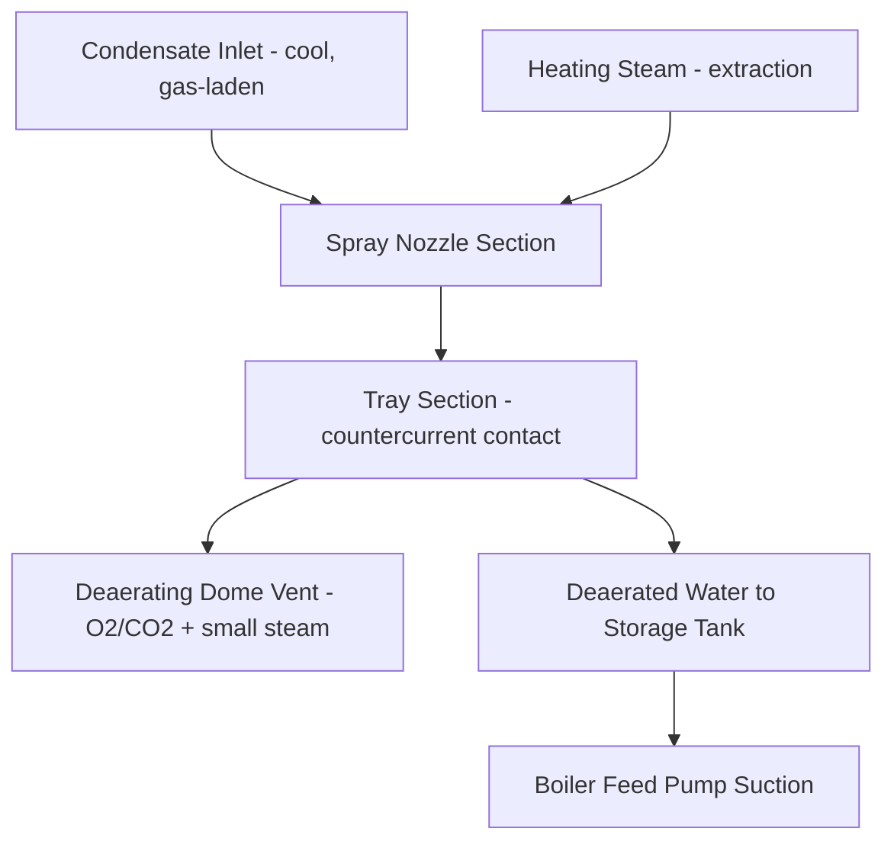

## Deaerators and Feedwater Treatment

### Overview

Deaerators remove dissolved non-condensable gases—primarily oxygen and carbon dioxide—from boiler feedwater, protecting the boiler, feedwater piping, and downstream components from gas-driven corrosion. Feedwater treatment more broadly encompasses the full set of chemical and mechanical processes applied to condensate/feedwater to control corrosion, scaling, and deposition throughout the steam-water cycle. This item builds on the deaerating (open) feedwater heater introduced previously, focusing on deaeration mechanisms and the broader feedwater chemistry program.

### Why Dissolved Gases Matter

**Key Points**

- **Dissolved oxygen** is the primary corrosion driver in feedwater systems, attacking carbon steel piping, economizer tubes, and boiler surfaces through electrochemical oxidation, forming iron oxide deposits (pitting-type corrosion is a particular concern since it concentrates attack at localized points rather than uniform wastage).
- **Dissolved carbon dioxide** (often from makeup water alkalinity breakdown or air in-leakage) forms carbonic acid in solution, lowering pH and promoting general corrosion, particularly in condensate return piping.
- Both gases enter the cycle primarily through: makeup water (containing dissolved atmospheric gases), air in-leakage at sub-atmospheric points (condenser, LP turbine glands, condensate pump seals), and to a lesser extent through chemical dosing byproducts.
- Uncontrolled oxygen corrosion in a boiler can lead to tube failures, reduced heat transfer efficiency (from oxide deposit buildup acting as insulation), and costly unplanned outages.

### Deaeration Principle (Henry's Law Basis)

Gas solubility in a liquid is governed by Henry's Law:

$$C_{gas} = k_H \cdot P_{gas}$$

where $C_{gas}$ is the dissolved gas concentration, $P_{gas}$ is the partial pressure of that gas above the liquid, and $k_H$ is the Henry's Law constant (temperature-dependent). Deaeration exploits two effects simultaneously:

1. **Heating to near-saturation temperature**: As water temperature approaches the boiling point at the prevailing pressure, the vapor pressure of water itself approaches the total system pressure, driving the partial pressure of any other gas present toward zero — dissolved gas solubility drops sharply as this condition is approached.
2. **Steam sweeping/scrubbing**: Continuously generated steam within the deaerator vessel physically sweeps liberated gas molecules away from the water surface and out through a vent, preventing re-absorption and maintaining a low local partial pressure of the gas above the water.

**Key Points**

- Mechanical deaeration (via the deaerator) is typically effective at reducing dissolved oxygen to very low levels — commonly cited targets are on the order of 0.005–0.01 mg/L (ppm) or lower for utility boiler feedwater. [Unverified — exact achievable/required levels vary by boiler pressure class, applicable standards, and specific deaerator design/performance guarantee.]
- Mechanical deaeration alone typically cannot achieve the extremely low oxygen levels required for high-pressure boiler protection, so **chemical oxygen scavenging** is used downstream as a polishing step.

### Deaerator Types

#### 1. Spray-Type Deaerators

Feedwater is broken into a fine spray through nozzles into a steam atmosphere, maximizing surface area for rapid heat transfer and gas release; often combined with a tray section for additional contact time.

#### 2. Tray-Type Deaerators

Feedwater cascades downward over a series of perforated trays while steam flows upward (or across) countercurrently, providing extended contact time and multiple stages of gas stripping.

#### 3. Spray-Tray Combination

Most modern deaerators combine an initial spray section (for rapid bulk heating and coarse gas removal) with a downstream tray section (for final polishing of residual dissolved gas), achieving both fast heat-up and low residual oxygen levels.

**Key Points**

- The vent from the deaerating dome intentionally releases a small, continuous amount of steam along with the stripped gases — this steam loss is necessary to sweep gases out and prevent their re-absorption, and is a normal, designed-in operating loss (excessive venting wastes steam; insufficient venting compromises deaeration).
- Vent rate is typically controlled via an orifice or valve sized to balance adequate gas removal against minimizing steam loss.

### Deaerator Storage Tank

Below (or integral with) the deaerating dome, a storage tank holds a buffer volume of deaerated feedwater, serving several functions:

- **Surge capacity**: Accommodates transient mismatches between condensate supply and boiler feed pump demand during load changes.
- **NPSH provision**: The elevated mounting of the deaerator (and the static head of water in the storage tank) provides adequate Net Positive Suction Head (NPSH) to the downstream boiler feed pumps, preventing cavitation, since the water is at or very near its saturation temperature and would otherwise flash to steam under insufficient suction pressure.
- **Residence time**: A brief additional holding time can allow further gas release from any remaining supersaturated conditions.

**Key Points**

- Boiler feed pumps handling near-saturated water are particularly vulnerable to cavitation if suction pressure margin is inadequate — the deaerator's elevation and storage tank design are directly tied to feed pump NPSH requirements.
- Storage tank level control is a critical control loop, balancing condensate makeup/return flow against boiler feed pump demand.

### Chemical Feedwater Treatment (Beyond Mechanical Deaeration)

#### 1. Chemical Oxygen Scavenging

Chemicals are dosed into feedwater (typically at the deaerator outlet or feedwater storage tank) to react with and eliminate residual dissolved oxygen that mechanical deaeration cannot fully remove.

**Common oxygen scavengers:**

- **Hydrazine (N₂H₄)**: Reacts with oxygen to form nitrogen gas and water:

$$N_2H_4 + O_2 \rightarrow N_2 + 2H_2O$$

Historically widely used in high-pressure utility boilers due to producing no dissolved solids and decomposing to volatile, non-scale-forming products; however, hydrazine is a suspected carcinogen and has faced increasing regulatory restriction and phase-out in many jurisdictions, driving adoption of alternative scavengers. [Unverified — specific regulatory status varies by country/jurisdiction and has been evolving.]

- **Sodium sulfite (Na₂SO₃)**: Reacts with oxygen to form sodium sulfate:

$$2Na_2SO_3 + O_2 \rightarrow 2Na_2SO_4$$

Effective and lower cost, but introduces dissolved solids into the boiler, making it more suitable for lower-to-medium pressure boilers where the added solids are less of a concern relative to high-pressure units with tight solids limits.

- **Carbohydrazide, DEHA (diethylhydroxylamine), erythorbic acid, and other organic scavengers**: Used as hydrazine alternatives, offering various tradeoffs in reaction byproducts, volatility, and effectiveness at different temperatures.

**Key Points**

- Scavenger selection depends on boiler pressure class, regulatory environment, cycle chemistry program (e.g., all-volatile treatment vs. others), and whether any added solids are acceptable.
- Scavenger dosing is typically controlled to maintain a small residual concentration in the boiler, confirming adequate excess is present without large overdosing (which wastes chemical and, for some scavengers, can itself contribute to feedwater chemistry issues).

#### 2. pH Control and Amine Treatment

Feedwater and condensate pH is controlled (typically in a slightly alkaline range) to minimize both acidic (CO₂-driven) corrosion and, in some treatment programs, to protect specific metallurgies:

- **Neutralizing amines** (e.g., morpholine, cyclohexylamine, ammonia): Volatile amines that partition into the steam phase and neutralize carbonic acid formed from CO₂ dissolution in condensate, protecting condensate return piping from acidic attack.
- **Filming amines**: Some treatment programs use filming amines that form a protective hydrophobic layer on metal surfaces, physically inhibiting corrosion contact with water/gases, used as an alternative or supplement to neutralizing programs.

#### 3. Feedwater Treatment Programs (Cycle Chemistry Regimes)

- **All-Volatile Treatment (AVT)**: Uses only volatile chemicals (ammonia or amines for pH control, hydrazine or volatile alternatives for oxygen scavenging) that leave no solid residue in the boiler, common in high-pressure once-through and drum boilers.
  - **AVT(R) — Reducing**: Includes an oxygen scavenger, maintaining a mildly reducing chemistry environment.
  - **AVT(O) — Oxidizing**: Omits the oxygen scavenger, relying on maintaining very low oxygen ingress and allowing a thin, stable protective oxide layer to form; used in some modern high-purity cycles, particularly with all-ferrous or mixed-metallurgy systems where oxidizing conditions favor protective magnetite/hematite layer stability. [Unverified — specific applicability depends on system metallurgy and is an active area of utility water chemistry practice that varies by plant.]
- **Phosphate Treatment / Coordinated Phosphate**: Used in drum boilers, dosing phosphate compounds to buffer pH and precipitate hardness contaminants (calcium, magnesium) as non-adherent sludge that can be removed via blowdown, rather than allowing hard scale formation on boiler tubes.
- **Oxygenated Treatment (OT)**: A specialized regime for high-purity, once-through supercritical units, deliberately maintaining a small controlled amount of dissolved oxygen (with essentially no reducing agents) to promote a highly protective, dense oxide layer on feedwater system materials; requires very high feedwater purity (low dissolved solids) to be effective and safe. [Unverified — OT is a specialized program with strict prerequisite water purity requirements and is not universally applicable.]

**Key Points**

- Treatment program selection depends heavily on boiler type (drum vs. once-through), operating pressure, materials of construction, and makeup water quality/purity.
- Incorrect chemistry program selection or poor control can cause accelerated corrosion or scaling; utilities typically follow guidelines from organizations such as EPRI or boiler manufacturers for program selection. [Inference — general industry practice reference; exact applicable guidelines are plant-specific.]

### Condensate Polishing (Complementary System)

Many plants, particularly those with once-through boilers or high water purity requirements, include a **condensate polishing system**—typically ion exchange resin beds or filtration/demineralization equipment—positioned in the condensate path (often just after the condenser hotwell, before or integrated with the feedwater heater train) to remove:

- Dissolved solids and trace contaminants that leak in through condenser tube leaks (especially relevant where cooling water is seawater or has high dissolved solids)
- Corrosion products (iron and copper oxides) carried from condensate/feedwater piping
- Any ionic contamination affecting overall cycle water purity

**Key Points**

- Condensate polishing works alongside (not as a replacement for) deaeration and chemical treatment; polishing addresses dissolved/suspended solids and ionic purity, while deaeration and chemical dosing address dissolved gas and corrosion control.
- This is treated as a related but distinct system, typically covered in more depth separately.

### Monitoring and Control Parameters

**Key Points**

- **Dissolved oxygen (DO) analyzers**: Continuous online monitoring at the deaerator outlet and boiler feed pump discharge, tracking DO in parts-per-billion (ppb) ranges for high-purity applications.
- **pH monitoring**: Continuous measurement at multiple points in the condensate/feedwater path to verify amine/ammonia dosing effectiveness.
- **Cation conductivity**: A sensitive indicator of ionic contamination (including condenser tube leaks introducing cooling water contaminants), widely used as an early-warning parameter in high-purity cycle chemistry programs.
- **Iron and copper monitoring**: Periodic or continuous tracking of corrosion product carryover, indicating overall feedwater system corrosion control effectiveness.
- **Scavenger residual testing**: Periodic grab-sample or online analysis confirming adequate excess oxygen scavenger is present in the boiler without significant overdosing.

**Example**

A utility boiler operating with AVT(R) chemistry might target feedwater dissolved oxygen below 0.005 mg/L at the economizer inlet, pH in the range of 9.2–9.6 (controlled via ammonia/amine dosing), and a small hydrazine (or alternative scavenger) residual at the boiler drum, with continuous cation conductivity monitoring to catch any condenser tube leak promptly, since even a small in-leak of cooling water can rapidly degrade cycle purity and increase corrosion risk. [Inference — illustrative representative targets; actual setpoints are plant/pressure-class/program-specific and should follow applicable manufacturer or industry (e.g., EPRI) guidelines.]

**Next Steps**

- Condensate Polishing System Design (Ion Exchange, Filtration)
- Boiler Drum Chemistry and Blowdown Control
- Corrosion Monitoring and Materials Selection in Feedwater Systems
- Cycle Chemistry Guidelines (EPRI, ASME Standards)
- Boiler Feed Pump NPSH and Cavitation Protection
- Once-Through vs. Drum Boiler Water Chemistry Differences