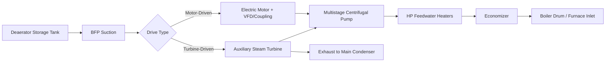

## Boiler Feed Pump Systems

### Overview

Boiler feed pumps (BFPs) raise feedwater from the deaerator storage tank pressure to the pressure required at the boiler inlet, overcoming boiler drum pressure (or once-through boiler operating pressure), economizer/superheater pressure drop, and piping/valve losses. They are among the most critical and highest-power-consuming auxiliary equipment in a steam power plant, and their reliable operation is essential to sustained unit output.

### Role in the Feedwater Cycle

Positioned immediately downstream of the deaerator storage tank, boiler feed pumps discharge feedwater through the high-pressure (HP) feedwater heaters, the economizer, and into the boiler drum (drum-type boilers) or directly into the furnace waterwall/superheater path (once-through/supercritical boilers).

**Key Points**

- BFP discharge pressure must exceed boiler drum/furnace pressure by a margin sufficient to overcome all downstream pressure drops (economizer, HP heaters, control valves, piping friction) plus provide margin for safety valve lift and transient conditions.
- For supercritical or ultra-supercritical once-through boilers, feed pump discharge pressures are substantially higher (often 300+ bar) than for subcritical drum boilers (typically 150–200 bar), since there is no drum to separate steam/water and the entire flow path must be pressurized above the critical pressure of water (~221 bar).
- BFPs are typically among the largest single auxiliary power consumers in the plant, commonly representing several percent of gross unit output. [Inference — general order-of-magnitude industry knowledge; exact figures are unit-specific.]

### Pump Types and Configuration

#### 1. Centrifugal Multistage Pumps

The dominant pump type for boiler feed service, using multiple impeller stages in series within a single casing to achieve the high discharge pressures required.

**Key Points**

- Stage count depends on required head; high-pressure utility BFPs may have 5–10+ stages.
- Casing designs include **barrel-type (double-casing)** construction for very high-pressure applications, where an inner stage casing is contained within an outer pressure-retaining barrel, allowing the inner casing to be removed for maintenance without breaking the primary pressure boundary — reducing maintenance complexity and downtime for high-pressure units.
- **Axially split casing** designs are common for lower-to-medium pressure applications, offering easier access to internals but with pressure-retention limitations at very high pressures compared to barrel designs.

#### 2. Drive Arrangements

- **Motor-driven BFPs**: Direct electric motor drive, often through a hydraulic coupling or variable-frequency drive (VFD) for speed control, since pump head/flow requirements vary with boiler load.
- **Turbine-driven BFPs (TDBFP)**: Driven by a dedicated small auxiliary steam turbine, typically supplied with steam extracted from an intermediate point in the main turbine cycle (or from the main steam/cold reheat line), with exhaust typically routed to the main condenser.
- **Combination arrangements**: Many large utility units use a mix — for example, two or three turbine-driven main BFPs sized for full load, plus one motor-driven BFP sized for startup, low-load operation, or as a backup/redundant unit.

**Key Points**

- Turbine-driven BFPs offer inherent variable-speed capability (matching pump output to boiler demand without throttling losses) and reduce the electrical auxiliary load on the plant, since the drive turbine uses steam extracted from the cycle rather than electrical power — this can improve overall plant efficiency compared to constant-speed motor-driven pumps with throttling control. [Inference — general engineering rationale widely cited in industry; exact efficiency benefit is plant-specific.]
- Motor-driven BFPs are simpler to control and maintain and are commonly used for startup service (before sufficient extraction steam is available to drive a turbine-driven pump) and as backup capacity.
- Variable-speed motor drives (via VFD or hydraulic coupling) can approach some of the efficiency benefits of turbine drives by avoiding constant-speed throttling losses, at the cost of additional electrical equipment complexity.

### Net Positive Suction Head (NPSH) and Cavitation

Because boiler feed pumps handle water at or very near its saturation temperature (delivered from the deaerator), suction conditions are critical to prevent cavitation.

$$NPSH_{available} = \frac{P_{suction} - P_{vapor}}{\rho g} + \frac{v^2}{2g} \pm z$$

where $P_{suction}$ is the absolute pressure at the pump suction, $P_{vapor}$ is the water's vapor pressure at operating temperature, and $z$ accounts for elevation/static head from the deaerator to the pump suction.

**Key Points**

- $NPSH_{available}$ must exceed $NPSH_{required}$ (a pump-specific characteristic from manufacturer curves) with adequate margin across the full operating range, or the pump will cavitate — vapor bubbles form at the impeller eye (where local pressure drops below vapor pressure) and collapse violently downstream, causing noise, vibration, and rapid impeller/casing erosion damage.
- Because feedwater is near saturation, even small suction pressure deficits can trigger cavitation — this is why the deaerator is elevated on a structure above the BFPs, providing static head margin, and why suction piping is designed with minimal pressure drop (large diameter, minimal fittings, short runs where possible).
- A **booster pump** (low-head, first-stage pump) is sometimes installed between the deaerator and the main BFP specifically to boost suction pressure and provide adequate NPSH margin to the main high-head pump, especially in designs where deaerator elevation alone is insufficient.

### Control and Operation

#### Flow/Pressure Control Methods

- **Throttling control (constant-speed pumps)**: A feedwater regulating valve downstream of the pump throttles flow to match boiler demand, with the pump running at constant speed producing more head than needed at partial load — this wastes energy as throttling loss (analogous to a car engine running at fixed RPM with the throttle used to control speed).
- **Variable-speed control (turbine-driven or VFD motor-driven pumps)**: Pump speed is adjusted to match required head/flow directly, minimizing throttling losses and improving part-load efficiency. This is the preferred control method in most modern large units for turbine-driven BFPs.
- **Recirculation (minimum flow) control**: All BFPs require a minimum continuous flow through the pump to prevent overheating and internal damage from operating too far into the low-flow region of the pump curve (where internal recirculation causes localized heating and potential vapor formation); a recirculation line with an automatic control valve routes flow back to the deaerator or condenser whenever main feedwater flow drops below the minimum safe threshold.

**Key Points**

- Minimum flow recirculation valves are critical protective devices; failure to maintain minimum flow at low loads or during startup/shutdown transients can rapidly damage pump internals.
- Feedwater control systems typically coordinate boiler feed pump speed/discharge pressure with the feedwater regulating valve position and boiler drum level control (in drum boilers) as an integrated control loop, since feedwater flow directly affects drum level and, in once-through units, directly affects the feedwater-to-fuel ratio controlling steam temperature.

### Boiler Feed Pump Train Components

- **Suction strainer**: Protects the pump from debris that could damage close-clearance internal components.
- **Balance drum/balance disk**: A hydraulic thrust-balancing device on multistage pumps that counteracts the large axial thrust generated by the pressure differential across stages, protecting the thrust bearing from excessive load.
- **Mechanical seals or packing**: Sealing systems at the shaft penetration points, preventing leakage of high-pressure, high-temperature feedwater; mechanical seals are more common in modern high-pressure applications due to better leakage control and reduced maintenance compared to traditional packing.
- **Bearings and lubrication system**: Support radial and thrust loads; typically forced-lubrication oil systems with coolers, filters, and redundant pumps for reliability.
- **Coupling (for turbine or motor drive)**: Transmits rotational power from the driver to the pump shaft; may include a gearbox if driver and pump operate at different optimal speeds (common for turbine-driven pumps, since drive turbines often run at higher speeds than optimal pump speed).
- **Governor/speed control system** (turbine-driven pumps): Controls drive turbine speed (and thus pump output) in response to feedwater demand signals from the plant control system.

### Startup and Transient Considerations

**Key Points**

- During unit startup, before sufficient extraction steam is available to operate turbine-driven BFPs, a motor-driven startup/auxiliary BFP is typically used to supply feedwater at the lower flow/pressure requirements of startup conditions.
- As the unit loads up and extraction steam becomes available, control transfers to the turbine-driven BFP(s), with the motor-driven pump secured or held on standby.
- Feed pump trip (loss of all feedwater supply) is a serious transient event requiring immediate boiler protection action (rapid runback or trip of fuel firing) to prevent low drum level conditions that could lead to tube overheating/damage; redundant BFP configurations (e.g., 2×50% or 3×50% capacity turbine-driven pumps, or N+1 arrangements) are standard practice specifically to maintain feedwater supply through single-pump failures. [Inference — standard reliability design philosophy widely applied in utility practice; exact redundancy configuration is plant-specific.]

### Common Failure Modes and Maintenance Considerations

- **Cavitation damage**: From inadequate NPSH margin, particularly during transients or with fouled/high-resistance suction piping.
- **Mechanical seal failure**: Leading to feedwater leakage, requiring seal replacement and potentially unit derate/trip depending on leak severity.
- **Bearing failure**: From lubrication system problems, misalignment, or excessive vibration.
- **Balance drum/disk wear**: Leading to increased axial thrust and potential thrust bearing damage if not detected via vibration/thrust monitoring.
- **Erosion/corrosion of internals**: From feedwater chemistry excursions (e.g., low pH events) or solid particle erosion from upstream scale/deposit carryover.

**Example**

A utility unit configured with two 50%-capacity turbine-driven BFPs and one 50%-capacity motor-driven startup/backup BFP can continue operating at reduced or full load if one turbine-driven pump trips, since the motor-driven pump (or the remaining turbine-driven pump combined with load reduction) can maintain adequate feedwater supply, avoiding a full unit trip that would otherwise result from a single-pump failure with no redundancy. [Inference — illustrative representative configuration; actual redundancy philosophy is plant-specific.]

**Next Steps**

- Deaerator Design and NPSH Margin Calculations
- Feedwater Control Loop Design (Drum Level / Once-Through Coordination)
- Pump Cavitation Theory and NPSH Curves
- Turbine-Driven Auxiliary Equipment (Governor Systems)
- Balance Drum and Thrust Bearing Design in Multistage Pumps
- Plant Auxiliary Power Consumption and Heat Rate Impact