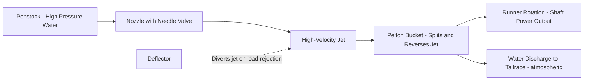
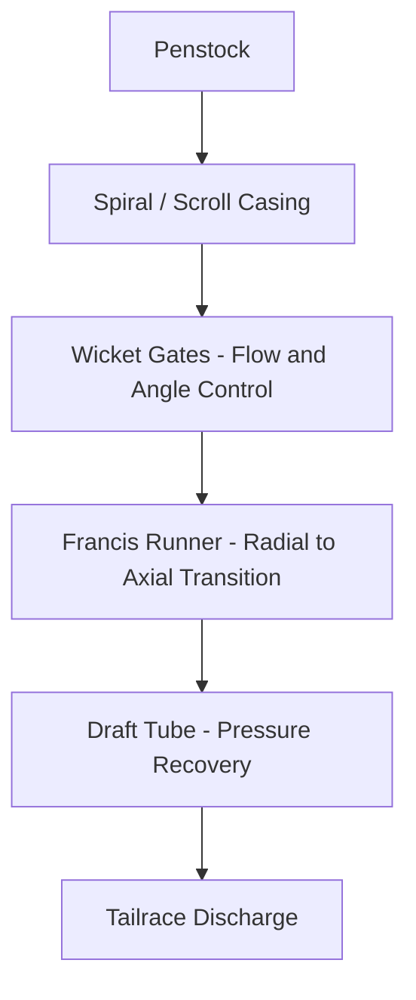
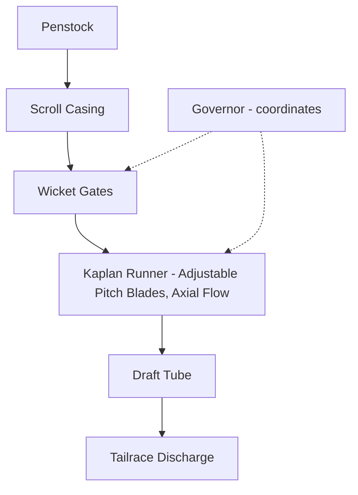

## Pelton, Francis, and Kaplan Hydraulic Turbines


### Overview

Hydraulic turbines convert the energy of flowing or falling water into mechanical shaft work, typically driving an electrical generator in hydroelectric power plants. The three classical turbine types—**Pelton**, **Francis**, and **Kaplan**—represent the dominant designs across the full range of head and flow conditions encountered in hydropower applications, distinguished fundamentally by whether they operate on impulse or reaction principles and by the head/flow regime each is optimized for.

### Impulse vs. Reaction Turbines

**Key Points**

- **Impulse turbines** (Pelton) convert all available pressure head into kinetic energy (high-velocity jet) *before* the water strikes the runner; the runner operates at atmospheric pressure, extracting energy purely from the jet's kinetic energy via momentum change (deflection) as it strikes the buckets — no further pressure drop occurs across the runner itself.
- **Reaction turbines** (Francis, Kaplan) operate with the runner fully immersed in flowing water at above-atmospheric pressure, extracting energy from *both* pressure drop and velocity change as water passes through the runner — pressure continues to decrease as water flows through the runner blades, distinguishing this from the impulse principle.
- This fundamental distinction governs turbine selection: impulse turbines suit high-head, low-flow applications (where a high-velocity jet can be efficiently formed), while reaction turbines suit low-to-medium head, higher-flow applications.

### General Turbine Selection by Head and Specific Speed

Turbine type selection is governed primarily by the available **head** ($H$) and the resulting **specific speed** ($N_s$), a dimensionless (or dimensional, depending on convention) parameter relating rotational speed, power, and head that characterizes the turbine's geometric family independent of absolute size:

$$N_s = \frac{N\sqrt{P}}{H^{5/4}}$$

(in one common dimensional convention, with $N$ in rpm, $P$ in kW or hp, and $H$ in meters or feet — units and exact form vary by convention/region).

**Key Points**

- Low specific speed corresponds to high-head, low-flow conditions → Pelton turbines.
- Medium specific speed corresponds to medium-head, medium-flow conditions → Francis turbines.
- High specific speed corresponds to low-head, high-flow conditions → Kaplan turbines.
- Typical head ranges (general guidance, with significant overlap and site-specific exceptions): Pelton for heads roughly above 300 m (and up to 1000+ m in some installations); Francis for heads roughly 40–600 m; Kaplan/propeller for heads roughly below 40–70 m. [Inference — widely cited general ranges in hydropower engineering references; exact boundaries vary by source, manufacturer, and specific site/design considerations.]

```mermaid
flowchart TD
    A[Turbine Selection by Head] (svg_diagram)
    A --> B[High Head, Low Flow]
    A --> C[Medium Head, Medium Flow]
    A --> D[Low Head, High Flow]
    B --> E[Pelton - Impulse]
    C --> F[Francis - Reaction, Mixed Flow]
    D --> G[Kaplan - Reaction, Axial Flow]
```

### Pelton Turbines

#### Working Principle

Water is accelerated through one or more fixed-geometry **nozzles**, forming a high-velocity jet that strikes a series of specially shaped double-cupped **buckets** mounted around the periphery of a wheel (runner). Each bucket splits the jet symmetrically and reverses its direction, maximizing the momentum change (impulse) imparted to the bucket, per the impulse-momentum principle. Since the runner operates at atmospheric pressure with no further pressure extraction after the nozzle, theoretical maximum efficiency occurs when the bucket (runner) tangential velocity is approximately half the jet velocity, maximizing the relative velocity change extracted.

**Key Points**

- Ideal Pelton runner speed ratio (bucket speed to jet velocity) is approximately 0.45–0.48 in practice (slightly below the theoretical 0.5 optimum, accounting for real bucket exit angle and friction losses). [Inference — commonly cited practical design range in hydraulic turbine references.]
- **Needle valve (spear valve)**: Controls jet flow rate by axially adjusting a needle within the nozzle, changing the effective nozzle opening area while maintaining a well-formed jet shape across a range of flows — critical for load control without significantly degrading jet quality/efficiency.
- **Deflector (jet deflector)**: A mechanical device that can rapidly divert the jet away from the buckets during a sudden load rejection, protecting the turbine/generator from overspeed without requiring the needle valve to close instantly (rapid needle closure would cause dangerous water hammer pressure surges in the penstock).
- Multiple nozzles (typically 2–6) may be arranged around a single runner to increase power capacity and allow finer flow/load control by sequentially engaging nozzles.
- Pelton turbines can be mounted with either horizontal or vertical shaft orientation, with horizontal arrangements common for smaller units with fewer nozzles, and vertical arrangements often used for larger installations with multiple nozzles arranged around the runner circumference.



### Francis Turbines

#### Working Principle

Water enters the turbine radially (inward) through a **spiral (scroll) casing** that distributes flow evenly around the circumference, passes through adjustable **wicket gates (guide vanes)** that control flow rate and impart the correct entry angle, then flows through the **runner** where it transitions from radial to axial direction while pressure and velocity both decrease, delivering work to the runner via the reaction principle, before exiting into a **draft tube** that recovers residual kinetic energy as additional pressure drop before discharge to the tailrace.

**Key Points**

- Francis turbines are classified as **mixed-flow** machines, since water enters radially and exits axially through the runner — this geometric transition is central to accommodating a wide range of head/flow combinations within a single turbine family.
- **Wicket gates**: A ring of pivoting vanes surrounding the runner, mechanically linked (via a governor-controlled operating ring) so all gates open/close in unison, providing the primary means of flow rate (and thus power) control; wicket gate angle also affects the flow's entry swirl to the runner, so off-design gate positions can reduce efficiency due to non-optimal incidence angle at the runner blades.
- **Draft tube**: An expanding-area conduit below the runner that decelerates exiting flow, converting velocity head into a pressure recovery effect — this allows the runner to be set above tailwater level (facilitating maintenance access and reducing excavation) while still recovering much of the kinetic energy that would otherwise be lost; draft tube design is a significant contributor to overall turbine efficiency.
- The runner must be fully submerged in water (unlike the atmospheric-pressure Pelton runner) since the reaction principle depends on continuous pressure drop through the runner and, if not correctly designed/operated, sub-atmospheric pressure regions within the runner or draft tube can promote **cavitation**.



**Key Points**

- Francis turbines are the most widely deployed hydraulic turbine type globally, owing to the broad range of head and flow conditions they can efficiently serve, spanning small run-of-river installations to some of the largest hydroelectric plants in the world. [Inference — widely cited general industry characterization.]

### Kaplan Turbines

#### Working Principle

A Kaplan turbine is a specialized axial-flow reaction turbine, essentially resembling a ship's propeller operating in reverse (extracting energy from flow rather than imparting it), optimized for low-head, high-flow conditions. Water flows through a scroll casing and wicket gates (similar in function to a Francis turbine) before entering the runner axially, where adjustable **runner blades** extract energy as flow passes straight through parallel to the shaft axis.

**Key Points**

- **Double regulation**: The defining feature of a true Kaplan turbine is that *both* the wicket gate angle and the runner blade pitch angle are adjustable and coordinated (typically via a cam or electronic control linking gate position to optimal blade angle), allowing the turbine to maintain high efficiency across a very wide range of flow rates — a significant advantage over fixed-blade propeller turbines, which suffer efficiency loss when operated away from their single design flow point.
- A **propeller turbine** is a simpler, related design with fixed-pitch runner blades (single regulation via wicket gates only), used where flow conditions are relatively steady and the added cost/complexity of variable blade pitch isn't justified.
- **Bulb turbines** and **tubular (S-type) turbines** are further variants of the Kaplan/propeller family adapted for very low-head applications (often under 20–30 m and sometimes just a few meters), where the generator is housed in a submerged bulb (bulb type) or connected via a right-angle drive outside the water passage (tubular/S-type), commonly used in run-of-river and tidal installations. [Inference — standard turbomachinery classification widely used in low-head hydropower literature.]



### Comparison: Pelton, Francis, and Kaplan Turbines

| Characteristic | Pelton | Francis | Kaplan |
| --- | --- | --- | --- |
| Principle | Impulse | Reaction | Reaction |
| Flow direction through runner | Jet strikes buckets (tangential) | Radial inlet, axial outlet (mixed) | Axial (parallel to shaft) |
| Head range | High (~300 m+) | Medium (~40–600 m) | Low (below ~40–70 m) |
| Flow rate | Low | Medium | High |
| Runner operating pressure | Atmospheric | Above atmospheric (submerged) | Above atmospheric (submerged) |
| Primary flow control | Needle valve / spear valve | Wicket gates | Wicket gates + blade pitch (double regulation) |
| Efficiency across flow range | Good (multiple nozzle control) | Good, degrades off-design | Excellent (double regulation maintains efficiency) |
| Typical application | Mountain/high-head hydro | Most common general-purpose hydro | Low-head, run-of-river hydro |

### Cavitation in Reaction Turbines

**Key Points**

- Cavitation risk in Francis and Kaplan turbines is a significant design consideration, since local pressure at certain points within the runner or draft tube can drop below the water's vapor pressure, particularly at the runner exit/draft tube entrance where velocity is highest and pressure lowest.
- The **Thoma cavitation coefficient** ($\sigma$) is used to characterize cavitation risk and determine the appropriate turbine setting elevation (height above tailwater level) required to avoid it:

$$\sigma = \frac{H_{atm} - H_v - H_s}{H}$$

where $H_{atm}$ is atmospheric pressure head, $H_v$ is vapor pressure head, $H_s$ is the turbine setting height above tailwater, and $H$ is the net head; the turbine must be installed with $\sigma$ above a critical minimum value (determined by testing/design) to avoid cavitation.

- Excessive cavitation causes pitting erosion damage to runner blades, reduces efficiency, and generates noise/vibration — cavitation-resistant materials (stainless steel alloys) and careful runner setting elevation are standard mitigation approaches.

### Turbine Governing and Speed Control

**Key Points**

- All three turbine types require a **governor** system that adjusts flow control devices (needle valve/deflector for Pelton; wicket gates for Francis/Kaplan; blade pitch additionally for Kaplan) to maintain constant rotational speed (and thus grid frequency, for synchronized generators) as electrical load demand changes.
- Rapid load rejection events require rapid flow reduction to prevent generator overspeed, but rapid flow changes in a penstock can cause damaging water hammer pressure transients — this tension is managed differently by turbine type: Pelton turbines use jet deflectors (diverting the jet instantly without changing needle position, avoiding water hammer) while Francis/Kaplan turbines rely on controlled-rate wicket gate closure combined with pressure relief devices (surge tanks, pressure relief valves) in the penstock system.

**Example**

A run-of-river hydroelectric plant on a wide, low-gradient river with only 15 m of available head and high flow volume would select a Kaplan (or bulb-type) turbine, using double regulation to maintain high efficiency despite significant seasonal flow variation, whereas a mountain plant utilizing a 500 m penstock drop from a high-elevation reservoir with comparatively lower flow would select a Pelton turbine, using multiple nozzles for fine load control across the operating range.

**Next Steps**

- Turbine Governor Systems and Load-Frequency Control
- Cavitation Analysis and Thoma Coefficient Application
- Penstock Design, Water Hammer, and Surge Tanks
- Draft Tube Design and Efficiency Optimization
- Pumped-Storage Hydropower (Reversible Pump-Turbines)
- Small Hydro and Micro-Hydro Turbine Selection
- Generator Coupling and Synchronization for Hydroelectric Units