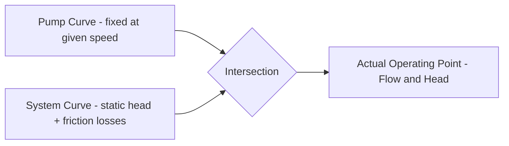

## Performance Curves and Off-Design Operation


### Overview

Performance curves characterize how a turbomachine's key output parameters — head, flow, power, and efficiency — relate to one another across its full operating range at a given speed. Off-design operation refers to running a machine away from its point of peak efficiency (best efficiency point, BEP), which occurs routinely in real systems as demand varies, and understanding this behavior is essential for system design, control strategy, and equipment protection across pumps, compressors, and turbines alike.

### Anatomy of a Performance Curve

#### Head-Capacity (H-Q) Curve

For pumps and hydraulic turbines, the head-capacity curve plots developed head (or, for turbines, available head at a given flow) against flow rate at constant rotational speed. For centrifugal pumps, this curve typically slopes downward (head decreases as flow increases), while for axial-flow machines the curve can be steeper and, in some designs, exhibit a locally unstable (rising-then-falling) shape at low flow.

**Key Points**

- A **stable** H-Q curve continuously decreases in head as flow increases (a monotonically drooping curve), ensuring a unique, stable operating point for any given system resistance.
- An **unstable** (or "hump" or "saddle") H-Q curve has a region where head initially rises with increasing flow before beginning its normal decrease at higher flow — if the system curve intersects this rising region, the pump can oscillate unpredictably between multiple valid operating points, a condition generally avoided in system design through pump selection or operational limits. [Inference — well-established stability principle in pump/system curve matching theory.]

#### Efficiency Curve

Efficiency is plotted against flow rate, typically forming a curve that rises from zero at shutoff (no flow), reaches a maximum at the **best efficiency point (BEP)**, then declines again at higher flows — the BEP flow rate is the design-intent operating point for the machine.

#### Power Curve

Power (brake horsepower/shaft power) is plotted against flow rate; for centrifugal pumps handling most liquids, power typically increases continuously with flow, meaning driver (motor) sizing must account for the maximum expected flow condition, not just the BEP condition, to avoid motor overload at high-flow operating points.

**Key Points**

- For some pump types (e.g., certain axial-flow designs), the power curve can behave differently — power may be highest near shutoff and decrease with increasing flow, an important distinction affecting motor sizing philosophy and startup procedures (some pumps are started against a closed valve specifically because that's their lowest-power condition, while others must never be started closed for the same reason in reverse). [Inference — general turbomachinery principle; specific power curve shape is pump-type and design dependent, and manufacturer curves should always be consulted for actual behavior.]

```mermaid
flowchart TD
    A[Typical Centrifugal Pump Performance Curves] (svg_diagram)
    A --> B[Head vs Flow - decreasing curve]
    A --> C[Efficiency vs Flow - peaks at BEP]
    A --> D[Power vs Flow - typically increasing]
    A --> E[NPSH Required vs Flow - typically increasing]
```

### The System Curve and Operating Point

A pump or fan does not operate at an arbitrary point on its own performance curve — the actual **operating point** is determined by the intersection of the machine's H-Q curve with the **system resistance curve**, which represents the head required by the piping/ductwork system at each flow rate:

$$H_{system} = H_{static} + K Q^2$$

where $H_{static}$ is the fixed elevation/pressure difference the system must overcome regardless of flow, and the $KQ^2$ term represents friction losses, which increase approximately with the square of flow rate for turbulent flow in a fixed piping configuration.

**Key Points**

- The operating point shifts whenever either curve changes: opening/closing a control valve changes the system curve (by changing $K$), while changing pump speed or impeller trim changes the pump curve itself (per the affinity laws).
- Systems with a large static head component relative to friction losses (e.g., pumping against significant elevation) behave differently under flow control than systems dominated by friction losses (e.g., long pipeline transport), affecting how throttling or speed control changes the operating point.



### Off-Design Operation: Causes and Consequences

Off-design operation occurs whenever a machine runs at a flow rate other than its BEP flow, which is the normal condition for most real systems most of the time, since system demand (flow requirement) typically varies with process conditions, load, or control valve position.

#### Operation at High Flow (Right of BEP)

**Key Points**

- Reduced efficiency compared to BEP.
- Increased $NPSH_{required}$, raising cavitation risk if $NPSH_{available}$ margin was sized primarily around BEP conditions.
- Increased radial thrust loading on the impeller/shaft in centrifugal pumps (since flow asymmetry within the volute increases away from BEP), potentially accelerating bearing and seal wear over sustained high-flow operation. [Inference — well-documented mechanical effect in centrifugal pump engineering literature.]
- Potential for choke conditions in compressors if flow approaches the sonic/choke limit.

#### Operation at Low Flow (Left of BEP)

**Key Points**

- Reduced efficiency, similar to high-flow operation but from different internal loss mechanisms (increased internal recirculation and shock/incidence losses at reduced flow).
- Risk of internal recirculation cavitation (suction and discharge recirculation), as discussed under cavitation prevention, which can occur even with adequate bulk NPSH margin due to localized internal flow pattern breakdown.
- Elevated temperature rise across the pump at very low flow (since a larger fraction of input power converts to heat rather than useful hydraulic work), which in extreme cases (near shutoff, prolonged operation) can cause fluid vaporization within the pump casing — this is the underlying reason minimum continuous flow requirements and recirculation/bypass lines are specified for centrifugal pumps, as introduced for boiler feed pump protection.
- For compressors, low-flow operation raises risk of approaching the surge line, with the associated risk of a full surge event if flow drops further.

### Variable-Speed Operation and the Affinity Laws in Off-Design Context

**Key Points**

- Reducing machine speed (via VFD, for pumps/fans, or governor-controlled turbine drives) shifts the entire H-Q curve downward and to the left (per the affinity laws: $Q \propto N$, $H \propto N^2$), allowing the operating point (intersection with the system curve) to move to a lower flow without the efficiency penalty associated with throttling a constant-speed machine.
- This is the fundamental efficiency advantage of variable-speed control over throttling control: throttling forces the *system curve* to become steeper (by adding valve resistance), moving the operating point along the *same* pump curve to a less efficient region, whereas speed reduction moves the *entire pump curve*, ideally tracking a locus of points that remains closer to each speed's own local BEP region for systems dominated by static head rather than pure friction loss. [Inference — standard energy-efficiency rationale for variable-speed drives widely documented in pump/fan engineering references; the degree of benefit depends on the specific system curve shape, particularly the ratio of static to friction head.]
- For purely friction-dominated systems (no static head component), the system curve intersects the affinity-law-scaled pump curves at points that trace the same relative efficiency, meaning variable speed control provides efficiency benefits primarily by avoiding throttling losses rather than by tracking a "better" BEP at each speed. [Inference — nuanced point sometimes underemphasized in simplified VFD energy-savings marketing material; exact benefit depends on system curve composition.]

### Compressor-Specific Off-Design Considerations

**Key Points**

- Compressor performance maps (introduced under centrifugal/axial compressor fundamentals) explicitly show off-design behavior via constant-speed lines, with surge and choke lines bounding the usable operating region — off-design operation for compressors is thus explicitly mapped and constrained by these stability limits, more so than for pumps where the primary off-design concerns are efficiency, cavitation, and mechanical loading rather than a hard aerodynamic instability boundary in most cases.
- Variable inlet guide vanes (VIGVs) and variable stator vanes (VSVs), introduced under axial compressor fundamentals, are specifically employed to extend the usable off-design operating range by adjusting internal flow angles to better match off-design flow conditions, effectively reshaping the surge margin available at reduced flow/speed conditions.

### Parallel and Series Operation (System-Level Off-Design Behavior)

**Key Points**

- **Parallel pump operation** (two or more pumps discharging into a common header): Combined flow at any given head is the sum of each pump's individual flow at that head, but the combined H-Q curve is generally flatter than doubling a single pump's flow at every head, since the shared system curve intersection determines the actual combined operating point — parallel operation is typically used to provide flexible total flow capacity across varying demand while allowing individual pumps to be added/removed from service.
- **Series pump operation** (pumps arranged so one pump's discharge feeds the next pump's suction): Combined head at any given flow is the sum of each pump's individual head at that flow, used to achieve higher total head than a single pump/stage can provide (functionally similar to multistage pump design, but with physically separate pump units).
- Both arrangements introduce off-design considerations for the individual pumps involved, since each pump in a parallel or series arrangement generally does not operate at its own individual BEP even when the combined system is well-matched overall.

```mermaid
flowchart TD
    A[Multi-Pump Operating Strategies] (svg_diagram)
    A --> B[Parallel Operation]
    A --> C[Series Operation]
    B --> D[Combined Flow = Sum of Flows at Same Head]
    B --> E[Used for Flexible Total Flow Capacity]
    C --> F[Combined Head = Sum of Heads at Same Flow]
    C --> G[Used for High Total Head Requirements]
```

### Monitoring and Managing Off-Design Operation in Practice

**Key Points**

- **Trending against the manufacturer curve**: Comparing actual measured head/flow/power/efficiency against the original design curve over time helps distinguish normal off-design operation (an expected, acceptable condition) from degraded performance due to wear, fouling, or damage (an abnormal condition requiring maintenance attention).
- **Operating envelope limits**: Many manufacturers specify a minimum and maximum continuous flow rate (a percentage range around BEP) within which sustained operation is considered safe and acceptable, with operation outside this envelope reserved for transient conditions only (startup, shutdown, brief upset conditions).
- **Control system logic**: Modern plant control systems often incorporate minimum flow protection (recirculation valve control, as introduced for boiler feed pumps), high-flow alarms/trips, and, for compressors, anti-surge control logic, specifically to keep equipment within its acceptable off-design operating envelope even during upset or transient system conditions.

**Example**

A cooling water circulating pump originally sized for a specific plant configuration may, after a plant modification reduces overall cooling water demand, find itself operating well to the left of its original BEP against a now-lower system resistance curve. Rather than accepting reduced efficiency indefinitely, the plant might trim the impeller (per the diameter-based affinity laws) or install a VFD to shift the pump's curve to better match the new, lower system demand — restoring near-BEP operation at the new duty point rather than continuously throttling or operating in an inefficient off-design region.

**Next Steps**

- Variable Frequency Drives (VFDs) for Pump and Fan Energy Optimization
- Parallel and Series Pump System Design
- Compressor Anti-Surge Control System Design
- Pump Curve Trending and Predictive Maintenance
- Minimum Flow Protection and Recirculation Valve Sizing
- Impeller Trimming Calculations and Field Application