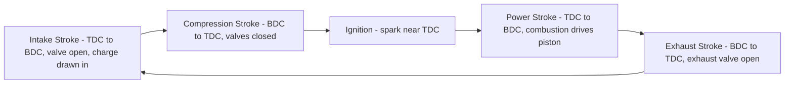

## Spark-Ignition Engine Operation and Components

### Overview

Spark-ignition (SI) engines are internal combustion engines in which a premixed fuel-air charge is ignited by an externally supplied electrical spark, as opposed to compression-ignition (diesel) engines, which rely on the heat of compression alone to initiate combustion. SI engines power the majority of gasoline-fueled automobiles, motorcycles, small equipment, and many stationary/marine applications, and their thermodynamic cycle, mechanical components, and operational characteristics form a foundational topic within internal combustion engine technology.

### The Otto Cycle: Thermodynamic Basis

The idealized air-standard cycle representing SI engine operation is the **Otto cycle**, consisting of four processes:

1. **Isentropic compression** (1→2): The piston compresses the air-fuel mixture, increasing pressure and temperature with no heat transfer.
2. **Constant-volume heat addition** (2→3): Combustion is idealized as instantaneous heat addition at constant volume (approximating the rapid spark-ignited combustion event near top dead center).
3. **Isentropic expansion** (3→4): The high-pressure combustion products expand, doing work on the piston (the power stroke).
4. **Constant-volume heat rejection** (4→1): Idealized heat rejection at constant volume, representing exhaust blowdown and the exchange of burned gas for a fresh charge.

**Key Points**

- Otto cycle thermal efficiency depends solely on the **compression ratio** $r$ and the specific heat ratio $\gamma$ of the working fluid:

$$\eta_{Otto} = 1 - \frac{1}{r^{\gamma - 1}}$$

- This relationship shows that increasing compression ratio increases ideal thermal efficiency, which is why higher compression ratios are generally desirable — however, practical SI engine compression ratios are limited by **knock** (uncontrolled auto-ignition of the end-gas ahead of the flame front), which becomes more likely at higher compression ratios and cylinder pressures/temperatures.
- Real SI engine efficiency is substantially lower than the ideal Otto cycle prediction due to real combustion duration (not instantaneous), heat transfer losses to cylinder walls, friction, incomplete combustion, and gas exchange (pumping) losses — the Otto cycle is a useful conceptual/comparative tool but does not predict actual engine efficiency directly. [Inference — standard air-standard cycle limitation widely acknowledged in IC engine textbooks.]

### The Four-Stroke Operating Cycle

Most SI engines operate on a four-stroke cycle, requiring two complete crankshaft revolutions (720°) per power-producing cycle per cylinder.

1. **Intake stroke**: The intake valve opens, and the piston moves from top dead center (TDC) to bottom dead center (BDC), drawing the air-fuel mixture (or, in modern direct-injection engines, air alone, with fuel injected directly into the cylinder) into the cylinder.
2. **Compression stroke**: Both valves closed, the piston moves from BDC to TDC, compressing the charge; the spark plug fires near the end of this stroke (ignition timing, typically some degrees of crank angle before TDC, to allow combustion to develop peak pressure shortly after TDC for optimal work extraction).
3. **Power (expansion) stroke**: Combustion pressure forces the piston from TDC to BDC, delivering work to the crankshaft — this is the only stroke that produces net positive work.
4. **Exhaust stroke**: The exhaust valve opens, and the piston moves from BDC to TDC, expelling burned combustion products from the cylinder.

**Key Points**

- **Valve overlap**: A brief period near TDC (end of exhaust stroke/start of intake stroke) where both intake and exhaust valves are simultaneously open slightly, used to improve cylinder scavenging (helping push out remaining exhaust gas) and, in some designs, improve volumetric efficiency at certain speeds; excessive overlap can cause unburned fuel-air mixture to pass directly to the exhaust at low speed/load, so overlap duration is a significant camshaft design tradeoff.
- Two-stroke SI engines (completing the cycle in one crankshaft revolution, 360°) exist and are used in smaller applications (some motorcycles, outdoor power equipment, older marine outboards), combining intake/compression and power/exhaust functions into fewer distinct strokes via port timing rather than poppet valves in many designs, but are less common in modern automotive-scale applications primarily due to emissions and efficiency disadvantages. [Inference — general characterization of two-stroke vs. four-stroke tradeoffs widely discussed in IC engine literature.]

### Core Mechanical Components

#### Cylinder Block and Head

- **Cylinder block**: The main structural casting containing the cylinders (bores) within which pistons reciprocate; typically cast iron or aluminum alloy, incorporating coolant passages (water jacket) and often the main bearing supports for the crankshaft.
- **Cylinder head**: Bolted atop the block, containing the combustion chamber, valve seats/guides, and (in overhead-valve/overhead-cam designs) some or all of the valvetrain; also incorporates coolant passages and, typically, the spark plug mounting locations.

#### Piston, Connecting Rod, and Crankshaft

- **Piston**: Reciprocates within the cylinder bore, transmitting combustion pressure force to the connecting rod; incorporates piston rings (compression rings, sealing combustion gas above and reducing blow-by past the piston; oil control rings, managing lubricating oil film thickness on the cylinder wall).
- **Connecting rod**: Converts the piston's reciprocating linear motion into the crankshaft's rotary motion, connected via a wrist pin (piston end) and a rod bearing (crankshaft end).
- **Crankshaft**: Converts the connecting rods' motion into rotary output at the flywheel/output shaft; incorporates counterweights to balance reciprocating and rotating mass forces and reduce vibration.

#### Valvetrain

- **Intake and exhaust valves**: Poppet-type valves that open to allow charge intake and exhaust expulsion, and seal the combustion chamber during compression and power strokes.
- **Camshaft**: A rotating shaft with lobes that mechanically actuate valve opening (via direct action, rocker arms, or pushrods depending on architecture) in precise timing relative to piston position, driven off the crankshaft (typically via timing belt, chain, or gears) at half crankshaft speed (since the four-stroke cycle requires each valve to open once per two crankshaft revolutions).
- **Valve springs**: Return valves to the closed position after the camshaft lobe passes, and maintain valve-to-cam-follower contact.
- **Overhead camshaft (OHC) vs. overhead valve (OHV) architectures**: OHC designs mount the camshaft(s) in the cylinder head, acting on valves directly or via short rocker arms, generally enabling higher engine speeds and more precise valve control; OHV designs mount the camshaft in the block, actuating valves via pushrods and rocker arms, offering a more compact, often lower-cost architecture with some speed/control limitations relative to OHC. [Inference — general comparative characterization widely discussed in automotive engineering references.]
- **Variable valve timing (VVT) and variable valve lift (VVL)**: Modern systems that adjust camshaft phase (timing) and/or lift profile dynamically with engine speed/load, improving efficiency and torque characteristics across a broader operating range than fixed valve timing allows.

### Ignition System

**Key Points**

- **Spark plug**: Provides the electrical spark gap across which a high-voltage discharge ignites the compressed air-fuel mixture; electrode gap and heat range (the plug's ability to dissipate heat) are engine-specific design/selection parameters.
- **Ignition coil**: Steps up battery voltage (typically 12V in automotive applications) to the tens of thousands of volts required to arc across the spark plug gap, historically via a single coil and distributor, and in modern engines typically via individual coil-on-plug or coil-near-plug arrangements for each cylinder, controlled electronically.
- **Ignition timing**: The crank angle (before TDC) at which the spark fires, precisely controlled (in modern engines, by the engine control unit/ECU) based on engine speed, load, and other sensor inputs, since combustion requires finite time to develop peak pressure and this timing must be optimized for maximum work extraction while avoiding knock.
- **Knock sensors**: Accelerometer-type sensors mounted on the block that detect the characteristic vibration signature of knock (auto-ignition), allowing the ECU to retard ignition timing dynamically to suppress knock when detected, protecting the engine from potential damage while allowing timing to remain as advanced as possible for efficiency under non-knocking conditions.

### Fuel Delivery Systems

**Key Points**

- **Carburetors**: Historically used mechanical devices that meter fuel into the intake airstream using the venturi effect (airflow through a restriction creates a pressure drop that draws fuel from a metering circuit); largely superseded in modern automotive applications by fuel injection due to injection's superior precision, emissions control, and adaptability to electronic control.
- **Port fuel injection (PFI)**: Fuel injectors spray fuel into the intake port just upstream of the intake valve, where it mixes with incoming air before entering the cylinder; injector timing and pulse width (duration open) are electronically controlled based on engine operating conditions.
- **Direct injection (GDI/DI)**: Fuel injectors spray fuel directly into the combustion chamber at high pressure, allowing more precise control of mixture formation, timing, and stratification (in some designs), generally enabling improved fuel economy and emissions performance compared to port injection, though with added system complexity and cost, and some direct-injection-specific concerns (e.g., intake valve deposit formation, since fuel no longer washes over the valve as in port injection). [Inference — well-documented comparative tradeoff in modern automotive engine literature.]
- **Air-fuel ratio (AFR) and stoichiometry**: The stoichiometric AFR for gasoline is approximately 14.7:1 by mass; modern engines use closed-loop feedback control (via oxygen sensors in the exhaust) to maintain AFR very close to stoichiometric during normal operation, optimizing three-way catalytic converter performance for emissions control, while allowing controlled deviation (richer for maximum power/cold start, leaner for maximum economy under certain conditions) as calibration strategy dictates.

### Combustion Process and Knock

**Key Points**

- Normal SI combustion propagates as a **flame front** initiated at the spark plug and traveling outward through the unburned charge at a finite speed, with cylinder pressure rising as the flame front consumes progressively more of the charge.
- **Knock (detonation)** occurs when unburned "end-gas" ahead of the advancing flame front spontaneously auto-ignites due to excessive pressure/temperature buildup before the normal flame front reaches it, causing extremely rapid, uncontrolled pressure rise and characteristic knocking/pinging noise; sustained severe knock can cause mechanical damage to pistons, rings, and cylinder heads from the associated shock pressure waves and localized thermal loading.
- Knock resistance is quantified by a fuel's **octane rating**, representing the fuel's resistance to auto-ignition under standardized test conditions — higher-octane fuels tolerate higher compression ratios and/or more aggressive ignition timing/boost before knock onset, which is why high-performance and high-compression-ratio engines typically specify higher-octane fuel.
- Knock mitigation strategies include: retarding ignition timing (reducing peak cylinder pressure/temperature), enriching the air-fuel mixture (charge cooling effect from fuel vaporization), reducing boost pressure in turbocharged/supercharged applications, and fundamental design choices (compression ratio, combustion chamber shape promoting fast, compact flame propagation, cooling system design managing end-gas temperature).

### Forced Induction (Turbocharging and Supercharging)

**Key Points**

- **Turbochargers** use exhaust gas energy (via a turbine) to drive a compressor that increases intake air density (boost pressure), allowing more air (and correspondingly more fuel) to be packed into the same cylinder displacement, increasing power output potential relative to a naturally aspirated engine of the same displacement.
- **Superchargers** achieve the same air-density-increasing effect but are mechanically driven directly off the crankshaft (via belt, gear, or chain) rather than using exhaust energy, providing generally more immediate response (no "turbo lag" associated with exhaust-driven turbine spool-up) at the cost of directly consuming engine shaft power to drive the compressor.
- Forced induction increases cylinder pressure and temperature, generally increasing knock tendency, so forced-induction SI engines typically require careful management via reduced compression ratio, intercooling (cooling compressed intake air to reduce its temperature before it enters the cylinder), more sophisticated knock control, and often higher-octane fuel requirements compared to naturally aspirated counterparts of similar specific output.

### Comparison Context: SI vs. Compression-Ignition (Brief)

| Characteristic | Spark-Ignition (SI) | Compression-Ignition (CI/Diesel) |
| --- | --- | --- |
| Ignition method | Externally supplied spark | Auto-ignition from compression heat |
| Charge preparation | Premixed (typically) fuel-air | Air compressed alone; fuel injected near TDC |
| Typical compression ratio | Lower (~8:1 to 12:1 for naturally aspirated) | Higher (~14:1 to 22:1 or more) |
| Knock concern | Yes — a primary design constraint | Different phenomenon (diesel knock/combustion noise, distinct mechanism) |
| Idealized cycle | Otto cycle (constant-volume heat addition) | Diesel cycle (constant-pressure heat addition, idealized) |

**Example**

A naturally aspirated gasoline engine with a 10:1 compression ratio operating on regular-octane fuel might be limited from further compression ratio increases (which would improve ideal Otto cycle efficiency) due to knock risk; a manufacturer wanting higher efficiency might instead adopt direct injection (providing charge-cooling benefits that suppress knock) combined with variable valve timing (optimizing effective compression ratio dynamically via Miller/Atkinson-cycle-like valve strategies) to achieve efficiency gains without simply raising the geometric compression ratio into knock-limited territory. [Inference — illustrative representative engineering approach; not a specific documented engine design.]

**Next Steps**

- Diesel (Compression-Ignition) Engine Operation and Components
- Engine Emissions Control (Three-Way Catalysts, EGR)
- Miller and Atkinson Cycle Valve Timing Strategies
- Turbocharger and Supercharger Design Details
- Engine Cooling and Lubrication Systems
- Fuel Octane Rating and Combustion Chemistry
- Engine Performance Testing and Indicated/Brake Power Measurement