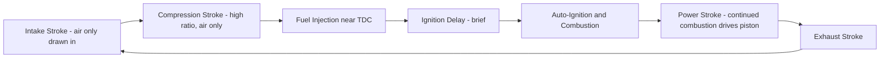
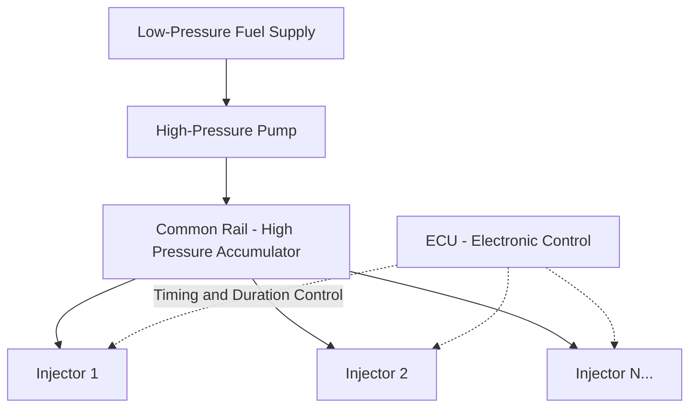

## Compression-Ignition Engine Operation and Components

### Overview

Compression-ignition (CI) engines, commonly known as diesel engines, are internal combustion engines in which fuel is injected directly into air that has been compressed to a high pressure and temperature sufficient to cause spontaneous auto-ignition, without requiring an external spark source. This fundamental difference from spark-ignition (SI) operation drives distinct design requirements across compression ratio, fuel delivery, combustion chamber geometry, and materials, making CI engines the dominant choice for heavy-duty, high-torque, and fuel-efficiency-critical applications such as trucks, locomotives, marine propulsion, and stationary/backup power generation.

### The Diesel Cycle: Thermodynamic Basis

The idealized air-standard cycle representing CI engine operation is the **Diesel cycle**, distinguished from the Otto cycle by how heat addition is modeled:

1. **Isentropic compression** (1→2): Air alone (no fuel) is compressed, reaching high pressure and temperature — since only air is compressed, much higher compression ratios are achievable without the knock concern that limits SI engines (there is no premixed fuel-air charge present to auto-ignite prematurely).
2. **Constant-pressure heat addition** (2→3): Fuel injection begins near the end of compression; combustion is idealized as occurring at constant pressure as the piston begins its expansion stroke, approximating the somewhat slower, diffusion-controlled combustion process characteristic of diesel combustion (compared to the near-instantaneous constant-volume idealization used for SI engines).
3. **Isentropic expansion** (3→4): Combustion products expand, delivering work to the piston.
4. **Constant-volume heat rejection** (4→1): Idealized heat rejection, representing exhaust blowdown and gas exchange, identical in form to the Otto cycle's final process.

**Key Points**

- Diesel cycle thermal efficiency depends on compression ratio $r$, the specific heat ratio $\gamma$, and the **cutoff ratio** $r_c$ (the ratio of volumes at the end and start of the constant-pressure heat addition process, characterizing how much of the expansion stroke is used for heat addition versus pure expansion):

$$\eta_{Diesel} = 1 - \frac{1}{r^{\gamma-1}} \left[ \frac{r_c^{\gamma} - 1}{\gamma (r_c - 1)} \right]$$

- For the same compression ratio, the Diesel cycle is theoretically less efficient than the Otto cycle (the bracketed term is always greater than 1), but because CI engines are not knock-limited in the same way SI engines are, they can operate at substantially higher compression ratios in practice, generally yielding higher **actual** efficiency than typical SI engines despite the Diesel cycle's theoretical disadvantage at equal compression ratio. [Inference — standard comparative conclusion widely presented in IC engine thermodynamics references.]
- Real diesel combustion does not occur at either purely constant volume or purely constant pressure; the **dual (limited-pressure) cycle** is a more refined idealization combining both constant-volume and constant-pressure heat addition phases, better approximating actual diesel combustion pressure development, though still an idealization relative to true engine behavior. [Inference — standard refinement noted in IC engine cycle analysis literature.]

### The Four-Stroke Operating Cycle (CI-Specific Characteristics)

CI engines follow the same fundamental four-stroke sequence (intake, compression, power, exhaust) as SI engines, but with key operational differences:

1. **Intake stroke**: Air alone is drawn into the cylinder (no fuel present), often assisted by forced induction (turbocharging is extremely common in modern diesel engines, both for power density and emissions reasons).
2. **Compression stroke**: Air alone is compressed to a much higher ratio than in SI engines, reaching temperatures well above the auto-ignition temperature of diesel fuel by the time the piston nears TDC.
3. **Fuel injection and combustion (start of power stroke)**: Fuel injection begins near TDC (with injection timing being a critical, precisely controlled parameter analogous to spark timing in SI engines); fuel auto-ignites shortly after contacting the hot compressed air, following a brief **ignition delay** period, after which combustion proceeds as injection continues, sustaining pressure through much of the initial expansion.
4. **Exhaust stroke**: Identical in function to SI operation, expelling combustion products.

**Key Points**

- **Ignition delay**: The brief interval between the start of fuel injection and the onset of noticeable combustion (auto-ignition), during which injected fuel atomizes, vaporizes, and mixes with hot air before chemical reactions accelerate to full ignition; excessive ignition delay allows more fuel to accumulate in the cylinder before ignition, causing a rapid, high pressure-rise-rate combustion event upon ignition — this is a primary contributor to the characteristic "diesel knock" or combustion noise/roughness associated with CI engines, distinct in mechanism from SI engine knock (auto-ignition of end-gas ahead of a flame front) even though both are colloquially called "knock."
- Because combustion in a CI engine is fundamentally a **diffusion-controlled** process (fuel and air must mix during combustion itself, rather than being premixed beforehand as in typical SI operation), combustion duration and completeness are strongly influenced by injection characteristics (spray pattern, pressure, timing) and in-cylinder air motion (swirl, turbulence).

### Core Mechanical Components (CI-Specific Emphasis)

#### Compression Ratio and Cylinder Design

**Key Points**

- CI engines typically operate at substantially higher compression ratios than SI engines (commonly in the range of roughly 14:1 to 22:1 or higher, compared to roughly 8:1 to 12:1 for naturally aspirated SI engines), since higher compression directly produces the elevated air temperature required for reliable auto-ignition, and since knock (in the SI sense) is not a limiting concern in the absence of a premixed charge. [Inference — general order-of-magnitude ranges widely cited in comparative IC engine references; exact values vary significantly by specific engine design and application.]
- CI engine components (pistons, connecting rods, cylinder heads, block structure) are generally engineered more robustly than comparable SI engine components to withstand the higher peak cylinder pressures associated with high compression ratios and diesel combustion pressure rise characteristics.
- **Combustion chamber design** is a critical differentiator: **direct injection (DI)** designs inject fuel directly into a shaped bowl in the piston crown within the main cylinder volume, generally favored in larger, heavy-duty diesel engines for their efficiency advantage; **indirect injection (IDI)** designs use a separate pre-chamber (swirl chamber or pre-combustion chamber) connected to the main cylinder by a narrow passage, where initial combustion begins before propagating into the main chamber — IDI designs were historically favored in smaller, higher-speed diesel engines for smoother, quieter combustion, but have been largely superseded by advances in high-pressure direct injection technology that address the noise/roughness concerns IDI was originally designed to solve. [Inference — general historical trend widely documented in diesel engine literature; adoption specifics vary by manufacturer, era, and application segment.]

#### Fuel Injection System

The fuel injection system is the most critical differentiator of CI engine design, since precise, high-pressure fuel delivery timed to the compression stroke is fundamental to diesel combustion (unlike SI engines, where fuel delivery and ignition timing are separately controlled events).

- **Injection pump**: Pressurizes fuel to the very high pressures required for effective atomization and penetration into the dense, hot compressed air charge; historically mechanical (inline or rotary/distributor-type pumps driven off the engine, with mechanical or hydraulic governing of injection quantity/timing), increasingly electronically controlled in modern applications.
- **Fuel injectors**: Deliver precisely metered, finely atomized fuel sprays directly into the combustion chamber (or pre-chamber, for IDI designs) at the correct crank angle; injector nozzle design (number and size of spray holes, spray pattern) is closely matched to combustion chamber geometry and in-cylinder air motion for optimal mixing.
- **Common rail direct injection**: The dominant modern CI fuel system architecture, in which a high-pressure pump maintains fuel at very high pressure (commonly several hundred to over 2000 bar in modern systems, depending on application) in a shared rail/accumulator, from which electronically controlled injectors draw fuel and inject it with precisely controlled timing, duration, and (in advanced systems) multiple injection events per combustion cycle (pilot, main, and post injections) — this architecture decouples injection pressure generation from injection timing/quantity control (unlike older mechanical pump-line-nozzle systems where pump speed directly tied pressure generation to engine speed), enabling much more flexible and precise combustion control for improved efficiency, emissions, and noise/vibration characteristics. [Unverified — specific pressure figures vary by manufacturer/application and continue to evolve with technology generations; consult current manufacturer specifications for exact figures.]
- **Multiple injection strategies**: Modern common-rail systems commonly employ a small **pilot injection** shortly before the main injection event to pre-condition the cylinder (reducing ignition delay and the associated rapid pressure rise of the main injection event, thereby reducing combustion noise and NOx formation), followed by the **main injection** that delivers the bulk of combustion energy, and sometimes **post-injections** for emissions control purposes (e.g., promoting soot oxidation or assisting aftertreatment system function).

#### Air Handling and Forced Induction

**Key Points**

- **Turbocharging** is extremely prevalent in modern CI engines (far more universal than in SI engines historically, though SI turbocharging has grown substantially in recent years for downsizing purposes), since diesel combustion benefits significantly from increased air density (more available oxygen improves combustion completeness and allows more fuel/power for a given displacement) without the knock-related boost limitations that constrain SI engines.
- **Intercooling (charge air cooling)**: Cooling compressed intake air after the turbocharger compressor reduces its temperature, increasing density further and reducing thermal loading on engine components, essentially universal on modern turbocharged diesel engines.
- **Variable geometry turbochargers (VGT)**: Adjustable turbine inlet vanes that optimize turbine efficiency and boost response across a wider range of engine speeds than a fixed-geometry turbocharger, improving low-speed torque and transient response — common in modern automotive and light/medium-duty diesel applications.

### Diesel Fuel Properties Relevant to Combustion

**Key Points**

- **Cetane number**: The diesel fuel analog to octane rating, but representing the *opposite* quality — cetane number measures a fuel's propensity to auto-ignite readily (shorter ignition delay), with higher cetane numbers indicating easier, more prompt ignition and generally smoother combustion (shorter ignition delay reduces the amount of fuel accumulated before ignition, moderating the subsequent pressure rise rate); this is the inverse relationship to octane rating, where higher values indicate greater *resistance* to auto-ignition.
- Diesel fuel's higher energy density per unit volume compared to gasoline, combined with the CI engine's higher compression ratio and lean-burn (excess air) operating characteristic, contributes to CI engines' generally superior brake thermal efficiency compared to SI engines of comparable displacement/power class. [Inference — well-established general comparative characterization in IC engine literature.]

### Emissions Characteristics and Control (Brief Context)

**Key Points**

- CI engines characteristically produce different emissions challenges than SI engines: generally lower CO and unburned hydrocarbon emissions (due to lean, excess-air operation promoting more complete combustion) but higher NOx (from high peak combustion temperatures) and particulate matter/soot (from locally fuel-rich zones within the diffusion-controlled combustion process, where fuel droplets burn in an oxygen-poor environment before fully mixing).
- Modern CI engines employ various aftertreatment technologies (diesel particulate filters, selective catalytic reduction, exhaust gas recirculation) to address these emissions characteristics, though detailed treatment of aftertreatment systems is a distinct topic area.

### Comparison Context: CI vs. SI (Brief)

| Characteristic | Compression-Ignition (CI/Diesel) | Spark-Ignition (SI) |
| --- | --- | --- |
| Ignition method | Auto-ignition from compression heat | External spark |
| Charge preparation | Air compressed alone; fuel injected near TDC | Premixed (typically) fuel-air charge |
| Typical compression ratio | Higher (~14:1 to 22:1+) | Lower (~8:1 to 12:1 NA) |
| Fuel/air mixing | Diffusion-controlled, during combustion | Premixed before ignition (typically) |
| Idealized cycle | Diesel cycle (constant-pressure heat addition) | Otto cycle (constant-volume heat addition) |
| Typical thermal efficiency | Generally higher | Generally lower |
| Characteristic emissions concern | NOx and particulate matter | CO and unburned hydrocarbons (historically) |
| Combustion noise character | "Diesel knock" from ignition delay/rapid pressure rise | Knock from end-gas auto-ignition (different mechanism) |

**Example**

A heavy-duty truck diesel engine using a common-rail injection system might employ a small pilot injection several crank-degrees before the main injection event specifically to shorten the effective ignition delay experienced by the main injection charge, reducing the sharp pressure-rise-rate and associated combustion noise that would otherwise occur if the full main injection quantity ignited after a longer, unmitigated ignition delay — illustrating how modern injection strategy directly addresses a fundamental CI combustion characteristic (ignition delay) that mechanical single-injection-event systems could not as precisely control. [Inference — illustrative representative example of modern diesel combustion control strategy; not a specific documented engine calibration.]

**Next Steps**

- Common Rail Fuel Injection System Design and Control
- Diesel Engine Emissions Aftertreatment (DPF, SCR, EGR)
- Turbocharger Matching and Variable Geometry Turbine Design
- Diesel Combustion Chamber Geometry and Air Motion (Swirl/Squish)
- Cetane Number and Diesel Fuel Quality Standards
- Dual (Limited-Pressure) Cycle Analysis for Real Diesel Combustion
- Diesel Engine Cold-Start Systems (Glow Plugs, Intake Air Heaters)