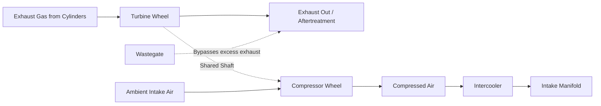
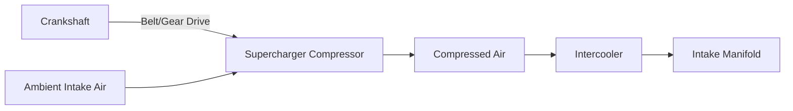

## Supercharging and Turbocharging

### Overview

Supercharging and turbocharging are forced induction techniques that compress intake air before it enters the engine cylinders, increasing air density and therefore the mass of air (and correspondingly, fuel) that can be packed into a given cylinder volume per cycle. This directly increases an engine's specific power output — power per unit displacement — beyond what naturally aspirated operation (drawing air in at or near atmospheric pressure) can achieve, at the cost of additional mechanical complexity, thermal management challenges, and (for SI engines) increased knock sensitivity, as introduced under spark-ignition and compression-ignition engine operation.

### Fundamental Principle: Why Forced Induction Increases Power

Engine power output is fundamentally proportional to the mass flow rate of air (and stoichiometrically corresponding fuel) processed by the engine per unit time, since combustion energy release scales with the mass of fuel burned:

$$\dot{m}_{air} = \rho_{air} \cdot \dot{V}_{displaced} \cdot \eta_v$$

where $\rho_{air}$ is intake air density, $\dot{V}_{displaced}$ is the volumetric displacement rate (displacement × speed), and $\eta_v$ is volumetric efficiency (introduced under engine performance parameters).

**Key Points**

- For a fixed engine displacement and speed, increasing intake air density $\rho_{air}$ (via compression before the intake valve) directly increases air mass flow, and therefore potential power output, without requiring any change to the engine's physical displacement.
- This is the core value proposition of forced induction: achieving higher specific power (and often improved specific fuel consumption at partial loads, due to reduced pumping and friction losses relative to power output from a smaller, boosted engine compared to a larger naturally aspirated engine producing equivalent peak power) — a strategy often termed "engine downsizing" in modern automotive contexts. [Inference — well-established downsizing rationale widely documented in modern automotive engineering literature.]

### Turbocharging

#### Working Principle

A turbocharger consists of a **turbine** and a **compressor** mounted on a common shaft. Exhaust gas, which still contains significant thermal and kinetic energy after leaving the cylinder, is directed through the turbine, extracting energy that drives the compressor, which draws in and compresses ambient (or filtered) intake air before delivering it to the engine's intake manifold.

**Key Points**

- Turbocharging effectively recovers energy that would otherwise be entirely wasted in the exhaust stream (in a naturally aspirated or non-turbocharged engine, this exhaust energy simply exits to atmosphere), making it thermodynamically attractive as an efficiency-improving technology, not merely a power-adding one. [Inference — standard energy-recovery rationale for turbocharging widely presented in engine efficiency literature.]
- Because the turbine is driven by exhaust gas rather than directly by the crankshaft, turbocharging does not directly consume engine shaft power in the same way supercharging does — though it does impose some exhaust backpressure penalty on the engine, which is itself a form of parasitic loss (increased pumping work during the exhaust stroke). [Inference — nuanced qualification often noted in turbocharger engineering references; backpressure effects vary by turbine sizing and matching.]

#### Turbocharger Components

- **Turbine section**: A radial or (less commonly, in smaller applications) axial turbine wheel housed in a volute-shaped casing, extracting energy from exhaust gas flow and rotational/kinetic energy.
- **Compressor section**: Typically a centrifugal compressor (as covered under centrifugal/axial compressor fundamentals), mounted on the same shaft as the turbine, compressing intake air.
- **Center housing/bearing system**: Supports the shared shaft at very high rotational speeds (commonly well over 100,000 rpm for smaller automotive turbochargers), typically using oil-lubricated journal or ball bearings, with oil supplied from the engine's lubrication system (and, in many designs, a coolant circuit as well, to manage heat soak from the hot turbine side).
- **Wastegate**: A bypass valve (integrated or external) that diverts some exhaust flow around the turbine when boost pressure reaches a target/maximum limit, preventing overboost and allowing boost pressure control across the operating range — essential since turbine speed (and thus compressor boost) would otherwise continue increasing with exhaust energy availability at high engine speed/load.
- **Variable geometry turbine (VGT)**: Adjustable vanes at the turbine inlet that vary the effective flow area, allowing a single turbocharger to provide effective boost response across a wider range of engine speeds than a fixed-geometry design (small effective area for quick spool-up at low speed, larger effective area to avoid excessive backpressure at high speed) — common in modern diesel applications and increasingly in some gasoline applications.

#### Turbo Lag

**Key Points**

- **Turbo lag** is the delay between a sudden increase in engine load/throttle demand and the corresponding rise in boost pressure, caused by the time required for exhaust energy to accelerate the turbine/compressor assembly's rotational inertia up to the speed needed to produce significant boost — most noticeable during rapid acceleration from low engine speed, where exhaust flow/energy is initially low.
- Mitigation strategies include: smaller turbine/compressor wheels with lower rotational inertia (trading ultimate boost/flow capacity for quicker response), variable geometry turbines (optimizing turbine effectiveness at low exhaust flow), twin-scroll turbine housings (separating exhaust pulses from different cylinder groups to improve turbine pulse energy utilization at low speed), sequential or twin-turbo arrangements (using a smaller turbo for quick low-speed response and a larger turbo for high-speed flow capacity), and electrically assisted turbochargers (using an electric motor integrated with the turbo shaft to spin up the compressor independent of exhaust energy availability, a more recent technology development). [Unverified — electrically assisted turbocharging is an active area of ongoing automotive technology development; specific implementation details and adoption levels continue to evolve.]

### Supercharging

#### Working Principle

A supercharger compresses intake air using a compressor mechanically driven directly off the engine's crankshaft (via belt, gear, or chain drive), rather than by exhaust gas energy — meaning boost pressure is directly and immediately tied to engine speed (since the drive mechanism runs at a fixed ratio to crankshaft speed), providing boost response essentially instantaneously with throttle input, without the spool-up delay characteristic of turbocharging.

**Key Points**

- Because the supercharger's compressor is mechanically driven, it directly consumes engine shaft power to operate — this parasitic power draw is a fundamental efficiency disadvantage compared to turbocharging's exhaust-energy-recovery approach, since supercharging effectively "spends" some of the engine's own useful output to generate the boost that then increases power output; the net power gain is therefore the boost-enabled power increase minus the drive power consumed. [Inference — standard comparative efficiency distinction widely presented in forced induction engineering literature.]

#### Supercharger Types

- **Roots-type superchargers**: Two meshing lobed rotors (similar in principle to a Roots blower) trap and transport air from inlet to outlet without internal compression (compression occurs externally, as trapped air is pushed against the resistance of the downstream intake system) — mechanically simple and robust, but generally less efficient than internally compressing designs at higher boost levels, since air is compressed inefficiently (a rapid, non-isentropic pressure equalization) rather than progressively.
- **Twin-screw (Lysholm) superchargers**: Two meshing helical rotors of different profiles progressively compress air internally as it moves along the rotor length (similar in principle to a screw pump/compressor), achieving genuine internal compression before discharge — generally more efficient than Roots-type designs, particularly at higher boost pressures, due to more thermodynamically favorable internal compression. [Inference — well-established comparative characterization in supercharger engineering literature.]
- **Centrifugal superchargers**: A centrifugal compressor (functioning identically in principle to a turbocharger's compressor stage) driven mechanically via a step-up drive (since centrifugal compressors require very high rotational speeds relative to typical crankshaft speeds) rather than by exhaust gas — offers good efficiency at high engine speed/flow but, similar to any centrifugal compressor, tends to produce boost that rises with speed rather than remaining as flat/immediate as positive-displacement (Roots or twin-screw) designs at low engine speed.

### Comparison: Turbocharging vs. Supercharging

| Characteristic | Turbocharging | Supercharging |
| --- | --- | --- |
| Drive energy source | Exhaust gas energy | Direct mechanical drive from crankshaft |
| Parasitic power draw on engine | Indirect (exhaust backpressure) | Direct (mechanical drive power) |
| Boost response | Delayed (turbo lag), improves at higher exhaust flow | Immediate, tied directly to engine speed |
| Thermodynamic efficiency rationale | Recovers otherwise-wasted exhaust energy | Consumes engine output directly |
| Typical peak efficiency point | High engine speed/load (ample exhaust energy) | Varies by type; positive-displacement types strong at low speed |
| Mechanical complexity | Turbine/compressor/bearing/wastegate/possible VGT system | Drive belt/gear system, compressor unit |
| Heat generated in intake air | Generally more (turbine-side heat soak plus compression heating) | Generally less severe heat soak concern, though compression heating still occurs [Inference] |

**Key Points**

- Some engines employ **twin-charging**, combining both a supercharger (for immediate low-speed boost response) and a turbocharger (for efficient high-speed/load boost) in a single system, aiming to capture the response advantage of supercharging and the efficiency advantage of turbocharging simultaneously — at the cost of substantially increased system complexity and cost. [Inference — recognized hybrid forced-induction strategy documented in automotive engineering literature, used in a limited number of production and racing applications.]

### Intercooling (Charge Air Cooling)

**Key Points**

- Compressing air inherently raises its temperature (per the compression thermodynamics discussed under centrifugal/axial compressor fundamentals), and hot intake air is less dense (partially offsetting the density gain from compression) and increases knock tendency in SI engines and thermal loading in both SI and CI engines.
- An **intercooler** (charge air cooler) — typically an air-to-air or air-to-liquid heat exchanger positioned after the compressor and before the intake manifold — cools the compressed air, increasing its density further and reducing knock risk/thermal loading, and is considered essentially standard practice on modern forced-induction engines beyond very low boost levels. [Inference — near-universal modern practice, though very low-boost applications may omit intercooling in some cases.]
- **Air-to-air intercoolers** use ambient airflow (through a radiator-like core, often front-mounted on vehicles) to cool the charge air; **air-to-liquid (air-to-water) intercoolers** use a liquid coolant loop (with its own separate radiator) to cool the charge air, often allowing more compact packaging and, in some designs, more consistent cooling performance independent of vehicle speed/ambient airflow, at the cost of added system complexity (separate coolant loop, pump, radiator). [Inference — standard comparative tradeoff widely discussed in forced induction engineering references.]

### Boost Pressure, Compression Ratio, and Knock Interaction (SI-Specific)

**Key Points**

- As introduced under SI engine operation, forced induction increases cylinder pressure and temperature, generally increasing knock tendency — this is why turbocharged/supercharged SI engines typically use lower geometric compression ratios than naturally aspirated counterparts, effectively trading some ideal-cycle efficiency (per the Otto cycle relationship) for the ability to run higher boost pressure without knock.
- Modern engine control strategies (precise knock detection and timing retard, direct injection charge-cooling effects, sophisticated boost control) allow higher combined effective compression (geometric ratio plus boost) than earlier forced-induction designs could safely achieve, an active area of ongoing engine efficiency development. [Inference — general trend in modern forced-induction SI engine development widely discussed in automotive engineering literature.]

**Example**

A modern compact turbocharged gasoline engine might use a relatively low geometric compression ratio (e.g., in the range of 9:1 to 10:1) combined with direct injection and a variable-geometry or twin-scroll turbocharger to achieve both strong low-speed torque response (mitigating turbo lag) and high specific power output, while relying on knock sensors and adaptive ignition timing to safely extract maximum performance across the full boost range without exceeding the engine's structural and thermal limits — illustrating how modern forced induction is implemented as an integrated system (mechanical hardware plus electronic control) rather than the turbocharger or supercharger component alone. [Inference — illustrative representative example of contemporary downsized turbocharged engine design philosophy; not based on a specific documented engine.]

**Next Steps**

- Turbocharger Matching and Compressor/Turbine Map Selection
- Variable Geometry Turbine (VGT) Control Strategies
- Twin-Charging and Sequential Turbocharger Systems
- Intercooler Design and Charge Air Cooling Effectiveness
- Knock Control Strategy in Boosted SI Engines
- Electrically Assisted and Electric Turbocharger Technology