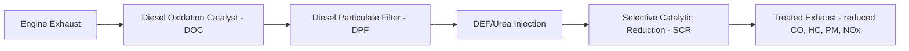
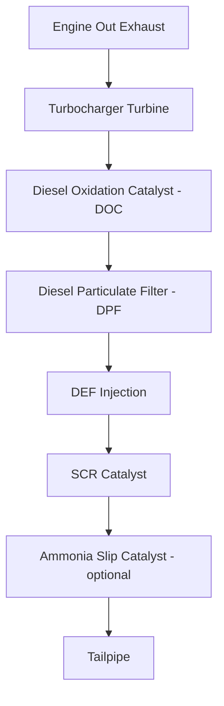

## Engine Emissions and Aftertreatment Systems

### Overview

Internal combustion engines produce several regulated pollutant species as byproducts of incomplete or imperfect combustion, requiring both in-cylinder combustion control strategies and downstream exhaust aftertreatment systems to meet modern emissions regulations. This item covers the formation mechanisms of the primary regulated pollutants and the major aftertreatment technologies used to control them, building on the SI and CI combustion fundamentals and forced induction concepts introduced previously.

### Primary Regulated Pollutants and Formation Mechanisms

#### Carbon Monoxide (CO)

**Key Points**

- CO forms primarily from incomplete combustion, occurring when insufficient oxygen is available to fully oxidize carbon to CO₂ (i.e., in fuel-rich combustion zones) or when combustion is quenched before oxidation completes (e.g., near cooler cylinder walls).
- CO formation is strongly correlated with air-fuel ratio: rich mixtures (excess fuel relative to stoichiometric) produce substantially more CO, making CO primarily an SI engine concern in richer operating modes (cold start, high-load enrichment), since CI engines typically operate lean (excess air) overall, limiting bulk CO formation even though localized fuel-rich zones exist within the diffusion combustion process. [Inference — general comparative characterization widely documented in IC engine emissions literature.]

#### Unburned Hydrocarbons (HC)

**Key Points**

- HC emissions represent fuel that escapes combustion entirely or partially, arising from mechanisms including: flame quenching near cool cylinder walls and crevice volumes (e.g., the piston ring/cylinder wall crevice, where flame cannot propagate into the very narrow gap), incomplete combustion in fuel-rich zones, and, in two-stroke SI engines, short-circuiting losses as discussed previously.
- Cold engine operation significantly increases HC emissions, since cold cylinder walls quench flame propagation more aggressively and cold-start enrichment (extra fuel to ensure reliable ignition/combustion in a cold engine) increases the fuel available to escape unburned.

#### Nitrogen Oxides (NOx)

**Key Points**

- NOx (primarily NO and NO₂) forms through the **thermal NOx** mechanism (also called the Zeldovich mechanism), in which atmospheric nitrogen and oxygen react at high temperature — NOx formation rate increases exponentially with peak combustion temperature, making it strongly dependent on local flame temperature and duration of exposure to high temperature.
- NOx is characteristically a bigger challenge for lean-burn and high-compression combustion strategies (including diesel/CI combustion generally, and lean-burn or high-EGR-dilution SI strategies at certain operating points) because these strategies often involve locally very high peak flame temperatures even when the bulk mixture is lean overall, though the relationship is complex and depends on the specific combustion strategy details. [Inference — nuanced characterization; NOx formation depends on multiple interacting factors including temperature, residence time, and local oxygen availability, not lean operation alone.]

#### Particulate Matter (PM) / Soot

**Key Points**

- PM (soot) forms primarily in fuel-rich, oxygen-deficient combustion zones where carbon-containing fuel fragments cannot fully oxidize and instead form solid carbon particles (soot precursors that agglomerate into larger particulates), a mechanism especially significant in CI (diesel) engines due to their diffusion-controlled combustion process, where locally fuel-rich zones inevitably exist within the fuel spray before full air mixing occurs.
- PM is generally a much smaller concern in port-injected or well-mixed direct-injection SI engines (which operate with more thoroughly premixed, generally stoichiometric or lean mixtures), though direct-injection SI (GDI) engines can produce measurably more PM than port-injected SI engines due to the shorter time available for fuel-air mixing before ignition, which has become a growing regulatory focus. [Inference — recognized and increasingly regulated characteristic of GDI engines relative to port-injected SI, documented in recent automotive emissions literature.]

#### Carbon Dioxide (CO₂)

**Key Points**

- CO₂ is the primary product of complete combustion and is not a "pollutant" in the traditional local air-quality sense (unlike CO, HC, NOx, and PM, which are harmful in the immediate combustion vicinity or cause smog/respiratory effects), but is regulated as the principal greenhouse gas associated with fuel combustion, with CO₂ emissions directly and unavoidably proportional to fuel consumption (carbon content burned) — meaning CO₂ reduction strategy is fundamentally about improving fuel efficiency (or switching to lower-carbon or carbon-neutral fuels) rather than aftertreatment removal, since CO₂ cannot be practically "cleaned" from the exhaust stream in the way other pollutants can (aside from emerging carbon capture technologies not typically applied to individual mobile engines).

### In-Cylinder Emissions Control Strategies (Brief Context)

**Key Points**

- **Exhaust Gas Recirculation (EGR)**: Routes a portion of exhaust gas back into the intake charge, displacing some fresh air/oxygen and adding inert gas that absorbs heat during combustion, lowering peak combustion temperature and thereby substantially reducing thermal NOx formation — widely used in both SI and CI engines, though CI engines generally use higher EGR rates for NOx control given their characteristically higher combustion temperatures.
- **Injection timing and multiple-injection strategies** (CI-specific, introduced previously): Pilot injection reduces ignition delay and associated rapid pressure rise, moderating both combustion noise and, to some extent, NOx formation by reducing peak local temperatures.
- **Lean-burn strategies and air-fuel ratio control**: Careful AFR management balances the competing formation mechanisms of different pollutants (e.g., rich mixtures reduce NOx but increase CO/HC; lean mixtures reduce CO/HC but can increase NOx depending on temperature effects), a fundamental combustion calibration tradeoff that aftertreatment systems are specifically designed to address.

### Aftertreatment Technologies

#### Three-Way Catalytic Converter (TWC) — SI Engine Application

**Key Points**

- The three-way catalyst simultaneously oxidizes CO and HC to CO₂ and H₂O while reducing NOx to N₂ and O₂, using precious metal catalysts (typically platinum, palladium, and rhodium) coated on a ceramic or metallic honeycomb substrate.
- Effective three-way catalyst operation requires the engine to operate very close to the **stoichiometric** air-fuel ratio (as introduced under SI engine fuel delivery), since the simultaneous oxidation and reduction reactions each require specific exhaust gas composition conditions that are only both satisfied in a narrow AFR window around stoichiometric — this is why modern SI engines use closed-loop oxygen sensor feedback control to maintain AFR precisely at stoichiometric during normal (non-enrichment) operation, specifically to keep the TWC operating effectively.
- **Catalyst light-off temperature**: TWCs require reaching a minimum operating temperature (commonly several hundred °C) before achieving significant conversion efficiency, meaning catalyst effectiveness is substantially reduced during cold start — this drives design strategies such as close-coupled catalyst placement (mounting the catalyst near the exhaust manifold to reach light-off temperature quickly) and cold-start-specific engine calibration (e.g., retarded ignition timing to increase exhaust temperature during warm-up).

#### Diesel Oxidation Catalyst (DOC) — CI Engine Application

**Key Points**

- Oxidizes CO, HC, and the soluble organic fraction of particulate matter to CO₂ and H�2O, similar in principle to the oxidation function of a TWC but operating in the persistently lean (excess oxygen) exhaust environment characteristic of diesel engines, where NOx reduction via a simple three-way-style catalyst is not effective (since NOx reduction chemistry requires a reducing, oxygen-poor environment that lean diesel exhaust does not naturally provide).
- Typically positioned upstream of other diesel aftertreatment components (DPF, SCR), partly because DOC oxidation of NO to NO₂ can assist downstream particulate filter regeneration processes (NO₂ being a more effective oxidizer of trapped soot than O₂ alone at typical exhaust temperatures). [Inference — well-established functional relationship documented in diesel aftertreatment engineering literature.]

#### Diesel Particulate Filter (DPF)

**Key Points**

- A porous ceramic (typically cordierite or silicon carbide) honeycomb structure with alternately plugged channels, forcing exhaust gas to flow through the porous walls, physically trapping soot particles while allowing gas to pass — achieving very high particulate mass and number removal efficiency.
- **Regeneration**: Trapped soot must be periodically burned off (oxidized) to prevent excessive backpressure buildup and filter blockage; **passive regeneration** occurs continuously during normal high-temperature operation (assisted by NO₂ from the upstream DOC, as noted above), while **active regeneration** involves deliberately raising exhaust temperature (via engine calibration strategies such as late post-injection, or in some systems, a dedicated fuel injector upstream of the DOC/DPF) when passive regeneration conditions aren't naturally met (e.g., during extended low-load/low-temperature operation), ensuring soot is periodically cleared regardless of duty cycle.
- Failure to regenerate adequately can lead to excessive soot accumulation, increased backpressure (reducing engine performance/efficiency), and in severe cases, uncontrolled high-temperature regeneration events that can damage the filter substrate.

#### Selective Catalytic Reduction (SCR)

**Key Points**

- SCR reduces NOx to N₂ and H₂O using a reductant — most commonly **urea-based diesel exhaust fluid (DEF)**, marketed under trade names such as AdBlue in some regions — injected into the hot exhaust stream upstream of the SCR catalyst, where it decomposes to ammonia (NH₃), which then reacts with NOx across the SCR catalyst substrate.
- SCR is highly effective at NOx reduction (commonly cited conversion efficiencies well above 90% under proper operating conditions) and, unlike some in-cylinder-only NOx control strategies, allows the engine itself to be calibrated for better fuel efficiency (which often correlates with higher engine-out NOx) since NOx reduction is handled downstream by the aftertreatment system rather than solely through combustion compromises. [Unverified — specific conversion efficiency figures vary by system design, operating conditions, and duty cycle; consult manufacturer/regulatory certification data for specific systems.]
- DEF/urea dosing requires precise electronic control (based on exhaust NOx sensors and/or modeled NOx output) to inject the correct reductant quantity — under-dosing reduces NOx conversion effectiveness, while over-dosing can cause ammonia slip (unreacted ammonia passing through the catalyst, itself an undesirable emission) or urea deposit formation in the exhaust system.
- Vehicles/engines equipped with SCR require periodic DEF refilling as a consumable, a practical operational consideration distinguishing SCR-equipped diesel engines from those relying solely on in-cylinder NOx control (e.g., primarily EGR-based systems without SCR, common on some smaller diesel applications, though these systems generally cannot achieve NOx reduction levels comparable to a well-functioning SCR system at equivalent fuel efficiency). [Inference — general comparative characterization of NOx control strategy tradeoffs across diesel engine segments.]

#### Lean NOx Trap (LNT) — Alternative NOx Strategy

**Key Points**

- An alternative (or complementary) NOx aftertreatment approach that chemically adsorbs (stores) NOx from lean exhaust onto a catalyst washcoat during normal lean operation, then periodically requires a brief rich (or near-stoichiometric) exhaust condition — achieved via a deliberate engine calibration event — to release and chemically reduce the stored NOx to N₂, regenerating the trap's storage capacity.
- LNTs avoid the need for a separate reductant fluid (DEF/urea) but generally have lower overall NOx storage/conversion capacity and can impose a fuel economy penalty from the periodic rich regeneration events, making them more common in smaller diesel applications or as a complementary technology alongside SCR in some system designs, rather than as the sole NOx control strategy in larger/heavy-duty applications. [Inference — general comparative positioning of LNT technology in diesel aftertreatment literature; specific application choices are manufacturer/market-segment dependent.]

### Integrated Modern Diesel Aftertreatment System (Typical Arrangement)

**Key Points**

- Modern heavy-duty diesel engines typically integrate DOC, DPF, and SCR (and often an ammonia slip catalyst as a final polishing stage to oxidize any residual unreacted ammonia) into a single combined aftertreatment package, coordinated by sophisticated electronic control managing regeneration timing, DEF dosing, and various exhaust temperature/NOx sensors throughout the system.
- Modern SI (gasoline) engines, by contrast, typically rely primarily on the single three-way catalyst (sometimes with a secondary "underfloor" catalyst downstream of a close-coupled primary catalyst), reflecting the fundamentally different pollutant profile and combustion strategy (near-stoichiometric, premixed) compared to lean-burn CI combustion. Gasoline particulate filters (GPF) have increasingly been added to modern GDI engines specifically to address the growing PM concern noted earlier for direct-injection gasoline combustion. [Unverified — GPF adoption and specific regulatory requirements vary by jurisdiction and continue to evolve; verify current requirements for specific markets/applications.]

**Example**

A modern heavy-duty diesel truck engine might rely on a combination of cooled EGR (reducing engine-out NOx via lower peak combustion temperature) combined with a full DOC-DPF-SCR aftertreatment system (further reducing CO/HC/PM via the DOC and DPF, and NOx via urea-based SCR), allowing the engine itself to be calibrated for good fuel efficiency (which tends to correlate with higher raw engine-out NOx) since the SCR system handles the majority of final NOx reduction — illustrating the modern design philosophy of splitting emissions control responsibility between in-cylinder strategy (optimized primarily for efficiency, with some NOx moderation via EGR) and aftertreatment (handling the remaining, more difficult-to-eliminate-in-cylinder pollutant burden). [Inference — illustrative representative example of a common modern heavy-duty diesel emissions control architecture; specific system configurations vary by manufacturer and regulatory requirements.]

**Next Steps**

- Exhaust Gas Recirculation (EGR) System Design and Cooling
- SCR Dosing Control and Urea/DEF System Design
- Diesel Particulate Filter Regeneration Strategies
- Gasoline Particulate Filter (GPF) Technology and Regulation
- Emissions Regulation Standards (Euro, EPA Tiers) and Test Cycles
- Catalyst Light-Off and Cold-Start Emissions Reduction Strategies
- Ammonia Slip Catalyst Design and Function