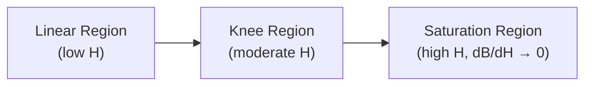

## Magnetic Circuits and Electromechanical Energy Conversion Principles

### Overview

Magnetic circuits provide the analytical framework for analyzing magnetic field distributions in electromechanical devices—transformers, motors, generators, and actuators. Electromechanical energy conversion describes how energy transforms between electrical and mechanical forms through the coupling magnetic (or electric) field. These two topics form the theoretical foundation for all rotating machine analysis.

### Magnetic Circuit Fundamentals

#### The Magnetic Circuit Analogy

A magnetic circuit consists of a closed path (usually ferromagnetic material) that confines and guides magnetic flux, analogous to how a conductor guides electric current in a resistive circuit.

**Key Points**

| Electric Circuit | Magnetic Circuit |
| --- | --- |
| EMF, $V$ (volts) | MMF, $\mathcal{F}$ (ampere-turns) |
| Current, $I$ (amperes) | Flux, $\Phi$ (webers) |
| Resistance, $R$ (ohms) | Reluctance, $\mathcal{R}$ (A-turns/Wb) |
| Conductivity, $\sigma$ | Permeability, $\mu$ |
| Current density, $J$ | Flux density, $B$ |

The governing relation is Ohm's Law for magnetic circuits:

$$\mathcal{F} = \Phi \mathcal{R}$$

where magnetomotive force is produced by a current-carrying coil:

$$\mathcal{F} = Ni$$

with $N$ the number of turns and $i$ the coil current.

#### Reluctance and Permeance

Reluctance quantifies opposition to flux establishment for a core segment of length $l$, cross-sectional area $A$, and permeability $\mu$:

$$\mathcal{R} = \frac{l}{\mu A}$$

Permeance is the reciprocal: $\mathcal{P} = 1/\mathcal{R}$.

Permeability is often expressed as $\mu = \mu_r \mu_0$, where $\mu_0 = 4\pi \times 10^{-7}$ H/m is the permeability of free space and $\mu_r$ is the relative permeability of the material (typically 2000–6000 for silicon steel, versus 1 for air).

**[Inference]** Because $\mu_{r,\text{iron}} \gg \mu_{r,\text{air}}$, air gaps—even very short ones—dominate the total reluctance of practical magnetic circuits, since reluctance scales inversely with permeability for a given geometry.

#### Series and Parallel Magnetic Circuits

Reluctances combine like resistances:

- **Series:** $\mathcal{R}_{eq} = \mathcal{R}_1 + \mathcal{R}_2 + \cdots$
- **Parallel:** $\dfrac{1}{\mathcal{R}_{eq}} = \dfrac{1}{\mathcal{R}_1} + \dfrac{1}{\mathcal{R}_2} + \cdots$

**Example**

A toroidal core of mean length $l_c = 0.3$ m, cross-section $A_c = 5 \times 10^{-4}$ m², $\mu_r = 3000$, contains an air gap $l_g = 1$ mm of the same area, wound with $N = 200$ turns carrying $i = 2$ A.

Core reluctance:

$$\mathcal{R}_c = \frac{l_c}{\mu_r \mu_0 A_c} = \frac{0.3}{3000 \times 4\pi\times10^{-7} \times 5\times10^{-4}} \approx 1.59 \times 10^5 \text{ A-t/Wb}$$

Gap reluctance:

$$\mathcal{R}_g = \frac{l_g}{\mu_0 A_c} = \frac{0.001}{4\pi\times10^{-7} \times 5\times10^{-4}} \approx 1.59 \times 10^6 \text{ A-t/Wb}$$

Total (series): $\mathcal{R}_{total} \approx 1.75 \times 10^6$ A-t/Wb

Flux: $\Phi = \mathcal{F}/\mathcal{R}_{total} = (200 \times 2)/1.75\times10^6 \approx 2.29 \times 10^{-4}$ Wb

This illustrates that the 1 mm gap contributes roughly ten times the reluctance of the entire 0.3 m iron path—the air gap dominates.

#### Fringing and Leakage Flux

- **Fringing flux** bulges outward at air gap edges, effectively increasing the gap's cross-sectional area. A common correction adds the gap length to each linear dimension of the gap cross-section.
- **Leakage flux** follows paths through air rather than the intended core path, linking only part of the winding turns. Leakage flux is modeled separately via leakage reactance in machine equivalent circuits since it does not contribute to the main energy-conversion flux.

**[Unverified]** Fringing corrections are empirical approximations; exact values depend on gap geometry and typically require finite-element analysis for precision beyond first-order estimates.

#### Nonlinear Core Behavior: Saturation and Hysteresis

Real ferromagnetic materials exhibit a nonlinear $B$–$H$ curve:

- **Saturation:** Beyond the knee, further increases in $H$ (and thus MMF/current) produce diminishing increases in $B$. Reluctance is not constant but a function of operating flux density.
- **Hysteresis:** The $B$–$H$ path differs for increasing versus decreasing $H$, forming a hysteresis loop. The enclosed area represents energy dissipated per cycle as heat.
- **Hysteresis loss** (empirical Steinmetz relation): $P_h = k_h f B_{max}^n$, where $n \approx 1.5$–$2.5$ depending on material.
- **Eddy current loss:** $P_e = k_e f^2 B_{max}^2$, caused by circulating currents induced in the core; mitigated by laminating the core into thin, insulated sheets.

**[Unverified]** Specific Steinmetz exponents and loss coefficients ($k_h$, $k_e$) are material- and manufacturer-specific and must be obtained from core datasheets for accurate loss prediction.

### Energy and Coenergy in Magnetic Fields

#### Field Energy Storage

For a singly-excited magnetic system, energy stored in the field, at fixed flux linkage $\lambda$:

$$W_{fld}(\lambda, x) = \int_0^{\lambda} i(\lambda', x)\, d\lambda'$$

Graphically, this is the area **between** the $\lambda$–$i$ curve and the $\lambda$-axis.

#### Coenergy

Coenergy is a mathematical construct useful when force/torque is expressed as a function of current rather than flux linkage:

$$W_{fld}'(i, x) = \int_0^{i} \lambda(i', x)\, di'$$

Graphically, coenergy is the area **between** the $\lambda$–$i$ curve and the $i$-axis. By definition:

$$W_{fld} + W_{fld}' = \lambda i$$

For a **linear** (unsaturated) system where $\lambda = L(x) i$:

$$W_{fld} = W_{fld}' = \frac{1}{2} L(x) i^2 = \frac{1}{2} \frac{\lambda^2}{L(x)}$$

**[Inference]** In saturated systems, $W_{fld} \neq W_{fld}'$ because the $\lambda$–$i$ relationship is nonlinear, so the two integral areas differ; the coenergy formulation remains algebraically convenient specifically because most machine analyses treat current, not flux linkage, as the independent (controlled) electrical variable.

Diagram illustrating the energy/coenergy split on a nonlinear $\lambda$–$i$ curve:

<svg xmlns="http://www.w3.org/2000/svg" viewBox="0 0 480 340" font-family="sans-serif">
<text x="240" y="20" font-size="14" text-anchor="middle" font-weight="bold">Energy vs. Coenergy on λ–i Curve (svg_diagram)</text>
<line x1="60" y1="290" x2="440" y2="290" stroke="black" stroke-width="1.5" />
<line x1="60" y1="290" x2="60" y2="40" stroke="black" stroke-width="1.5" />
<text x="450" y="295" font-size="13">i</text>
<text x="45" y="35" font-size="13">λ</text>
<path d="M 60 290 Q 180 230 260 150 Q 320 90 400 60" stroke="#1a5fb4" stroke-width="2.5" fill="none" />
<path d="M 60 290 Q 180 230 260 150 Q 320 90 400 60 L 260 150 L 60 290 Z" fill="#a4c8f0" fill-opacity="0.6" />
<text x="130" y="240" font-size="12" fill="#0b3d91">W_fld</text>
<path d="M 60 290 L 260 150 L 260 290 Z" fill="#f9c74f" fill-opacity="0.6" />
<text x="150" y="275" font-size="12" fill="#7a4a00">W'_fld</text>
<line x1="260" y1="150" x2="260" y2="290" stroke="gray" stroke-dasharray="4,3" />
<line x1="260" y1="150" x2="60" y2="150" stroke="gray" stroke-dasharray="4,3" />
<circle cx="260" cy="150" r="3.5" fill="black" />
<text x="265" y="145" font-size="12">(i₀, λ₀)</text>
</svg>

### Electromechanical Force and Torque Production

#### Principle of Virtual Work

Force (or torque) is derived from the rate of change of stored field energy or coenergy with respect to mechanical displacement, applied at constant flux linkage or constant current respectively.

**At constant flux linkage $\lambda$:**

$$f_{fld} = -\left.\frac{\partial W_{fld}(\lambda, x)}{\partial x}\right|_{\lambda = \text{const}}$$

**At constant current $i$ (using coenergy — preferred for most machine analysis):**

$$f_{fld} = +\left.\frac{\partial W_{fld}'(i, x)}{\partial x}\right|_{i = \text{const}}$$

For rotational systems, replace $x \to \theta$ and $f_{fld} \to T_{fld}$:

$$T_{fld} = \left.\frac{\partial W_{fld}'(i, \theta)}{\partial \theta}\right|_{i = \text{const}}$$

**Key Points**

- The negative sign in the flux-linkage form reflects that the field does positive work on the mechanical system as it moves toward lower stored energy (at constant $\lambda$, with the source disconnected).
- The positive sign in the coenergy form arises because, at constant current, the electrical source supplies energy both to increase stored field energy and to do mechanical work.
- For a linear system: $T_{fld} = \dfrac{1}{2} i^2 \dfrac{dL(\theta)}{d\theta}$

#### Energy Balance Derivation

Starting from the electrical port, instantaneous electrical power input equals the rate of resistive loss, field energy storage, and mechanical work output:

$$e\, i\, dt = i^2 R\, dt + dW_{fld} + f_{fld}\, dx$$

Since $e = d\lambda/dt$ (Faraday's Law, neglecting resistance drop for the field-energy portion):

$$i\, d\lambda = dW_{fld} + f_{fld}\, dx$$

This differential relation is the starting point from which the partial-derivative force expressions are formally derived via the total differential of $W_{fld}(\lambda, x)$.

#### Doubly-Excited Systems

For machines with two independent windings (e.g., field and armature, as in synchronous machines or reluctance devices with cross-coupling), coenergy depends on both currents:

$$W_{fld}'(i_1, i_2, \theta) = \frac{1}{2} L_{11} i_1^2 + \frac{1}{2} L_{22} i_2^2 + L_{12}(\theta)\, i_1 i_2$$

Torque:

$$T_{fld} = \frac{1}{2} i_1^2 \frac{dL_{11}}{d\theta} + \frac{1}{2} i_2^2 \frac{dL_{22}}{d\theta} + i_1 i_2 \frac{dL_{12}}{d\theta}$$

The cross term $i_1 i_2 \, dL_{12}/d\theta$ is the **mutual coupling** (alignment) torque responsible for torque production in synchronous and induction machines, since it depends on relative angular position between rotor and stator windings.

### Singly-Excited Systems: Worked Example

**Example**

An electromagnet with a moving armature has inductance $L(x) = \dfrac{0.08}{0.002 + x}$ H, where $x$ is the air-gap length in meters. At $x = 0.003$ m, current is held constant at $i = 4$ A.

$$\frac{dL}{dx} = -\frac{0.08}{(0.002+x)^2}$$

At $x = 0.003$: $\dfrac{dL}{dx} = -\dfrac{0.08}{(0.005)^2} = -3200$ H/m

$$f_{fld} = \frac{1}{2} i^2 \frac{dL}{dx} = \frac{1}{2}(16)(-3200) = -25{,}600 \text{ N}$$

The negative sign indicates the force acts to **decrease** $x$ (pull the armature closed), consistent with the physical tendency of magnetic systems to move toward configurations of minimum reluctance / maximum inductance.

### Types of Electromechanical Devices by Conversion Mechanism

**Key Points**

1. **Force devices (translational):** Solenoids, relays, electromagnets — governed by $f_{fld} = \frac{1}{2}i^2 \, dL/dx$.
2. **Torque devices, singly-excited (reluctance type):** Variable-reluctance motors, reluctance actuators — torque exists only where $dL/d\theta \neq 0$; torque is zero at aligned/unaligned positions.
3. **Torque devices, doubly-excited (synchronous type):** Depend on mutual inductance variation $dL_{12}/d\theta$; this is the basis of synchronous machine and induction machine torque production, covered in depth in subsequent chapter items.

### Practical Design Implications

- **Core material selection:** High-permeability, low-hysteresis-loss materials (silicon steel, ferrites for high-frequency devices) minimize excitation MMF and core losses.
- **Air gap sizing:** Gap length is chosen as a trade-off — larger gaps reduce saturation sensitivity and improve linearity but demand higher MMF (more copper, more loss) for a given flux.
- **Lamination:** Stacking thin insulated laminations perpendicular to eddy current paths reduces $P_e$ roughly with the square of lamination thickness. **[Unverified]** — exact scaling depends on lamination thickness relative to skin depth at the operating frequency.
- **Saturation margin:** Machines are typically designed to operate near, but below, the saturation knee to balance material utilization (compactness) against nonlinear losses and reduced incremental permeability.

### Common Pitfalls

**Key Points**

- Confusing $W_{fld}$ and $W_{fld}'$: sign errors in force/torque calculations are the most frequent student error; always confirm which variable ($\lambda$ or $i$) is held constant.
- Neglecting fringing in air-gap reluctance calculations, leading to underestimated flux for a given MMF.
- Applying the linear inductance formula ($T = \frac{1}{2}i^2 dL/d\theta$) to a saturated core, where $L$ is no longer a valid constant-slope descriptor of the $\lambda$–$i$ relationship.
- Forgetting that reluctance torque devices produce **zero average torque** at positions where $dL/d\theta = 0$, even if current is nonzero — meaningful for singly-excited reluctance actuator/motor design.

### Related Topics

- Faraday's Law and induced EMF in moving conductors
- Rotating magnetic fields and the elementary AC machine
- Equivalent circuit modeling of transformers (mutual/leakage reactance)
- Singly- vs. doubly-excited magnetic systems: detailed torque-angle characteristics
- Synchronous machine torque and power-angle equations
- Induction machine rotating field theory
- Core loss modeling: Steinmetz equation and manufacturer loss curves
- Finite element analysis (FEA) methods for nonlinear magnetic circuit solutions