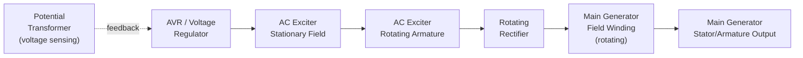
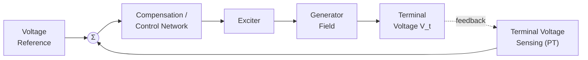

## Generator Excitation Systems and Voltage Regulation

### Overview

The excitation system supplies and controls DC current to the synchronous generator's field winding, establishing the rotor magnetic field. It is the primary actuator for terminal voltage control and reactive power management, and plays a critical role in power system stability during disturbances. Voltage regulation, as a static performance metric, and dynamic voltage control via excitation, are closely related but distinct concepts covered together here.

### Functions of the Excitation System

**Key Points**

- Maintain generator terminal voltage at a set-point under varying load conditions.
- Control reactive power output/absorption to support system voltage and power factor requirements.
- Enhance transient stability by rapidly boosting field current during system disturbances (fault recovery).
- Provide field current limits to protect the rotor winding from thermal damage (overexcitation) and prevent loss-of-synchronism (underexcitation).
- Enable controlled shutdown/de-excitation and support fault-current limiting during internal faults.

### Types of Excitation Systems

Excitation systems are broadly classified by how field power is generated and delivered to the rotor.

#### 1. DC Excitation Systems

Uses a DC generator (exciter), often mounted on the main generator shaft, as the source of field power, delivered via slip rings and brushes.

**[Inference]** DC exciter systems are largely legacy technology in modern installations, since a rotating DC commutator machine has higher maintenance requirements and slower response than static or brushless alternatives — however, many older units remain in service.

#### 2. AC Excitation Systems (Brushless)

An AC exciter (a small synchronous generator with a **stationary field and rotating armature**, the inverse of the main generator) is mounted on the same shaft. Its AC output is rectified by a rotating diode/rectifier assembly mounted on the shaft, and the resulting DC feeds directly to the main generator's field winding — no brushes or slip rings required for the main field.

**Key Points**

- Eliminates brush wear, sparking risk, and slip-ring maintenance.
- Response is inherently slightly slower than static systems due to the extra AC-exciter rotating stage, though still fast enough for most stability requirements.
- Standard configuration for most modern medium-to-large synchronous generators.

#### 3. Static Excitation Systems

Field power is derived directly from the generator's own terminals (or an auxiliary/station supply) via a step-down transformer and controlled rectifier (thyristor bridge), then delivered to the rotating field winding through brushes and slip rings.

**Key Points**

- Very fast response (no rotating exciter stage — response time typically dominated only by the thyristor firing and control loop).
- Requires brushes and slip rings for the main field, reintroducing that maintenance requirement.
- Commonly used where fast transient response is prioritized, such as in systems requiring strong stability support.
- Field-forcing ceiling voltage can be very high relative to rated field voltage, enabling rapid field-current boost during faults.

**[Unverified]** Exact ceiling voltage ratios and response time constants are standardized by IEEE excitation system models (e.g., IEEE Std 421.5) but vary by specific system type and manufacturer implementation.

### Automatic Voltage Regulator (AVR)

The AVR is the control system that continuously adjusts exciter output to hold generator terminal voltage at the desired reference, forming a closed-loop feedback control system.

#### Basic AVR Control Loop

**Key Points**

- Error signal = $V_{ref} - V_{sensed}$; the AVR drives exciter output to null this error.
- A **stabilizing/compensation network** (often including derivative and rate-feedback terms) is required because the exciter–generator combination, if left as a simple proportional loop, tends toward oscillatory or unstable response due to the multiple time constants in the field circuit.
- Modern AVRs are largely digital, implementing PID-type control with additional limiter and protective functions.

#### Standard IEEE Excitation System Models

**[Unverified]** IEEE Std 421.5 defines standardized block-diagram models (e.g., DC1A, AC4A, ST1A type designations) used for power system stability studies; the specific model type and parameter values applicable to a given machine must be obtained from the manufacturer or plant documentation, as generic textbook parameters do not represent any specific real machine accurately.

### Power System Stabilizer (PSS)

A supplementary control loop often added to the AVR to damp low-frequency (0.1–2 Hz) electromechanical power oscillations between generators and the rest of the system.

**Key Points**

- Takes an auxiliary input (commonly rotor speed deviation, electrical power, or frequency).
- Injects a modulating signal into the AVR reference to produce a component of electrical torque in phase with speed deviation, providing positive damping.
- Essential for maintaining small-signal (dynamic) stability in interconnected power systems, particularly for generators connected via long transmission lines with weak system strength.

### AVR Limiter Functions

Modern excitation control systems incorporate multiple protective limiter loops that override normal voltage regulation when operating limits are approached:

| Limiter | Purpose |
| --- | --- |
| Overexcitation limiter (OEL) | Prevents field winding thermal damage from prolonged high field current |
| Underexcitation limiter (UEL) | Prevents loss of synchronism / stator end-region heating from operating too far into leading PF (underexcited) region |
| V/Hz (volts-per-hertz) limiter | Prevents core overfluxing during low-frequency or overvoltage conditions (particularly at startup/shutdown) |
| Stator current limiter (SCL) | Prevents armature winding thermal overload |

**[Inference]** These limiters exist because the AVR's primary voltage-regulation objective can, under abnormal system conditions, drive the machine toward an operating point that satisfies the voltage target but violates a thermal or stability constraint — the limiters act as an override to keep the machine within its capability curve.

### Generator Capability Curve

The capability curve defines the safe steady-state operating region (real power $P$ vs. reactive power $Q$), bounded by:

1. **Armature current limit** (thermal, stator winding) — an arc of constant $|S| = \sqrt{P^2+Q^2}$
2. **Field current limit** (thermal, rotor winding) — bounds the overexcited (lagging) region
3. **Stability/underexcitation limit** (theoretical steady-state stability plus a practical margin) — bounds the underexcited (leading) region
4. **Prime mover rating** — horizontal line limiting maximum $P$

<svg xmlns="http://www.w3.org/2000/svg" viewBox="0 0 480 380" font-family="sans-serif">
<text x="240" y="20" font-size="14" text-anchor="middle" font-weight="bold">Generator Capability Curve (svg_diagram)</text>
<line x1="60" y1="330" x2="60" y2="50" stroke="black" stroke-width="1.5" />
<line x1="60" y1="200" x2="420" y2="200" stroke="black" stroke-width="1.5" />
<text x="425" y="205" font-size="12">Q (leading)</text>
<text x="10" y="55" font-size="12">P</text>
<text x="425" y="200" font-size="11" text-anchor="start" />
<text x="65" y="345" font-size="11">Q (lagging) →</text>
<path d="M 200 200 A 130 130 0 0 1 60 70" stroke="#1a5fb4" stroke-width="2" fill="none" />
<text x="90" y="90" font-size="10" fill="#1a5fb4">Field current limit</text>
<path d="M 200 200 A 140 140 0 0 0 100 330" stroke="#e8590c" stroke-width="2" fill="none" />
<text x="90" y="300" font-size="10" fill="#e8590c">Armature current limit</text>
<path d="M 60 200 Q 130 250 100 330" stroke="#2f9e44" stroke-width="2" fill="none" stroke-dasharray="5,3" />
<text x="10" y="260" font-size="10" fill="#2f9e44">Stability limit</text>
<line x1="60" y1="70" x2="420" y2="70" stroke="gray" stroke-dasharray="3,3" />
<text x="300" y="65" font-size="10" fill="gray">Prime mover limit</text>
</svg>

**[Unverified]** The precise shape and boundary values of a capability curve are machine-specific (derived from rated MVA, power factor, and thermal design) and must be taken from the manufacturer's test data — the diagram above illustrates general topology, not any actual machine's ratings.

### Voltage Regulation Revisited: Static vs. Dynamic

**Key Points**

- **Static voltage regulation** ($VR$, as defined by $(E_A - V_\phi)/V_\phi$) describes the no-load-to-full-load voltage change at *fixed* excitation — a machine characteristic, not a control system performance measure.
- **Dynamic voltage regulation** refers to how quickly and accurately the AVR/excitation system restores terminal voltage to setpoint following a disturbance (load step, fault) — characterized by response time, overshoot, and settling time of the closed-loop control system.
- These are frequently conflated: a machine can have poor inherent (static) $VR$ but excellent (dynamic) voltage control if equipped with a fast, well-tuned AVR — the AVR actively compensates for the machine's natural regulation characteristic under closed-loop operation.

### Excitation System Response and Ceiling Voltage

Key performance metrics defined by IEEE standards for excitation system dynamic performance:

- **Nominal response:** A standardized measure of the rate of increase of exciter output voltage, evaluated over the first 0.5 seconds following a step change.
- **Ceiling voltage:** Maximum DC voltage the exciter can supply to the field under specified conditions — determines field-forcing capability during faults.

**[Unverified]** Specific numerical response and ceiling-voltage requirements vary by system type, application, and grid code requirements, and should be verified against the applicable IEEE standard or grid interconnection requirement rather than assumed as universal.

### Excitation and Reactive Power Control

The relationship between field current $I_F$ and reactive power output, for a generator connected to a stiff bus at fixed real power $P$:

- Increasing $I_F$ increases $E_A$, which (at constant $P$, constant $\delta$-adjusted-for-$E_A$ change) increases $Q$ delivered to the system (moves toward overexcited, lagging operation).
- Decreasing $I_F$ reduces $E_A$, reducing or reversing $Q$ (moves toward underexcited, leading operation, i.e., the generator absorbs reactive power).

This is captured in the reactive power equation from the synchronous generator power topic:

$$Q = \frac{E_A V_\phi \cos\delta - V_\phi^2}{X_s}$$

**Example**

A generator at $V_\phi = 1.0$ pu, $X_s = 1.0$ pu, $\delta = 20°$, needs to supply $Q = 0.3$ pu. Solve for required $E_A$:

$$0.3 = \frac{E_A (1.0)\cos(20°) - (1.0)^2}{1.0}$$

$$0.3 = 0.9397\, E_A - 1$$

$$E_A = \frac{1.3}{0.9397} \approx 1.384 \text{ pu}$$

The AVR would drive field current to establish this $E_A$, then continue adjusting as $\delta$ shifts with any subsequent real-power changes to hold the target voltage/reactive-power operating point.

### Common Pitfalls

**Key Points**

- Treating the AVR as controlling real power — it controls voltage/reactive power; real power is set by prime-mover input (governor).
- Assuming brushless (AC) excitation is always faster than static excitation — static systems are typically faster because they omit the rotating exciter stage entirely.
- Ignoring limiter action when analyzing AVR response — under abnormal conditions, OEL/UEL/SCL limiters can override the primary voltage loop, and models that omit them will not correctly predict machine behavior near capability limits.
- Confusing static voltage regulation (a machine parameter at fixed excitation) with the AVR's dynamic voltage control performance (a control-system parameter).

### Related Topics

- Synchronous generator construction and operation (equivalent circuit foundation)
- Power system stability and the swing equation
- Power system stabilizer (PSS) tuning and low-frequency oscillation damping
- IEEE Std 421.5 excitation system models (DC, AC, ST types)
- Reactive power compensation and system voltage control
- Generator protection: loss-of-excitation and out-of-step relaying
- Load-frequency control and governor droop characteristics