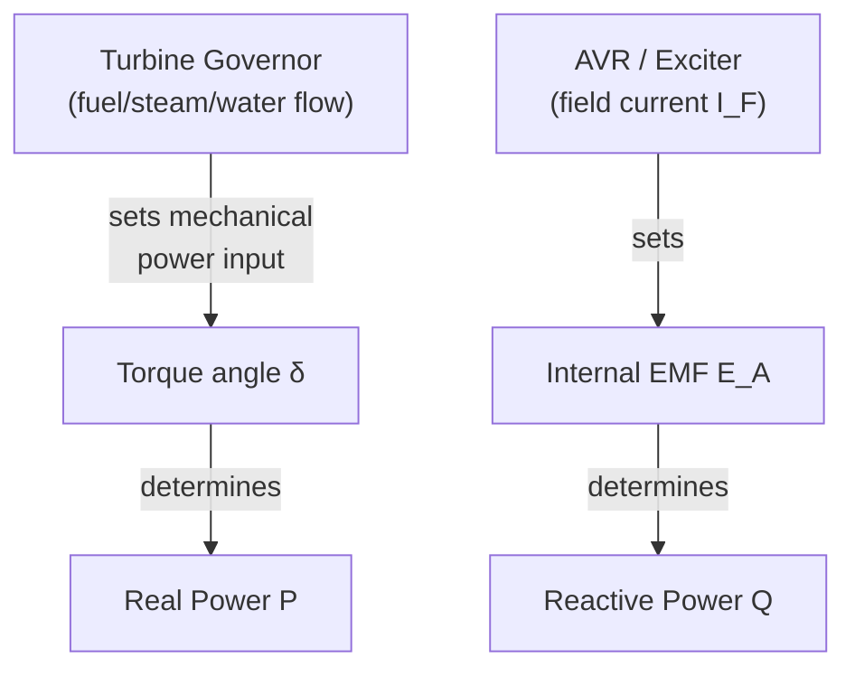

## Real and Reactive Power Control in Synchronous Generators

### Overview

Real and reactive power control in synchronous generators rests on two largely decoupled control mechanisms: prime-mover mechanical input (governor) governs real power $P$, while field excitation (AVR) governs reactive power $Q$ and terminal voltage. Understanding this decoupling, the underlying power-angle relationships, and the practical limits imposed by machine capability is central to generator operation on an interconnected power system.

### The Decoupled Control Principle

**Key Points**

- **Real power $P$** is controlled by adjusting mechanical torque/power input from the prime mover (via turbine governor valve, fuel/steam flow) — this changes the torque angle $\delta$.
- **Reactive power $Q$** is controlled by adjusting field excitation $I_F$ — this changes the internal EMF magnitude $E_A$.
- **[Inference]** This decoupling holds as an approximation because, in typical high-voltage transmission systems, the X/R ratio of the network is large (highly reactive), which causes $P$ flow to be primarily sensitive to angle differences and $Q$ flow to be primarily sensitive to voltage magnitude differences — the coupling is not exact and becomes weaker at higher X/R ratios.

### Governing Power Equations (Round-Rotor, Neglecting R_A)

For a generator connected to a bus of voltage $V_\phi$ through synchronous reactance $X_s$:

$$P = \frac{E_A V_\phi}{X_s}\sin\delta$$

$$Q = \frac{E_A V_\phi \cos\delta - V_\phi^2}{X_s}$$

**Key Points**

- $P$ is primarily a function of $\sin\delta$ — for small-to-moderate $\delta$, increasing torque angle increases real power output nearly linearly.
- $Q$ depends on both $E_A$ and $\delta$, but for typical operating angles ($\delta$ under ~30–40°), $\cos\delta$ changes slowly, so $Q$ is dominated by the $(E_A - V_\phi)$-type term — reinforcing that excitation is the dominant $Q$ control lever.
- At $\delta = 90°$, $P$ reaches its theoretical maximum $P_{max} = E_A V_\phi / X_s$ (static stability limit); real machines never operate this close to the limit in steady state.

### Governor Control of Real Power

#### Speed-Droop Governing

Most generators operate with a governor that reduces speed setpoint slightly as load increases (droop characteristic), enabling stable parallel operation and automatic load sharing among multiple generators on the same system:

$$R = -\frac{\Delta f / f_0}{\Delta P / P_{rated}}$$

where $R$ is the droop (typically expressed as a percentage, commonly 4–5%), $\Delta f$ is frequency deviation, and $\Delta P$ is the corresponding real power change.

**Example**

A generator with 5% droop, rated 100 MW, operating at nominal 60 Hz. If system frequency drops to 59.7 Hz (a $\Delta f = -0.3$ Hz, or $-0.5\%$ of nominal):

$$\Delta P = -\frac{\Delta f/f_0}{R} \times P_{rated} = -\frac{-0.005}{0.05}\times 100 = 10 \text{ MW}$$

The governor increases output by 10 MW in response to the frequency drop, illustrating the droop characteristic's role in automatic primary frequency response.

**Key Points**

- Droop governing allows multiple parallel generators to share load changes automatically in proportion to their capacity (and inverse of their droop settings), without requiring a fast communication link.
- Isochronous (zero-droop) governing holds frequency exactly constant and is typically used only for a single generator serving an isolated load, since multiple isochronous units in parallel would fight for control and are inherently unstable together.

#### Governor Response to Torque Angle

Increasing mechanical power input causes the rotor to accelerate momentarily, advancing $\delta$ until the increased electrical power output ($P = E_A V_\phi \sin\delta / X_s$) again balances the mechanical input — a new steady-state equilibrium at a larger $\delta$.

### AVR/Excitation Control of Reactive Power

As detailed in the excitation systems topic, the AVR adjusts field current to hold terminal voltage at its reference. Since $Q$ output depends strongly on $E_A$ (set by $I_F$), the practical effect of AVR action is reactive power regulation:

- **Overexcited operation** ($I_F$ high, $E_A > V_\phi$-related threshold): Generator supplies lagging reactive power (acts as a source of $Q$, supporting system voltage).
- **Underexcited operation** ($I_F$ low): Generator absorbs reactive power (acts as a sink of $Q$, can depress local voltage; limited by stability/heating constraints).

**Example**

Two identical generators (round rotor, $X_s = 1.0$ pu, $V_\phi = 1.0$ pu) both deliver $P = 0.6$ pu. Generator A holds $E_A = 1.2$ pu; Generator B holds $E_A = 1.4$ pu (higher excitation).

For A: $0.6 = \dfrac{(1.2)(1.0)}{1.0}\sin\delta_A \Rightarrow \sin\delta_A = 0.5 \Rightarrow \delta_A = 30°$

$$Q_A = (1.2)(1.0)\cos(30°) - 1.0 = 1.039 - 1 = 0.039 \text{ pu}$$

For B: $0.6 = \dfrac{(1.4)(1.0)}{1.0}\sin\delta_B \Rightarrow \sin\delta_B = 0.4286 \Rightarrow \delta_B = 25.4°$

$$Q_B = (1.4)(1.0)\cos(25.4°) - 1.0 = 1.264 - 1 = 0.264 \text{ pu}$$

Same real power output, but Generator B (higher excitation) supplies substantially more reactive power — demonstrating that $Q$ is set largely independently of $P$, via the excitation level.

### The Power-Angle Curve

<svg xmlns="http://www.w3.org/2000/svg" viewBox="0 0 480 300" font-family="sans-serif">
<text x="240" y="20" font-size="14" text-anchor="middle" font-weight="bold">Power-Angle Curve P vs. δ (svg_diagram)</text>
<line x1="50" y1="250" x2="440" y2="250" stroke="black" stroke-width="1.5" />
<line x1="50" y1="250" x2="50" y2="40" stroke="black" stroke-width="1.5" />
<text x="445" y="255" font-size="12">δ</text>
<text x="30" y="35" font-size="12">P</text>
<path d="M 50 250 Q 150 250 230 60 Q 310 250 410 250" stroke="#1a5fb4" stroke-width="2.5" fill="none" />
<line x1="230" y1="250" x2="230" y2="40" stroke="gray" stroke-dasharray="4,3" />
<text x="220" y="270" font-size="11">90°</text>
<text x="205" y="55" font-size="11">P_max</text>
<circle cx="150" cy="130" r="4" fill="#e8590c" />
<text x="100" y="120" font-size="11" fill="#e8590c">Typical operating point</text>
<text x="90" y="265" font-size="10">0°</text>
<text x="390" y="265" font-size="10">180°</text>
</svg>

**Key Points**

- Only the rising portion (roughly $0° < \delta < 90°$) is a stable operating region; beyond $90°$, increasing $\delta$ further *decreases* deliverable power, and the machine loses synchronism if pushed past this point (transient/steady-state instability).
- The transient stability margin (area-based, via equal-area criterion) is a distinct, more advanced topic concerning how far and how fast $\delta$ can swing during a disturbance before instability results — generally treated separately from steady-state $P$–$\delta$ analysis.

### Combined P-Q Operating Point and the Capability Curve

Real and reactive power setpoints must simultaneously respect the generator's capability curve (armature current limit, field current limit, stability/underexcitation limit, prime-mover limit — detailed in the excitation systems item). Coordinated control means:

1. Governor sets $P$ per economic dispatch / automatic generation control (AGC) signals.
2. AVR sets $Q$ (via voltage setpoint) per system voltage support requirements, subject to remaining thermal/stability headroom once $P$ is fixed.
3. As $P$ increases toward the prime-mover or armature-current limit, available $Q$ margin (before hitting the armature current limit arc) shrinks — a generator near full real-power output has reduced spare capacity for reactive power support.

**[Inference]** This interaction means system operators must consider a generator's real-time $P$ dispatch when calling on it for voltage support (Q) service, since the two setpoints are not independent at the boundary of the capability curve, even though the underlying control mechanisms (governor vs. AVR) are largely decoupled.

### Load Sharing Among Parallel Generators

When multiple generators operate in parallel on the same bus:

- **Real power sharing** is governed by relative governor droop settings — generators with lower droop (stiffer response) pick up proportionally more of a load change.
- **Reactive power sharing** is governed by relative AVR/excitation settings and machine synchronous reactances — mismatched voltage references between paralleled units can cause circulating reactive current even without any real-power imbalance.

**Key Points**

- A generator with its voltage reference set too high relative to its neighbors on the same bus will absorb disproportionate reactive burden (or push reactive power onto neighbors), independent of real-power dispatch.
- Proper load sharing requires coordinated droop and voltage-reference settings across all paralleled units, typically managed via plant-level or system-level automatic generation control (AGC) and automatic voltage control schemes.

### Practical Control Modes

**Key Points**

- **Voltage control mode:** AVR holds terminal voltage constant (most common for generators directly serving local load or in weak-grid conditions).
- **Power factor control mode:** Excitation adjusted to hold a fixed PF regardless of $P$ changes — less common for grid-connected generators but used in some industrial cogeneration contexts.
- **Reactive power (Mvar) control mode:** Excitation adjusted to hold a fixed $Q$ output, often used when dispatched by a system operator for specific voltage support requirements.
- **Real power modes:** Governed either by fixed-output (base-load), droop/frequency-response, or AGC-dispatched setpoints from system operators for load-following.

### Common Pitfalls

**Key Points**

- Assuming excitation changes affect only $Q$ with zero effect on $\delta$/$P$ — in reality, changing $E_A$ at fixed mechanical power input causes a small transient shift in $\delta$ before a new steady state is reached, since $P$ depends on both $E_A$ and $\delta$; the "decoupled" model is a steady-state, high-X/R approximation.
- Ignoring capability curve interaction — treating $P$ and $Q$ setpoints as freely and independently assignable regardless of how close the machine is to its thermal or stability limits.
- Confusing droop governing (proportional, used for parallel operation) with isochronous governing (integral/zero-droop, generally restricted to islanded/single-unit operation).
- Neglecting that reactive power sharing between parallel units depends on relative voltage-reference settings, not just individual AVR "correctness" — a well-tuned AVR can still cause poor Q-sharing if its reference doesn't match paralleled units.

### Related Topics

- Synchronous generator construction and operation (equivalent circuit and power equations)
- Generator excitation systems and voltage regulation (AVR/exciter detail)
- Equal-area criterion and transient stability analysis
- Automatic generation control (AGC) and economic dispatch
- Load-frequency control and speed-droop governing
- Generator capability curves and reactive power limits
- Reactive power compensation devices (synchronous condensers, SVCs, STATCOMs)